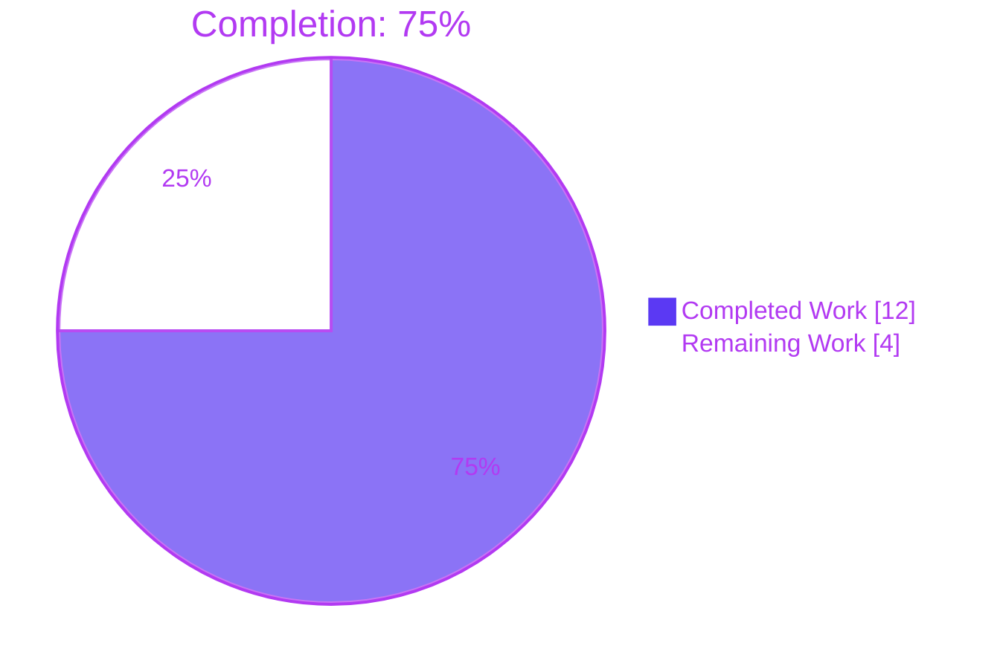
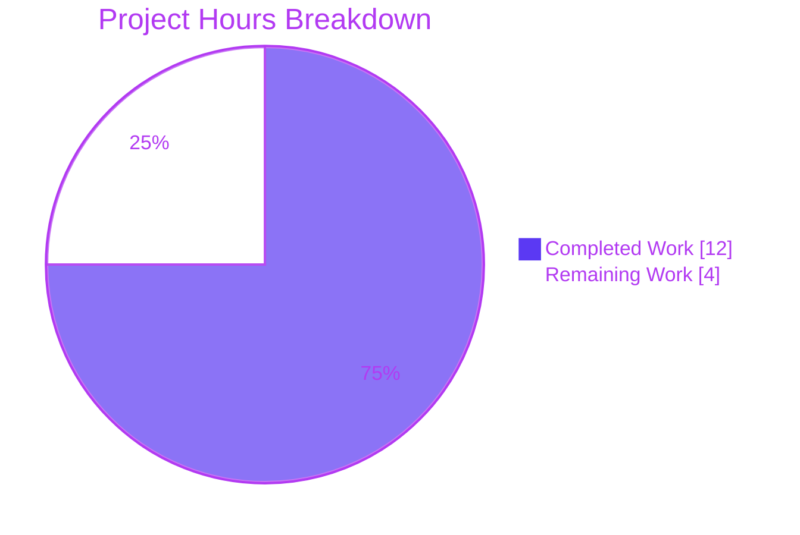
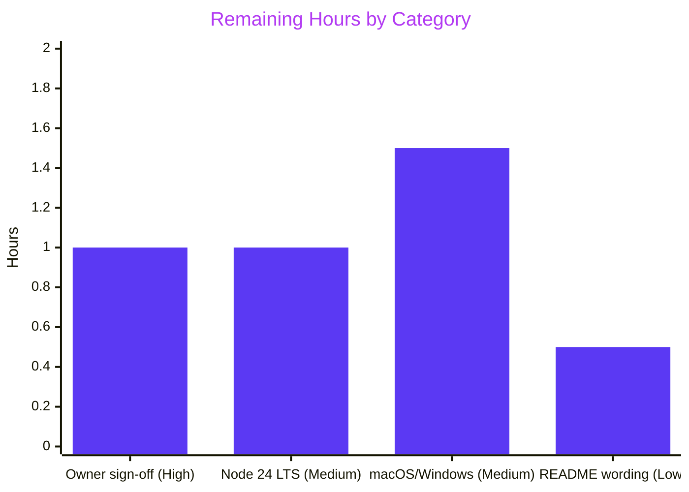

# 1. Executive Summary

## 1.1 Project Overview

This project delivers a minimal Node.js tutorial for developers new to server-side JavaScript. `server.js` uses only Node's built-in `http` module to answer `/hello` with `Hello world` on port 3000 and prints `Welcome to Blitzy` once listening; `README.md` gives four lines of run instructions. The deliberately tiny scope — one JSDoc line and one statement, no dependencies, no install step, no tests or hardening — is the acceptance criterion, and both files match the specified content byte for byte. The target is a learner's own machine, not a network-facing service.

## 1.2 Completion Status



| Metric | Value |
|---|---|
| Total Hours | 16.0 |
| Completed Hours (AI + Manual) | 12.0 (12.0 AI + 0.0 manual) |
| Remaining Hours | 4.0 |
| Percent Complete | **75.0%** (12.0 ÷ 16.0) |

Every one of the 12 AAP deliverables is complete; the 4.0 remaining hours are owner sign-off and path-to-production checks.

## 1.3 Key Accomplishments

- ✅ `/hello` returns exactly `Hello world` (11 bytes, HTTP 200) for GET and every standard method Node dispatches
- ✅ Every other URL returns HTTP 200 with an empty body — exact-match routing, no 404
- ✅ `Welcome to Blitzy` is printed once, bare (18 bytes, no ANSI), only after the port is bound
- ✅ README instructions work literally from a clean copy with no install step
- ✅ Both files are byte-identical to the specification (`server.js` 2 lines/247 B; `README.md` 5 lines/229 B)
- ✅ Only Node-default headers are sent — no `Server`, `X-Powered-By` or version disclosure
- ✅ No request input is reflected; injection, smuggling and oversized-input probes are rejected by Node's parser
- ✅ Zero dependencies, zero extra files: the repository tracks exactly `server.js` and `README.md`

## 1.4 Critical Unresolved Issues

**0 of 12** AAP deliverables are unresolved. **5 items** remain open for owner sign-off — four caveats accepted under the AAP's exact-content and no-hardening rules, and one runtime configuration never exercised. None blocks release for the local-tutorial target.

| Issue | Impact | Owner | ETA |
|---|---|---|---|
| CONNECT/PRI are closed by Node without a response and HEAD has no body, so "any method → `Hello world`" holds for 33 of 35 standard methods (Section 5.2, D2) | Contract wording overstates behaviour; no learner impact | Project owner | 0.5 h |
| Hardening deliberately absent: all-interface bind, no connection/rate cap, no security headers, raw `EADDRINUSE` crash (D3) | Unsafe if ever exposed beyond localhost | Project owner | 0.5 h |
| Node.js version unpinned; supported-release guidance is not recorded in the repository (D4) | Learners may run an end-of-life runtime | Project owner | 1.0 h |
| README omits "run from the repository root"; body has no trailing newline (D5) | Minor learner confusion | Project owner | 0.5 h |
| Never exercised on macOS, Windows or Node 24 LTS — verified on Linux with Node v22.23.2 only | Platform differences (e.g. PowerShell's `curl` alias) untested | QA / owner | 1.5 h |

## 1.5 Access Issues

No access issues identified. Node.js and curl are available, the branch is pushed and matches its remote, and the project reads no credentials, environment variables or external services.

## 1.6 Recommended Next Steps

1. [High] Review and sign off the accepted caveats (Section 5.2, D2–D3), then merge.
2. [Medium] Run the README walkthrough on Node 24 LTS and settle published runtime guidance (D4).
3. [Medium] Run the README walkthrough on macOS and Windows; on PowerShell use `curl.exe`.
4. [Low] Decide whether to amend the exact README text to state the run directory (D5).

# 2. Project Hours Breakdown

## 2.1 Completed Work Detail

| Component | Hours | Description |
|---|---|---|
| HTTP server — `server.js` (FR-1, AAP 0.6.3, implicit port/every-request requirement) | 1.5 | Single CommonJS statement: `require('http').createServer(...)` with exact `req.url === '/hello'` match, one `res.end` for both branches, `.listen(3000, …)` |
| Startup print (FR-2) | 0.5 | Bare `console.log('Welcome to Blitzy')` in the listen callback, so it prints only after the bind succeeds |
| Run instructions — `README.md` (FR-3) | 0.5 | Title plus three instruction lines (4 non-blank) replacing the repository's placeholder title |
| Exact-content and scope conformance | 0.5 | Byte comparison against AAP 0.9.1, one untagged JSDoc line, two-file boundary (AAP 0.8.2), `node --check` |
| Functional runtime verification | 3.0 | Contract across methods and URLs, header set, keep-alive/pipelining/HTTP 1.0, load, lifecycle signals, console hygiene, browser client |
| Security verification | 3.0 | Injection and reflection, CRLF, request smuggling, oversized input, slow-client and idle-socket exhaustion, disclosure, CORS in a browser |
| Node runtime currency verification | 2.0 | `http.Server` defaults, default headers, API deprecation status and published advisories for the installed runtime |
| README walkthrough and clean-copy boot | 1.0 | README commands executed literally from clean, `git archive`, minimal-environment and read-only copies |
| **Total** | **12.0** | |

## 2.2 Remaining Work Detail

| Category | Hours | Priority |
|---|---|---|
| Owner sign-off of accepted caveats D2 (method handling) and D3 (hardening exclusions), then merge | 1.0 | High |
| Verify on Node 24 LTS and settle runtime guidance (D4) | 1.0 | Medium |
| Learner-platform walkthrough on macOS and Windows | 1.5 | Medium |
| README wording decision: run directory and trailing newline (D5) | 0.5 | Low |
| **Total** | **4.0** | |

## 2.3 Hours Calculation

- Completed: 1.5 + 0.5 + 0.5 + 0.5 + 3.0 + 3.0 + 2.0 + 1.0 = **12.0 h**
- Remaining: 1.0 + 1.0 + 1.5 + 0.5 = **4.0 h**
- Total: 12.0 + 4.0 = **16.0 h**
- Completion: 12.0 ÷ 16.0 × 100 = **75.0%**

Confidence is high: the scope is two fixed files, and remaining work is review and platform checks rather than implementation. Hardening for public deployment is outside the AAP and is not counted.

# 3. Test Results

The repository carries no test suite — the AAP forbids one (0.8.2), and `node --test` reports `# tests 0`. The results below come from a scripted assertion suite and the project's package gate, executed against the delivered tree on Node v22.23.2 inside an isolated network namespace. No coverage tooling exists, so coverage is not reported.

| Area / Category | Framework | Tests | Passed | Failed | Coverage | What This Proves |
|---|---|---|---|---|---|---|
| Static and package gate | `node --check`, `cmp`, `unshare -n` smoke | 4 | 4 | 0 | n/a | Both files are syntactically valid, byte-identical to the specification, and the whole-package gate passes |
| HTTP contract (FR-1, AAP 0.6.3) | bash + curl | 21 | 21 | 0 | n/a | `/hello` returns `Hello world` for GET, POST, PUT, DELETE, PATCH, OPTIONS, TRACE, PURGE; HEAD is 200 with no body; 11 non-matching URLs return 200 empty |
| Headers, disclosure and input handling | bash + curl | 9 | 9 | 0 | n/a | Only `Date`, `Connection`, `Keep-Alive`, `Content-Length` are sent; script paths are not reflected, CRLF cannot inject headers, a 20 KB header gets 431 and the server recovers |
| Concurrency | bash + curl + xargs | 2 | 2 | 0 | n/a | 200 parallel requests and a 100/100 mixed load are all answered with correct bodies |
| Console output (FR-2) | bash | 4 | 4 | 0 | n/a | stdout is exactly `Welcome to Blitzy\n` (18 B) after all traffic; stderr empty; no ANSI codes |
| Process lifecycle | bash | 5 | 5 | 0 | n/a | A second instance fails with `EADDRINUSE` without disturbing the first; SIGTERM exits 143 and frees the port |
| README walkthrough (FR-3) | bash | 5 | 5 | 0 | n/a | Commands extracted from `README.md` boot a clean two-file copy under `env -i` and return `Hello world` |
| **Total** | | **50** | **50** | **0** | n/a | Every delivered requirement passes on the verified runtime |

**Not Covered**

- **No in-repository regression suite.** Nothing in the tree re-runs these checks automatically; future edits must be re-verified with the package gate in Section 9.5.
- **Other runtimes and platforms.** Only Node v22.23.2 on Linux was exercised. Run the README walkthrough on Node 24 LTS, macOS and Windows before publishing (Windows PowerShell 5.1 aliases `curl` to `Invoke-WebRequest`; use `curl.exe`).
- **Non-dispatched methods.** CONNECT and PRI never reach the handler; this Node default is recorded in Section 5.2 (D2) rather than tested as a pass.

# 4. Runtime Validation & UI Verification

The server was started exactly as the README instructs (`node server.js` from the repository root) on the host port and in an isolated network namespace, and driven with curl, raw sockets and a headless Chrome browser. There is no UI, authentication or external integration to exercise.

- ✅ **Startup** — binds `*:3000` (all interfaces, dual-stack) and prints `Welcome to Blitzy` only once the port is listening
- ✅ **`/hello` over curl** — `HTTP/1.1 200 OK`, `Content-Length: 11`, body `Hello world` with no trailing newline
- ✅ **`/hello` in Chrome** — page text is exactly `Hello world`; in-page `fetch` POST and PUT return 200 `Hello world`; 8 of 8 requests 200; zero console errors or warnings
- ✅ **Non-matching URLs** — `/other` and the browser's automatic `/favicon.ico` return 200 with an empty body; blank page, no error
- ✅ **Headers on the wire** — only `Date`, `Connection: keep-alive`, `Keep-Alive: timeout=5`, `Content-Length`; no server or version banner, in curl and in Chrome's network log
- ✅ **README walkthrough and package gate** — README-extracted commands work from a clean copy; the isolated smoke gate exits 0
- ⚠ **CONNECT** — Node closes the socket with 0 bytes and never invokes the handler; the server keeps serving (next `/hello` is 200 11) — Section 5.2, D2
- ⚠ **Second instance on a busy port** — exits 1 with an unhandled `Error: listen EADDRINUSE: address already in use :::3000` stack trace; the first instance is unaffected (accepted, D3)
- ⚠ **Run from another directory** — `node server.js` outside the repository root fails with `Error: Cannot find module '/server.js'`; the README does not name the directory (D5)

**Never exercised at runtime:** macOS, Windows, and any Node release other than v22.23.2 (including the recommended Node 24 LTS); clients connecting from another machine over the all-interface bind.

# 5. Compliance & Quality Review

## 5.1 Compliance Matrix

| # | AAP Deliverable | Benchmark | Status | Progress | Evidence |
|---|---|---|---|---|---|
| 1 | FR-1 — `/hello` returns `Hello world` | Functional correctness | ✅ PASS | 100% | `server.js:2`; contract tests (Section 3) |
| 2 | FR-2 — bare `Welcome to Blitzy` once listening | Output exactness | ✅ PASS | 100% | 18-byte stdout, no ANSI, printed in the `listen` callback |
| 3 | FR-3 — accurate README under five lines | Documentation accuracy | ✅ PASS | 100% | `README.md:1–5`, 4 non-blank lines; walkthrough tests |
| 4 | AAP 0.6.3 HTTP contract | API contract | ✅ PASS (caveat D2) | 100% | 33 of 35 standard methods dispatched; CONNECT/PRI closed by Node |
| 5 | Fixed port 3000; every request answered | Reliability | ✅ PASS | 100% | `.listen(3000, …)`; 400-request concurrency tests |
| 6 | NFR size — one JSDoc line, one statement | Code minimalism | ✅ PASS | 100% | `server.js` 2 lines / 247 B, 0 JSDoc tags |
| 7 | NFR dependencies — built-ins only, no install | Supply chain | ✅ PASS | 100% | Only `require('http')`; no manifest; clean-copy boot |
| 8 | NFR security — Node defaults, nothing added | Security posture | ✅ PASS (caveat D3) | 100% | Default headers only; no reflection; parser rejects malformed input |
| 9 | AAP 0.9.1 exact file contents | Acceptance criterion | ✅ PASS | 100% | `cmp` exit 0 for both files |
| 10 | AAP 0.8.2 scope boundary — two files only | Scope control | ✅ PASS | 100% | `git ls-files` → `README.md`, `server.js` |
| 11 | Figma console excluded (AAP 0.8.2) | Scope control | ✅ PASS | 100% | No UI, asset or design file in the tree |
| 12 | Rules (AAP 0.10) — none supplied; refinement governs | Rule compliance | ✅ PASS | 100% | No user rules exist to apply; `grep` finds no TODO/FIXME/placeholder markers |

## 5.2 AAP & Rule Divergences and Gaps

| # | What the AAP/Rule Required | What Was Delivered Instead | Why It Diverged | Impact | Remediation |
|---|---|---|---|---|---|
| D1 | Two new files in an empty checkout; nothing modified (0.9.1, 0.11.4) | `README.md` modified over an existing placeholder; `server.js` added | The initial commit `6cb007c` already tracked a placeholder README | None — final bytes match exactly | None required |
| D2 | Any method on `/hello` → 200 `Hello world` (0.6.3) | 33 of 35 methods answered; CONNECT/PRI closed; HEAD bodiless; unknown tokens 400 | Node `http` defaults; a `'connect'` listener or method handling is excluded by 0.8.2 and 0.9.1 | Negligible for a tutorial | Accept, or reword the contract |
| D3 | Enterprise best practice (0.10) | No hardening: `*:3000` bind, no rate/connection cap, no security headers, unhandled `EADDRINUSE` | **Sanctioned** — the refinement's no-hardening, minimal-lines direction (0.1.2, 0.8.2) | Unsafe beyond localhost | None for the tutorial; re-scope before exposure |
| D4 | Supported, patched runtime (implicit) | Node unpinned; runtime guidance not in the repository | AAP 0.3.1 forbids a pin; 0.8.2 forbids extra README content | Learners may use an end-of-life Node | Publish runtime guidance or accept |
| D5 | Accurate run instructions (FR-3) | README omits the run directory; body lacks a trailing newline | AAP 0.9.1 fixes the exact text; 0.6.3 fixes the exact body | Minor learner friction | Accept, or amend the AAP text |

**D1 — README modified rather than created.** AAP 0.9.1 and 0.11.4 describe an empty checkout in which both deliverables are new files and nothing is modified. The repository was not empty: its initial commit `6cb007c` already tracked a one-line `README.md` reading `# empty_repo_to_push_new_prod_code_3009_alreadyused`. Commit `c2647de` therefore replaces that placeholder, and `git diff --name-status origin/main` shows `M README.md` beside `A server.js`. The final README is byte-identical to the specified text (229 bytes, `cmp` exit 0) with no residue of the placeholder, so correctness is unaffected. No action is needed beyond accepting one modification in place of a second addition.

**D2 — "Any method" holds for the methods Node dispatches.** AAP 0.6.3 promises `200 Hello world` for any method on `/hello`. Node's `http` server destroys CONNECT and PRI connections before the handler runs because no `'connect'` listener exists; HEAD responses carry no body by protocol; unknown or lowercase method tokens receive a parser-level `400`. The handler at `server.js:2` answers the other 33 of Node's 35 `http.METHODS`. Closing the gap needs a `'connect'` listener or method handling, which AAP 0.8.2 forbids and which would break the exact two-line content of 0.9.1. The owner should accept the behaviour or reword the contract as "any method Node dispatches".

**D3 — Hardening deliberately absent (Sanctioned).** AAP 0.10 applies enterprise best practice only where the user's refinement does not override it, and the refinement's direction — fewest lines, no handlers, headers, configuration or hardening (0.1.2, 0.8.2) — overrides it here. The server at `server.js:2` listens on all interfaces (`*:3000`), sets no connection or rate cap (`server.timeout` 0, `requestTimeout` 300 s, `maxConnections` unset), sends no `Content-Type` or security headers, and crashes with an unhandled `EADDRINUSE` stack trace when the port is taken. This suits a local tutorial, but any machine on the same network can reach the endpoint. Any public deployment must be re-scoped and hardened first.

**D4 — Runtime guidance lives outside the repository.** AAP 0.3.1 deliberately avoids a version pin, and `README.md:3` says only "Requires Node.js". The verified runtime, v22.23.2 with llhttp 9.4.3, is a supported Maintenance LTS release with no known unpatched advisories; v22.23.3 is available. Current guidance is Node.js 24 LTS (v24.21.0 as of 30 September 2026), never below the July 2026 security floors (22.23.2, 24.18.1, 26.5.1), and never an end-of-life line (20.x, 23.x, 25.x). AAP 0.8.2 forbids adding this to the README, so a learner may still run an outdated runtime. The owner should publish runtime guidance alongside the tutorial or accept the risk.

**D5 — README assumes the repository root.** FR-3 asks for accurate run instructions in under five lines. They are accurate but assume the learner is in the repository root: `node server.js` from any other directory fails with `Cannot find module`. The body is exactly `Hello world` with no trailing newline (AAP 0.6.3), so an interactive shell prompt follows it on the same line after `curl`. Both follow from AAP 0.9.1, which makes the exact README and server content the acceptance criterion and forbids rewording. The impact is minor learner friction; the owner can accept it or amend the AAP text (for example "From this folder, run `node server.js`") and re-run the package gate.

# 6. Risk Assessment

| Risk | Category | Severity | Probability | Mitigation | Status |
|---|---|---|---|---|---|
| All-interface bind (`*:3000`) lets other machines on a shared network reach the endpoint | Security | Medium | Medium | Run on a trusted network or behind a host firewall; loopback binding would require amending the AAP's exact content | Accepted (D3) |
| No connection, rate or idle cap (`server.timeout` 0, `maxConnections` unset) — resource exhaustion if exposed | Security | Medium | Low | Keep the tutorial local; front any deployment with a reverse proxy that enforces limits | Accepted (D3) |
| Unpinned runtime lets learners use an end-of-life or unpatched Node.js | Security | Medium | Medium | Publish guidance: Node 24 LTS, floors 22.23.2 / 24.18.1 / 26.5.1, no 20.x/23.x/25.x | Open (D4) |
| Tutorial never run on macOS, Windows or Node 24; Windows PowerShell 5.1 aliases `curl` to `Invoke-WebRequest` | Integration | Medium | Medium | Walk through the README on each platform; tell Windows users to type `curl.exe` | Open |
| Busy port 3000 produces a raw `EADDRINUSE` stack trace and exit 1 | Operational | Low | Medium | Stop the other process (`lsof -ti :3000`) before starting; see Section 9 troubleshooting | Accepted (D3) |
| No in-repository regression suite, so future edits are not checked automatically | Operational | Low | Medium | Re-run `node --check server.js` and the isolated package gate after any change | Accepted (AAP 0.8.2) |
| Running `node server.js` outside the repository root fails with `Cannot find module` | Operational | Low | Low | Run from the folder containing `server.js`; optionally amend the README text | Accepted (D5) |
| CONNECT/PRI never reach the handler, contradicting a literal reading of the contract | Technical | Low | Low | Accept Node's behaviour or reword AAP 0.6.3 | Accepted (D2) |

# 7. Visual Project Status



**Remaining hours by category (4.0 h total)**



| Priority | Tasks | Hours |
|---|---|---|
| High | 1 | 1.0 |
| Medium | 2 | 2.5 |
| Low | 1 | 0.5 |
| **Total** | **4** | **4.0** |

# 8. Summary & Recommendations

The project delivers everything the Agent Action Plan specified: a two-line `server.js` that answers `/hello` with `Hello world` on port 3000 and prints `Welcome to Blitzy` once listening, and a four-line `README.md` whose commands work literally. Both files are byte-identical to the specified content, the repository tracks nothing else, and no dependency or install step exists. The project stands at **75.0% complete** — 12.0 of 16.0 hours — with all 12 AAP deliverables finished and the remaining 4.0 hours confined to sign-off and path-to-production checks.

Verification is strong for so small a surface. All 50 assertions in Section 3 pass: the HTTP contract across eight methods and eleven non-matching URLs, the header set, input handling, concurrency, console output, process lifecycle and the README walkthrough. A browser check confirms that `/hello` renders exactly `Hello world`, that `/other` is blank, and that the console stays clean. No request input is reflected, and Node's parser rejects malformed and oversized requests without affecting service.

The remaining gaps are decisions, not defects. Five divergences are documented (Section 5.2): the README replaced an existing placeholder rather than being created; CONNECT and PRI never reach the handler; hardening is deliberately absent, as the user's refinement directs; runtime guidance is not recorded in the repository; and the README assumes the learner is in the repository root. The only capability never exercised is the tutorial on macOS, Windows and Node 24 LTS.

The critical path is short: the owner signs off the accepted caveats and merges (1.0 h), verifies on Node 24 LTS and publishes runtime guidance (1.0 h), runs the walkthrough on macOS and Windows (1.5 h), and decides on the README wording (0.5 h). Success means the README steps produce `Welcome to Blitzy` and `Hello world` on every supported learner platform and runtime.

**Production readiness:** ready for its stated purpose — a local tutorial on the learner's own machine. It is intentionally not hardened for network exposure; any public deployment requires a new scope covering binding, limits, headers and error handling.

# 9. Development Guide

## 9.1 System Prerequisites

- **Node.js** — any maintained release; verified on v22.23.2. Recommended: Node.js 24 LTS. Avoid anything below 22.23.2 / 24.18.1 / 26.5.1 and the end-of-life 20.x, 23.x and 25.x lines.
- **curl** — to call the endpoint (on Windows PowerShell, type `curl.exe`).
- **OS** — any platform Node supports; verified on Linux. Port 3000 must be free.
- Optional: `lsof` or `ss` to see which process owns port 3000.

## 9.2 Environment Setup

No virtual environment, package install, build step, database or environment variable is needed. The server reads no configuration; the port is fixed at 3000.

```bash
node --version            # expect v22.x or later, e.g. v22.23.2
cd <path-to-repository>   # the folder containing server.js and README.md
ls                        # README.md  server.js
```

## 9.3 Dependency Installation

None. `server.js` uses only Node's built-in `http` module, so there is no `package.json` and nothing to `npm install`.

## 9.4 Application Startup

Foreground (the README flow) — stop with Ctrl+C:

```bash
lsof -ti :3000            # no output means the port is free
node server.js            # prints: Welcome to Blitzy
```

Background, keeping the pid so you stop only your own process:

```bash
d=$(mktemp -d)
nohup node server.js > "$d/server.log" 2>&1 &
pid=$!
cat "$d/server.log"       # Welcome to Blitzy
kill "$pid"               # when finished
```

Start `nohup … &` on its own line; chaining it after `&&` makes `$!` capture a subshell rather than Node.

## 9.5 Verification Steps

```bash
node --check server.js && echo "syntax OK"        # exit 0
curl -s http://localhost:3000/hello; echo          # Hello world
curl -s -i http://localhost:3000/hello             # HTTP/1.1 200 OK ... Content-Length: 11
curl -s -o /dev/null -w '%{http_code} %{size_download}\n' http://localhost:3000/other   # 200 0
ss -ltnp 'sport = :3000'                           # LISTEN ... *:3000 ... "node"
```

Isolated package gate (Linux, run as root; uses a private network namespace, so it never touches the host's port 3000):

```bash
d=$(mktemp -d) && timeout 30 unshare -n sh -c 'ip link set lo up; node server.js > "$0/server.log" 2>&1 & p=$!; sleep 1; cat "$0/server.log"; curl -s -i http://localhost:3000/hello; echo; curl -s -i http://localhost:3000/other; echo; kill $p' "$d"
```

Expected: `Welcome to Blitzy`, then `HTTP/1.1 200 OK` with body `Hello world`, then `HTTP/1.1 200 OK` with `Content-Length: 0`; exit status 0.

## 9.6 Example Usage

```bash
curl http://localhost:3000/hello                 # Hello world
curl -X POST -d a=1 http://localhost:3000/hello  # Hello world (any dispatched method)
curl -i http://localhost:3000/anything-else      # 200, empty body
```

In a browser, `http://localhost:3000/hello` shows `Hello world` as plain text; any other path shows a blank page.

## 9.7 Troubleshooting

| Symptom | Cause | Resolution |
|---|---|---|
| `Error: listen EADDRINUSE: address already in use :::3000`, exit 1 | Another process holds port 3000 | `lsof -ti :3000` shows the pid; stop it only if it is your own server, then restart |
| `Error: Cannot find module '/…/server.js'` | Command run outside the repository root | `cd` to the folder containing `server.js` |
| `curl: (7) Failed to connect` | Server not running or not yet listening | Start it and wait for `Welcome to Blitzy` |
| Shell prompt appears right after `Hello world` | The body has no trailing newline, by specification | Expected; append `; echo` to the command |
| PowerShell prints an object instead of `Hello world` | `curl` is an alias for `Invoke-WebRequest` in Windows PowerShell 5.1 | Use `curl.exe http://localhost:3000/hello` |
| Empty response for `/hello/` or `/hello?x=1` | Routing is an exact match on `/hello` | Request exactly `/hello` |

# 10. Appendices

## A. Command Reference

| Command | Purpose |
|---|---|
| `node server.js` | Start the server (repository root) |
| `node --check server.js` | Syntax check; exit 0 means valid |
| `curl http://localhost:3000/hello` | Call the endpoint; returns `Hello world` |
| `curl -s -i http://localhost:3000/other` | Confirm the empty 200 fallback |
| `lsof -ti :3000` | Show the pid that owns port 3000 |
| `ss -ltnp 'sport = :3000'` | Show the listener and its process |
| `kill "$pid"` | Stop a server you started in the background |
| `node --test` | Confirms no test suite exists (`# tests 0`) |

## B. Port Reference

| Port | Protocol | Bind | Purpose |
|---|---|---|---|
| 3000 | HTTP/1.1 over TCP | All interfaces (`*`, dual-stack) | The only listener; fixed in `server.js:2` |

## C. Key File Locations

| Path | Purpose |
|---|---|
| `server.js` | Line 1: one-line JSDoc summary. Line 2: server, `/hello` handler, `listen(3000)`, welcome print |
| `README.md` | Title and three run-instruction lines |

## D. Technology Versions

| Technology | Version | Notes |
|---|---|---|
| Node.js | v22.23.2 (verified) | Maintenance LTS "Jod"; Node 24 LTS (v24.21.0) recommended |
| llhttp | 9.4.3 | Bundled HTTP parser in the verified runtime |
| JavaScript module system | CommonJS | `require('http')`; no `package.json` needed |
| Third-party packages | None | Built-ins only |

## E. Environment Variable Reference

The project reads no environment variables (`server.js` contains no `process.env` reference). Port, path and messages are literals.

## F. Developer Tools Guide

- **Syntax:** `node --check server.js`.
- **Contract spot-check:** `curl -s -o /dev/null -w '%{http_code} %{size_download}\n' <url>` — expect `200 11` for `/hello`, `200 0` otherwise.
- **Header inspection:** `curl -s -D - -o /dev/null http://localhost:3000/hello` — expect only `Date`, `Connection`, `Keep-Alive`, `Content-Length`.
- **Isolated run:** the `unshare -n` package gate in Section 9.5 avoids conflicts on a shared host.
- **Exact-content check:** because the specified content is the acceptance criterion, `git diff` against the delivered commit should stay empty unless the specification itself changes.

## G. Glossary

| Term | Meaning |
|---|---|
| AAP | Agent Action Plan — the specification this project was delivered against |
| FR-1 / FR-2 / FR-3 | The three functional requirements: `/hello` response, welcome print, README |
| Exact-match routing | Only a request target of exactly `/hello` matches; `/hello/`, `/HELLO` and `/hello?x=1` do not |
| `EADDRINUSE` | Node error raised when port 3000 is already taken |
| Package gate | `node --check` followed by the isolated smoke run in Section 9.5 |
| Network namespace | A private Linux network stack (`unshare -n`) giving the server its own port 3000 |
