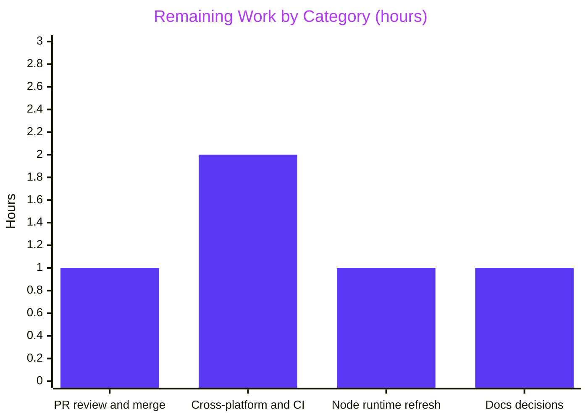

# 1. Executive Summary

## 1.1 Project Overview

This project adds a `GET /good-evening` endpoint to the single-file Node.js tutorial server and gives the repository its first automated test suite. The endpoint returns `200`, `Content-Type: text/plain` and the 12-byte body `Good evening`, while `/hello`, the startup message, port 3000 and every other URL stay byte-for-byte unchanged. Target users are learners running the tutorial locally. The scope is one inserted span on `server.js` line 2 plus `test/good-evening.test.js`, a dependency-free `node:test` suite that spawns the server. A follow-up pass, scoped by the owner to add nothing new, refined the suite's harness, layout and comments.

## 1.2 Completion Status


| Metric | Value |
|---|---|
| Total Hours | 25.0 |
| Completed Hours (AI + Manual) | 20.0 (20.0 AI + 0.0 manual) |
| Remaining Hours | 5.0 |
| Percent Complete | **80.0%** |

20.0 of 25.0 hours are complete (80.0%). Every AAP and refinement requirement is delivered; the remaining 5.0 hours are path-to-production work.

## 1.3 Key Accomplishments

- [x] `GET /good-evening` returns 200, `text/plain`, `Content-Length: 12` and `Good evening`, on the exact path only (`server.js:2`)
- [x] `/hello`, unmatched URLs, port 3000 and `Welcome to Blitzy` are byte-identical on the wire to baseline `04b7b44`
- [x] The `server.js` change is exactly the prescribed 94-byte span, and the AAP byte guard exits 0
- [x] 4 suites and 8 tests pass on Node v24.21.0 and v22.23.3, with no install step
- [x] Against the original server, the suite gives 6 passes and exactly 2 failures (body and Content-Type)
- [x] An interrupted test run stops its server and ends at once by its own signal; a busy port fails in about 0.12 s (`test/good-evening.test.js:14–23`)
- [x] Early-exit failures name the server's exit code, signal and complete stderr (`test/good-evening.test.js:28–30`)
- [x] No dependency, manifest, npm script, CI file or middleware

## 1.4 Critical Unresolved Issues

**0 of 19 scoped requirements are open** (15 from the AAP and its rules, 4 from the owner's refinement request). 4 path-to-production items are open, and none of them blocks release.

| Issue | Impact | Owner | ETA |
|---|---|---|---|
| The suite has not been run on macOS, Windows or the owner's CI | Signal and teardown behaviour is unconfirmed outside Linux. CI that routes traffic through a proxy needs `NO_PROXY=localhost` | Developer | 2.0 h |
| The installed Node v24.21.0 bundles OpenSSL 3.5.8, which carries 13 CVEs that are fixed in 3.5.9 | Not reachable, because the server is cleartext HTTP with no TLS. The runtime should still move to the next 24.x release | DevOps | 1.0 h |
| Two accepted interrupted-run edge cases (Section 5.2 D5): an interrupted runner frees port 3000 8–34 ms after it returns, and SIGHUP or SIGQUIT sent to the test-file process alone leaves the server bound | A rebind inside the window fails, and a stray server must be stopped by hand. Once the port is free the next run passes 8/8 | Reviewer | Within PR review (1.0 h) |
| `README.md` does not mention `/good-evening` or the test suite, and the PR carries two `blitzy/documentation/` files outside the AAP's scope (Section 5.2 D7) | Readers of `README.md` see the pre-change picture, and the PR diff is far larger than the code change | Project owner | 1.0 h |

## 1.5 Access Issues

No access issues identified. No credentials, external services or package registry are needed, and the branch is in sync with its remote.

## 1.6 Recommended Next Steps

1. **[High]** Review and merge the PR, accepting Section 5.2 D1, D2, D5 and D6.
2. **[Medium]** Run `node --test` on macOS, Windows and your CI with port 3000 free. Set `NO_PROXY=localhost` wherever a proxy is injected.
3. **[Medium]** Move to the next Node 24.x release that carries OpenSSL 3.5.9, then re-run the suite.
4. **[Low]** Decide whether `README.md` should document `/good-evening` and `node --test`, and whether the two `blitzy/documentation/` files stay in this PR (Section 5.2 D7).

# 2. Project Hours Breakdown

## 2.1 Completed Work Detail

| Component | Hours | Description |
|---|---|---|
| Route and response contract (`server.js:2`) | 2.0 | Contract analysis and the exact-match `/good-evening` arm placed after `/hello`. Includes the branch-local `Content-Type: text/plain` via a comma expression, the implicit 200, the `/hello`-means-greeting interpretation and the byte-exact 94-byte insertion (FR-1, FR-2, FR-3, FR-5) |
| Child-process test harness | 5.0 | Module-level `before` and `after` hooks: `process.execPath` spawn and readiness on the full startup line. Also early-exit rejection carrying the exit code and drained stderr, spawn-error handling, 5000 ms hook deadlines, SIGKILL escalation and interrupt cleanup (AAP 0.6.3.2, 0.7.4) |
| Contract and preservation tests | 2.0 | 4 suites and 8 tests with exact names and assertions (AAP 0.7.5). Requests pin the direct target with `redirect: 'manual'` (FR-4) |
| Runtime and regression validation | 4.0 | Wire checks of every route, plus method, target and baseline-parity matrices. Also header isolation under keep-alive, pipelining and concurrency, Node v22/v24 parity, the 6/2 discrimination against `04b7b44`, assertion mutants and harness fault injection (AAP 0.7.1, 0.7.6, 0.7.7) |
| Security review and runtime advisory assessment | 1.5 | Request-to-sink tracing, a hostile-input sweep, disclosure and secret-exposure checks, and a dated advisory check of Node 24.21.0, Undici 7.29.1 and OpenSSL 3.5.8 (AAP 0.6.1, 0.9.1) |
| Change-footprint and style discipline | 1.5 | The 0.7.7 byte guard, the single-hunk `server.js` diff and the test-file footprint (AAP 0.5.1). Also the 0.5.4 style, and the Rule 1 and Rule 2 dispositions recorded in code and commit history |
| Harness refinement (`test/good-evening.test.js`) | 2.5 | Eight candidate improvements from the owner's refinement request evaluated: six applied, two declined on evidence. SIGINT and SIGTERM listeners now stop the child and re-raise the signal, so an interrupted run ends at once (lines 14–19). Also a separate uncaught-exception monitor, the signal in early-exit errors, a `BASE_URL` constant in place of 7 URL literals, `const timer`, blank-line layout, and comments that state behaviour (lines 12–13, 27, 31, 81) |
| Refinement verification | 1.5 | Interrupt matrix across signals, targets and timings on Node 22 and 24. Also early-exit stubs (exit code, signal, missing file), the uncaught-exception path, descriptor exhaustion, assertion mutants, stability and parallel runs, an HTTP differential against the base and browser rendering |
| **Total** | **20.0** | |

## 2.2 Remaining Work Detail

| Category | Hours | Priority |
|---|---|---|
| PR review and merge sign-off, including acceptance of the harness design decisions, the interrupted-run edge cases and the 94-line test file (Section 5.2 D1, D2, D5, D6) | 1.0 | High |
| Cross-platform and CI verification: run the suite on macOS, on Windows and in the owner's CI, and set `NO_PROXY=localhost` under injected proxies | 2.0 | Medium |
| Node runtime refresh: install and checksum-verify the next 24.x release with OpenSSL 3.5.9 on each host and CI image, then re-run the suite and smoke check | 1.0 | Medium |
| Documentation decisions: whether `README.md` documents `/good-evening` and `node --test` (0.5 h), and whether the two `blitzy/documentation/` files stay in this PR (0.5 h, Section 5.2 D7) | 1.0 | Low |
| **Total** | **5.0** | |

## 2.3 Hours Calculation

- **Completed:** 2.0 + 5.0 + 2.0 + 4.0 + 1.5 + 1.5 + 2.5 + 1.5 = **20.0 h**
- **Remaining:** 1.0 + 2.0 + 1.0 + 1.0 = **5.0 h**
- **Total:** 20.0 + 5.0 = **25.0 h**
- **Completion:** 20.0 / 25.0 × 100 = **80.0%**

Confidence is high for the completed hours, because every AAP and refinement requirement is delivered and verified. It is medium for cross-platform verification: if Windows signal semantics need harness changes, that item could grow from 2.0 h to about 4.0 h.

# 3. Test Results

Every run below executed at HEAD `5f79b89` in a private network namespace with port 3000 free (`CI=true timeout 120 unshare -n sh -c 'ip link set lo up && node --test --test-reporter=tap'`), on Node v24.21.0 unless stated otherwise.

| Area / Category | Framework | Tests | Passed | Failed | Coverage | What This Proves |
|---|---|---|---|---|---|---|
| Server startup | `node:test` | 1 | 1 | 0 | n/m¹ | The server starts cleanly: stdout is exactly `Welcome to Blitzy\n` and stderr is empty |
| GET /good-evening contract | `node:test` | 3 | 3 | 0 | n/m¹ | The new route answers 200 with exactly `text/plain` and `Good evening` |
| GET /hello preservation | `node:test` | 3 | 3 | 0 | n/m¹ | The greeting route is unchanged and still sends no Content-Type |
| Unmatched URLs | `node:test` | 1 | 1 | 0 | n/m¹ | Every other URL still returns an empty 200 |
| Node v22.23.3 run (full suite) | `node:test` | 8 | 8 | 0 | n/m¹ | The suite is portable across Node 22 and 24 with no install step |
| Discrimination against baseline `04b7b44:server.js` | `node:test` | 8 | 6 | 2 (expected) | n/m¹ | The suite fails when the route is absent; only the body and Content-Type tests fail |
| Busy-port fast-fail (port 3000 pre-bound) | `node:test` | 8 | 0 | 0 (8 cancelled) | n/m¹ | An occupied port fails in 123 ms with `EADDRINUSE` and `server exited with code 1, signal null` instead of hanging |
| Runtime smoke check and AAP byte guard | curl + Node | 5 checks | 5 | 0 | — | The wire contract of 4 URLs holds, and `server.js` differs from baseline only by the prescribed span |

¹ Not measurable. `node --experimental-test-coverage` lists no files, because `server.js` runs in a child process that is stopped by signal.

The primary suite is the first four rows: **8 tests in 4 suites, 8 passed and 0 failed (exit 0, 173 ms; 177 ms on Node 22)**. The explicit-path run `node --test test/good-evening.test.js`, launched from another directory, and the default spec reporter (`ℹ tests 8`, `ℹ pass 8`) give the same 8/8. `--test-name-pattern="GET /good-evening"` runs 3 of 3.

**Not Covered**
- **Line or branch coverage.** No coverage figure exists for `server.js`. Before release, rely on the 8 contract tests and the baseline discrimination instead.
- **macOS and Windows.** The suite has never run there. Before relying on those platforms, confirm the signal listeners (`test/good-evening.test.js:14–23`), the SIGTERM-then-SIGKILL teardown (lines 36–44) and child cleanup.
- **CI and proxy environments.** The repository has no CI. Under `NODE_USE_ENV_PROXY=1` with `HTTP_PROXY` set, the localhost fetches need `NO_PROXY=localhost`.
- **Harness failure paths.** These are a server that never becomes ready or ignores SIGTERM, an early exit, descriptor exhaustion, an uncaught exception and an interrupted run with its signal re-raise. Fault-injection runs verified them (Section 4), but no test in the repository guards them, and the owner's refinement request excluded new tests. Re-check them manually after any harness edit.
- **Signals other than SIGINT and SIGTERM.** SIGHUP or SIGQUIT sent to the test-file process alone is not handled (Section 5.2 D5).
- **Non-GET methods, HEAD and URL variants** (trailing slash, query, case, encodings). They were exercised at runtime (Section 4), but the suite does not assert them.

# 4. Runtime Validation & UI Verification

- ✅ **Startup and lifecycle.** `node server.js` prints `Welcome to Blitzy` and listens on `*:3000`, with stderr still 0 B after more than 5,000 requests. A second instance exits 1 with `EADDRINUSE`, exactly as the baseline does, and SIGTERM and SIGINT free the port.
- ✅ **GET /good-evening.** The route returns `HTTP/1.1 200 OK` with `Content-Type: text/plain`, `Content-Length: 12` and `Good evening`. It answers the same under 10 methods and over IPv6, and HEAD returns headers only, with no Content-Length, as Node does on `/hello`.
- ✅ **Exact matching.** `/good-evening/`, `?x=1`, case, percent-encoded and dot-segment variants, plus the absolute-form target, all fall through to the empty 200.
- ✅ **/hello and the default arm.** Both are byte-identical to `04b7b44` (excluding `Date`) across methods, HEAD and HTTP/1.0. `/hello-world` still returns an empty 200.
- ✅ **Header isolation.** `Content-Type` never leaks to another route across keep-alive reuse, pipelining and more than 4,500 concurrent responses.
- ✅ **Node HTTP defaults.** The 400, 408, 417 and 431 responses and CONNECT handling are byte-identical to the baseline. Error responses disclose no stack trace, path, `Server` or `X-Powered-By`.
- ✅ **Hostile input.** 418 probes covered XSS, SQL, command and template payloads, CRLF injection, request smuggling and traversal. Nothing was reflected, no file was served, no 5xx occurred, and neither environment value leaked.
- ✅ **Browser.** Headless Chrome renders `Good evening` and `Hello world` as plain text and an empty page for other URLs, with no console errors.
- ⚠ **Test-run interruption.** SIGINT or SIGTERM to the test process ends it in 2–5 ms with exit 130 or 143 and frees port 3000. Signals to the runner, the process group or during teardown leave no server behind. Two edge cases remain: an interrupted runner frees the port 8–34 ms after it returns, and SIGHUP or SIGQUIT to the test process alone leaves the server bound (Section 5.2 D5).
- ⚠ **Platforms.** Runs covered Linux only, on Node v24.21.0 and v22.23.3. macOS and Windows have not been run.

**Not exercised at runtime:** macOS and Windows hosts, any deployment behind a reverse proxy or in production, and TLS, which does not apply because the server is HTTP-only by design. There is no authentication or UI flow to drive.

# 5. Compliance & Quality Review

## 5.1 Compliance Matrix

| # | Deliverable | Benchmark | Status | Progress | Evidence |
|---|---|---|---|---|---|
| 1 | FR-1, FR-2: exact-match `/good-evening` arm after `/hello`, returning 200, `Good evening` (12 B) and `Content-Type: text/plain` | AAP 0.1.1, 0.4.1, 0.4.2 | ✅ PASS | 100% | `server.js:2`; `curl -i`; 3 `GET /good-evening` tests; variants fall through to the empty 200 |
| 2 | FR-3: `/hello`, port, startup, methods and default arm preserved | AAP 0.4.3 | ✅ PASS | 100% | Byte guard exit 0; `GET /hello` and `unmatched URLs` suites |
| 3 | FR-4: `node:test` suite, 4 suites / 8 tests, passing | AAP 0.7.5 | ✅ PASS | 100% | TAP `# tests 8 # pass 8 # fail 0` |
| 4 | FR-5: minimal code change (one `@@ -2 +2 @@` hunk on `server.js`) | AAP 0.5.1, 0.7.7 | ✅ PASS | 100% | `git diff --stat origin/main...HEAD -- server.js test/`: 2 files, +95/−1 |
| 5 | Child-process harness | AAP 0.6.3.2, 0.7.4 | ✅ PASS (extended, see 5.2 D1, D5) | 100% | `test/good-evening.test.js:11–44` |
| 6 | Suite discriminates old from new server (6/8) | AAP 0.7.1 | ✅ PASS | 100% | Run against `04b7b44:server.js` |
| 7 | No dependency, manifest, npm script, Node pin or CI | AAP 0.3.1, 0.8.2 | ✅ PASS | 100% | `git ls-files`: 5 tracked files, none a manifest; built-in imports only |
| 8 | Code style of both files | AAP 0.5.4 | ✅ PASS | 100% | Single quotes, `===`, semicolons, arrows, 2-space indent, LF, no tabs |
| 9 | Documentation and line-1 JSDoc untouched | AAP 0.2.3, 0.8.1, 0.8.2 | ⚠ PARTIAL (see 5.2 D7) | README and JSDoc ✅; `blitzy/documentation/` ⚠ | `README.md` and `server.js:1` unchanged; `blitzy/documentation/` changed in `ec895ab` and `fac27e0` |
| 10 | Rule 1 "Clone-QA-20-Apr-rules" hardening directives | AAP 0.9.1 | ⚖ Overridden (sanctioned) | n/a | No hardening code; `/hello` header set pinned at `test/good-evening.test.js:81–85` |
| 11 | Refinement request: improve the PR without new features or scope; modify only files that need it | Owner's refinement request | ✅ PASS | 100% | `git diff fac27e0 HEAD --stat`: only `test/good-evening.test.js`; suite names, order and assertions unchanged |
| 12 | Production-ready code: no placeholders, syntax-clean | Blitzy quality bar | ✅ PASS | 100% | `node --check` on both files; no TODO/FIXME/skip markers |

## 5.2 AAP & Rule Divergences and Gaps

| # | What the AAP/Rule Required | What Was Delivered Instead | Why It Diverged | Impact | Remediation |
|---|---|---|---|---|---|
| D1 | AAP 0.6.3.2 sample harness: resolve on the startup line, reject on early exit, `kill()` in `after` | The sample behaviour plus signal listeners that stop the child and re-raise the signal, an uncaught-exception monitor, spawn-error handling, close-synchronised rejection, 5000 ms hook deadlines, SIGKILL escalation and a full-output check (`test/good-evening.test.js:12–44`) | A delivery design decision, so that the fixed-port suite cannot hang or leave port 3000 bound | More robust, denser harness. Teardown failures appear as an extra hook entry | Accept at review (recommended), or simplify |
| D2 | AAP 0.6.3.2: each test calls global `fetch` on `http://localhost:3000/<path>` | All 7 calls add `{ redirect: 'manual' }` (lines 55–90) | Makes the assertions judge the named URL's own response, never a redirect target | None on results. The tests prove more | None |
| D3 | Rule 1: security headers, input validation, rate limiting, HTTPS, dependency updates, helmet.js, CORS | None implemented in either file | **Sanctioned.** AAP 0.9.1 declines each directive, the AAP outranks the Rules, and the owner's refinement request rules out new features | The tutorial server has no hardening | None for this release. Public exposure needs new scope |
| D4 | User success criterion: `curl …/hello-world` returns `Hello world` | Verified at `/hello`. `/hello-world` stays an empty 200, with no alias added | **Sanctioned.** AAP 0.2.1 and 0.7.2: the repository's greeting route is `/hello` | A literal `/hello-world` call returns an empty body | None, unless a new `/hello-world` route is wanted |
| D5 | AAP 0.7.4: the child is stopped when the suite ends | An interrupted runner returns 8–34 ms before port 3000 is free; SIGHUP or SIGQUIT to the test-file process alone leaves the server bound | Runner exit timing is outside the test file; the listeners cover SIGINT and SIGTERM only | A rebind inside the window fails; a stray server must be stopped by hand | Accept at review, or extend the signal list (lines 14–19) |
| D6 | AAP 0.5.1: `test/good-evening.test.js`, lines 1–65 | 94 lines (3,829 B) with blank-line layout and behaviour comments, and no new suite, test or assertion | **Sanctioned.** The owner's refinement request: "line count updates after completion" | None at runtime. The file reads more easily | None |
| D7 | AAP 0.8.2: no edits to `blitzy/documentation/Project Guide.md`; AAP 0.5.1: a final set of 4 tracked files | `Project Guide.md` replaced by this project's status guide (`ec895ab`), and `Technical Specifications.md` added (`fac27e0`) | Documentation commits that publish the status guide and specification; no further reason is recorded | No runtime effect. The PR diff is 4 files, +7,058/−196, for a +95/−1 code change | Owner decides whether both files stay in this PR |

**D1, harness extended beyond the AAP sample.** AAP 0.6.3.2 describes a harness that resolves on the startup line, rejects on early exit and calls `kill()` in `after`, and all three hold (`test/good-evening.test.js:24–39`). The file adds one-shot SIGINT and SIGTERM listeners that SIGKILL the child and re-raise the signal (lines 14–19), an `uncaughtExceptionMonitor` listener (20–23), spawn-error rejection (25), an early-exit rejection raised after stdio closes that names code, signal and stderr (28–30), 5000 ms hook deadlines (34, 44), SIGKILL escalation after 3000 ms (38–42) and a full-output check (43). The AAP neither requires nor forbids these; they keep the fixed-port suite from hanging or stranding port 3000. Keep them (recommended) or simplify at review.

**D2, redirect handling pinned.** AAP 0.6.3.2 says each test calls the global `fetch` on `http://localhost:3000/<path>`, which the file holds in `BASE_URL` (line 7). All seven calls also pass `{ redirect: 'manual' }` (`test/good-evening.test.js:55–90`). `fetch` follows redirects by default, so without the option a status, body or header assertion could be satisfied by a redirect destination rather than the route under test. With it, every assertion speaks for the exact URL it names. The passing result is unchanged and no code outside the test file is affected. The only action is to acknowledge the option at review.

**D3, Rule 1 overridden (sanctioned).** "Clone-QA-20-Apr-rules" asks for security headers, input validation, rate limiting, HTTPS, dependency updates, helmet.js and CORS. AAP 0.9.1 declines each one: the request forbids new dependencies, middleware and server-configuration changes and pins the `/hello` header set, and the AAP outranks the Rules. The owner's refinement request reaffirms this: "Adding new features or changing the defined scope is not supported". `test/good-evening.test.js:81` states that only `/good-evening` sets Content-Type, and line 84 asserts that `/hello` sends none. The Gantt chart sets no schedule, and Rule 2 ("This 30sep") holds no readable requirement. Public exposure needs separately scoped hardening behind a reverse proxy.

**D4, `/hello-world` criterion verified at `/hello` (sanctioned).** The request's success criteria expect `curl http://localhost:3000/hello-world` to return `Hello world`. The repository has always served its greeting at `/hello`, as shown by `server.js:2`, `README.md:5` and commit `06b5c87`. AAP 0.2.1 and 0.7.2 therefore map the criterion to `/hello`. The AAP also forbade an alias, because adding one would change a response that must stay unchanged. The suite tests `/hello` (`test/good-evening.test.js:70–86`), and `/hello-world` still returns 200 with an empty body, as it did before. If the literal path is wanted, it is a new route and a separate change.

**D5, interrupted-run edge cases (accepted).** AAP 0.7.4 requires the child to be stopped when the suite ends. Two narrow cases fall short. If only the `node --test` runner is signalled while the first request is in flight, about 0.1 s into a run, it returns without waiting and port 3000 is freed 8–34 ms later. If SIGHUP or SIGQUIT is sent to the test-file process alone, it exits 129 or 131 and the spawned server stays bound; the same signals sent to the process group, as a closing terminal does, are clean. The listeners at `test/good-evening.test.js:14–19` cover SIGINT and SIGTERM only, and handling for SIGHUP and SIGQUIT has not been implemented. Accept at review, or extend the signal list.

**D6, test file longer than the AAP footprint (sanctioned).** AAP 0.5.1 lists `test/good-evening.test.js` as lines 1–65, and the original layout dropped every blank line to meet that count. The owner's refinement request states "Only modified files will be regenerated; line count updates after completion", which releases the count. The file is now 94 lines (3,829 B, LF). Blank lines separate the imports, hooks and suites, and comments at lines 12–13, 27, 31 and 81 state behaviour. The 4 suites, 8 tests and 12 assertion lines keep their names, order and targets, as the TAP output confirms. The `server.js` footprint is not released and still matches its prescribed bytes. No action is needed.

**D7, documentation files carried by the PR.** AAP 0.8.2 excludes edits to `blitzy/documentation/Project Guide.md`, and AAP 0.5.1 expects the branch to end with 4 tracked files. Commit `ec895ab` ("Adding Blitzy Project Guide") replaces that file's tutorial guide with this project's status guide, and `fac27e0` ("Adding Blitzy Technical Specifications") adds a 6,700-line specification, so the branch tracks 5 files. Neither file is read by the server or the suite, so behaviour is unaffected, but reviewers see 7,058 added lines for a 95-line code change. The earlier tutorial guide is recoverable with `git show 04b7b44:"blitzy/documentation/Project Guide.md"`. Decide whether both files belong in this PR.

# 6. Risk Assessment

| # | Risk | Category | Severity | Probability | Mitigation | Status |
|---|---|---|---|---|---|---|
| R1 | Port 3000 is a literal in both `server.js` and the suite, so two concurrent runs, or a run beside a live server, collide (the suite fails in about 0.12 s with 8 tests cancelled and EADDRINUSE) | Technical | Medium | Medium | Run one suite per host or network namespace (`unshare -n`, Section 9). The fast, explicit failure is by design (AAP 0.7.4) | Accepted by design |
| R2 | Harness signal handling (`test/good-evening.test.js:14–23`, `:36–44`) is proven only on Linux. Windows has no POSIX SIGTERM/SIGKILL semantics, and macOS timing is unmeasured | Technical | Medium | Low–Medium | Run the suite on macOS and Windows before relying on it there (task in Section 2.2) | Open |
| R3 | In a CI job that routes Node's fetch through a proxy (`NODE_USE_ENV_PROXY=1` plus `HTTP_PROXY`), requests to `localhost:3000` leave the host and 7 tests fail | Integration | Low | Low | Set `NO_PROXY=localhost,127.0.0.1` in any proxied job | Open |
| R4 | No rate or connection limit: slow or idle sockets are held until Node's default header timeout (about 67–89 s observed), and an unbounded number of sockets can be opened | Security | Medium | Low (local tutorial use) | Keep the server off public networks. Any exposure goes behind a reverse proxy with limits, as a separately scoped change | Accepted (AAP 0.9.1) |
| R5 | No security headers, HTTPS or CORS policy. `/hello` deliberately sends no Content-Type | Security | Low | Low | The same constraint as R4. Hardening was declined by AAP 0.9.1 and the `/hello` header set is pinned by test | Accepted (AAP 0.9.1) |
| R6 | The installed Node v24.21.0 bundles OpenSSL 3.5.8: 13 CVEs, 1 High (DTLS), fixed in 3.5.9. None is reachable from this cleartext HTTP server. Node 24 enters maintenance on 2026-10-20 | Security | Low | Low | Move to the next Node 24.x release that carries OpenSSL 3.5.9, and re-run the suite and smoke check | Open |
| R7 | An interrupted runner frees port 3000 8–34 ms after it returns, and SIGHUP or SIGQUIT sent to the test-file process alone leaves the server bound (Section 5.2 D5) | Operational | Low | Low | Interrupt with Ctrl+C or signal the process group. Stop a stray server with `kill $(lsof -ti :3000)`, or extend the listeners at `test/good-evening.test.js:14–19` | Accepted |
| R8 | `README.md` does not mention `/good-evening` or `node --test`, so newcomers can miss the new route and the test command. The PR also carries two `blitzy/documentation/` files outside the AAP's scope (Section 5.2 D7) | Operational | Low | High | Decide on a `README.md` refresh and on keeping the documentation files (Section 2.2) | Open |

The server keeps no state, reads no environment variables or secrets, and serves only fixed strings, so input-driven injection, disclosure and reflection risks are absent. This was confirmed by 418 hostile-input probes covering path, query, header and body variants, with no reflection or leakage. The repository has no dependencies, so there is no supply-chain exposure beyond the Node runtime itself (R6).

# 7. Visual Project Status


**Remaining hours by category (total 5.0 h)**



| Priority | Tasks | Hours | Share of Remaining |
|---|---|---|---|
| High | 1 (PR review and merge sign-off) | 1.0 | 20% |
| Medium | 2 (cross-platform and CI verification; Node runtime refresh) | 3.0 | 60% |
| Low | 1 (documentation decisions) | 1.0 | 20% |
| **Total** | **4** | **5.0** | **100%** |

# 8. Summary & Recommendations

**Delivered and verified.** The project is **80.0% complete**: 20.0 of 25.0 hours, with 5.0 hours remaining. All 19 scoped requirements are met: 15 from the AAP and its rules, and 4 from the owner's refinement request. `server.js:2` now answers `GET /good-evening` with HTTP 200, `Content-Type: text/plain` and the 12-byte body `Good evening`. The edit is a single inserted span, confirmed byte-for-byte against the base `04b7b44`. `/hello`, port 3000, the `Welcome to Blitzy` startup line and the empty-200 default arm are unchanged. `test/good-evening.test.js` (94 lines, built-in modules only) runs 8 tests in 4 suites, all passing on Node v24.21.0 and v22.23.3. Against the unmodified server, exactly the 2 new-route assertions fail, so the suite demonstrably detects the change it guards. The refined harness ends an interrupted run at once by its own signal and names the code, signal and stderr of a server that exits early.

**Remaining gaps.** All of the remaining work is path-to-production; none of it is AAP functionality. A reviewer sign-off on the harness design decisions, the accepted interrupted-run edge cases and the longer test file (Section 5.2) takes 1.0 h. A first run on macOS, Windows and the owner's CI takes 2.0 h at medium confidence, and could reach about 4 h if Windows signal semantics need harness changes. A move to a Node 24.x release that carries OpenSSL 3.5.9 takes 1.0 h, and the decisions on refreshing `README.md` and on keeping the two `blitzy/documentation/` files in this PR take 1.0 h. The Rule 1 hardening directives, the literal `/hello-world` criterion and the test file's line count are sanctioned by AAP 0.9.1, AAP 0.2.1 and the owner's refinement request, and need no work in this release.

**Critical path to production.** Nothing blocks merging: the change is additive, confined to one line of production code, and covered by a suite that fails fast and explicitly on a busy port. Rollout takes three steps: review and merge the change, settling whether the documentation files ride with it; run the suite and smoke check on each target platform and in CI, with port 3000 free and `NO_PROXY=localhost` wherever a proxy is configured; then refresh the Node runtime.

**Success metrics.** The release is measured against the targets below. Only platform coverage is still short of its target.

| Metric | Target | Current |
|---|---|---|
| Suite result (`node --test`) | 8 tests, 4 suites, 0 failures | 8 / 4 / 8 pass / 0 fail |
| Discrimination against the base server | 2 new-route failures | 6 pass / 2 fail (body, Content-Type) |
| Production code footprint | One inserted span on line 2 | Byte guard exit 0; 247 → 341 B |
| New dependencies or manifests | 0 | 0 |
| Platforms verified | Linux, macOS, Windows, CI | Linux (Node 22 and 24) |

**Production readiness.** The change is ready for review and merge as a tutorial-grade feature. It is not ready for public network exposure, and was never intended to be: by AAP decision the server carries no rate limiting, security headers or TLS (Section 6, R4–R5). Any internet-facing deployment needs separately scoped hardening, ideally behind a reverse proxy.

# 9. Development Guide

## 9.1 System Prerequisites

- **Node.js 22 or later.** The suite needs the built-in `node:test` runner and global `fetch`. It was verified on Node v24.21.0 and v22.23.3. On the 22.x line use 22.12.0 or later, and on 20.x use 20.20.2 or later.
- **curl**, for manual checks.
- **Optional, Linux only:** `unshare` (util-linux) and `ip` (iproute2). These run the suite in a private network namespace, so it never touches the host's port 3000.
- **OS:** Linux was verified. macOS and Windows are expected to work but have not been run (Section 6, R2).
- **Hardware:** negligible. One server uses about 50 MB RSS, and a full suite run peaks at about 180 MB and finishes in about 0.2 s.

## 9.2 Environment Setup

There is nothing to install or configure. The repository has no `package.json`, no lockfile and no `node_modules`. Neither file reads any environment variable or secret.

```bash
git clone <repository-url>
cd <repository-directory>
git checkout blitzy-5380880a-38c3-46fd-9005-2049edf8858d
node --version
```

The final command should print `v22.x` or later.

## 9.3 Build (Syntax Check)

There is no compile step. Both files are plain CommonJS and are checked in place:

```bash
node --check server.js && node --check test/good-evening.test.js && echo syntax_ok
```

Expected output: `syntax_ok`. Nothing is written to disk.

## 9.4 Running the Application

Port 3000 is a fixed literal. Make sure nothing else is listening on it (`lsof -i :3000` should print nothing), then start the server:

```bash
node server.js
```

Expected output: `Welcome to Blitzy`. The process runs in the foreground until you press Ctrl+C. From a second terminal:

```bash
curl -i http://localhost:3000/good-evening
curl -i http://localhost:3000/hello
curl -s -o /dev/null -w '%{http_code} %{size_download}B\n' http://localhost:3000/hello-world
```

| Request | Expected response |
|---|---|
| `GET /good-evening` | `200 OK`, `Content-Type: text/plain`, `Content-Length: 12`, body `Good evening` |
| `GET /hello` | `200 OK`, `Content-Length: 11`, no Content-Type, body `Hello world` |
| `GET /hello-world`, `/other` or any other URL | `200`, `0B` (empty body) |

## 9.5 Running the Tests

Stop any server you started on port 3000 first. The suite spawns its own server on that port.

```bash
# Default (spec) reporter. Summary lines: ℹ tests 8, ℹ suites 4, ℹ pass 8, ℹ fail 0
node --test

# TAP reporter. Summary lines: # tests 8, # suites 4, # pass 8, # fail 0
node --test --test-reporter=tap

# Explicit file path (same result)
node --test test/good-evening.test.js

# One suite only (3 tests)
node --test --test-name-pattern="GET /good-evening"
```

**Isolated run (Linux).** This avoids any clash with a process on the host's port 3000, and suits shared CI runners:

```bash
CI=true timeout 120 unshare -n sh -c 'ip link set lo up && node --test --test-reporter=tap'
```

## 9.6 Verification Steps

**1. Smoke check in a private namespace (Linux).** Expected output: `Welcome to Blitzy`, then `200 12B text/plain`, `200 11B`, `200 0B`, `200 0B` and `Good evening`.

```bash
d=$(mktemp -d); timeout 30 unshare -n sh -c 'ip link set lo up; node server.js > "$0/server.log" 2>&1 & p=$!; sleep 1; cat "$0/server.log"; for u in /good-evening /hello /hello-world /other; do curl -s -o /dev/null -w "%{http_code} %{size_download}B %{content_type}\n" http://localhost:3000$u; done; curl -s http://localhost:3000/good-evening; echo; kill $p' "$d"
```

**2. Byte guard: production change limited to one span.** It exits `0` when `server.js` equals the base `04b7b44` plus exactly the `/good-evening` arm.

```bash
SPAN=" req.url === '/good-evening' ? (res.setHeader('Content-Type', 'text/plain'), 'Good evening') :"; node -e 'const fs = require("fs"), cp = require("child_process"); const s = Buffer.from(process.argv[1]); const b = fs.readFileSync("server.js"); const i = b.indexOf(s); if (i < 0 || b.indexOf(s, i + 1) >= 0) process.exit(2); const r = Buffer.concat([b.subarray(0, i), b.subarray(i + s.length)]); process.exit(r.equals(cp.execFileSync("git", ["show", "04b7b44:server.js"])) ? 0 : 1);' "$SPAN"; echo "guard_exit=$?"
```

**3. Discrimination: the suite catches a server without the route.** Expected output: `# pass 6`, `# fail 2`, with the body and Content-Type tests marked `not ok`.

```bash
d=$(mktemp -d); mkdir -p "$d/test" && git show 04b7b44:server.js > "$d/server.js" && cp test/good-evening.test.js "$d/test/" && (cd "$d" && CI=true timeout 120 unshare -n sh -c 'ip link set lo up && node --test --test-reporter=tap' | grep -E '^# (tests|pass|fail)|not ok')
```

## 9.7 Troubleshooting

| Symptom | Cause | Resolution |
|---|---|---|
| All 8 tests cancelled within about 0.12 s, with `server exited with code 1, signal null` and `EADDRINUSE` in stderr | Something already listens on port 3000, possibly a server left by a test process that received SIGHUP or SIGQUIT | Stop it (`lsof -i :3000` or `ss -ltnp 'sport = :3000'`), or use the isolated `unshare -n` run |
| `before` hook fails after 5000 ms | The spawned server never printed `Welcome to Blitzy` (startup hang) | Run `node server.js` by hand and inspect its output |
| `server exited with code N, signal S: <stderr>` | The server exited before becoming ready | Read the quoted stderr. The usual cause is a syntax error in `server.js` (run `node --check server.js`) |
| `server did not close within 3000 ms of SIGTERM and was sent SIGKILL` | The server ignored SIGTERM during teardown (`test/good-evening.test.js:38–42`) | Check `server.js` for added signal handlers or blocking work |
| `Expected values to be strictly deep-equal` in the `after` hook | The server printed more than `Welcome to Blitzy\n` on stdout, or anything on stderr | Remove the extra logging, or update the expected output at `test/good-evening.test.js:43` deliberately |
| A run stops early after Ctrl+C or SIGTERM: `node --test` exits 1, and `node test/good-evening.test.js` run directly exits 130 or 143 | The harness stopped the server and re-raised the signal (`test/good-evening.test.js:14–19`) | Expected. Port 3000 is free; re-run the suite |
| 7 tests fail with network errors, in CI only | Node fetch is routed through a proxy (`NODE_USE_ENV_PROXY=1` plus `HTTP_PROXY`) | Set `NO_PROXY=localhost,127.0.0.1` for the job |
| `curl -X HEAD …` hangs | curl waits for a body that HEAD never sends | Use `curl -I http://localhost:3000/good-evening` |
| `fetch is not defined`, or `node:test` not found | Node is older than 18 | Upgrade to Node 22 or later |

# 10. Appendices

## A. Command Reference

| Purpose | Command | Expected Result |
|---|---|---|
| Syntax check | `node --check server.js && node --check test/good-evening.test.js` | Silent, exit 0 |
| Start server | `node server.js` | Prints `Welcome to Blitzy`, listens on :3000 |
| Run suite (spec) | `node --test` | `ℹ tests 8`, `ℹ pass 8`, `ℹ fail 0` |
| Run suite (TAP) | `node --test --test-reporter=tap` | `# tests 8`, `# suites 4`, `# pass 8`, `# fail 0` |
| Run one suite | `node --test --test-name-pattern="GET /good-evening"` | 3 tests pass |
| Isolated suite (Linux) | `CI=true timeout 120 unshare -n sh -c 'ip link set lo up && node --test --test-reporter=tap'` | As TAP above, never touches the host's :3000 |
| New route check | `curl -i http://localhost:3000/good-evening` | 200, `Content-Type: text/plain`, `Good evening` |
| Preserved route check | `curl -i http://localhost:3000/hello` | 200, no Content-Type, `Hello world` |
| Code footprint | `git diff --stat origin/main...HEAD -- server.js test/` | 2 files changed, 95 insertions(+), 1 deletion(-) |
| Full PR footprint | `git diff --stat origin/main...HEAD` | 4 files changed, 7058 insertions(+), 196 deletions(-) |
| Port owner | `lsof -i :3000` or `ss -ltnp 'sport = :3000'` | Empty when the port is free |

## B. Port Reference

| Port | Protocol | Owner | Configurable |
|---|---|---|---|
| 3000 | HTTP/1.1 (cleartext) | `server.js` (and the server the suite spawns) | No. A literal in `server.js` and the test file, by AAP design |

## C. Key File Locations

| Path | Role |
|---|---|
| `server.js` | The HTTP server (2 lines, 341 B). Line 2 holds the `/hello`, `/good-evening` and default arms |
| `test/good-evening.test.js` | `node:test` suite (94 lines). Harness at lines 1–44: `BASE_URL` at 7, `before` at 11–34 with interrupt listeners at 14–23, `after` at 36–44. Four suites at lines 46–94 |
| `README.md` | Tutorial run instructions (mentions `/hello` only; unchanged) |
| `blitzy/documentation/Project Guide.md` | This project's status guide; it replaced the base tutorial guide in `ec895ab` |
| `blitzy/documentation/Technical Specifications.md` | Technical specification (6,700 lines), added in `fac27e0` |

## D. Technology Versions

| Technology | Version | Notes |
|---|---|---|
| Node.js | v24.21.0 (primary); v22.23.3 (also verified) | Supplies the `http`, `node:test`, `node:assert/strict`, `node:child_process` and `node:path` built-ins and global `fetch`. v24.21.0 bundles OpenSSL 3.5.8 (Section 6, R6) |
| Test runner | `node:test` (built in) | No third-party framework |
| curl | System package | Manual and smoke checks |
| npm | Not used | There is no manifest and no install step |
| Third-party dependencies | None | |

## E. Environment Variable Reference

Neither `server.js` nor the test file reads any environment variable or secret. The variables below only shape how the tools around them behave.

| Variable | Used By | Effect | Recommended Value |
|---|---|---|---|
| `CI` | Shell conventions | Marks a non-interactive run. The suite behaves identically with or without it | `true` in automation |
| `NODE_USE_ENV_PROXY` / `HTTP_PROXY` | Node fetch (Node 24) | Routes the suite's requests through a proxy, which breaks requests to `localhost` | Leave unset, or pair it with `NO_PROXY` |
| `NO_PROXY` | Node fetch, curl | Excludes local hosts from proxying | `localhost,127.0.0.1` in proxied CI jobs |

## F. Developer Tools Guide

- **Filter tests:** `--test-name-pattern="<suite or test name>"` runs a subset. The suite names are `server startup`, `GET /good-evening`, `GET /hello` and `unmatched URLs`.
- **Reporters:** `--test-reporter=spec` (default on Node 24) for people, `--test-reporter=tap` for CI logs.
- **Coverage:** `node --experimental-test-coverage` reports no file rows. `server.js` runs in a child process, so its lines are outside the runner's instrumentation. Correctness rests on the black-box HTTP assertions and the byte guard (Section 9.6).
- **Isolation:** `unshare -n` gives a command its own loopback and its own port 3000, which disappears when the command exits. Use it for parallel or shared-host runs.
- **No linter or formatter** is configured. The style follows the existing code: single quotes, `===`, semicolons in the test file and 2-space indentation.

## G. Glossary

| Term | Meaning |
|---|---|
| Arm | One branch of the nested conditional expression in `server.js:2` that picks the response body by `req.url` |
| Default arm | The final `''` branch: every unmatched URL returns 200 with an empty body |
| Byte guard | A check that `server.js`, minus the inserted `/good-evening` span, is byte-identical to the base commit `04b7b44` |
| Discrimination run | Running the new suite against the base server to show it fails exactly where the new behaviour is missing (6 pass / 2 fail) |
| Harness | The module-level `before`/`after` hooks that spawn `server.js` with `process.execPath`, wait for `Welcome to Blitzy` and stop the server afterwards |
| Network namespace | A Linux isolation unit (`unshare -n`) with its own loopback interface and port space |
| AAP | The agreed action plan defining this change's scope and decisions |
