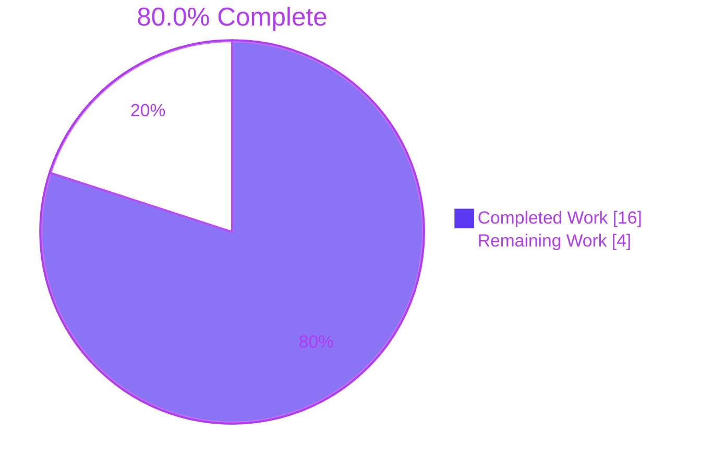
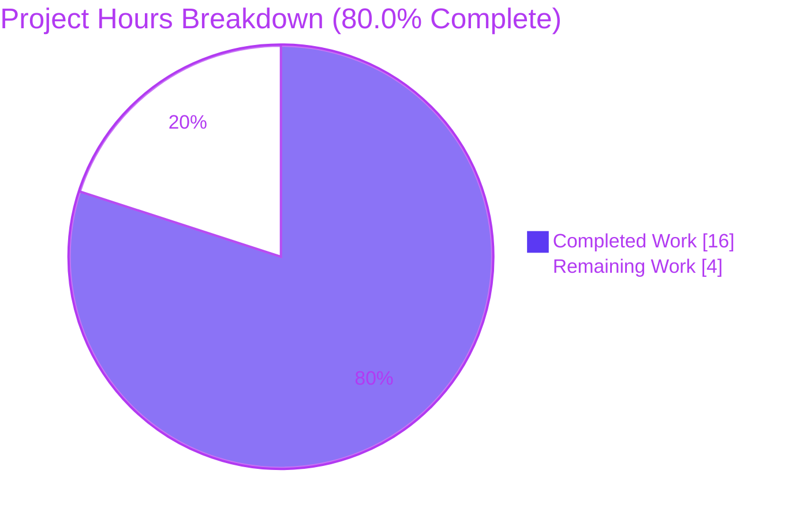
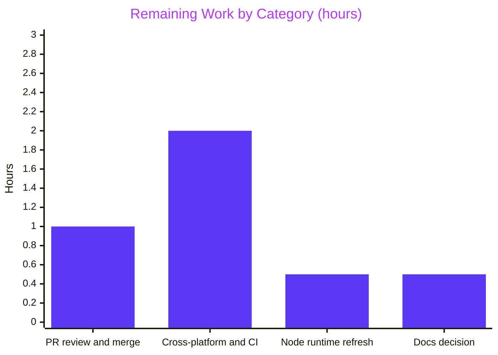

# 1. Executive Summary

## 1.1 Project Overview

This project adds a `GET /good-evening` endpoint to the single-file Node.js tutorial server and gives the repository its first automated test suite. The endpoint returns `200`, `Content-Type: text/plain` and the 12-byte body `Good evening`. The `/hello` route, the startup message, port 3000 and every other URL stay byte-for-byte unchanged. The target users are learners running the tutorial locally. The scope is one inserted span on `server.js` line 2, plus `test/good-evening.test.js`, a dependency-free `node:test` suite that spawns the server as a child process.

## 1.2 Completion Status



| Metric | Value |
|---|---|
| Total Hours | 20.0 |
| Completed Hours (AI + Manual) | 16.0 (16.0 AI + 0.0 manual) |
| Remaining Hours | 4.0 |
| Percent Complete | **80.0%** |

16.0 of 20.0 hours are complete, which is 80.0%. Every AAP requirement has been delivered. The remaining 4.0 hours are path-to-production work: review sign-off, platform verification and runtime upkeep.

## 1.3 Key Accomplishments

- [x] `GET /good-evening` returns 200, `text/plain`, `Content-Length: 12` and `Good evening`, on the exact path only (`server.js:2`)
- [x] `/hello`, unmatched URLs, port 3000 and `Welcome to Blitzy` are byte-identical on the wire to baseline `04b7b44`
- [x] The `server.js` change is exactly the prescribed 94-byte span, and the AAP byte guard exits 0
- [x] 4 suites and 8 tests pass on Node v24.21.0 and v22.23.3, with no install step
- [x] Against the original server, the suite gives 6 passes and exactly 2 failures (body and Content-Type)
- [x] Harness failure paths are bounded: a busy port fails in about 124 ms, hung or SIGTERM-ignoring servers are stopped, and interrupted runs leave no lasting orphan
- [x] No dependency, manifest, CI file, middleware or documentation edit

## 1.4 Critical Unresolved Issues

**0 of 14 AAP requirements are open.** 4 path-to-production items are open, and none of them blocks release.

| Issue | Impact | Owner | ETA |
|---|---|---|---|
| The suite has not been run on macOS, Windows or the owner's CI | Signal and teardown behaviour is unconfirmed outside Linux. CI that routes traffic through a proxy needs `NO_PROXY=localhost` | Developer | 2.0 h |
| The installed Node v24.21.0 bundles OpenSSL 3.5.8, which carries 13 CVEs that are fixed in 3.5.9 | Not reachable, because the server is cleartext HTTP with no TLS. The runtime should still move to the next 24.x release | DevOps | 0.5 h |
| When a `node --test` run is interrupted, port 3000 is released 10–36 ms after the runner exits. This is an accepted caveat (Section 5.2) | A rebind attempted inside that window can fail. The next suite run passes 8/8 | Reviewer | Within PR review (1.0 h) |
| `README.md` and `blitzy/documentation/Project Guide.md` do not mention `/good-evening` or the test suite | Documentation readers see the pre-change picture. The AAP left both files unchanged on purpose | Project owner | 0.5 h |

## 1.5 Access Issues

No access issues identified. No credentials, external services or package registry are needed, and the branch is in sync with its remote.

## 1.6 Recommended Next Steps

1. **[High]** Review and merge the PR, accepting the harness design decisions and the interrupted-run caveat (Section 5.2).
2. **[Medium]** Run `node --test` on macOS, Windows and your CI with port 3000 free. Set `NO_PROXY=localhost` wherever a proxy is injected.
3. **[Medium]** Move to the next Node 24.x release that carries OpenSSL 3.5.9, then re-run the suite.
4. **[Low]** Decide whether to document `/good-evening` and `node --test` in `README.md`.

# 2. Project Hours Breakdown

## 2.1 Completed Work Detail

| Component | Hours | Description |
|---|---|---|
| Route and response contract (`server.js:2`) | 2.0 | Contract analysis and the exact-match `/good-evening` arm placed after `/hello`. Includes the branch-local `Content-Type: text/plain` via a comma expression, the implicit 200, the `/hello`-means-greeting interpretation and the byte-exact 94-byte insertion (FR-1, FR-2, FR-3, FR-5) |
| Child-process test harness | 5.0 | Module-level `before` and `after` hooks: `process.execPath` spawn and readiness on the full startup line. Also early-exit rejection carrying the exit code and drained stderr, spawn-error handling, 5000 ms hook deadlines, SIGKILL escalation and interrupt cleanup (AAP 0.6.3.2, 0.7.4) |
| Contract and preservation tests | 2.0 | 4 suites and 8 tests with exact names and assertions (AAP 0.7.5). Requests pin the direct target with `redirect: 'manual'` (FR-4) |
| Runtime and regression validation | 4.0 | Wire checks of every route, plus method, target and baseline-parity matrices. Also header isolation under keep-alive, pipelining and concurrency, Node v22/v24 parity, the 6/2 discrimination against `04b7b44`, assertion mutants and harness fault injection (AAP 0.7.1, 0.7.6, 0.7.7) |
| Security review and runtime advisory assessment | 1.5 | Request-to-sink tracing, a hostile-input sweep, disclosure and secret-exposure checks, and a dated advisory check of Node 24.21.0, Undici 7.29.1 and OpenSSL 3.5.8 (AAP 0.6.1, 0.9.1) |
| Change-footprint and style discipline | 1.5 | The 0.7.7 byte guard, the single-hunk diff and the 65-line test file layout (AAP 0.5.1). Also the 0.5.4 style, and the Rule 1 and Rule 2 dispositions recorded in code and commit history |
| **Total** | **16.0** | |

## 2.2 Remaining Work Detail

| Category | Hours | Priority |
|---|---|---|
| PR review and merge sign-off, including acceptance of the harness design decisions and the interrupted-run caveat (Section 5.2) | 1.0 | High |
| Cross-platform and CI verification: run the suite on macOS, on Windows and in the owner's CI, and set `NO_PROXY=localhost` under injected proxies | 2.0 | Medium |
| Node runtime refresh to the next 24.x release with OpenSSL 3.5.9, then re-run the suite and smoke check | 0.5 | Medium |
| Owner decision on refreshing `README.md` and `blitzy/documentation/Project Guide.md` for `/good-evening` and `node --test` | 0.5 | Low |
| **Total** | **4.0** | |

## 2.3 Hours Calculation

- **Completed:** 2.0 + 5.0 + 2.0 + 4.0 + 1.5 + 1.5 = **16.0 h**
- **Remaining:** 1.0 + 2.0 + 0.5 + 0.5 = **4.0 h**
- **Total:** 16.0 + 4.0 = **20.0 h**
- **Completion:** 16.0 / 20.0 × 100 = **80.0%**

Confidence is high for the completed hours, because every AAP item is delivered and verified. It is medium for cross-platform verification: if Windows signal semantics need harness changes, that item could grow from 2.0 h to about 4.0 h.

# 3. Test Results

Every run below executed at HEAD `e4d245b` in a private network namespace with port 3000 free (`CI=true timeout 120 unshare -n sh -c 'ip link set lo up && node --test --test-reporter=tap'`), on Node v24.21.0 unless stated otherwise.

| Area / Category | Framework | Tests | Passed | Failed | Coverage | What This Proves |
|---|---|---|---|---|---|---|
| Server startup | `node:test` | 1 | 1 | 0 | n/m¹ | The server starts cleanly: stdout is exactly `Welcome to Blitzy\n` and stderr is empty |
| GET /good-evening contract | `node:test` | 3 | 3 | 0 | n/m¹ | The new route answers 200 with exactly `text/plain` and `Good evening` |
| GET /hello preservation | `node:test` | 3 | 3 | 0 | n/m¹ | The greeting route is unchanged and still sends no Content-Type |
| Unmatched URLs | `node:test` | 1 | 1 | 0 | n/m¹ | Every other URL still returns an empty 200 |
| Node v22.23.3 run (full suite) | `node:test` | 8 | 8 | 0 | n/m¹ | The suite is portable across Node 22 and 24 with no install step |
| Discrimination against baseline `04b7b44:server.js` | `node:test` | 8 | 6 | 2 (expected) | n/m¹ | The suite fails when the route is absent; only the body and Content-Type tests fail |
| Busy-port fast-fail (port 3000 pre-bound) | `node:test` | 8 | 0 | 0 (8 cancelled) | n/m¹ | An occupied port fails in 124 ms with `EADDRINUSE` instead of hanging |
| Runtime smoke check and AAP byte guard | curl + Node | 5 checks | 5 | 0 | — | The wire contract of 4 URLs holds, and `server.js` differs from baseline only by the prescribed span |

¹ Not measurable. `node --experimental-test-coverage` lists no files, because `server.js` runs in a child process that is stopped by signal.

The primary suite is the first four rows: **8 tests in 4 suites, 8 passed and 0 failed (exit 0, about 170 ms)**. The explicit-path run `node --test test/good-evening.test.js` gives the same 8/8.

**Not Covered**
- **Line or branch coverage.** No coverage figure exists for `server.js`. Before release, rely on the 8 contract tests and the baseline discrimination instead.
- **macOS and Windows.** The suite has never run there. Before relying on those platforms, confirm the signal listeners (`test/good-evening.test.js:8`), the SIGTERM-then-SIGKILL teardown (lines 16–23) and child cleanup.
- **CI and proxy environments.** The repository has no CI. Under `NODE_USE_ENV_PROXY=1` with `HTTP_PROXY` set, the localhost fetches need `NO_PROXY=localhost`.
- **Harness failure paths.** These are a server that never becomes ready, a child that ignores SIGTERM, spawn exhaustion and an interrupted runner. Fault-injection runs verified them, but no test in the repository guards them. Re-check them manually after any harness edit.
- **Non-GET methods, HEAD and URL variants** (trailing slash, query, case, encodings). They were exercised at runtime (Section 4), but the suite does not assert them.

# 4. Runtime Validation & UI Verification

- ✅ **Startup and lifecycle.** `node server.js` prints `Welcome to Blitzy` and listens on `*:3000`, with stderr still 0 B after more than 5,000 requests. A second instance exits 1 with `EADDRINUSE`, exactly as the baseline does, and SIGTERM and SIGINT free the port.
- ✅ **GET /good-evening.** The route returns `HTTP/1.1 200 OK` with `Content-Type: text/plain`, `Content-Length: 12` and `Good evening`. It answers the same under 10 methods, and HEAD returns headers only, with no Content-Length, as Node does on `/hello`.
- ✅ **Exact matching.** `/good-evening/`, `?x=1`, case, percent-encoded and dot-segment variants, plus the absolute-form target, all fall through to the empty 200.
- ✅ **/hello and the default arm.** Both are byte-identical to `04b7b44` (excluding `Date`) across methods, HEAD and HTTP/1.0. `/hello-world` still returns an empty 200.
- ✅ **Header isolation.** `Content-Type` never leaks to another route across keep-alive reuse, pipelining and more than 4,500 concurrent responses.
- ✅ **Node HTTP defaults.** The 400, 408, 417 and 431 responses and CONNECT handling are byte-identical to the baseline. Error responses disclose no stack trace, path, `Server` or `X-Powered-By`.
- ✅ **Hostile input.** 418 probes covered XSS, SQL, command and template payloads, CRLF injection, request smuggling and traversal. Nothing was reflected, no file was served, no 5xx occurred, and neither environment value leaked.
- ✅ **Browser.** Headless Chrome renders `Good evening` and `Hello world` as plain text. Pages with injected query strings render an empty DOM with no console errors.
- ⚠ **Platforms.** Runs covered Linux only, on Node v24.21.0 and v22.23.3. macOS and Windows have not been run.

**Not exercised at runtime:** macOS and Windows hosts, any deployment behind a reverse proxy or in production, and TLS, which does not apply because the server is HTTP-only by design. There is no authentication or UI flow to drive.

# 5. Compliance & Quality Review

## 5.1 Compliance Matrix

| # | Deliverable | Benchmark | Status | Progress | Evidence |
|---|---|---|---|---|---|
| 1 | FR-1: exact-match `/good-evening` arm after `/hello` | AAP 0.1.1, 0.4.1 | ✅ PASS | 100% | `server.js:2`; variants fall through to the empty 200 |
| 2 | FR-2: 200, `Good evening` (12 B), `Content-Type: text/plain` | AAP 0.4.2 | ✅ PASS | 100% | `curl -i`; 3 `GET /good-evening` tests |
| 3 | FR-3: `/hello`, port, startup, methods and default arm preserved | AAP 0.4.3 | ✅ PASS | 100% | Byte guard exit 0; `GET /hello` and `unmatched URLs` suites |
| 4 | FR-4: `node:test` suite, 4 suites / 8 tests, passing | AAP 0.7.5 | ✅ PASS | 100% | TAP `# tests 8 # pass 8 # fail 0` |
| 5 | FR-5: minimal change (2 files, +66/−1, one `@@ -2 +2 @@` hunk) | AAP 0.5.1 | ✅ PASS | 100% | `git diff --numstat origin/main...HEAD` |
| 6 | Child-process harness | AAP 0.6.3.2, 0.7.4 | ✅ PASS (extended, see 5.2) | 100% | `test/good-evening.test.js:7–23` |
| 7 | Suite discriminates old from new server (6/8) | AAP 0.7.1 | ✅ PASS | 100% | Run against `04b7b44:server.js` |
| 8 | No dependency, manifest, npm script, Node pin or CI | AAP 0.3.1, 0.8.2 | ✅ PASS | 100% | `git ls-files`: 4 tracked files; built-in imports only |
| 9 | Code style of both files | AAP 0.5.4 | ✅ PASS | 100% | Single quotes, `===`, semicolons, arrows, 2-space indent, LF |
| 10 | Documentation and line-1 JSDoc untouched | AAP 0.2.3, 0.8.1 | ✅ PASS | 100% | Empty diff on `README.md` and `blitzy/documentation/Project Guide.md` |
| 11 | Rule 1 "Clone-QA-20-Apr-rules" hardening directives | AAP 0.9.1 | ⚖ Overridden (sanctioned) | n/a | No hardening code; `test/good-evening.test.js:53` |
| 12 | Production-ready code: no placeholders, syntax-clean | Blitzy quality bar | ✅ PASS | 100% | `node --check` on both files; no TODO/FIXME/skip markers |

## 5.2 AAP & Rule Divergences and Gaps

| # | What the AAP/Rule Required | What Was Delivered Instead | Why It Diverged | Impact | Remediation |
|---|---|---|---|---|---|
| D1 | AAP 0.6.3.2 sample harness: resolve on the startup line, reject on early exit, `kill()` in `after` | The sample behaviour plus signal listeners, spawn-error handling, close-synchronised rejection, 5000 ms hook deadlines, SIGKILL escalation and a full-output check (`test/good-evening.test.js:8–23`) | A delivery design decision, so that the fixed-port suite cannot hang or leave port 3000 bound | More robust, somewhat denser harness. Teardown failures appear as an extra hook entry | Accept at review (recommended), or simplify |
| D2 | AAP 0.6.3.2: each test calls global `fetch` on `http://localhost:3000/<path>` | All 7 calls add `{ redirect: 'manual' }` (lines 32–61) | Makes the assertions judge the named URL's own response, never a redirect target | None on results. The tests prove more | None |
| D3 | Rule 1: security headers, input validation, rate limiting, HTTPS, dependency updates, helmet.js, CORS | None implemented in either file | **Sanctioned.** AAP 0.9.1 declines each directive, and the AAP outranks the Rules | The tutorial server has no hardening | None for this release. Public exposure needs new scope |
| D4 | User success criterion: `curl …/hello-world` returns `Hello world` | Verified at `/hello`. `/hello-world` stays an empty 200, with no alias added | **Sanctioned.** AAP 0.2.1 and 0.7.2: the repository's greeting route is `/hello` | A literal `/hello-world` call returns an empty body | None, unless a new `/hello-world` route is wanted |
| D5 | AAP 0.7.4: the child is stopped when the suite ends | An interrupted runner returns 10–36 ms before the server is stopped | Accepted caveat: toolchain timing that the test file cannot reach | A rebind attempted inside that window can fail. The next run passes 8/8 | Accept at review |

**D1, harness extended beyond the AAP sample.** AAP 0.6.3.2 describes a harness that resolves on the startup line, rejects on early exit and calls `kill()` in `after`, and all three hold (`test/good-evening.test.js:9–18`). The file adds:
- one-shot SIGINT, SIGTERM and `uncaughtExceptionMonitor` listeners that SIGKILL the child (line 8);
- spawn-error rejection (line 10);
- an early-exit rejection raised only after stdio closes (lines 11–12);
- 5000 ms hook deadlines (lines 15 and 23);
- SIGKILL escalation after 3000 ms, asserted unneeded (lines 17–21);
- a full stdout and stderr comparison at teardown (line 22).

The AAP neither requires nor forbids these. They keep the fixed-port suite from hanging or stranding port 3000. Keep them (recommended) or simplify at review.

**D2, redirect handling pinned.** AAP 0.6.3.2 says each test calls the global `fetch` on `http://localhost:3000/<path>`. All seven calls also pass `{ redirect: 'manual' }` (`test/good-evening.test.js:32–61`). `fetch` follows redirects by default, so without the option a status, body or header assertion could be satisfied by a redirect destination rather than the route under test. With it, every assertion speaks for the exact URL it names. The passing result is unchanged and no code outside the test file is affected. The only action is to acknowledge the option at review.

**D3, Rule 1 overridden (sanctioned).** "Clone-QA-20-Apr-rules" asks for security headers, input validation, rate limiting, HTTPS, dependency updates, helmet.js and CORS. AAP 0.9.1 declines each one. The request forbids new dependencies, middleware and server-configuration changes and requires the `/hello` header set to stay unchanged, and the AAP outranks the Rules. `test/good-evening.test.js:53` records the decision, and line 56 asserts that `/hello` sends no Content-Type. The rule's Gantt chart sets no schedule for this repository, and Rule 2 ("This 30sep") holds no readable requirement. The server has no hardening: there is no rate or connection cap, slow sockets are held for about 89 s, and transport is cleartext. Public exposure needs separately scoped hardening behind a reverse proxy.

**D4, `/hello-world` criterion verified at `/hello` (sanctioned).** The request's success criteria expect `curl http://localhost:3000/hello-world` to return `Hello world`. The repository has always served its greeting at `/hello`, as shown by `server.js:2`, `README.md:5` and commit `06b5c87`. AAP 0.2.1 and 0.7.2 therefore resolved the criterion to `/hello`. The AAP also forbade an alias, because adding one would change a response that must stay unchanged. The suite tests `/hello` (`test/good-evening.test.js:44–58`), and `/hello-world` still returns 200 with an empty body, as it did before. If the literal path is wanted, it is a new route and a separate change.

**D5, port released slightly after an interrupted runner exits (accepted).** AAP 0.7.4 requires the child to be stopped when the suite ends. Suppose only the `node --test` runner is signalled while the first request is in flight, about 0.12 s into a run. The runner exits without waiting, and the server stops 10–36 ms later. The line 8 listeners still prevent any lasting orphan, and an immediately following run passes 8/8. The gap comes from the runner's exit behaviour and Node's roughly 25 ms lazy load of global `fetch`, both outside the test file. Accept it at review. Only a tool that rebinds port 3000 within about 36 ms of an interrupted run would notice.

# 6. Risk Assessment

| # | Risk | Category | Severity | Probability | Mitigation | Status |
|---|---|---|---|---|---|---|
| R1 | Port 3000 is a literal in both `server.js` and the suite, so two concurrent runs, or a run beside a live server, collide (the suite fails in about 0.12 s with 8 tests cancelled and EADDRINUSE) | Technical | Medium | Medium | Run one suite per host or network namespace (`unshare -n`, Section 9). The fast, explicit failure is by design (AAP 0.7.4) | Accepted by design |
| R2 | Harness signal handling (`test/good-evening.test.js:8`, `:16–23`) is proven only on Linux. Windows has no POSIX SIGTERM/SIGKILL semantics, and macOS timing is unmeasured | Technical | Medium | Low–Medium | Run the suite on macOS and Windows before relying on it there (task in Section 2.2) | Open |
| R3 | In a CI job that routes Node's fetch through a proxy (`NODE_USE_ENV_PROXY=1` plus `HTTP_PROXY`), requests to `localhost:3000` leave the host and 7 tests fail | Integration | Low | Low | Set `NO_PROXY=localhost,127.0.0.1` in any proxied job | Open |
| R4 | No rate or connection limit: slow or idle sockets are held until Node's default header timeout (about 67–89 s observed), and an unbounded number of sockets can be opened | Security | Medium | Low (local tutorial use) | Keep the server off public networks. Any exposure goes behind a reverse proxy with limits, as a separately scoped change | Accepted (AAP 0.9.1) |
| R5 | No security headers, HTTPS or CORS policy. `/hello` deliberately sends no Content-Type | Security | Low | Low | The same constraint as R4. Hardening was declined by AAP 0.9.1 and the `/hello` header set is pinned by test | Accepted (AAP 0.9.1) |
| R6 | The installed Node v24.21.0 bundles OpenSSL 3.5.8: 13 CVEs, 1 High (DTLS), fixed in 3.5.9. None is reachable from this cleartext HTTP server. Node 24 enters maintenance on 2026-10-20 | Security | Low | Low | Move to the next Node 24.x release that carries OpenSSL 3.5.9, and re-run the suite and smoke check | Open |
| R7 | If only the `node --test` runner is interrupted during the first request, port 3000 is freed 10–36 ms after the runner returns (no lasting orphan) | Operational | Low | Low | An immediately following run passes 8/8. Only a tool that rebinds within about 36 ms would notice | Accepted |
| R8 | `README.md` and `blitzy/documentation/Project Guide.md` do not mention `/good-evening` or `node --test`, so newcomers can miss the new route and the test command | Operational | Low | High | Decide on a follow-up documentation refresh (AAP 0.5.5 deliberately left both files untouched) | Open |

The server keeps no state, reads no environment variables or secrets, and serves only fixed strings, so input-driven injection, disclosure and reflection risks are absent. This was confirmed by 418 hostile-input probes covering path, query, header and body variants, with no reflection or leakage. The repository has no dependencies, so there is no supply-chain exposure beyond the Node runtime itself (R6).

# 7. Visual Project Status



**Remaining hours by category (total 4.0 h)**



| Priority | Tasks | Hours | Share of Remaining |
|---|---|---|---|
| High | 1 (PR review and merge sign-off) | 1.0 | 25% |
| Medium | 2 (cross-platform and CI verification; Node runtime refresh) | 2.5 | 62.5% |
| Low | 1 (README and Project Guide decision) | 0.5 | 12.5% |
| **Total** | **4** | **4.0** | **100%** |

# 8. Summary & Recommendations

**Delivered and verified.** The project is **80.0% complete**: 16.0 of 20.0 hours, with 4.0 hours remaining. All 14 AAP requirements are met. `server.js:2` now answers `GET /good-evening` with HTTP 200, `Content-Type: text/plain` and the 12-byte body `Good evening`. The edit is a single inserted span, confirmed byte-for-byte against the base `04b7b44`. `/hello`, port 3000, the `Welcome to Blitzy` startup line and the empty-200 default arm are unchanged. `test/good-evening.test.js` (65 lines, built-in modules only) runs 8 tests in 4 suites, all passing on Node v24.21.0 and v22.23.3. Against the unmodified server, exactly the 2 new-route assertions fail, so the suite demonstrably detects the change it guards.

**Remaining gaps.** All of the remaining work is path-to-production; none of it is AAP functionality. It consists of:
- a reviewer sign-off on the harness design decisions and the accepted interrupted-run caveat (Section 5.2), 1.0 h;
- a first run on macOS, Windows and the owner's CI, 2.0 h, at medium confidence. It could reach about 4 h if Windows signal semantics need harness changes;
- a move to a Node 24.x release that carries OpenSSL 3.5.9, 0.5 h;
- a decision on refreshing `README.md` and the earlier Project Guide, 0.5 h.

The Rule 1 hardening directives and the literal `/hello-world` criterion are sanctioned by AAP 0.9.1 and 0.2.1, and need no work in this release.

**Critical path to production.** Nothing blocks merging: the change is additive, confined to one line of production code, and covered by a suite that fails fast and explicitly on a busy port. Production rollout follows three steps:
1. Review and merge the two-file change.
2. Run the suite and smoke check on each target platform and in CI, with port 3000 free and `NO_PROXY=localhost` wherever a proxy is configured.
3. Refresh the Node runtime.

**Success metrics.** The release is measured against the targets below. Only platform coverage is still short of its target.

| Metric | Target | Current |
|---|---|---|
| Suite result (`node --test`) | 8 tests, 4 suites, 0 failures | 8 / 4 / 8 pass / 0 fail |
| Discrimination against the base server | 2 new-route failures | 6 pass / 2 fail (body, Content-Type) |
| Production code footprint | One inserted span on line 2 | Byte guard exit 0; 247 → 341 B |
| New dependencies or manifests | 0 | 0 |
| Platforms verified | Linux, macOS, Windows, CI | Linux (Node 22 and 24) |

**Production readiness.** The change is ready for review and merge as a tutorial-grade feature. It is not ready for public network exposure, and was never intended to be: by AAP decision the server carries no rate limiting, security headers or TLS (Section 6, R4–R5). Any internet-facing deployment needs separately scoped hardening, ideally behind a reverse proxy.

# 9. Development Guide

## 9.1 System Prerequisites

- **Node.js 22 or later.** The suite needs the built-in `node:test` runner and global `fetch`. It was verified on Node v24.21.0 and v22.23.3. On the 22.x line use 22.12.0 or later, and on 20.x use 20.20.2 or later.
- **curl**, for manual checks.
- **Optional, Linux only:** `unshare` (util-linux) and `ip` (iproute2). These run the suite in a private network namespace, so it never touches the host's port 3000.
- **OS:** Linux was verified. macOS and Windows are expected to work but have not been run (Section 6, R2).
- **Hardware:** negligible. One server uses about 50 MB RSS, and a full suite run peaks at about 180 MB and finishes in about 0.2 s.

## 9.2 Environment Setup

There is nothing to install or configure. The repository has no `package.json`, no lockfile and no `node_modules`. Neither file reads any environment variable or secret.

```bash
git clone <repository-url>
cd <repository-directory>
git checkout blitzy-5380880a-38c3-46fd-9005-2049edf8858d
node --version
```

The final command should print `v22.x` or later.

## 9.3 Build (Syntax Check)

There is no compile step. Both files are plain CommonJS and are checked in place:

```bash
node --check server.js && node --check test/good-evening.test.js && echo syntax_ok
```

Expected output: `syntax_ok`. Nothing is written to disk.

## 9.4 Running the Application

Port 3000 is a fixed literal. Make sure nothing else is listening on it (`lsof -i :3000` should print nothing), then start the server:

```bash
node server.js
```

Expected output: `Welcome to Blitzy`. The process runs in the foreground until you press Ctrl+C. From a second terminal:

```bash
curl -i http://localhost:3000/good-evening
curl -i http://localhost:3000/hello
curl -s -o /dev/null -w '%{http_code} %{size_download}B\n' http://localhost:3000/hello-world
```

| Request | Expected response |
|---|---|
| `GET /good-evening` | `200 OK`, `Content-Type: text/plain`, `Content-Length: 12`, body `Good evening` |
| `GET /hello` | `200 OK`, `Content-Length: 11`, no Content-Type, body `Hello world` |
| `GET /hello-world`, `/other` or any other URL | `200`, `0B` (empty body) |

## 9.5 Running the Tests

Stop any server you started on port 3000 first. The suite spawns its own server on that port.

```bash
# Default (spec) reporter. Summary lines: ℹ tests 8, ℹ suites 4, ℹ pass 8, ℹ fail 0
node --test

# TAP reporter. Summary lines: # tests 8, # suites 4, # pass 8, # fail 0
node --test --test-reporter=tap

# Explicit file path (same result)
node --test test/good-evening.test.js

# One suite only (3 tests)
node --test --test-name-pattern="GET /good-evening"
```

**Isolated run (Linux).** This avoids any clash with a process on the host's port 3000, and suits shared CI runners:

```bash
CI=true timeout 120 unshare -n sh -c 'ip link set lo up && node --test --test-reporter=tap'
```

## 9.6 Verification Steps

**1. Smoke check in a private namespace (Linux).** Expected output: `Welcome to Blitzy`, then `200 12B text/plain`, `200 11B`, `200 0B`, `200 0B` and `Good evening`.

```bash
d=$(mktemp -d); timeout 30 unshare -n sh -c 'ip link set lo up; node server.js > "$0/server.log" 2>&1 & p=$!; sleep 1; cat "$0/server.log"; for u in /good-evening /hello /hello-world /other; do curl -s -o /dev/null -w "%{http_code} %{size_download}B %{content_type}\n" http://localhost:3000$u; done; curl -s http://localhost:3000/good-evening; echo; kill $p' "$d"
```

**2. Byte guard: production change limited to one span.** It exits `0` when `server.js` equals the base `04b7b44` plus exactly the `/good-evening` arm.

```bash
SPAN=" req.url === '/good-evening' ? (res.setHeader('Content-Type', 'text/plain'), 'Good evening') :"; node -e 'const fs = require("fs"), cp = require("child_process"); const s = Buffer.from(process.argv[1]); const b = fs.readFileSync("server.js"); const i = b.indexOf(s); if (i < 0 || b.indexOf(s, i + 1) >= 0) process.exit(2); const r = Buffer.concat([b.subarray(0, i), b.subarray(i + s.length)]); process.exit(r.equals(cp.execFileSync("git", ["show", "04b7b44:server.js"])) ? 0 : 1);' "$SPAN"; echo "guard_exit=$?"
```

**3. Discrimination: the suite catches a server without the route.** Expected output: `# pass 6`, `# fail 2`, with the body and Content-Type tests marked `not ok`.

```bash
d=$(mktemp -d); mkdir -p "$d/test" && git show 04b7b44:server.js > "$d/server.js" && cp test/good-evening.test.js "$d/test/" && (cd "$d" && CI=true timeout 120 unshare -n sh -c 'ip link set lo up && node --test --test-reporter=tap' | grep -E '^# (tests|pass|fail)|not ok')
```

## 9.7 Troubleshooting

| Symptom | Cause | Resolution |
|---|---|---|
| All 8 tests cancelled within about 0.12 s, and stderr shows `EADDRINUSE` | Something already listens on port 3000 | Stop it (`lsof -i :3000` or `ss -ltnp 'sport = :3000'`), or use the isolated `unshare -n` run |
| `before` hook fails after 5000 ms | The spawned server never printed `Welcome to Blitzy` (startup hang) | Run `node server.js` by hand and inspect its output |
| `server exited with code N: <stderr>` | The server exited before becoming ready | Read the quoted stderr. The usual cause is a syntax error in `server.js` (run `node --check server.js`) |
| `server did not close within 3000 ms of SIGTERM and was sent SIGKILL` | The server ignored SIGTERM during teardown | Check `server.js` for added signal handlers or blocking work |
| `Expected values to be strictly deep-equal` in the `after` hook | The server printed more than `Welcome to Blitzy\n` on stdout, or anything on stderr | Remove the extra logging, or update the expected output at `test/good-evening.test.js:22` deliberately |
| 7 tests fail with network errors, in CI only | Node fetch is routed through a proxy (`NODE_USE_ENV_PROXY=1` plus `HTTP_PROXY`) | Set `NO_PROXY=localhost,127.0.0.1` for the job |
| `curl -X HEAD …` hangs | curl waits for a body that HEAD never sends | Use `curl -I http://localhost:3000/good-evening` |
| `fetch is not defined`, or `node:test` not found | Node is older than 18 | Upgrade to Node 22 or later |

# 10. Appendices

## A. Command Reference

| Purpose | Command | Expected Result |
|---|---|---|
| Syntax check | `node --check server.js && node --check test/good-evening.test.js` | Silent, exit 0 |
| Start server | `node server.js` | Prints `Welcome to Blitzy`, listens on :3000 |
| Run suite (spec) | `node --test` | `ℹ tests 8`, `ℹ pass 8`, `ℹ fail 0` |
| Run suite (TAP) | `node --test --test-reporter=tap` | `# tests 8`, `# suites 4`, `# pass 8`, `# fail 0` |
| Run one suite | `node --test --test-name-pattern="GET /good-evening"` | 3 tests pass |
| Isolated suite (Linux) | `CI=true timeout 120 unshare -n sh -c 'ip link set lo up && node --test --test-reporter=tap'` | As TAP above, never touches the host's :3000 |
| New route check | `curl -i http://localhost:3000/good-evening` | 200, `Content-Type: text/plain`, `Good evening` |
| Preserved route check | `curl -i http://localhost:3000/hello` | 200, no Content-Type, `Hello world` |
| Change footprint | `git diff --stat origin/main...HEAD` | 2 files changed, 66 insertions(+), 1 deletion(-) |
| Port owner | `lsof -i :3000` or `ss -ltnp 'sport = :3000'` | Empty when the port is free |

## B. Port Reference

| Port | Protocol | Owner | Configurable |
|---|---|---|---|
| 3000 | HTTP/1.1 (cleartext) | `server.js` (and the server the suite spawns) | No. A literal in `server.js` and the test file, by AAP design |

## C. Key File Locations

| Path | Role |
|---|---|
| `server.js` | The HTTP server (2 lines, 341 B). Line 2 holds the `/hello`, `/good-evening` and default arms |
| `test/good-evening.test.js` | `node:test` suite (65 lines): harness at lines 1–23, four suites at lines 24–65 |
| `README.md` | Tutorial run instructions (mentions `/hello` only; unchanged) |
| `blitzy/documentation/Project Guide.md` | Earlier project guide for the base tutorial (unchanged) |

## D. Technology Versions

| Technology | Version | Notes |
|---|---|---|
| Node.js | v24.21.0 (primary); v22.23.3 (also verified) | Supplies the `http`, `node:test`, `node:assert/strict`, `node:child_process` and `node:path` built-ins and global `fetch`. v24.21.0 bundles OpenSSL 3.5.8 (Section 6, R6) |
| Test runner | `node:test` (built in) | No third-party framework |
| curl | System package | Manual and smoke checks |
| npm | Not used | There is no manifest and no install step |
| Third-party dependencies | None | |

## E. Environment Variable Reference

Neither `server.js` nor the test file reads any environment variable or secret. The variables below only shape how the tools around them behave.

| Variable | Used By | Effect | Recommended Value |
|---|---|---|---|
| `CI` | Shell conventions | Marks a non-interactive run. The suite behaves identically with or without it | `true` in automation |
| `NODE_USE_ENV_PROXY` / `HTTP_PROXY` | Node fetch (Node 24) | Routes the suite's requests through a proxy, which breaks requests to `localhost` | Leave unset, or pair it with `NO_PROXY` |
| `NO_PROXY` | Node fetch, curl | Excludes local hosts from proxying | `localhost,127.0.0.1` in proxied CI jobs |

## F. Developer Tools Guide

- **Filter tests:** `--test-name-pattern="<suite or test name>"` runs a subset. The suite names are `server startup`, `GET /good-evening`, `GET /hello` and `unmatched URLs`.
- **Reporters:** `--test-reporter=spec` (default on Node 24) for people, `--test-reporter=tap` for CI logs.
- **Coverage:** `node --experimental-test-coverage` reports no file rows. `server.js` runs in a child process, so its lines are outside the runner's instrumentation. Correctness rests on the black-box HTTP assertions and the byte guard (Section 9.6).
- **Isolation:** `unshare -n` gives a command its own loopback and its own port 3000, which disappears when the command exits. Use it for parallel or shared-host runs.
- **No linter or formatter** is configured. The style follows the existing code: single quotes, `===`, semicolons in the test file and 2-space indentation.

## G. Glossary

| Term | Meaning |
|---|---|
| Arm | One branch of the nested conditional expression in `server.js:2` that picks the response body by `req.url` |
| Default arm | The final `''` branch: every unmatched URL returns 200 with an empty body |
| Byte guard | A check that `server.js`, minus the inserted `/good-evening` span, is byte-identical to the base commit `04b7b44` |
| Discrimination run | Running the new suite against the base server to show it fails exactly where the new behaviour is missing (6 pass / 2 fail) |
| Harness | The module-level `before`/`after` hooks that spawn `server.js` with `process.execPath`, wait for `Welcome to Blitzy` and stop the server afterwards |
| Network namespace | A Linux isolation unit (`unshare -n`) with its own loopback interface and port space |
| AAP | The agreed action plan defining this change's scope and decisions |
