# Technical Specification

# 1. Introduction

## 1.1 Executive Summary

### 1.1.1 Project Overview

The repository holds the **Node.js Hello Tutorial** (`README.md`, line 1), a deliberately minimal, dependency-free example of server-side JavaScript. The runnable system is one file, `server.js`, which uses only Node.js's built-in `http` module to:

- answer HTTP requests for the exact path `/hello` with the body `Hello world`;
- answer every other request path with HTTP 200 and an empty body;
- listen on fixed TCP port 3000 and print `Welcome to Blitzy` to standard output once listening.

`README.md` gives the run instructions in four non-blank lines. `blitzy/documentation/Project Guide.md` is the delivery and status report. It does not run.

| Attribute | Value | Evidence |
|---|---|---|
| Deliverable size | `server.js`: 2 lines / 247 B; `README.md`: 5 lines / 229 B | `server.js`, `README.md` |
| Runtime | Node.js (unpinned), CommonJS, built-in `http` module only | `server.js` line 2; `README.md` line 3 |
| Third-party dependencies | None; no `package.json`, no install step | `README.md` line 3; `Project Guide.md` §9.3 |
| Target environment | A learner's own machine, not a network-facing service | `Project Guide.md` §1.1 |
| Delivery status | 12 of 12 specified deliverables complete; 75.0% of estimated effort (12.0 of 16.0 h) | `Project Guide.md` §1.2 |

The Project Guide treats the small scope as the acceptance criterion: "one JSDoc line and one statement, no dependencies, no install step, no tests or hardening". It reports both files as byte-for-byte matches to the specified content (`Project Guide.md` §1.1, §5.1 item 9).

### 1.1.2 Core Business Problem

The project gives developers new to server-side JavaScript (`Project Guide.md` §1.1) a first working HTTP server with no setup. It meets that need with these properties:

- **No setup.** Nothing needs installing beyond Node.js itself (`README.md` line 3). There is no build step, environment variable, database or configuration file (`Project Guide.md` §9.2).
- **Readable in full.** The whole server is one statement on `server.js` line 2, so the learner can see the full request lifecycle (create server, inspect URL, end response, listen) at once.
- **Predictable output.** One fixed startup message and one fixed response body let the learner confirm success by comparing literal strings (`README.md` lines 4–5).

### 1.1.3 Key Stakeholders and Users

| Stakeholder | Role | Evidence |
|---|---|---|
| Learners (developers new to server-side JavaScript) | Primary users; follow `README.md` to start the server and call `/hello` | `Project Guide.md` §1.1, §8 |
| Project owner | Signs off the accepted caveats (D2–D5), decides on runtime guidance and README wording, and owns merge | `Project Guide.md` §1.4, §1.6 |
| QA / owner | Runs the tutorial on macOS, Windows and Node 24 LTS, which has not yet been done | `Project Guide.md` §1.4, §2.2 |
| Repository contributors | `lakshya-blitzy` (initial commit `6cb007c`), Blitzy Agent (commits `06b5c87`, `c2647de`, `92db56b`), `blitzy-qa[bot]` (merge `04b7b44`, PR #1) | Git history |

### 1.1.4 Business Impact and Value Proposition

| Value Driver | Description | Evidence |
|---|---|---|
| Fast first run | Two commands (`node server.js`, `curl http://localhost:3000/hello`) give a verifiable result | `README.md` lines 4–5 |
| No supply-chain exposure | Only `require('http')`; no packages, manifest or lockfile | `server.js` line 2; `Project Guide.md` §5.1 item 7 |
| Small surface to learn and review | One statement implements all runtime behaviour | `server.js` line 2; `Project Guide.md` §5.1 item 6 |
| Verified behaviour | 50 of 50 scripted assertions passed on Linux with Node v22.23.2 | `Project Guide.md` §3 |

The Project Guide defines success as the README steps producing `Welcome to Blitzy` and `Hello world` "on every supported learner platform and runtime" (`Project Guide.md` §8). It rates production readiness as limited to "a local tutorial on the learner's own machine". Any public deployment needs a new scope covering binding, limits, headers and error handling (`Project Guide.md` §8).


## 1.2 System Overview

### 1.2.1 Project Context

#### Business Context and Market Positioning

The project is a teaching example, not a commercial product, and the repository makes no market-positioning claims. Its stated audience is developers new to server-side JavaScript, running the tutorial on their own machines (`Project Guide.md` §1.1). The startup message `Welcome to Blitzy` (`server.js` line 2) ties the tutorial to Blitzy. The Blitzy Agent built it against an Agent Action Plan (AAP), the governing specification (`Project Guide.md` Appendix G). The guide calls the system "ready for its stated purpose", a local tutorial, and "intentionally not hardened for network exposure" (`Project Guide.md` §8).

#### Current System Limitations (Predecessor State)

No earlier system is being replaced. Initial commit `6cb007c` held only a one-line placeholder `README.md` (`# empty_repo_to_push_new_prod_code_3009_alreadyused`). Commit `c2647de` replaced it with the tutorial text, recorded as divergence D1 with no functional impact (`Project Guide.md` §5.2). The limitations the delivered system accepts are listed in Section 1.3.2.

| Commit | Date (UTC) | Author | Change |
|---|---|---|---|
| `6cb007c` | 2026-09-30 | lakshya-blitzy | Initial commit; placeholder `README.md` |
| `06b5c87` | 2026-09-30 | Blitzy Agent | Added `server.js` |
| `c2647de` | 2026-09-30 | Blitzy Agent | Replaced the README placeholder with run instructions |
| `92db56b` | 2026-09-30 | Blitzy Agent | Added `blitzy/documentation/Project Guide.md` |
| `04b7b44` | 2026-10-01 | blitzy-qa[bot] | Merged pull request #1 into `main` |

The sources disagree on merge status. `Project Guide.md` §1.6 lists "sign off the accepted caveats … then merge" as the top pending step. Git history shows pull request #1 merged on 2026-10-01. The repository has no record of the owner's sign-off.

#### Integration with Existing Enterprise Landscape

The system does not integrate with any enterprise system. It reads no credentials, environment variables or external services (`Project Guide.md` §1.5, Appendix E). It needs no database or configuration (`Project Guide.md` §9.2).

| Integration Surface | Status | Evidence |
|---|---|---|
| Node.js runtime (built-in `http` module) | Required; version unpinned | `server.js` line 2; `README.md` line 3 |
| HTTP clients (curl, web browser) | Used by learners to call the endpoint | `README.md` line 5; `Project Guide.md` §4 |
| Host OS TCP port 3000 | Required free; the only listener | `server.js` line 2; `Project Guide.md` Appendix B |
| Databases, external APIs, identity providers | None | `Project Guide.md` §1.5, §4, §9.2 |
| Build, package or CI/CD tooling | None in repository; no manifest or pipeline files | Repository root contents |

### 1.2.2 High-Level Description

#### Primary System Capabilities

| Capability | Behaviour | Evidence |
|---|---|---|
| Greeting endpoint | A request whose URL is exactly `/hello` gets HTTP 200 with body `Hello world` (11 bytes, no trailing newline) | `server.js` line 2; `Project Guide.md` §4 |
| Empty fallback | Any other request URL gets HTTP 200 with an empty body; no 404 is produced | `server.js` line 2; `Project Guide.md` §1.3 |
| Startup notification | `Welcome to Blitzy` is printed once, only after port 3000 is bound | `server.js` line 2; `Project Guide.md` §5.1 item 2 |
| Run instructions | Title plus three instruction lines covering prerequisite, start command and test request | `README.md` lines 1–5 |

#### Major System Components

| Component | Location | Responsibility |
|---|---|---|
| HTTP server | `server.js` line 2 | Creates the server, routes on `req.url`, writes the response, listens on port 3000, logs startup |
| Inline documentation | `server.js` line 1 | One-line JSDoc summary of the endpoint, port and startup message |
| Learner guide | `README.md` | States the Node.js prerequisite, the start command and the expected `curl` result |
| Project status report | `blitzy/documentation/Project Guide.md` | Delivery status, verification results, divergences, risks and operations guide; not part of the runtime |
| Platform | Node.js built-in `http` module | HTTP/1.1 parsing (llhttp 9.4.3 in the verified runtime), default headers and method dispatch |

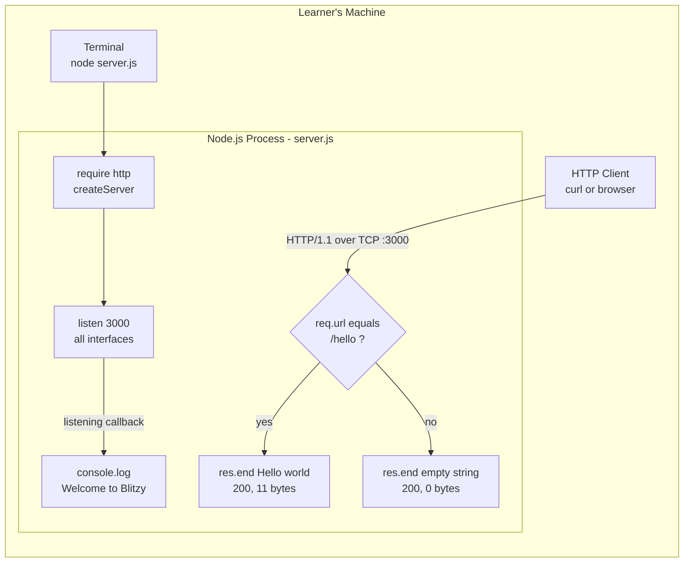
```mermaid
flowchart LR
    subgraph LearnerHost["Learner's Machine"]
        Terminal["Terminal<br/>node server.js"]
        HttpClient["HTTP Client<br/>curl or browser"]
        subgraph NodeProc["Node.js Process - server.js"]
            CreateSrv["require http<br/>createServer"]
            BindPort["listen 3000<br/>all interfaces"]
            WelcomeLog["console.log<br/>Welcome to Blitzy"]
            UrlCheck{"req.url equals<br/>/hello ?"}
            HelloBody["res.end Hello world<br/>200, 11 bytes"]
            EmptyBody["res.end empty string<br/>200, 0 bytes"]
        end
    end
    Terminal --> CreateSrv
    CreateSrv --> BindPort
    BindPort -->|"listening callback"| WelcomeLog
    HttpClient -->|"HTTP/1.1 over TCP :3000"| UrlCheck
    UrlCheck -->|"yes"| HelloBody
    UrlCheck -->|"no"| EmptyBody
```

#### Core Technical Approach

All runtime behaviour sits in one CommonJS statement made of two inline arrow callbacks, with no named functions, exports or third-party modules:

```javascript
require('http').createServer((req, res) => res.end(req.url === '/hello' ? 'Hello world' : '')).listen(3000, () => console.log('Welcome to Blitzy'));
```

| Design Choice | Implementation | Consequence |
|---|---|---|
| Exact-match routing | Strict equality `req.url === '/hello'` | `/hello/`, `/HELLO` and `/hello?x=1` get the empty fallback (`Project Guide.md` Appendix G) |
| Single response call | One `res.end(...)` with a ternary; no status or headers set | Node defaults apply: status 200; only `Date`, `Connection`, `Keep-Alive`, `Content-Length` headers; no `Content-Type` (`Project Guide.md` §3, §5.2 D3) |
| Method-agnostic handler | Method is never inspected | Answers 33 of Node's 35 standard methods; CONNECT/PRI are closed by Node; HEAD has no body (`Project Guide.md` §5.2 D2) |
| Literal configuration | Port, path and messages are string/number literals | No `process.env` use; port fixed at 3000 (`Project Guide.md` Appendix E) |
| Event-ordered startup | Log call sits in the `listen` callback | Message appears only after a successful bind |
| Platform defaults for binding and errors | `listen(3000)` with no host; no `'error'` listener | Binds `*:3000` dual-stack; a busy port ends with an unhandled `EADDRINUSE` and exit 1 (`Project Guide.md` §4, §5.2 D3) |

### 1.2.3 Success Criteria

#### Measurable Objectives

The AAP sets twelve deliverables. `Project Guide.md` §5.1 reports all twelve as passing.

| Objective | Target | Reported Result | Evidence |
|---|---|---|---|
| FR-1: `/hello` response | HTTP 200, body exactly `Hello world` | Pass; holds for 33 of 35 standard methods (caveat D2) | `Project Guide.md` §3, §5.1 |
| Fallback response | Every other URL answered with 200 and an empty body | Pass across 11 non-matching URLs | `Project Guide.md` §3 |
| FR-2: startup message | stdout exactly `Welcome to Blitzy\n` (18 B), once, after bind; stderr empty | Pass | `Project Guide.md` §3, §5.1 |
| FR-3: README | Accurate run instructions under five lines | Pass; 4 non-blank lines; commands work from a clean copy | `Project Guide.md` §5.1 |
| Size limit | One JSDoc line and one statement | Pass; 2 lines / 247 B, 0 JSDoc tags | `Project Guide.md` §5.1 item 6 |
| Dependency limit | Built-in modules only; no install | Pass; only `require('http')`, no manifest | `Project Guide.md` §5.1 item 7 |
| Exact content (AAP 0.9.1) | Both files byte-identical to the specification | Pass; `cmp` exit 0 | `Project Guide.md` §5.1 item 9 |
| Scope boundary (AAP 0.8.2) | Only the two deliverable files | Pass when verified; see note below | `Project Guide.md` §5.1 item 10 |

The guide verified the scope boundary with `git ls-files` returning `README.md` and `server.js`. Commit `92db56b` later added the guide itself, so the tracked tree now has three files: the two deliverables plus `blitzy/documentation/Project Guide.md`.

#### Critical Success Factors

1. **Exact-content conformance.** The specified file contents are the acceptance criterion. `git diff` against the delivered commit should stay empty unless the specification changes (`Project Guide.md` Appendix F).
2. **README steps work as written.** Learners must run `node server.js` from the repository root with port 3000 free. Starting from any other directory fails with `Cannot find module` (`Project Guide.md` §5.2 D5, §9.7).
3. **Supported runtime.** Any maintained Node.js release; Node.js 24 LTS recommended. Avoid anything below 22.23.2 / 24.18.1 / 26.5.1 and the end-of-life 20.x, 23.x and 25.x lines (`Project Guide.md` §9.1, §5.2 D4).
4. **Local-only operation.** Because the server binds all interfaces with no hardening, it must stay on a trusted network (`Project Guide.md` §6).
5. **Owner sign-off.** The project owner must accept caveats D2–D5 (`Project Guide.md` §1.4).

#### Key Performance Indicators

| KPI | Current Value | Target | Source |
|---|---|---|---|
| Scripted assertion pass rate | 50 of 50 (100%) | 100% | `Project Guide.md` §3 |
| AAP deliverables complete | 12 of 12 | 12 of 12 | `Project Guide.md` §1.2, §5.1 |
| Effort completion | 75.0% (12.0 of 16.0 h) | 100% | `Project Guide.md` §1.2, §2.3 |
| Open sign-off / platform items | 5 | 0 | `Project Guide.md` §1.4 |
| Verified platforms and runtimes | Linux with Node v22.23.2 only | Linux, macOS, Windows; Node 24 LTS | `Project Guide.md` §1.4, §3 |
| Concurrency correctness | 200 parallel and a 100/100 mixed load, all answered correctly | Every request answered | `Project Guide.md` §3 |
| In-repository automated tests | 0 (`node --test` reports `# tests 0`); coverage not reported | 0 by design (AAP 0.8.2) | `Project Guide.md` §3 |


## 1.3 Scope

### 1.3.1 In-Scope

#### Core Features and Functionalities

**Must-have capabilities.** The AAP defines three functional requirements plus an HTTP contract (`Project Guide.md` §5.1, Appendix G).

| ID | Requirement | Implementation | Evidence |
|---|---|---|---|
| FR-1 | `/hello` returns `Hello world` | Ternary on `req.url` inside the request handler | `server.js` line 2 |
| FR-2 | Print bare `Welcome to Blitzy` once listening | `console.log` in the `listen` callback | `server.js` line 2 |
| FR-3 | Accurate README under five lines | Title plus three instruction lines | `README.md` lines 1–5 |
| AAP 0.6.3 | Any method on `/hello` returns 200 `Hello world`; other URLs return 200 with an empty body | Method-agnostic handler; Node handles method dispatch (caveat D2) | `server.js` line 2; `Project Guide.md` §5.2 |
| Fixed port | Listen on 3000 and answer every request | `.listen(3000, …)` | `server.js` line 2; `Project Guide.md` §5.1 item 5 |

**Primary user workflows.** The main workflow is the README walkthrough (`README.md` lines 4–5; `Project Guide.md` §9.4).

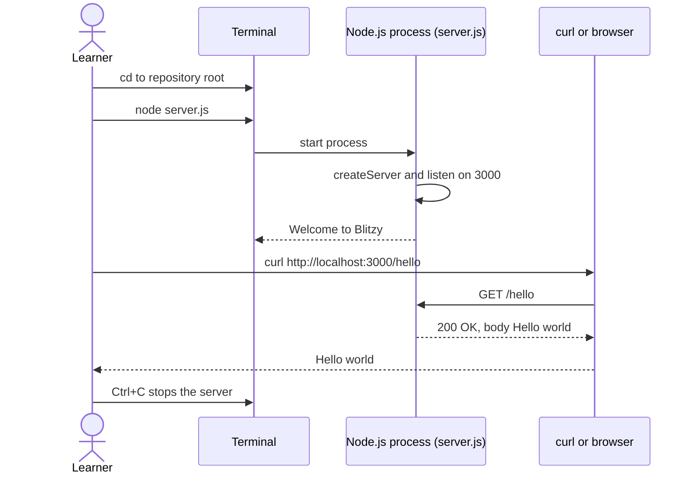
```mermaid
sequenceDiagram
    actor Learner
    participant Term as Terminal
    participant Srv as Node.js process (server.js)
    participant Cli as curl or browser
    Learner->>Term: cd to repository root
    Learner->>Term: node server.js
    Term->>Srv: start process
    Srv->>Srv: createServer and listen on 3000
    Srv-->>Term: Welcome to Blitzy
    Learner->>Cli: curl http://localhost:3000/hello
    Cli->>Srv: GET /hello
    Srv-->>Cli: 200 OK, body Hello world
    Cli-->>Learner: Hello world
    Learner->>Term: Ctrl+C stops the server
```

| Workflow | Steps | Expected Result | Source |
|---|---|---|---|
| README walkthrough | `node server.js`, then `curl http://localhost:3000/hello` | `Welcome to Blitzy` on stdout; `Hello world` from curl | `README.md` lines 4–5 |
| Browser check | Open `http://localhost:3000/hello` | Plain text `Hello world`; any other path shows a blank page | `Project Guide.md` §9.6 |
| Syntax check | `node --check server.js` | Exit status 0 | `Project Guide.md` §9.5 |
| Background run | `nohup node server.js > "$d/server.log" 2>&1 &`, then `kill "$pid"` | Log contains `Welcome to Blitzy`; the stop affects only this process | `Project Guide.md` §9.4 |
| Isolated package gate (Linux, root) | `unshare -n` smoke run in a private network namespace | Welcome line, `/hello` 200 `Hello world`, `/other` 200 empty; exit 0 | `Project Guide.md` §9.5 |

**Essential integrations**

| Integration | Purpose | Requirement | Source |
|---|---|---|---|
| Node.js runtime | Runs `server.js`; provides the `http` module | Any maintained release; Node.js 24 LTS recommended; verified on v22.23.2 | `Project Guide.md` §9.1 |
| curl | Calls the endpoint | On Windows PowerShell 5.1, use `curl.exe` | `README.md` line 5; `Project Guide.md` §9.1 |
| Web browser | Optional client | None | `Project Guide.md` §4, §9.6 |
| Host OS networking | TCP listener | Port 3000 must be free | `Project Guide.md` §9.1 |

**Key technical requirements**

| Requirement | Specification | Source |
|---|---|---|
| Module system | CommonJS (`require`); no `package.json` | `server.js` line 2; `Project Guide.md` Appendix D |
| Protocol and port | HTTP/1.1 over TCP, port 3000, all interfaces (dual-stack) | `Project Guide.md` Appendix B |
| Dependencies | Built-in modules only; no install step | `README.md` line 3; `Project Guide.md` §5.1 item 7 |
| Configuration | None; no environment variables read | `Project Guide.md` Appendix E |
| Response headers | Node defaults only (`Date`, `Connection`, `Keep-Alive`, `Content-Length`); no server or version banner | `Project Guide.md` §3, §4 |
| Code size | One JSDoc line and one statement | `server.js`; `Project Guide.md` §5.1 item 6 |
| Exact content | Both files byte-identical to the AAP 0.9.1 text | `Project Guide.md` §5.1 item 9 |
| Input handling | No request input reflected; Node's parser rejects malformed or oversized input (a 20 KB header gets 431) and the server keeps running | `Project Guide.md` §1.3, §3 |

#### Implementation Boundaries

| Boundary | Included | Evidence |
|---|---|---|
| System boundary | One Node.js process with one TCP listener on port 3000. No outbound connections, persistence or file-system access in `server.js` | `server.js` line 2; `Project Guide.md` Appendix B |
| User groups | Learners as primary users; project owner and QA as maintainers. No accounts, roles or authentication | `Project Guide.md` §1.1, §1.4, §4 |
| Geographic / market coverage | No locale, region or language handling; fixed English strings. Intended for any OS that Node supports, verified on Linux only. Runs on the learner's machine | `server.js` line 2; `Project Guide.md` §1.1, §9.1 |
| Data domains | Input: request URL only, compared but never stored or echoed. Output: two literal response bodies and one console message. No persisted data, personal data, credentials or configuration | `server.js` line 2; `Project Guide.md` §1.3, §1.5 |

### 1.3.2 Out-of-Scope

#### Explicitly Excluded Features and Capabilities

| Excluded Item | Basis | Evidence |
|---|---|---|
| Network hardening: loopback-only bind, connection/rate/idle caps, security headers, `Content-Type` | Sanctioned no-hardening, minimal-lines direction (AAP 0.1.2, 0.8.2) | `Project Guide.md` §5.2 D3 |
| Handling of a busy port (`EADDRINUSE`) and other startup errors | Same direction; no `'error'` listener | `Project Guide.md` §5.2 D3 |
| 404 responses, multiple routes, method-specific handling, a `'connect'` listener | Ruled out by AAP 0.8.2 and the exact two-line content of AAP 0.9.1 | `Project Guide.md` §5.2 D2 |
| In-repository test suite and coverage tooling | Forbidden by AAP 0.8.2 | `Project Guide.md` §3 |
| Package manifest, third-party dependencies, install or build step | Dependency NFR | `Project Guide.md` §5.1 item 7, §9.3 |
| Runtime version pin | AAP 0.3.1 avoids a pin on purpose | `Project Guide.md` §5.2 D4 |
| Extra README content (runtime guidance, run directory) | AAP 0.8.2 and the exact text of 0.9.1 | `Project Guide.md` §5.2 D4, D5 |
| UI, assets and design files (the Figma console) | Excluded by AAP 0.8.2 | `Project Guide.md` §5.1 item 11 |
| Configurable port, path or messages | All are literals; no environment variables | `Project Guide.md` Appendix E |

#### Future Phase Considerations

| Item | Priority | Estimate | Source |
|---|---|---|---|
| Owner sign-off of caveats D2–D3, then merge (merge done on 2026-10-01 per git history; sign-off not recorded) | High | 1.0 h | `Project Guide.md` §1.6, §2.2 |
| Verify on Node.js 24 LTS and publish runtime guidance (D4) | Medium | 1.0 h | `Project Guide.md` §2.2 |
| README walkthrough on macOS and Windows | Medium | 1.5 h | `Project Guide.md` §2.2 |
| Decide README wording on run directory and trailing newline (D5) | Low | 0.5 h | `Project Guide.md` §2.2 |
| Re-scope for any public deployment: binding, limits, headers, error handling | Not estimated (outside the AAP) | — | `Project Guide.md` §2.3, §8 |

#### Integration Points Not Covered

- Databases or any other persistence (`Project Guide.md` §9.2).
- External APIs, outbound network calls and third-party services (`Project Guide.md` §1.5).
- Authentication, authorization and identity providers (`Project Guide.md` §4).
- Environment-based configuration and secrets management (`Project Guide.md` Appendix E).
- CI/CD pipelines, containers and deployment targets. The repository contains none, and there is no regression suite to re-run automatically (`Project Guide.md` §3, §6).
- Reverse proxies or traffic limiting. The guide suggests these only as a mitigation if the server is ever deployed (`Project Guide.md` §6).
- Logging and monitoring beyond the single startup message (`server.js` line 2).

#### Unsupported Use Cases

| Use Case | Behaviour | Source |
|---|---|---|
| Public or network-facing deployment | Not hardened; any machine on the same network can reach `*:3000` | `Project Guide.md` §5.2 D3, §8 |
| CONNECT or PRI requests | Node closes the socket without a response; the handler never runs | `Project Guide.md` §5.2 D2 |
| HEAD on `/hello` expecting a body | 200 with no body, per protocol | `Project Guide.md` §5.2 D2 |
| Unknown or lowercase method tokens | Parser-level 400 | `Project Guide.md` §5.2 D2 |
| Path variants `/hello/`, `/HELLO`, `/hello?x=1` | 200 with an empty body (exact-match routing) | `Project Guide.md` Appendix G, §9.7 |
| Starting from outside the repository root | Fails with `Cannot find module` | `Project Guide.md` §5.2 D5 |
| A second instance, or a port other than 3000 | Unhandled `EADDRINUSE`, exit 1; the port is not configurable | `Project Guide.md` §4, Appendix E |
| macOS, Windows, or Node.js releases other than v22.23.2 | Not verified; Windows PowerShell 5.1 aliases `curl` to `Invoke-WebRequest` | `Project Guide.md` §1.4, §6 |


## 1.4 References

- `server.js` - The entire runtime: line 1 JSDoc summary; line 2 CommonJS statement using built-in `http`, exact `/hello` match returning `Hello world`, empty fallback, `listen(3000)` and the `Welcome to Blitzy` startup log
- `README.md` - Tutorial title ("Node.js Hello Tutorial"), Node.js-only prerequisite with no install, start command and expected `curl` result (5 lines, 229 B)
- `blitzy/` - Container for project documentation; one child, `blitzy/documentation`
- `blitzy/documentation/` - Holds the project status report
- `blitzy/documentation/Project Guide.md` - Target audience and purpose (§1.1); completion metrics and open issues (§1.2–§1.6); effort breakdown (§2); 50/50 assertion results and gaps in test coverage (§3); runtime validation (§4); AAP compliance matrix and divergences D1–D5 (§5); risks (§6); readiness statement (§8); prerequisites, workflows and troubleshooting (§9); port, versions, environment variables and glossary (§10 Appendices B, D, E, G)
- Git history (`6cb007c`, `06b5c87`, `c2647de`, `92db56b`, `04b7b44`) - Original placeholder README, delivery sequence, contributors, and the pull request #1 merge on 2026-10-01
- Repository root (`""`) - Tracked tree is `README.md`, `server.js` and `blitzy/documentation/Project Guide.md`; no package manifest, test, CI or container files


# 2. Product Requirements

## 2.1 Feature Catalog

The product has seven features. Three come from the functional requirements FR-1 to FR-3. Two come from the AAP 0.6.3 HTTP contract and the fixed-port deliverable. Two are cross-cutting non-functional requirements on size, dependencies, scope and security. All seven are drawn from the Agent Action Plan (AAP) as reported in `blitzy/documentation/Project Guide.md` (§5.1, §5.2, Appendix G) and from the delivered code in `server.js` and `README.md`. The AAP itself is not stored in the repository, so its clause numbers (0.1.2, 0.3.1, 0.6.3, 0.8.2, 0.9.1) are cited as the Project Guide reports them.

### 2.1.1 Feature Summary

| ID | Feature | Category | Priority / Status |
|---|---|---|---|
| F-001 | Greeting Endpoint (`/hello`) | HTTP API | Critical / Completed |
| F-002 | Non-Matching Request Fallback | HTTP API | High / Completed |
| F-003 | Fixed-Port HTTP Listener | Server Runtime | Critical / Completed |
| F-004 | Startup Notification | Console Output | High / Completed |
| F-005 | Tutorial Run Instructions | Documentation | High / Completed |
| F-006 | Minimal, Zero-Dependency Deliverable | Non-Functional: Packaging and Scope | Critical / Completed |
| F-007 | Platform-Default Security Posture | Non-Functional: Security | High / Completed |

**Classification basis**

| Attribute | Rule Applied | Evidence |
|---|---|---|
| Critical | Without the feature, the README walkthrough cannot produce its documented result, or the AAP acceptance criterion (exact content) fails | `README.md` lines 4–5; `Project Guide.md` §1.1, §8 |
| High | A delivered AAP requirement that does not on its own block the walkthrough | `Project Guide.md` §5.1 |
| Completed | All 12 AAP deliverables pass; pull request #1 merged in `04b7b44` (2026-10-01) | `Project Guide.md` §1.2, §5.1; git history |
| Open caveats | Owner sign-off on D2–D5 and macOS, Windows and Node 24 LTS walkthroughs are still outstanding. None blocks the local-tutorial target | `Project Guide.md` §1.4 |

### 2.1.2 F-001 Greeting Endpoint (`/hello`)

**Feature metadata**

| Attribute | Value |
|---|---|
| Unique ID | F-001 |
| Feature Name | Greeting Endpoint (`/hello`) |
| Feature Category | HTTP API |
| Priority Level | Critical |
| Status | Completed, with accepted caveat D2 pending owner sign-off |
| Source Requirement | FR-1; AAP 0.6.3 (`Project Guide.md` §5.1 items 1 and 4) |

**Description**

- *Overview.* A request whose target is exactly `/hello` gets HTTP 200 with the body `Hello world` (11 bytes, no trailing newline). This holds for every HTTP method Node dispatches to the handler. It is the true branch of the ternary in the request handler at `server.js` line 2.
- *Business value.* This is the tutorial's single verifiable outcome. `README.md` line 5 promises it, and the Project Guide's definition of success depends on it (`Project Guide.md` §8).
- *User benefits.* One `curl` command or one browser visit confirms the server works. The fixed literal output is easy to compare.
- *Technical context.* Routing is the strict comparison `req.url === '/hello'`, and the response is a single `res.end('Hello world')`. No status code or header is set explicitly, so Node's defaults supply status 200 and `Content-Length: 11`. The method is never inspected.

**Dependencies**

| Type | Dependency | Evidence |
|---|---|---|
| Prerequisite Features | F-003: the handler runs only on a listening server | `server.js` line 2 |
| System Dependencies | Node.js built-in `http` module (`createServer`, llhttp parser, method dispatch) | `server.js` line 2; `Project Guide.md` Appendix D |
| External Dependencies | An HTTP client: curl or a web browser | `README.md` line 5; `Project Guide.md` §4 |
| Integration Requirements | HTTP/1.1 over TCP on port 3000 | `Project Guide.md` Appendix B |

### 2.1.3 F-002 Non-Matching Request Fallback

**Feature metadata**

| Attribute | Value |
|---|---|
| Unique ID | F-002 |
| Feature Name | Non-Matching Request Fallback |
| Feature Category | HTTP API |
| Priority Level | High |
| Status | Completed |
| Source Requirement | AAP 0.6.3 HTTP contract (`Project Guide.md` §1.3, §5.1 item 4) |

**Description**

- *Overview.* Any request whose target is not exactly `/hello` gets HTTP 200 with an empty body (`Content-Length: 0`). The server never returns 404. This is the false branch of the same ternary (`res.end('')`, `server.js` line 2).
- *Business value.* Every request gets an answer (AAP deliverable 5) with no routing tables or error-handling code, so the server stays one statement.
- *User benefits.* The browser's automatic `/favicon.ico` request and mistyped paths show a blank page, with no error and no crash (`Project Guide.md` §4).
- *Technical context.* `req.url` includes the query string, so `/hello?x=1`, `/hello/` and `/HELLO` all fall through to this branch (`Project Guide.md` Appendix G, §9.7).

**Dependencies**

| Type | Dependency | Evidence |
|---|---|---|
| Prerequisite Features | F-003. Shares the request handler with F-001 | `server.js` line 2 |
| System Dependencies | Node.js built-in `http` module | `server.js` line 2 |
| External Dependencies | HTTP clients (curl, browser) | `Project Guide.md` §4, §9.6 |
| Integration Requirements | Same listener as F-001 (TCP port 3000) | `Project Guide.md` Appendix B |

### 2.1.4 F-003 Fixed-Port HTTP Listener

**Feature metadata**

| Attribute | Value |
|---|---|
| Unique ID | F-003 |
| Feature Name | Fixed-Port HTTP Listener |
| Feature Category | Server Runtime |
| Priority Level | Critical |
| Status | Completed |
| Source Requirement | AAP deliverable 5, "Fixed port 3000; every request answered" (`Project Guide.md` §5.1) |

**Description**

- *Overview.* One Node.js process creates an HTTP server and listens on TCP port 3000. No host argument is passed, so Node binds all interfaces, dual-stack (`*:3000`). The port is a literal, and nothing reads configuration or environment variables (`Project Guide.md` Appendix E).
- *Business value.* A fixed, known port makes the README commands deterministic (`README.md` lines 4–5).
- *User benefits.* The learner configures nothing, and the URL is the same on every run.
- *Technical context.* The code is `.listen(3000, callback)` with no `'error'` listener, so a busy port causes an unhandled `EADDRINUSE` and exit code 1. All other server settings are Node defaults. Observed on Node v22.23.3: `server.timeout` 0, `requestTimeout` 300 000 ms, `headersTimeout` 60 000 ms, `keepAliveTimeout` 5 000 ms, `maxConnections` unset.

**Dependencies**

| Type | Dependency | Evidence |
|---|---|---|
| Prerequisite Features | None; this is the foundation feature | `server.js` line 2 |
| System Dependencies | Node.js runtime: unpinned, any maintained release, verified on v22.23.2. Host TCP stack with port 3000 free | `README.md` line 3; `Project Guide.md` §9.1 |
| External Dependencies | None | `Project Guide.md` §1.5 |
| Integration Requirements | Started with `node server.js` from the repository root | `README.md` line 4; `Project Guide.md` §5.2 D5 |

### 2.1.5 F-004 Startup Notification

**Feature metadata**

| Attribute | Value |
|---|---|
| Unique ID | F-004 |
| Feature Name | Startup Notification |
| Feature Category | Console Output |
| Priority Level | High |
| Status | Completed |
| Source Requirement | FR-2, "bare `Welcome to Blitzy` once listening" (`Project Guide.md` §5.1 item 2) |

**Description**

- *Overview.* Once the port is bound, the process prints `Welcome to Blitzy` to standard output exactly once. The `console.log` call sits in the `listen` callback (`server.js` line 2).
- *Business value.* It tells the learner the server has started before they send the request. `README.md` line 4 promises it.
- *User benefits.* A clear readiness signal. The troubleshooting guide answers `curl: (7) Failed to connect` with "wait for `Welcome to Blitzy`" (`Project Guide.md` §9.7).
- *Technical context.* Standard output is exactly `Welcome to Blitzy\n` (18 bytes, no ANSI codes). Nothing is printed when the bind fails, nothing is logged per request, and standard error stays empty in normal operation (`Project Guide.md` §3).

**Dependencies**

| Type | Dependency | Evidence |
|---|---|---|
| Prerequisite Features | F-003: the callback fires on the `'listening'` event | `server.js` line 2 |
| System Dependencies | Node.js `console` writing to process stdout | `server.js` line 2 |
| External Dependencies | A terminal, or a redirected log file for background runs | `Project Guide.md` §9.4 |
| Integration Requirements | The stdout stream only | `Project Guide.md` §3 |

### 2.1.6 F-005 Tutorial Run Instructions

**Feature metadata**

| Attribute | Value |
|---|---|
| Unique ID | F-005 |
| Feature Name | Tutorial Run Instructions (`README.md`) |
| Feature Category | Documentation |
| Priority Level | High |
| Status | Completed; walkthroughs on macOS, Windows and Node 24 LTS not yet run |
| Source Requirement | FR-3, "accurate README under five lines" (`Project Guide.md` §5.1 item 3) |

**Description**

- *Overview.* `README.md` has a title (line 1) and three instruction lines. Line 3 states the prerequisite (Node.js, nothing to install). Line 4 gives the start command, the expected message and the port. Line 5 gives the `curl` request and its expected response.
- *Business value.* A new learner can finish the tutorial without any other documentation.
- *User benefits.* Two commands, each with a literal expected result.
- *Technical context.* The file is 5 lines and 229 bytes, 4 of them non-blank, with no trailing newline. AAP 0.9.1 fixes its exact text. It replaced the placeholder README from commit `6cb007c` (D1) (`Project Guide.md` §5.2).

**Dependencies**

| Type | Dependency | Evidence |
|---|---|---|
| Prerequisite Features | F-003, F-004 and F-001, whose behaviour it documents | `README.md` lines 4–5 |
| System Dependencies | None at runtime | `README.md` |
| External Dependencies | Node.js and curl. On Windows PowerShell 5.1, use `curl.exe` | `Project Guide.md` §9.1 |
| Integration Requirements | Commands assume the working directory is the repository root | `Project Guide.md` §5.2 D5 |

### 2.1.7 F-006 Minimal, Zero-Dependency Deliverable

**Feature metadata**

| Attribute | Value |
|---|---|
| Unique ID | F-006 |
| Feature Name | Minimal, Zero-Dependency Deliverable |
| Feature Category | Non-Functional: Packaging and Scope |
| Priority Level | Critical (the AAP acceptance criterion) |
| Status | Completed |
| Source Requirement | NFR size, NFR dependencies, AAP 0.9.1, AAP 0.8.2, AAP 0.3.1 (`Project Guide.md` §5.1 items 6, 7, 9–11; §5.2 D4) |

**Description**

- *Overview.* A cross-cutting constraint on every other feature:
  - the server is one JSDoc line and one statement;
  - it uses built-in modules only, with no manifest, install, build step or in-repository tests;
  - the deliverable is two files whose content matches the specification byte for byte;
  - the Node.js version is not pinned.
- *Business value.* The smallest possible surface to teach and review, and no supply-chain exposure (`Project Guide.md` §5.1 item 7).
- *User benefits.* Nothing to install, and the whole program can be read at a glance.
- *Technical context.*
  - `server.js` is 2 lines / 247 B with 0 JSDoc tags; `README.md` is 229 B; `cmp` exits 0 for both.
  - `node --test` reports `# tests 0` (`Project Guide.md` §3).
  - The guide's `git ls-files` check returned the two deliverables. The tracked tree now has three files, because commit `92db56b` later added `blitzy/documentation/Project Guide.md`.

**Dependencies**

| Type | Dependency | Evidence |
|---|---|---|
| Prerequisite Features | None. It constrains F-001 to F-005 and F-007 | `Project Guide.md` §1.1 |
| System Dependencies | Node.js built-in `http` module only | `server.js` line 2 |
| External Dependencies | None: no `package.json` or third-party packages | `Project Guide.md` §9.3, Appendix D |
| Integration Requirements | None | `Project Guide.md` §1.5 |

### 2.1.8 F-007 Platform-Default Security Posture

**Feature metadata**

| Attribute | Value |
|---|---|
| Unique ID | F-007 |
| Feature Name | Platform-Default Security Posture |
| Feature Category | Non-Functional: Security |
| Priority Level | High |
| Status | Completed, with accepted caveat D3 (hardening deliberately absent) |
| Source Requirement | NFR security, "Node defaults, nothing added"; AAP 0.1.2, 0.8.2 (`Project Guide.md` §5.1 item 8, §5.2 D3) |

**Description**

- *Overview.* The server adds no security controls and discloses nothing. It relies on Node's defaults: the default header set only, no reflection of request input, and parser-level rejection of malformed or oversized requests. It reads no credentials, environment variables or external services.
- *Business value.* Meets the security requirement without adding code that would break F-006.
- *User benefits.* Nothing is echoed back, there is nothing to configure, and the server keeps serving after bad input.
- *Technical context.*
  - Sent headers are `Date`, `Connection: keep-alive`, `Keep-Alive: timeout=5` and `Content-Length`.
  - A 20 KB header gets 431 (Node's `maxHeaderSize` defaults to 16 384 B). A lowercase or unknown method token gets 400. CONNECT and PRI are closed without a response.
  - Hardening is deliberately absent: `*:3000` bind, no caps, no `Content-Type` or security headers, and an unhandled `EADDRINUSE`.

**Dependencies**

| Type | Dependency | Evidence |
|---|---|---|
| Prerequisite Features | F-003 (listener). Applies to F-001 and F-002 responses | `server.js` line 2 |
| System Dependencies | Node `http` and llhttp defaults (llhttp 9.4.3 in the verified runtime) | `Project Guide.md` Appendix D |
| External Dependencies | A trusted local network, because of the all-interface bind | `Project Guide.md` §6 |
| Integration Requirements | None | `Project Guide.md` §1.5, Appendix E |

## 2.2 Functional Requirements Table

All requirements are at baseline version 1.0 (see Section 2.6). Priorities use Must-Have, Should-Have and Could-Have; complexity uses High, Medium and Low. The acceptance criteria come from three sources: the Project Guide's verification commands (`Project Guide.md` §9.5, Appendix F), its 50-assertion suite (§3), and its runtime validation (§4). Every criterion is an observable command result. A re-run against `server.js` on Node v22.23.3 reproduced them.

### 2.2.1 F-001 Greeting Endpoint Requirements

| Requirement ID | Description | Acceptance Criteria | Priority / Complexity |
|---|---|---|---|
| F-001-RQ-001 | A request whose target is exactly `/hello` returns status 200 with body `Hello world` | `curl -s -o /dev/null -w '%{http_code} %{size_download}' http://localhost:3000/hello` prints `200 11`; the body has no trailing newline | Must-Have / Low |
| F-001-RQ-002 | The response does not depend on the method, for every method Node dispatches (33 of 35 `http.METHODS`) | GET, POST, PUT, DELETE, PATCH, OPTIONS, TRACE and PURGE on `/hello` each return 200 `Hello world`; a request body such as `-d a=1` does not change the response | Must-Have / Low |
| F-001-RQ-003 | HEAD on `/hello` returns status 200 without a body | `curl -I` returns 200 with zero body bytes | Should-Have / Low |
| F-001-RQ-004 | Routing is an exact, case-sensitive match on the full request target, query string included | `/hello/`, `/HELLO` and `/hello?x=1` each return `200 0` (served by F-002) | Must-Have / Low |

**Technical specifications**

| Aspect | Specification |
|---|---|
| Input Parameters | `req.url` only. Method, headers and body are ignored |
| Output/Response | `HTTP/1.1 200 OK` with `Date`, `Connection: keep-alive`, `Keep-Alive: timeout=5` and `Content-Length: 11`; body `Hello world` |
| Performance Criteria | No latency target is defined. Verified: 200 parallel requests and a 100/100 mixed load all return correct bodies (`Project Guide.md` §3) |
| Data Requirements | One static 11-byte string literal. No state or persistence |

**Validation rules**

| Rule Type | Rule | Evidence |
|---|---|---|
| Business Rules | Only an exact `/hello` produces the greeting. "Any method" holds for the methods Node dispatches; CONNECT and PRI never reach the handler (D2) | `Project Guide.md` §5.2 D2 |
| Data Validation | No application-level validation. Node's parser rejects malformed requests before the handler runs (F-007-RQ-003) | `Project Guide.md` §3 |
| Security Requirements | Request input is never reflected (F-007-RQ-002) | `Project Guide.md` §1.3 |
| Compliance Requirements | Body text and code are fixed by AAP 0.6.3 and the exact content of AAP 0.9.1 | `Project Guide.md` §5.1 items 4 and 9 |

### 2.2.2 F-002 Non-Matching Request Fallback Requirements

| Requirement ID | Description | Acceptance Criteria | Priority / Complexity |
|---|---|---|---|
| F-002-RQ-001 | Any request target other than exactly `/hello` returns status 200 with an empty body | `curl -s -o /dev/null -w '%{http_code} %{size_download}' http://localhost:3000/other` prints `200 0`; the same holds for all 11 non-matching URLs in the suite, including `/favicon.ico` | Must-Have / Low |
| F-002-RQ-002 | The handler never produces a 404 or any other error status | Every non-matching URL returns 200; a browser shows a blank page with zero console errors | Must-Have / Low |

**Technical specifications**

| Aspect | Specification |
|---|---|
| Input Parameters | `req.url` (any value except exactly `/hello`) |
| Output/Response | `HTTP/1.1 200 OK`, `Content-Length: 0`, empty body |
| Performance Criteria | Same as F-001; covered by the same concurrency assertions |
| Data Requirements | One empty string literal. No state |

**Validation rules**

| Rule Type | Rule | Evidence |
|---|---|---|
| Business Rules | No 404 and no extra routes. The exact two-line content rules out routing logic | `Project Guide.md` §1.3; §5.2 D2 |
| Data Validation | None at application level | `server.js` line 2 |
| Security Requirements | The empty body discloses nothing | `Project Guide.md` §4 |
| Compliance Requirements | AAP 0.6.3 HTTP contract | `Project Guide.md` §5.1 item 4 |

### 2.2.3 F-003 Fixed-Port HTTP Listener Requirements

| Requirement ID | Description | Acceptance Criteria | Priority / Complexity |
|---|---|---|---|
| F-003-RQ-001 | Listen on TCP port 3000, fixed as a literal, with no configuration or environment variables | `ss -ltnp 'sport = :3000'` shows `LISTEN … *:3000 … "node"`; `server.js` contains no `process.env` reference | Must-Have / Low |
| F-003-RQ-002 | Answer every request, including under concurrent load | 200 parallel requests and a 100/100 mixed load (400 requests in all) are each answered with the correct body | Must-Have / Medium |
| F-003-RQ-003 | A second instance on a busy port fails without disturbing the first | The second `node server.js` exits 1 with `Error: listen EADDRINUSE: address already in use :::3000`; the first instance still returns `200 11` on `/hello` | Should-Have / Low |
| F-003-RQ-004 | Stopping the process by signal releases the port | SIGTERM ends the process with exit status 143 and frees port 3000 | Should-Have / Low |

**Technical specifications**

| Aspect | Specification |
|---|---|
| Input Parameters | `node server.js` run from the repository root. No CLI arguments, environment variables or config files |
| Output/Response | One listening socket on `*:3000` (all interfaces, dual-stack), HTTP/1.1 over TCP |
| Performance Criteria | Node defaults apply: `server.timeout` 0, `requestTimeout` 300 s, `headersTimeout` 60 s, `keepAliveTimeout` 5 s, `maxConnections` unset |
| Data Requirements | None |

**Validation rules**

| Rule Type | Rule | Evidence |
|---|---|---|
| Business Rules | One listener; the port cannot be configured | `Project Guide.md` Appendix B, Appendix E |
| Data Validation | Not applicable | `server.js` line 2 |
| Security Requirements | The all-interface bind means use on a trusted network only (D3) | `Project Guide.md` §5.2 D3, §6 |
| Compliance Requirements | AAP deliverable 5; AAP 0.8.2 forbids extra handlers or configuration | `Project Guide.md` §5.1 item 5, §5.2 D3 |

### 2.2.4 F-004 Startup Notification Requirements

| Requirement ID | Description | Acceptance Criteria | Priority / Complexity |
|---|---|---|---|
| F-004-RQ-001 | Print the bare message `Welcome to Blitzy` on standard output | stdout is exactly `Welcome to Blitzy\n` (18 bytes) with no ANSI escape codes | Must-Have / Low |
| F-004-RQ-002 | Print only after the port is bound | The message appears only once the listener is up; a failed bind (`EADDRINUSE`) writes 0 bytes to stdout | Must-Have / Low |
| F-004-RQ-003 | Print exactly once per process, with no other console output | After all verification traffic stdout is still 18 bytes and stderr is empty | Must-Have / Low |

**Technical specifications**

| Aspect | Specification |
|---|---|
| Input Parameters | The server's `'listening'` event (the `listen` callback) |
| Output/Response | One line on stdout |
| Performance Criteria | No timing target is defined; the line is written in the `listen` callback |
| Data Requirements | One string literal. No request data is logged |

**Validation rules**

| Rule Type | Rule | Evidence |
|---|---|---|
| Business Rules | The text is fixed and is the learner's readiness signal | `README.md` line 4; `Project Guide.md` §9.7 |
| Data Validation | Not applicable | `server.js` line 2 |
| Security Requirements | No request content, path or client data reaches the console | `Project Guide.md` §3 |
| Compliance Requirements | FR-2; exact content of AAP 0.9.1 | `Project Guide.md` §5.1 items 2 and 9 |

### 2.2.5 F-005 Tutorial Run Instructions Requirements

| Requirement ID | Description | Acceptance Criteria | Priority / Complexity |
|---|---|---|---|
| F-005-RQ-001 | The README is accurate and under five lines | 4 non-blank lines (5 lines in all, 229 B): a title and three instructions | Must-Have / Low |
| F-005-RQ-002 | Node.js is stated as the only prerequisite, with nothing to install | Line 3 reads "Requires Node.js; there is nothing to install." | Must-Have / Low |
| F-005-RQ-003 | The start command is given with its expected output and port | Line 4 names `node server.js`, `Welcome to Blitzy` and port 3000, and running the command produces that output | Must-Have / Low |
| F-005-RQ-004 | The test request is given with its expected response | Line 5 names `curl http://localhost:3000/hello` and `Hello world`, and running the command returns that body | Must-Have / Low |
| F-005-RQ-005 | The commands work exactly as written from a clean copy | Commands extracted from the README boot a clean two-file copy under `env -i` and return `Hello world` (5 assertions) | Must-Have / Medium |

**Technical specifications**

| Aspect | Specification |
|---|---|
| Input Parameters | None. Static Markdown |
| Output/Response | Title `# Node.js Hello Tutorial` and three instruction lines |
| Performance Criteria | Not applicable |
| Data Requirements | The exact text of AAP 0.9.1, 229 B, no trailing newline |

**Validation rules**

| Rule Type | Rule | Evidence |
|---|---|---|
| Business Rules | The instructions must match the runtime behaviour of F-001, F-003 and F-004 | `README.md` lines 4–5 |
| Data Validation | Byte-identical to the specified text (`cmp` exit 0) | `Project Guide.md` §5.1 item 9 |
| Security Requirements | Not applicable | `README.md` |
| Compliance Requirements | FR-3. AAP 0.8.2 forbids extra content such as the run directory or runtime guidance (D4, D5) | `Project Guide.md` §5.2 D4, D5 |

### 2.2.6 F-006 Minimal, Zero-Dependency Deliverable Requirements

| Requirement ID | Description | Acceptance Criteria | Priority / Complexity |
|---|---|---|---|
| F-006-RQ-001 | `server.js` is one JSDoc line and one statement | 2 lines, 247 B, 0 JSDoc tags; `node --check server.js` exits 0 | Must-Have / Low |
| F-006-RQ-002 | Built-in modules only, with no manifest, install or build step | Only `require('http')`; no `package.json`; a clean copy boots with no install | Must-Have / Low |
| F-006-RQ-003 | Both deliverables are byte-identical to the specified content | `cmp` against the AAP 0.9.1 text exits 0 for both files; `git diff` against the delivered commit is empty | Must-Have / Low |
| F-006-RQ-004 | The deliverable is `server.js` and `README.md` only, with no UI, assets, design files or in-repository tests | No UI, asset or design file in the tree; `node --test` reports `# tests 0` | Must-Have / Low |
| F-006-RQ-005 | The Node.js version is not pinned | `README.md` line 3 says only "Requires Node.js"; the repository has no manifest or version file | Must-Have / Low |

**Technical specifications**

| Aspect | Specification |
|---|---|
| Input Parameters | The repository tree |
| Output/Response | Two deliverable files: `server.js` (2 lines / 247 B) and `README.md` (5 lines / 229 B) |
| Performance Criteria | Not applicable |
| Data Requirements | The exact content is the acceptance criterion |

**Validation rules**

| Rule Type | Rule | Evidence |
|---|---|---|
| Business Rules | Any change to either file needs a change to the specification first | `Project Guide.md` Appendix F |
| Data Validation | `cmp` and `node --check` | `Project Guide.md` §3, §9.5 |
| Security Requirements | No third-party code, so no supply-chain exposure | `Project Guide.md` §5.1 item 7 |
| Compliance Requirements | AAP 0.3.1, 0.8.2, 0.9.1. Deliverable 12: no TODO, FIXME or placeholder markers | `Project Guide.md` §5.1 items 6, 7, 9–12 |

### 2.2.7 F-007 Platform-Default Security Posture Requirements

| Requirement ID | Description | Acceptance Criteria | Priority / Complexity |
|---|---|---|---|
| F-007-RQ-001 | Send only Node's default headers, with no server or version disclosure | `curl -s -D - -o /dev/null http://localhost:3000/hello` shows only `Date`, `Connection`, `Keep-Alive` and `Content-Length`; no `Server` or `X-Powered-By` | Must-Have / Low |
| F-007-RQ-002 | Never reflect request input in a response | Script paths, query strings and POST payloads (for example `<script>`) never appear in responses; CRLF sequences cannot inject headers | Must-Have / Low |
| F-007-RQ-003 | Node's parser rejects malformed or oversized requests, and the server keeps serving | A 20 KB header gets 431; a lowercase method token gets 400; CONNECT closes with 0 bytes; the next `/hello` returns `200 11` | Must-Have / Low |
| F-007-RQ-004 | Read no credentials, environment variables or external services | No `process.env` reference and no outbound connection in `server.js` | Must-Have / Low |
| F-007-RQ-005 | Add no hardening beyond Node's defaults (sanctioned) | `server.js` has no security headers, `Content-Type`, rate or connection caps, or `'error'` listener | Must-Have / Low |

**Technical specifications**

| Aspect | Specification |
|---|---|
| Input Parameters | Raw HTTP/1.1 requests from any client that can reach `*:3000` |
| Output/Response | The default header set; parser-generated 400 or 431 for invalid input; the socket is closed for CONNECT and PRI |
| Performance Criteria | Node's default limits: `maxHeaderSize` 16 384 B, `headersTimeout` 60 s, `requestTimeout` 300 s; no connection cap |
| Data Requirements | Nothing is stored, logged or echoed |

**Validation rules**

| Rule Type | Rule | Evidence |
|---|---|---|
| Business Rules | Local-tutorial use only. Any public deployment needs a new scope covering binding, limits, headers and error handling | `Project Guide.md` §8 |
| Data Validation | Parser-level only (llhttp) | `Project Guide.md` §3, Appendix D |
| Security Requirements | Run on a trusted network or behind a host firewall | `Project Guide.md` §6 |
| Compliance Requirements | NFR security, "Node defaults, nothing added"; AAP 0.1.2 and 0.8.2; D3 sanctioned | `Project Guide.md` §5.1 item 8, §5.2 D3 |

## 2.3 Feature Relationships

Every relationship below follows from code structure in `server.js` line 2, from textual references in `README.md`, or from the requirements as reported in `Project Guide.md` §5. Section 1.2.2 has the component-level process flowchart and Section 1.3.1 has the README walkthrough sequence diagram. This section shows how the features depend on one another.

### 2.3.1 Feature Dependency Map

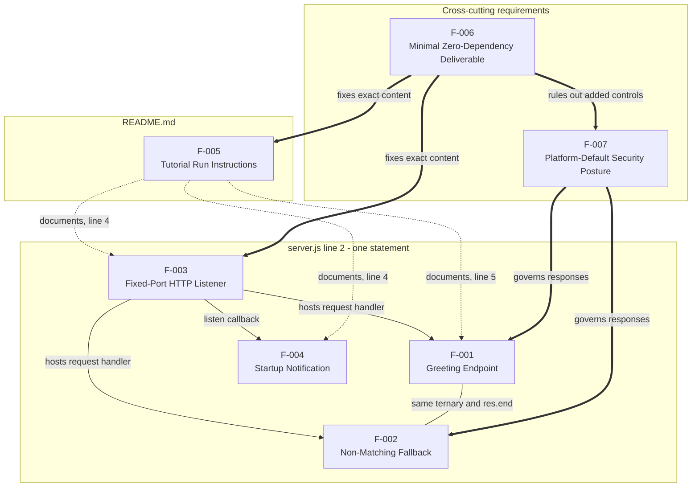
```mermaid
flowchart TD
    subgraph RuntimeLayer["server.js line 2 - one statement"]
        F003["F-003<br/>Fixed-Port HTTP Listener"]
        F001["F-001<br/>Greeting Endpoint"]
        F002["F-002<br/>Non-Matching Fallback"]
        F004["F-004<br/>Startup Notification"]
    end
    subgraph DocLayer["README.md"]
        F005["F-005<br/>Tutorial Run Instructions"]
    end
    subgraph CrossCutting["Cross-cutting requirements"]
        F006["F-006<br/>Minimal Zero-Dependency Deliverable"]
        F007["F-007<br/>Platform-Default Security Posture"]
    end
    F003 -->|"hosts request handler"| F001
    F003 -->|"hosts request handler"| F002
    F003 -->|"listen callback"| F004
    F001 ---|"same ternary and res.end"| F002
    F005 -.->|"documents, line 4"| F003
    F005 -.->|"documents, line 4"| F004
    F005 -.->|"documents, line 5"| F001
    F006 ==>|"fixes exact content"| F003
    F006 ==>|"fixes exact content"| F005
    F006 ==>|"rules out added controls"| F007
    F007 ==>|"governs responses"| F001
    F007 ==>|"governs responses"| F002
```

The map draws F-006's exact-content constraint only on F-003, F-005 and F-007. It applies equally to F-001, F-002 and F-004, because all four runtime features share the one statement whose text AAP 0.9.1 fixes (`Project Guide.md` §5.1 item 9).

| Feature | Depends On | Nature of Dependency | Evidence |
|---|---|---|---|
| F-001, F-002 | F-003 | The request handler is the `createServer` callback of the listener | `server.js` line 2 |
| F-001 ↔ F-002 | Each other | Two branches of one ternary passed to one `res.end` call; changing either changes the other's code | `server.js` line 2 |
| F-004 | F-003 | The `console.log` runs in the `listen(3000, …)` callback, so a failed bind prints nothing | `server.js` line 2; Section 2.2.4 |
| F-005 | F-001, F-003, F-004 | README lines 4–5 state their observable outputs; any behaviour change makes the README inaccurate | `README.md` lines 4–5 |
| F-007 | F-003; Node defaults | The security posture is whatever Node's `http` server provides, because nothing is added | `Project Guide.md` §5.2 D3 |
| F-001 to F-005, F-007 | F-006 | The exact-content and two-file constraints rule out new routes, handlers, headers, configuration or README text | `Project Guide.md` §5.1 items 6, 9, 10; §5.2 D2–D5 |

### 2.3.2 Request and Startup Processing Flow

The flow below shows where each feature acts on a request and at startup. Rejections from the parser stage come from Node itself, before the application handler runs (`Project Guide.md` §3, §5.2 D2; confirmed at runtime on Node v22.23.3).

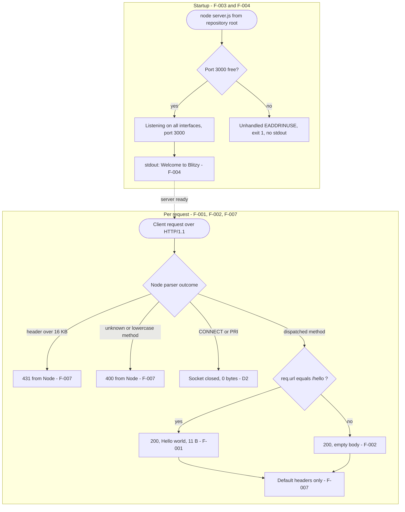
```mermaid
flowchart TD
    subgraph StartupFlow["Startup - F-003 and F-004"]
        RunCmd(["node server.js from repository root"]) --> BindTry{"Port 3000 free?"}
        BindTry -->|"yes"| Listening["Listening on all interfaces, port 3000"]
        Listening --> PrintWelcome["stdout: Welcome to Blitzy - F-004"]
        BindTry -->|"no"| CrashExit["Unhandled EADDRINUSE, exit 1, no stdout"]
    end
    subgraph RequestFlow["Per request - F-001, F-002, F-007"]
        ClientReq(["Client request over HTTP/1.1"]) --> ParseCheck{"Node parser outcome"}
        ParseCheck -->|"header over 16 KB"| Resp431["431 from Node - F-007"]
        ParseCheck -->|"unknown or lowercase method"| Resp400["400 from Node - F-007"]
        ParseCheck -->|"CONNECT or PRI"| SockClose["Socket closed, 0 bytes - D2"]
        ParseCheck -->|"dispatched method"| UrlMatch{"req.url equals /hello ?"}
        UrlMatch -->|"yes"| HelloResp["200, Hello world, 11 B - F-001"]
        UrlMatch -->|"no"| EmptyResp["200, empty body - F-002"]
        HelloResp --> DefaultHdrs["Default headers only - F-007"]
        EmptyResp --> DefaultHdrs
    end
    PrintWelcome -.->|"server ready"| ClientReq
```

### 2.3.3 Integration Points

| Integration Point | Features | Interface | Evidence |
|---|---|---|---|
| HTTP/1.1 over TCP port 3000, all interfaces, dual-stack | F-001, F-002, F-003, F-007 | curl, web browser or any HTTP client | `Project Guide.md` Appendix B, §4 |
| Process standard output | F-004 | A terminal, or a redirected log file for background runs | `Project Guide.md` §9.4 |
| Process launch and working directory | F-003, F-005 | `node server.js`, resolved against the current directory; it fails with `Cannot find module` outside the repository root | `Project Guide.md` §5.2 D5, §9.7 |
| Learner reading the documentation | F-005 | `README.md` Markdown | `README.md` lines 1–5 |

### 2.3.4 Shared Components

| Component | Location | Used By | Notes |
|---|---|---|---|
| The single CommonJS statement | `server.js` line 2 | F-001, F-002, F-003, F-004, F-007 | Holds all runtime behaviour; F-006 limits it to one statement |
| Inline request-handler arrow callback | `server.js` line 2 | F-001, F-002 | One strict comparison on `req.url`; one `res.end` call |
| Inline `listen` callback | `server.js` line 2 | F-004, triggered by F-003 | Runs once, on the `'listening'` event |
| One-line JSDoc summary | `server.js` line 1 | Describes F-001, F-003 and F-004 | Counted under F-006-RQ-001 (0 JSDoc tags) |

### 2.3.5 Common Services

| Service | Provided By | Consumed By | Evidence |
|---|---|---|---|
| HTTP parsing, method dispatch, default headers and error responses | Node.js built-in `http` module (llhttp 9.4.3 in the verified runtime) | F-001, F-002, F-003, F-007 | `Project Guide.md` Appendix D |
| Console output | Node.js `console` / process stdout | F-004 | `server.js` line 2 |
| TCP networking | Host operating system | F-003 | `Project Guide.md` §9.1 |

The repository has no other shared services: no database, authentication, configuration, logging framework or external API (`Project Guide.md` §1.5, §4, §9.2).

## 2.4 Implementation Considerations

One constraint governs every feature: the exact file contents are the acceptance criterion (AAP 0.9.1), and the scope excludes handlers, headers, configuration and hardening (AAP 0.1.2, 0.8.2) (`Project Guide.md` §1.1, §5.2). Any change listed below therefore needs a specification change first. The repository defines no latency, throughput or availability SLA, so performance entries report only verified behaviour and the platform defaults that apply.

### 2.4.1 F-001 Greeting Endpoint

| Consideration | Detail | Evidence |
|---|---|---|
| Technical Constraints | Method handling or a `'connect'` listener cannot be added, so the CONNECT/PRI gap (D2) stays open unless the contract is reworded to "any method Node dispatches". No `Content-Type` is sent | `Project Guide.md` §5.2 D2, D3 |
| Performance Requirements | One string comparison and a constant literal per request, with no I/O. Verified correct under 200 parallel requests and a 100/100 mixed load | `server.js` line 2; `Project Guide.md` §3 |
| Scalability Considerations | One process on one event loop; no clustering or worker model | `server.js` line 2 |
| Security Implications | Method, headers and body are never read, so nothing can be reflected | `Project Guide.md` §1.3 |
| Maintenance Requirements | Changing the path or body changes the bytes of `server.js` and makes `README.md` line 5 inaccurate. The specification, README and package gate must be updated together | `Project Guide.md` Appendix F |

### 2.4.2 F-002 Non-Matching Request Fallback

| Consideration | Detail | Evidence |
|---|---|---|
| Technical Constraints | No 404 and no further routes are possible within the two-line content | `Project Guide.md` §1.3, §5.2 D2 |
| Performance Requirements | Same cost as F-001: one comparison, a constant empty body | `server.js` line 2 |
| Scalability Considerations | Inherits F-003's single-process model | `server.js` line 2 |
| Security Implications | Empty body; the requested path is never echoed | `Project Guide.md` §3 |
| Maintenance Requirements | Learners requesting `/hello/` or `/hello?x=1` get an empty page; the troubleshooting guide covers this | `Project Guide.md` §9.7 |

### 2.4.3 F-003 Fixed-Port HTTP Listener

| Consideration | Detail | Evidence |
|---|---|---|
| Technical Constraints | Port 3000 is a literal with no environment override. With no host argument the server binds all interfaces, and with no `'error'` listener a busy port produces a raw `EADDRINUSE` stack trace | `server.js` line 2; `Project Guide.md` §5.2 D3, Appendix E |
| Performance Requirements | Node defaults apply: `server.timeout` 0, `requestTimeout` 300 s, `headersTimeout` 60 s, `keepAliveTimeout` 5 s, `maxConnections` unset | Runtime inspection on Node v22.23.3; `Project Guide.md` §5.2 D3 |
| Scalability Considerations | One instance per host, because the fixed port makes a second instance fail. No connection or rate caps. For any deployment the guide suggests a reverse proxy that enforces limits | `Project Guide.md` §3, §6 |
| Security Implications | The all-interface bind exposes the endpoint to the local network (risk Medium/Medium). The missing caps allow resource exhaustion if the server is exposed (risk Medium/Low). Both accepted under D3 | `Project Guide.md` §6 |
| Maintenance Requirements | Check the port with `lsof -ti :3000` before starting; stop only a process you own. Verified only on Linux with Node v22.23.2 | `Project Guide.md` §1.4, §9.4, §9.7 |

### 2.4.4 F-004 Startup Notification

| Consideration | Detail | Evidence |
|---|---|---|
| Technical Constraints | The print must stay in the `listen` callback to keep its after-bind guarantee. There is no logging framework | `server.js` line 2 |
| Performance Requirements | No timing target. One write per process lifetime | `Project Guide.md` §3 |
| Scalability Considerations | Not applicable | — |
| Security Implications | No request data, path or client address reaches the console | `Project Guide.md` §3 |
| Maintenance Requirements | This is the only operational signal. There are no request logs or monitoring | Section 1.3.2; `server.js` line 2 |

### 2.4.5 F-005 Tutorial Run Instructions

| Consideration | Detail | Evidence |
|---|---|---|
| Technical Constraints | The text is fixed. The run directory and runtime guidance cannot be added (D4, D5), and the file has no trailing newline | `Project Guide.md` §5.2 D4, D5 |
| Performance Requirements | Not applicable | — |
| Scalability Considerations | Platform reach is unverified beyond Linux. Windows PowerShell 5.1 aliases `curl` to `Invoke-WebRequest`, so `curl.exe` is needed (risk Medium/Medium) | `Project Guide.md` §6, §9.1 |
| Security Implications | Supported-runtime guidance cannot appear in the README, so learners may run an end-of-life Node.js (risk Medium/Medium, open) | `Project Guide.md` §5.2 D4, §6 |
| Maintenance Requirements | Pending: walkthroughs on Node 24 LTS (1.0 h) and on macOS and Windows (1.5 h), and a wording decision (0.5 h). Any amendment needs an AAP text change and a package-gate re-run | `Project Guide.md` §2.2, §5.2 D5 |

### 2.4.6 F-006 Minimal, Zero-Dependency Deliverable

| Consideration | Detail | Evidence |
|---|---|---|
| Technical Constraints | One statement, CommonJS, built-ins only, no manifest, no in-repository tests (AAP 0.8.2), no version pin (AAP 0.3.1) | `Project Guide.md` §3, §5.1, §5.2 D4 |
| Performance Requirements | No install, build or dependency-resolution step; startup is `node server.js` alone | `Project Guide.md` §9.2–§9.4 |
| Scalability Considerations | Any added capability breaks the one-statement and exact-content requirements, so growth needs a new scope | `Project Guide.md` §8 |
| Security Implications | No third-party code, so the only supply-chain surface is the Node.js runtime. Guidance: Node.js 24 LTS; never below 22.23.2 / 24.18.1 / 26.5.1; avoid the end-of-life 20.x, 23.x and 25.x lines | `Project Guide.md` §5.2 D4, §9.1 |
| Maintenance Requirements | No regression suite: after any edit, re-run `node --check server.js` and the isolated `unshare -n` package gate. `git diff` against the delivered commit should stay empty | `Project Guide.md` §3, §9.5, Appendix F |

### 2.4.7 F-007 Platform-Default Security Posture

| Consideration | Detail | Evidence |
|---|---|---|
| Technical Constraints | Hardening is excluded by direction (AAP 0.1.2, 0.8.2). Loopback binding would need an amendment to the exact content | `Project Guide.md` §5.2 D3, §6 |
| Performance Requirements | Node's defaults are the only guards: `maxHeaderSize` 16 384 B (a 20 KB header gets 431), `headersTimeout` 60 s, `requestTimeout` 300 s | Runtime inspection on Node v22.23.3; `Project Guide.md` §3 |
| Scalability Considerations | No connection, rate or idle caps; unsuitable for shared or public exposure | `Project Guide.md` §6 |
| Security Implications | Ready only as a local tutorial. A public deployment needs a new scope covering binding, limits, headers and error handling | `Project Guide.md` §8 |
| Maintenance Requirements | The posture depends on the runtime's patch level. Keep Node.js above the security floors and re-check published advisories, as the delivery's runtime-currency verification did | `Project Guide.md` §2.1, §5.2 D4 |

## 2.5 Traceability Matrix

Each requirement traces back to its AAP source and forward to its implementation and its verification evidence. Verification refers to the 50-assertion suite (`Project Guide.md` §3) and to runtime validation (`Project Guide.md` §4). The suite was run outside the repository; no test files are tracked (F-006-RQ-004). Line references are to `server.js` (S) and `README.md` (R).

### 2.5.1 AAP Deliverable to Feature Mapping

| # | AAP Deliverable (`Project Guide.md` §5.1) | Feature(s) | Requirement IDs |
|---|---|---|---|
| 1 | FR-1: `/hello` returns `Hello world` | F-001 | F-001-RQ-001 |
| 2 | FR-2: bare `Welcome to Blitzy` once listening | F-004 | F-004-RQ-001 to RQ-003 |
| 3 | FR-3: accurate README under five lines | F-005 | F-005-RQ-001 to RQ-005 |
| 4 | AAP 0.6.3 HTTP contract | F-001, F-002 | F-001-RQ-002 to RQ-004; F-002-RQ-001, RQ-002 |
| 5 | Fixed port 3000; every request answered | F-003 | F-003-RQ-001 to RQ-004 |
| 6 | NFR size: one JSDoc line, one statement | F-006 | F-006-RQ-001 |
| 7 | NFR dependencies: built-ins only, no install | F-006 | F-006-RQ-002 |
| 8 | NFR security: Node defaults, nothing added | F-007 | F-007-RQ-001 to RQ-005 |
| 9 | AAP 0.9.1 exact file contents | F-006 | F-006-RQ-003 |
| 10 | AAP 0.8.2 scope boundary: two files only | F-006 | F-006-RQ-004 |
| 11 | Figma console excluded (AAP 0.8.2) | F-006 | F-006-RQ-004 |
| 12 | Rules (AAP 0.10): none supplied | F-006 | Compliance rule in Section 2.2.6 |

AAP 0.3.1 (no version pin) is not a numbered deliverable. It is traced to F-006-RQ-005 through divergence D4 (`Project Guide.md` §5.2).

### 2.5.2 Requirement to Implementation and Verification

| Requirement ID | Source | Implementation | Verification |
|---|---|---|---|
| F-001-RQ-001 | FR-1; AAP 0.6.3 | S2: true branch, `res.end('Hello world')` | §3 HTTP contract; §4 curl and Chrome |
| F-001-RQ-002 | AAP 0.6.3 | S2: method never inspected | §3 HTTP contract (8 methods); §5.2 D2 |
| F-001-RQ-003 | AAP 0.6.3; HTTP protocol | Node `http` suppresses the HEAD body | §3 HTTP contract |
| F-001-RQ-004 | Exact-match routing (Appendix G) | S2: `req.url === '/hello'` | §3 HTTP contract; §9.7 |
| F-002-RQ-001 | AAP 0.6.3 | S2: false branch, `res.end('')` | §3 HTTP contract (11 URLs); §4 `/other`, `/favicon.ico` |
| F-002-RQ-002 | AAP 0.6.3, "no 404" (§1.3) | S2: no status code set | §3 HTTP contract; §4 Chrome console |
| F-003-RQ-001 | Deliverable 5; Appendix E | S2: `.listen(3000, …)` | §4 startup `*:3000`; §9.5 `ss` |
| F-003-RQ-002 | Deliverable 5 | S2: Node event-loop server | §3 Concurrency (2 assertions) |
| F-003-RQ-003 | Lifecycle behaviour (§4) | S2: no `'error'` listener | §3 Process lifecycle; §4 second instance |
| F-003-RQ-004 | Lifecycle behaviour (§3) | Node default signal handling | §3 Process lifecycle |
| F-004-RQ-001 | FR-2 | S2: `console.log('Welcome to Blitzy')` | §3 Console output (4 assertions) |
| F-004-RQ-002 | FR-2, "once listening" | S2: inside the `listen` callback | §3 Console output; §4 startup |
| F-004-RQ-003 | FR-2 | S2: the only console call | §3 Console output |
| F-005-RQ-001 | FR-3 | R1–R5 | §5.1 item 3 |
| F-005-RQ-002 | FR-3 | R3 | §3 README walkthrough |
| F-005-RQ-003 | FR-3 | R4 | §3 README walkthrough |
| F-005-RQ-004 | FR-3 | R5 | §3 README walkthrough |
| F-005-RQ-005 | FR-3 | R4–R5 | §3 README walkthrough (5 assertions); §4 |
| F-006-RQ-001 | NFR size | S1–S2 | §3 Static and package gate; §5.1 item 6 |
| F-006-RQ-002 | NFR dependencies | S2: `require('http')` only | §5.1 item 7; clean-copy boot (§3) |
| F-006-RQ-003 | AAP 0.9.1 | `server.js`, `README.md` | §3 Static gate (`cmp`); §5.1 item 9 |
| F-006-RQ-004 | AAP 0.8.2 | Repository tree | §5.1 items 10–11; `node --test` → `# tests 0` |
| F-006-RQ-005 | AAP 0.3.1 | R3; no manifest | §5.2 D4 |
| F-007-RQ-001 | NFR security | S2: no headers set | §3 Headers, disclosure and input (9 assertions); §4 |
| F-007-RQ-002 | NFR security | S2: literal bodies only | §3 Headers, disclosure and input |
| F-007-RQ-003 | NFR security | Node llhttp parser | §3 (20 KB header → 431); §4 CONNECT |
| F-007-RQ-004 | §1.5; Appendix E | S2: no `process.env`, no outbound calls | §1.5; Appendix E |
| F-007-RQ-005 | AAP 0.1.2, 0.8.2 | S2: nothing added | §5.1 item 8; §5.2 D3 |

### 2.5.3 Verification Coverage by Assertion Category

| Assertion Category (`Project Guide.md` §3) | Assertions | Requirements Covered | Result |
|---|---|---|---|
| Static and package gate | 4 | F-006-RQ-001, RQ-003 | 4 / 4 pass |
| HTTP contract | 21 | F-001-RQ-001 to RQ-004; F-002-RQ-001, RQ-002 | 21 / 21 pass |
| Headers, disclosure and input handling | 9 | F-007-RQ-001 to RQ-003 | 9 / 9 pass |
| Concurrency | 2 | F-003-RQ-002 | 2 / 2 pass |
| Console output | 4 | F-004-RQ-001 to RQ-003 | 4 / 4 pass |
| Process lifecycle | 5 | F-003-RQ-003, RQ-004 | 5 / 5 pass |
| README walkthrough | 5 | F-005-RQ-002 to RQ-005; F-006-RQ-002 | 5 / 5 pass |

The suite was run on Linux with Node v22.23.2 only. It did not cover macOS, Windows or Node 24 LTS, and it does not exercise CONNECT/PRI as a pass condition (`Project Guide.md` §3 "Not Covered").

## 2.6 Assumptions, Constraints and Requirement Versioning

### 2.6.1 Requirement Version Baseline

The repository has no requirements-versioning artefact. The baseline below is anchored to the git history and to the Project Guide's compliance review.

| Version | Date (UTC) | Baseline Commit(s) | Content |
|---|---|---|---|
| 1.0 | 2026-09-30 | `06b5c87` (`server.js`), `c2647de` (`README.md`), reported in `92db56b` (`Project Guide.md`) | F-001 to F-007, 30 requirements, all Completed against the AAP |
| 1.0 (merged) | 2026-10-01 | `04b7b44`, merge of pull request #1 into `main` | No requirement change; the same two deliverable files |

**Candidate changes (not adopted)**

| Candidate | Affected Requirements | Effect if Adopted | Source |
|---|---|---|---|
| Reword the contract to "any method Node dispatches" (D2) | F-001-RQ-002 | Wording only; no code change | `Project Guide.md` §5.2 D2 |
| Amend the README to name the run directory, e.g. "From this folder, run `node server.js`" (D5) | F-005-RQ-003, F-006-RQ-003 | Changes README bytes; the AAP text must change and the package gate be re-run | `Project Guide.md` §5.2 D5 |
| Publish runtime guidance alongside the tutorial (D4) | F-006-RQ-005 | None in the repository; AAP 0.8.2 keeps it out of the README | `Project Guide.md` §5.2 D4 |
| Re-scope for any public deployment: binding, limits, headers, error handling | F-003, F-007 | New scope; would replace the no-hardening constraint C-3 | `Project Guide.md` §8 |

### 2.6.2 Assumptions

| ID | Assumption | Impact if False | Evidence |
|---|---|---|---|
| A-1 | The learner runs `node server.js` from the repository root | `Error: Cannot find module '/…/server.js'` | `Project Guide.md` §5.2 D5, §9.7 |
| A-2 | TCP port 3000 is free | Unhandled `EADDRINUSE`, exit 1 | `Project Guide.md` §4, §9.7 |
| A-3 | The learner has a maintained, patched Node.js release | Possibly an end-of-life or vulnerable runtime (risk Medium/Medium, open) | `Project Guide.md` §5.2 D4, §6 |
| A-4 | curl is available (`curl.exe` on Windows PowerShell 5.1) | PowerShell prints an object instead of `Hello world` | `Project Guide.md` §9.1, §9.7 |
| A-5 | The server runs on the learner's own machine on a trusted network | Other machines on the network can reach `*:3000` | `Project Guide.md` §1.1, §5.2 D3 |
| A-6 | The project owner accepts caveats D2–D5 | Contract rewording or AAP amendments needed. The merge has happened (`04b7b44`), but no sign-off is recorded in the repository | `Project Guide.md` §1.4, §1.6; git history |
| A-7 | Behaviour on macOS, Windows and Node 24 LTS matches Linux with Node v22.23.2 | Untested platform differences | `Project Guide.md` §1.4, §3 |

### 2.6.3 Constraints

| ID | Constraint | Source | Affected Features |
|---|---|---|---|
| C-1 | Both files must match the specified content byte for byte | AAP 0.9.1 | All |
| C-2 | Two-file scope: no tests, UI or design assets, or extra README content | AAP 0.8.2 | F-005, F-006 |
| C-3 | Fewest lines; no added handlers, headers, configuration or hardening | AAP 0.1.2, 0.8.2 | F-001, F-002, F-003, F-007 |
| C-4 | No Node.js version pin | AAP 0.3.1 | F-005, F-006 |
| C-5 | Built-in modules only; no install step | NFR dependencies | F-006 |
| C-6 | Port, path and messages are literals; no environment variables | `server.js` line 2; `Project Guide.md` Appendix E | F-001 to F-004 |

### 2.6.4 Related Documents and Process Flowcharts

| Reference | Content Relevant to These Requirements |
|---|---|
| Section 1.1 Executive Summary | Purpose, target audience and stakeholders behind the feature priorities |
| Section 1.2.2 High-Level Description | Component flowchart of the Node.js process and the design-choice table behind F-001 to F-004 |
| Section 1.2.3 Success Criteria | Measurable objectives and KPIs matching the acceptance criteria in Section 2.2 |
| Section 1.3.1 In-Scope | README walkthrough sequence diagram (F-003 → F-004 → F-001) and key technical requirements |
| Section 1.3.2 Out-of-Scope | Excluded capabilities and unsupported use cases behind constraints C-2 and C-3 |
| Section 2.3.2 | Request and startup processing flowchart mapped to features |
| `Project Guide.md` §9 | Operational guide: prerequisites, startup, verification commands and troubleshooting used as acceptance criteria |

## 2.7 References

- `server.js` - The full runtime implementation behind F-001 to F-004 and F-007. Line 1: one-line JSDoc summary. Line 2: one CommonJS statement with `require('http')`, the exact `req.url === '/hello'` match, a single `res.end` for both branches, `.listen(3000, …)` and the `Welcome to Blitzy` log in the listen callback.
- `README.md` - F-005 run instructions: title (line 1), Node.js-only prerequisite with no install (line 3), start command, message and port (line 4), `curl` request and expected `Hello world` (line 5). 5 lines / 229 B.
- `blitzy/` - Container folder; its only child is `blitzy/documentation`.
- `blitzy/documentation/` - Holds the project status report.
- `blitzy/documentation/Project Guide.md` - Source of the AAP-derived requirements and verification evidence:
  - §1.1 scope and acceptance criterion;
  - §1.3–§1.6 accomplishments, open issues and next steps;
  - §2 effort by component;
  - §3 the 50-assertion results by category;
  - §4 runtime validation (headers, CONNECT, second instance, wrong directory);
  - §5.1 the 12-deliverable compliance matrix;
  - §5.2 divergences D1–D5 with AAP clauses 0.1.2, 0.3.1, 0.6.3, 0.8.2, 0.9.1;
  - §6 risk register;
  - §8 readiness statement;
  - §9 prerequisites, verification commands and troubleshooting;
  - Appendices B, D, E, F and G (port, versions, environment variables, developer checks, glossary).
- Git history (`6cb007c`, `06b5c87`, `c2647de`, `92db56b`, `04b7b44`) - Delivery sequence and the requirement-baseline commits; pull request #1 merged on 2026-10-01; the tracked tree is three files.
- Repository root (`""`) - No package manifest, test, CI, container or `.blitzyignore` files.
- Runtime verification of `server.js` on Node v22.23.3 (llhttp 9.4.3) - Reproduced the acceptance criteria:
  - `/hello` returns `200 11`; non-matching URLs return `200 0`;
  - POST, PUT, DELETE, PATCH and OPTIONS return `Hello world`; HEAD returns 200 with no body;
  - only the default headers are sent;
  - 18-byte stdout, and no stdout on a failed bind;
  - `EADDRINUSE` exit 1; SIGTERM exit 143;
  - a 20 KB header gets 431, a lowercase method gets 400, CONNECT closes with 0 bytes, and the server keeps serving;
  - `http.Server` defaults: `timeout` 0, `requestTimeout` 300 000 ms, `headersTimeout` 60 000 ms, `keepAliveTimeout` 5 000 ms, `maxHeaderSize` 16 384 B, 35 `http.METHODS`.
- Section 1.1 Executive Summary - Stakeholders and value proposition behind the feature priorities.
- Section 1.2 System Overview - Component flowchart, design-choice table and success criteria used for cross-reference.
- Section 1.3 Scope - In-scope requirements, README walkthrough sequence diagram, exclusions and unsupported use cases.
- Section 1.4 References - Evidence base shared with this section.

# 3. Technology Stack

## 3.1 Programming Languages

The whole stack is one JavaScript file on the Node.js runtime, plus Markdown documentation. Two constraints drive every technology choice: the exact-content requirement (AAP 0.9.1) and the built-ins-only, no-install requirement (Section 2.6.3, constraints C-1 to C-6). The repository has no manifest, lockfile, build configuration, container definition or pipeline. The only executable source is `server.js`.

### 3.1.1 Languages by Component

| Component | Language / Format | Location | Notes |
|---|---|---|---|
| HTTP server (runtime code) | JavaScript, CommonJS module format | `server.js` lines 1–2 | One untagged JSDoc comment and one statement; no `import`/`export` syntax; loads only `require('http')` |
| Learner run instructions | Markdown | `README.md` lines 1–5 | Title plus three instruction lines; embeds the shell commands `node server.js` and `curl …` as inline code |
| Project status and operations guide | Markdown, with embedded Mermaid charts and shell examples | `blitzy/documentation/Project Guide.md` | Documentation only; not loaded at runtime |
| Verification scripts | Bash / POSIX shell | Not committed; described in `Project Guide.md` §3, §9.5 | The 50 scripted assertions ran outside the repository. AAP 0.8.2 forbids an in-repository test suite |

No other language is present: no TypeScript, Python, HTML/CSS, mobile or native code, and no configuration languages (JSON, YAML, HCL).

### 3.1.2 Selection Rationale

| Choice | Justification | Evidence |
|---|---|---|
| JavaScript on Node.js | The tutorial targets "developers new to server-side JavaScript", and the README is titled "Node.js Hello Tutorial". Node.js runs the source file directly, with no compile step | `Project Guide.md` §1.1; `README.md` line 1 |
| CommonJS (`require`) rather than ES modules | Node.js treats a `.js` file with no enclosing `package.json` `"type"` field as CommonJS, so the module loads with no manifest. That satisfies "no `package.json` needed" | `server.js` line 2; `Project Guide.md` Appendix D |
| No TypeScript or other compiled language | Compiling would add a toolchain install and a build step, which conflicts with "there is nothing to install" and the dependency NFR (C-5) | `README.md` line 3; `Project Guide.md` §9.2 |
| Minimal language surface | The statement uses only arrow functions, strict equality (`===`) and a ternary. These ES2015-era constructs run on every maintained Node.js release, so no transpilation is needed | `server.js` line 2 |

### 3.1.3 Constraints and Dependencies

- **Fixed source text (C-1).** Both deliverables must match the AAP text byte for byte, so even formatting or refactoring changes need a specification change first (`Project Guide.md` §5.1 item 9, Appendix F).
- **One statement (NFR size).** `server.js` is two lines, 247 bytes, with zero JSDoc tags. This rules out extra modules, helpers and type annotations (`Project Guide.md` §5.1 item 6).
- **Runtime-only dependency.** The language runtime is the single dependency, and it is deliberately unpinned (C-4, AAP 0.3.1). There is no `engines` field, no `.nvmrc` and no version check (`Project Guide.md` §5.2 D4).
- **Working-directory dependency.** The module is located by relative path, so `node server.js` works only from the repository root (`Project Guide.md` §5.2 D5).
- **No language tooling configuration.** The tree contains no linter, formatter or type-checker configuration. `node --check server.js` is the only static check (`Project Guide.md` Appendix F).

## 3.2 Frameworks & Libraries

The system uses no application framework and no third-party library. Everything it does comes from the Node.js runtime and its built-in `http` module.

### 3.2.1 Core Runtime Platform

| Component | Version | Role | Evidence |
|---|---|---|---|
| Node.js | Unpinned. Verified on v22.23.2 (Maintenance LTS "Jod"). Recommended: Node.js 24 LTS (v24.21.0 as of 30 September 2026) | Runs `server.js`; supplies the module loader, `http` and `console` | `Project Guide.md` Appendix D, §9.1, §5.2 D4 |
| `http` (built-in module) | Ships with the runtime | Creates the server, dispatches requests, writes default headers and status 200 | `server.js` line 2 |
| llhttp (bundled parser) | 9.4.3 in the verified runtime | Parses HTTP/1.1. Rejects oversized headers with 431 and unknown or lowercase method tokens with 400; closes CONNECT/PRI | `Project Guide.md` Appendix D, §3, §5.2 D2 |
| `console` (global) | Ships with the runtime | Writes the single startup line to stdout | `server.js` line 2 |

The Node.js v22.23.3 binary in the environment used to write this section reports llhttp 9.4.3, V8 12.4.254.21-node.57, libuv 1.51.0 and OpenSSL 3.5.8. OpenSSL is linked into the runtime but never used, because the server speaks plain HTTP only (`Project Guide.md` Appendix B).

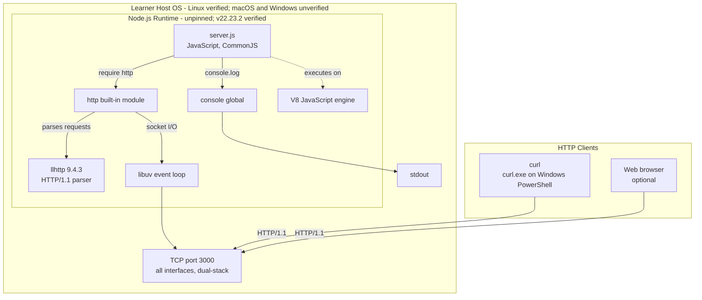
```mermaid
flowchart TB
    subgraph Clients["HTTP Clients"]
        CurlCli["curl<br/>curl.exe on Windows PowerShell"]
        Browser["Web browser<br/>optional"]
    end
    subgraph HostOS["Learner Host OS - Linux verified; macOS and Windows unverified"]
        subgraph NodeRuntime["Node.js Runtime - unpinned; v22.23.2 verified"]
            AppCode["server.js<br/>JavaScript, CommonJS"]
            HttpMod["http built-in module"]
            Llhttp["llhttp 9.4.3<br/>HTTP/1.1 parser"]
            ConsoleApi["console global"]
            V8Eng["V8 JavaScript engine"]
            LibUv["libuv event loop"]
        end
        TcpPort["TCP port 3000<br/>all interfaces, dual-stack"]
        StdOut["stdout"]
    end
    AppCode -->|"require http"| HttpMod
    HttpMod -->|"parses requests"| Llhttp
    AppCode -->|"console.log"| ConsoleApi
    ConsoleApi --> StdOut
    AppCode -.->|"executes on"| V8Eng
    HttpMod -->|"socket I/O"| LibUv
    LibUv --> TcpPort
    CurlCli -->|"HTTP/1.1"| TcpPort
    Browser -->|"HTTP/1.1"| TcpPort
```

### 3.2.2 Application Frameworks

**None.** There is no web framework (such as Express, Fastify or Koa), no routing or middleware library and no logging library. The default stack's Flask and LangChain do not apply.

| Decision | Justification | Consequence |
|---|---|---|
| Built-in `http` instead of a web framework | Built-ins only, no install (NFR dependencies, C-5); two-file scope (AAP 0.8.2) | Routing is the strict-equality ternary `req.url === '/hello'`, with no 404, method routing or middleware (Section 1.2.2) |
| `console.log` instead of a logging library | Fewest lines; no handlers or configuration (AAP 0.1.2, 0.8.2) | One unstructured line, `Welcome to Blitzy`, per process lifetime. No request logs (Section 2.4.4) |
| No HTTP utility libraries (content negotiation, security headers, rate limiting) | No-hardening direction (D3) | Only Node's default headers are sent (`Date`, `Connection`, `Keep-Alive`, `Content-Length`); no `Content-Type` (`Project Guide.md` §3) |

### 3.2.3 Built-in API Surface and Defaults Relied On

| API | Use in `server.js` line 2 | Platform Default Relied On |
|---|---|---|
| `require('http')` | Loads the module through the CommonJS loader | Built-in name resolution; no `node_modules` lookup |
| `http.createServer(listener)` | Registers the single inline request handler | Handler runs for 33 of Node's 35 `http.METHODS`; there is no `'connect'` listener (D2) |
| `res.end(body)` | Sends `Hello world` or an empty string | Status 200; `Content-Length` computed automatically; keep-alive, timeout 5 s |
| `server.listen(3000, callback)` | Binds the port, then logs the startup message | No host argument, so all interfaces, dual-stack; no `'error'` listener, so a busy port gives `EADDRINUSE`, exit 1 |
| `console.log(message)` | Prints `Welcome to Blitzy` | Newline-terminated stdout write (18 bytes) |

Server limits are runtime defaults, inspected on Node v22.23.3: `server.timeout` 0, `requestTimeout` 300 000 ms, `headersTimeout` 60 000 ms, `keepAliveTimeout` 5 000 ms, `maxHeaderSize` 16 384 B, `maxConnections` unset (Section 2.4.3, 2.4.7; `Project Guide.md` §5.2 D3).

### 3.2.4 Compatibility Requirements

| Runtime Line | Status | Minimum Patch | Source |
|---|---|---|---|
| Node.js 22.x | Supported; the only line verified (v22.23.2 on Linux) | 22.23.2 | `Project Guide.md` §3, §9.1, Appendix D |
| Node.js 24.x LTS | Recommended; not yet verified (open item, 1.0 h) | 24.18.1 | `Project Guide.md` §1.4, §2.2, §9.1 |
| Node.js 26.x | Acceptable above the security floor; not verified | 26.5.1 | `Project Guide.md` §5.2 D4 |
| Node.js 20.x, 23.x, 25.x | End-of-life; avoid | — | `Project Guide.md` §9.1 |

- **Why the runtime line matters.** Observable behaviour (headers, timeouts, method dispatch, parser limits) comes from Node defaults, not from the code. A different runtime line can change it, which is why verification on Node 24 LTS is still open (`Project Guide.md` §1.4).
- **API stability.** Delivery included a runtime-currency check of `http.Server` defaults, default headers, API deprecation status and published advisories for the installed runtime (`Project Guide.md` §2.1).
- **Operating systems.** Any OS that Node.js supports is intended; only Linux was verified. macOS and Windows walkthroughs are pending (1.5 h) (`Project Guide.md` §1.4, §9.1).
- **Integration requirement.** Clients must speak HTTP/1.1 over TCP to port 3000. TLS, HTTP/2 and WebSocket upgrades are not served (`Project Guide.md` Appendix B).

### 3.2.5 Security Implications

- **Parser as the only input guard.** llhttp rejects injection, request-smuggling and oversized-input probes, and the server keeps serving afterwards (`Project Guide.md` §1.3, §3). Patching that protection means upgrading the Node.js runtime.
- **No disclosure headers.** The runtime sends no `Server` or `X-Powered-By` banner, so the response reveals neither the stack nor its version (`Project Guide.md` §1.3).
- **Defaults, not hardening.** The all-interface bind and the absence of connection caps come from the runtime defaults and are accepted under D3. Treat the stack as fit for local use only (`Project Guide.md` §5.2 D3, §8).

## 3.3 Open Source Dependencies

The repository declares no third-party package. The only open-source software in the runtime path is the Node.js runtime and the components bundled inside it, all installed by the learner outside this repository.

### 3.3.1 Third-Party Packages

**None.** The evidence:

| Check | Result | Evidence |
|---|---|---|
| Module imports in source | One import, `require('http')`, a built-in | `server.js` line 2 |
| Package manifest (`package.json`) | Absent | Repository root contents; `Project Guide.md` §9.3 |
| Lockfile (`package-lock.json`, `yarn.lock`, `pnpm-lock.yaml`) | Absent | Repository root contents |
| Installed modules (`node_modules/`) | Absent | Repository root contents |
| Installation step | None: "there is nothing to install" | `README.md` line 3; `Project Guide.md` §9.3 |
| Declared third-party packages | "None — Built-ins only" | `Project Guide.md` Appendix D |

### 3.3.2 Package Registries and Version Management

| Concern | Status | Evidence |
|---|---|---|
| npm registry | Not used. No `npm install`, `npx` or registry configuration (`.npmrc`) | `Project Guide.md` §9.3 |
| Package manager | None required. npm ships with Node.js but the tutorial never calls it | `README.md` lines 3–5 |
| Runtime version pinning | None by design: no `engines` field, `.nvmrc`, `.node-version` or Volta configuration (AAP 0.3.1, constraint C-4) | `Project Guide.md` §5.2 D4 |
| Runtime version guidance | Kept outside the repository: Node.js 24 LTS recommended; floors 22.23.2 / 24.18.1 / 26.5.1; avoid 20.x, 23.x and 25.x | `Project Guide.md` §9.1, §5.2 D4 |

### 3.3.3 Open-Source Components in the Runtime Path

| Component | Version | How It Is Delivered | Evidence |
|---|---|---|---|
| Node.js runtime | Unpinned; verified v22.23.2 | Installed by the learner | `README.md` line 3; `Project Guide.md` Appendix D |
| llhttp HTTP/1.1 parser | 9.4.3 in the verified runtime | Bundled in the Node.js binary | `Project Guide.md` Appendix D |
| V8 engine, libuv event loop | Bundled; observed as V8 12.4.254.21-node.57 and libuv 1.51.0 in Node v22.23.3 | Bundled in the Node.js binary | Runtime inspection (`process.versions`) |

### 3.3.4 Supply-Chain Security

- **Attack surface.** With no third-party code, the Node.js runtime is the only supply-chain exposure (Section 2.4.6). Nothing is downloaded at install time and there are no transitive dependencies, so dependency auditing (`npm audit`), SBOM generation and lockfile integrity checks have nothing to examine.
- **Open risk.** The runtime is unpinned, so a learner may run an end-of-life or unpatched Node.js. The guide rates this Security, Medium likelihood / Medium impact, status Open (D4). The mitigation is published guidance kept outside the repository (`Project Guide.md` §6).
- **Advisory status of the verified runtime.** v22.23.2 is reported as a supported Maintenance LTS release with no known unpatched advisories; v22.23.3 is available (`Project Guide.md` §5.2 D4).

## 3.4 Third-Party Services

The running system uses no third-party service. `server.js` makes no outbound network calls and reads no credentials, environment variables or external services (`Project Guide.md` §1.5, Appendix E). It acts only as a TCP listener on the learner's machine.

| Category | Status | Default-Stack Item Not Adopted | Evidence |
|---|---|---|---|
| External APIs and integrations | None. The only inbound integration is HTTP/1.1 clients (curl, browser) calling port 3000 | — | `server.js` line 2; Section 1.2.1 |
| Authentication services | None. No accounts, roles, tokens or identity provider | Auth0 | `Project Guide.md` §4; Section 1.3.1 |
| Monitoring and observability | None. The one operational signal is the `Welcome to Blitzy` startup line on stdout; there are no request logs, metrics or health endpoints | — | `server.js` line 2; Section 2.4.4 |
| Cloud services | None. The process runs on the learner's own machine; there is no hosting, CDN or managed service | AWS | `Project Guide.md` §1.1, §8 |

GitHub hosts the source repository and pull request #1. That is a development-time service, not a runtime dependency (see Section 3.6.4). Adding any runtime service, including a reverse proxy, which the guide mentions only as a mitigation for a future deployment, would need a new scope (`Project Guide.md` §6, §8).

## 3.5 Databases & Storage

The system stores nothing. Both response bodies (`Hello world` and the empty string) and the startup message are string literals in `server.js` line 2. The request URL is compared but never stored or echoed (Section 1.3.1, Implementation Boundaries).

| Concern | Status | Evidence |
|---|---|---|
| Primary / secondary databases | None. The default stack's MongoDB is not adopted; the guide states no database is needed | `Project Guide.md` §9.2 |
| Data persistence strategy | None. No file-system access, no session state, no writes besides the stdout line | `server.js` line 2 |
| Caching solutions | None. No in-process or external cache, and no `Cache-Control` or `ETag` headers; only Node's default headers are sent | `Project Guide.md` §3 |
| Storage services | None. No object storage, volumes or uploads | `server.js` line 2; `Project Guide.md` §1.5 |
| Configuration storage | None. Port 3000, the `/hello` path and all messages are literals, and no environment variables are read | `Project Guide.md` Appendix E |

Process output is the only data that can outlive a request. In the guide's background-run recipe, the operator redirects stdout and stderr to a temporary log file of their choosing (`nohup node server.js > "$d/server.log" 2>&1 &`). That file lives outside the application and contains only the startup line (`Project Guide.md` §9.4).

## 3.6 Development & Deployment

The repository holds no build, container, infrastructure or pipeline definition. Development and verification use the Node.js CLI and standard Unix tools run by hand. "Deployment" means a learner running `node server.js` on their own machine.

### 3.6.1 Development Tools

| Tool | Version | Purpose | Evidence |
|---|---|---|---|
| Node.js CLI: `node`, `node --check`, `node --test` | v22.23.2 (verified) | Run the server; syntax check (exit 0 = valid); confirm there is no test suite (`# tests 0`) | `Project Guide.md` §3, Appendix C, Appendix F |
| curl | Not recorded in the guide (8.5.0 in the environment used to write this section) | Call the endpoint; check status, size and headers (`-w '%{http_code} %{size_download}'`, `-D -`) | `README.md` line 5; `Project Guide.md` Appendix F |
| Bash, `xargs` | Not recorded | Scripted assertion suite (50 assertions) and concurrency load (200 parallel; 100/100 mixed) | `Project Guide.md` §3 |
| `cmp` | Not recorded | Byte comparison of both files against the AAP text | `Project Guide.md` §3, §5.1 item 9 |
| git: `ls-files`, `archive`, `diff` | Not recorded (2.43.0 in the environment used to write this section) | Scope check, clean-copy boot, exact-content drift check | `Project Guide.md` §2.1, Appendix F |
| `unshare -n`, `ip`, `timeout` | Not recorded | Isolated package gate in a private Linux network namespace (root required) | `Project Guide.md` §9.5 |
| `ss`, `lsof`, `nohup`, `env -i` | Not recorded | Listener inspection, port-owner lookup, background runs, minimal-environment boot | `Project Guide.md` §2.1, §9.4, §9.5 |
| Headless Chrome | Not recorded | Browser check: page text, in-page `fetch`, network log, console errors | `Project Guide.md` §4 |

None of these tools is configured in the repository. There is no linter, formatter, editor configuration, git hook or coverage tool, and the guide reports coverage as not available (`Project Guide.md` §3).

### 3.6.2 Build System

**None.** No transpilation, bundling, minification or packaging takes place. Node.js executes `server.js` exactly as committed, and the guide states that no virtual environment, package install or build step is needed (`Project Guide.md` §9.2). The only quality gate is the **package gate**, `node --check` followed by the isolated smoke run (`Project Guide.md` Appendix G):

```bash
node --check server.js && echo "syntax OK"
d=$(mktemp -d) && timeout 30 unshare -n sh -c 'ip link set lo up; node server.js > "$0/server.log" 2>&1 & ...' "$d"
```

### 3.6.3 Containerization

**None.** The repository has no `Dockerfile`, compose file or image definition, so the default stack's Docker is not adopted. The process runs directly on the host OS. During verification, port isolation came from a Linux network namespace (`unshare -n`), which gives the server its own port 3000 without touching the host's (`Project Guide.md` §9.5, Appendix G). It is a verification technique, not a packaging format.

### 3.6.4 Source Control and CI/CD

| Concern | Status | Evidence |
|---|---|---|
| Source hosting | GitHub (`origin` remote); default branch `main` | Repository git configuration |
| Change flow | Agent-authored commits on a feature branch, merged through pull request #1 by `blitzy-qa[bot]` (`04b7b44`, 2026-10-01) | Git history; Section 1.2.1 |
| CI pipeline (e.g. GitHub Actions) | None; there is no `.github/` directory or other pipeline file | Repository root contents |
| Automated regression | None. Accepted as a Low/Medium operational risk because AAP 0.8.2 forbids in-repository tests | `Project Guide.md` §3, §6 |
| CD / release | None. There are no tags, artefacts or deployment targets | Git history; Section 1.3.2 |

Adding a pipeline would need a scope change: there are no in-repository tests for it to run (C-2), and the exact-content rule (C-1) leaves only verification of what already exists. Until then, every change follows the manual workflow below (`Project Guide.md` §6, §9.5, Appendix F):

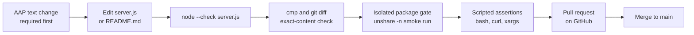
```mermaid
flowchart LR
    SpecChange["AAP text change<br/>required first"] --> EditSrc["Edit server.js<br/>or README.md"]
    EditSrc --> SyntaxChk["node --check server.js"]
    SyntaxChk --> ContentChk["cmp and git diff<br/>exact-content check"]
    ContentChk --> PkgGate["Isolated package gate<br/>unshare -n smoke run"]
    PkgGate --> Assertions["Scripted assertions<br/>bash, curl, xargs"]
    Assertions --> PullReq["Pull request<br/>on GitHub"]
    PullReq --> MergeMain["Merge to main"]
```

### 3.6.5 Deployment and Operation Model

| Aspect | Specification | Evidence |
|---|---|---|
| Target environment | The learner's own machine; any OS Node.js supports (Linux verified) | `Project Guide.md` §1.1, §9.1 |
| Prerequisites | A maintained Node.js release, curl (`curl.exe` on Windows PowerShell 5.1), port 3000 free | `Project Guide.md` §9.1 |
| Start | `node server.js` from the repository root, in the foreground or with `nohup … &` in the background | `README.md` line 4; `Project Guide.md` §9.4 |
| Readiness signal | `Welcome to Blitzy` on stdout, printed only after the bind succeeds | `server.js` line 2 |
| Stop | Ctrl+C, or `kill` on the captured PID (SIGTERM exits 143 and frees the port) | `Project Guide.md` §3, §9.4 |
| Infrastructure as Code | None; the default stack's Terraform is not adopted | Repository root contents |
| Production readiness | Local tutorial only. Public deployment needs a new scope covering binding, limits, headers and error handling | `Project Guide.md` §8 |

### 3.6.6 Default Technology Stack Alignment

The supplied default stack applies only where the repository shows it in use. AAP 0.8.2 and constraints C-2, C-3 and C-5 exclude the rest.

| Default Item | Status in This System | Reason |
|---|---|---|
| Cloud Platform: AWS | Not used | Local-only tutorial; no cloud target (`Project Guide.md` §8) |
| Containerization: Docker | Not used | Runs directly on the host (Section 3.6.3) |
| Infrastructure as Code: Terraform | Not used | No infrastructure to provision |
| CI/CD: GitHub Actions | Not used; GitHub hosts the repository only | No pipeline files; in-repository tests forbidden (AAP 0.8.2) |
| Backend: Python / Flask | Replaced by JavaScript on Node.js with the built-in `http` module | Audience is server-side JavaScript learners; built-ins only (Section 3.1.2) |
| Authentication: Auth0 | Not used | No authentication (Section 3.4) |
| Database: MongoDB | Not used | No persistence (Section 3.5) |
| AI Framework: LangChain | Not used | No AI capability in scope |
| Web: React with TypeScript; TailwindCSS | Not used | No UI; the Figma console is excluded (`Project Guide.md` §5.1 item 11) |
| Mobile / Native / Desktop: React Native, Swift, Kotlin, Objective-C, Electron | Not used | No client applications; HTTP clients are curl or a browser |

## 3.7 References

**Repository files and folders**

- `server.js`: the only executable source. Line 1 is the untagged JSDoc comment; line 2 is the single CommonJS statement using `require('http')`, `createServer`, `res.end`, `listen(3000)` and `console.log`. Establishes the language, module format, built-in API surface and the absence of third-party imports, storage and outbound calls.
- `README.md`: lines 1–5. Title "Node.js Hello Tutorial", the Node.js-only prerequisite, "there is nothing to install", the `node server.js` start command and the `curl` check.
- `blitzy/documentation/Project Guide.md`: delivery and verification report. Sections cited:
  - §1.1 (audience, local-only target), §1.3 (default headers, parser rejection of probes), §1.4 (open items, including Node 24 LTS and macOS/Windows verification), §1.5 (no credentials, environment variables or external services)
  - §2.1 (runtime-currency verification, clean-copy boot tools), §2.2 (remaining effort)
  - §3 (test tooling: `node --check`, `cmp`, `unshare -n`, bash, curl, xargs; no coverage; `node --test` reports zero tests), §4 (headless Chrome checks)
  - §5.1 (compliance items 6, 7, 9 and 11), §5.2 D2–D5 (method dispatch, sanctioned absence of hardening, unpinned runtime and security floors, run-directory assumption), §6 (risk ratings), §8 (production readiness)
  - §9.1 (prerequisites, supported runtime lines), §9.2 (no environment setup, database or build), §9.3 (no dependency installation), §9.4 (foreground and background start and stop), §9.5 (package gate commands)
  - Appendix A (command reference, including `node --test`; the Development Tools table in 3.6.1 cites this row as Appendix C, but the command reference is Appendix A), Appendix B (HTTP/1.1 over TCP on port 3000, all interfaces), Appendix D (technology versions: Node.js v22.23.2, llhttp 9.4.3, CommonJS, no third-party packages), Appendix E (no environment variables), Appendix F (developer tools), Appendix G (package gate and network namespace definitions)
- `blitzy/documentation/`: the folder holding the Project Guide; documentation only, not loaded at runtime.
- Repository root (`""`): shows that no `package.json`, lockfile, `node_modules/`, `.nvmrc`, `Dockerfile`, `.github/`, IaC or linter/formatter configuration exists.
- Repository git configuration and history: GitHub `origin` remote, branch `main`, and pull request #1 merged by `blitzy-qa[bot]` in commit `04b7b44` (2026-10-01).

**Runtime inspection (environment used to write this section)**

- Node.js v22.23.3 (`process.release.lts` "Jod"): llhttp 9.4.3, V8 12.4.254.21-node.57, libuv 1.51.0, OpenSSL 3.5.8; npm 11.18.0 present but unused; curl 8.5.0; git 2.43.0. `node --check server.js` passes. A WebSocket `Upgrade` request to `/hello` gets a plain HTTP/1.1 200 `Hello world` with no protocol switch; an HTTP/2 prior-knowledge request is closed.

**Cross-referenced Technical Specification sections**

- Section 1.2 System Overview: integration-surface table, component flowchart, design-choice table.
- Section 1.3 Scope: key technical requirements and the out-of-scope items (no CI/CD, containers, persistence, authentication or monitoring).
- Section 2.4 Implementation Considerations: Node `http.Server` defaults and supply-chain notes (2.4.3, 2.4.6, 2.4.7).
- Section 2.6 Assumptions, Constraints and Requirement Versioning: constraints C-1 to C-6.

**Web sources**

- None. A search for the current Node.js release schedule returned no results, so runtime-line guidance comes from `Project Guide.md` §9.1 and §5.2 D4, dated 30 September 2026.

# 4. Process Flowchart

## 4.1 System Workflows

All runtime behaviour comes from one CommonJS statement at `server.js` line 2. That statement registers two inline callbacks, the request handler and the `listen` callback. Request parsing, connection management, error responses and process termination are all left to Node.js defaults. The system has no business transactions, accounts, queues, schedulers or persistence. Its workflows are those of a local tutorial and its maintenance.

Behaviour below comes from `server.js`, `README.md` and `blitzy/documentation/Project Guide.md`, whose results were verified on Node v22.23.2. It was re-observed on Node v22.23.3 while writing this section. Values seen only in that re-run are marked *local check*. Section 4.4 has the diagram for each workflow. Section 1.3.1 (README walkthrough sequence) and Section 2.3.2 (request and startup flow by feature) give summary views.

### 4.1.1 Core Business Processes

#### Workflow Catalog

| ID | Workflow | Trigger → Outcome | Features |
|---|---|---|---|
| WF-1 | Learner tutorial journey | Learner reads `README.md` → sees `Welcome to Blitzy`, then `Hello world` | F-005, F-003, F-004, F-001 |
| WF-2 | Server startup and readiness | `node server.js` → listening on `*:3000` with the welcome line, or exit 1 | F-003, F-004 |
| WF-3 | Request handling | Request bytes on port 3000 → 200 `Hello world`, 200 empty, a Node 400/431/408, or a closed socket | F-001, F-002, F-007 |
| WF-4 | Connection reuse and idle close | Response sent → next request on the same socket, or socket closed | F-003, F-007 |
| WF-5 | Shutdown | Ctrl+C or `kill` → exit 130 or 143; port released | F-003 |
| WF-6 | Maintainer verification (package gate) | Specification change → syntax, content, scope and smoke checks pass → merge | F-006 |

#### End-to-End User Journey (WF-1)

The learner is the only end user. They interact with the system through the README, the terminal and an HTTP client (Figure 4.4.1).

| Step | Learner Touchpoint | System Response | Evidence |
|---|---|---|---|
| 1 | Read `README.md`: Node.js is the only prerequisite and nothing needs installing | — | `README.md` line 3 |
| 2 | Open a terminal in the folder containing `server.js`. The README assumes this but does not say it (D5) | — | `Project Guide.md` §5.2 D5; Section 2.6.2 A-1 |
| 3 | Run `node server.js` | Node loads the module, binds `*:3000` and prints `Welcome to Blitzy` | `README.md` line 4; `server.js` line 2 |
| 4 | Wait for the welcome line, the only readiness signal | Requests sent before it fail with `curl: (7) Failed to connect` | `Project Guide.md` §9.7 |
| 5 | Run `curl http://localhost:3000/hello` | 200 with body `Hello world` and no trailing newline, so the shell prompt follows on the same line | `README.md` line 5; `Project Guide.md` §5.2 D5 |
| 6 | Optionally open `http://localhost:3000/hello` in a browser | Plain text `Hello world`. The browser's automatic `/favicon.ico` request gets 200 with an empty body, and other paths show a blank page | `Project Guide.md` §4, §9.6 |
| 7 | Press Ctrl+C | SIGINT ends the process with exit 130 (local check) and releases the port | `Project Guide.md` §9.4 |

#### System Interactions

| Interaction | Direction | Mechanism | Evidence |
|---|---|---|---|
| Process launch | Terminal → Node.js | `node server.js`; the path resolves against the working directory | `Project Guide.md` §5.2 D5 |
| Port bind | Node.js → host OS | `listen(3000)` with no host argument binds `*:3000`, dual-stack | `server.js` line 2; `Project Guide.md` Appendix B |
| Readiness notice | Node.js → stdout | One `console.log` in the `listen` callback (18 B) | `server.js` line 2; `Project Guide.md` §3 |
| Request/response | HTTP client ↔ Node.js | HTTP/1.1 over TCP; HTTP/1.0 requests are also answered (local check) | `Project Guide.md` Appendix B |
| Fatal error report | Node.js → stderr | Uncaught-exception stack trace, then exit 1 | `Project Guide.md` §4 |
| Outbound calls, files, environment | None | No outbound connection, file access or `process.env` read | `Project Guide.md` §1.5, Appendix E |

#### Decision Points

The application code makes **one** decision, DP-5. Every other branch is taken by Node.js or the operating system with default behaviour.

| ID | Decision | Decided By | Outcomes |
|---|---|---|---|
| DP-1 | Does `server.js` resolve from the working directory? | Node module loader | Yes → evaluate line 2. No → `Cannot find module`, exit 1 |
| DP-2 | Is TCP port 3000 free? | Host OS, through `listen` | Yes → listening and welcome line. No → unhandled `EADDRINUSE`, exit 1 |
| DP-3 | Is the request well formed and within limits? | llhttp parser and `http.Server` defaults | Yes → continue. No → 400, 431 or 408, then the connection closes |
| DP-4 | Is the method CONNECT? | Node `http` (no `'connect'` listener) | Yes → socket destroyed with 0 bytes. No → `'request'` event |
| DP-5 | `req.url === '/hello'`? | `server.js` line 2 (the only application decision) | Yes → `Hello world`. No → empty body |
| DP-6 | Is the method HEAD? | Node `http` | Yes → headers only, body suppressed |
| DP-7 | Keep the connection open? | Node `http` | HTTP/1.1 keep-alive → idle window. HTTP/1.0 or `Connection: close` → close |
| DP-8 | Does another request arrive inside the keep-alive window? | Node `http` | Yes → same socket reused. No → closed about 6 s after the last response |

#### Error Handling Paths

| Error Path | Workflow | Outcome | Detail |
|---|---|---|---|
| Run from the wrong directory | WF-1, WF-2 | `Error: Cannot find module`, exit 1 | Section 4.3.2; Figure 4.4.3.1 |
| Port 3000 already in use | WF-2 | Unhandled `EADDRINUSE` stack trace, stdout empty, exit 1; an existing instance keeps serving | Section 4.3.2; Figures 4.4.3.1, 4.4.4.4 |
| Malformed, oversized or stalled request | WF-3 | Node's own 400, 431 or 408 reaches the client; the handler never runs; the server keeps serving | Section 4.3.2; Figure 4.4.4.3 |
| CONNECT request | WF-3 | Socket closed with no response | Section 4.3.2 |
| Learner-side mismatches (path variant, PowerShell `curl` alias, missing newline) | WF-1 | Empty output, a PowerShell object, or the prompt on the same line | Figure 4.4.3.2 |

### 4.1.2 Integration Workflows

The system integrates with no external system. It has no database, external API, identity provider, message broker or scheduler (`Project Guide.md` §1.5, §9.2). Its integration surface is the HTTP listener, the process's standard streams and the host OS.

#### Data Flow Between Systems

| Data Item | Source → Sink | Handling | Evidence |
|---|---|---|---|
| Request target (`req.url`) | Client → handler | Strict equality against `/hello`; never stored, logged or echoed | `server.js` line 2; `Project Guide.md` §1.3 |
| Method, headers, body | Client → Node runtime | Parsed by Node and ignored by the handler. A 1 MB POST body to `/hello` still gets `200 Hello world` (local check) | `Project Guide.md` §9.6 |
| Response body | Handler → client | One of two literals: `Hello world` (11 B) or the empty string | `server.js` line 2 |
| Response headers | Node runtime → client | `Date`, `Connection`, `Keep-Alive`, `Content-Length`. HEAD responses omit `Content-Length` (local check) | `Project Guide.md` §3, §4 |
| Startup line | `listen` callback → stdout | `Welcome to Blitzy\n`, 18 B, once per process | `Project Guide.md` §3 |
| Fatal error | Node runtime → stderr | Stack trace for an uncaught exception | `Project Guide.md` §4 |
| Persistent data | — | None | `Project Guide.md` §9.2 |

#### API Interactions

The system exposes one HTTP interface on port 3000. Its full observable contract:

| Request | Response | Source |
|---|---|---|
| `GET /hello` (HTTP/1.1) | `200 OK`, `Content-Length: 11`, `Keep-Alive: timeout=5`, body `Hello world` | F-001; `Project Guide.md` §4 |
| POST, PUT, DELETE, PATCH, OPTIONS, TRACE, PURGE on `/hello` | Same as GET; the method is ignored | `Project Guide.md` §3 |
| `HEAD /hello` | `200 OK`, headers only | `Project Guide.md` §3, §5.2 D2 |
| `GET /hello HTTP/1.0` | `200 OK`, `Connection: close`, no `Content-Length`, body `Hello world` | Local check |
| Any other target: `/other`, `/hello/`, `/HELLO`, `/hello?x=1`, `/favicon.ico`, absolute-form `http://localhost:3000/hello` | `200 OK`, `Content-Length: 0` | F-002; `Project Guide.md` Appendix G; absolute form from local check |
| Lowercase method, missing `Host` on HTTP/1.1, non-HTTP bytes such as a TLS ClientHello | `400 Bad Request`, `Connection: close` | `Project Guide.md` §5.2 D2; local check |
| Header block over 16 384 B | `431 Request Header Fields Too Large` | `Project Guide.md` §3 |
| Headers never completed | `408 Request Timeout` after the 60 s header timeout; 89.8 s in the local check | Local check |
| `Connection: Upgrade` (e.g. WebSocket) to `/hello` | Plain `200 Hello world`; no protocol switch | Local check |
| CONNECT | Socket closed with 0 bytes | `Project Guide.md` §4, §5.2 D2 |
| PRI | Sources disagree. `Project Guide.md` §1.4 and D2 report the connection closed without a response. The local check on v22.23.3 got `400 Bad Request` with `Connection: close`. Both agree the handler never runs | `Project Guide.md` §1.4, §5.2 D2; local check |

#### Event Processing Flows

All processing is driven by events on the Node.js event loop. `server.js` registers listeners for two of them; the rest fall through to Node's defaults.

| Event | Emitter | Listener in `server.js` | Result |
|---|---|---|---|
| `'listening'` | Server | `listen` callback | `console.log('Welcome to Blitzy')`, once |
| `'request'` | HTTP server | Inline handler | One `res.end(...)` with one of two literals |
| `'clientError'` | HTTP server | None (Node default) | 400, 431 or 408 written to the client, then the socket closes |
| `'connect'` | HTTP server | None | CONNECT socket destroyed |
| `'upgrade'` | HTTP server | None | Request served as an ordinary request (local check) |
| `'error'` during `listen` | Server | None | Thrown as an uncaught exception; process exits 1 |
| SIGINT / SIGTERM | Process | None | Default termination: exit 130 / 143 |

Figures 4.4.2.1 and 4.4.2.2 show these flows, and Figures 4.4.4.1 to 4.4.4.4 show them as sequences.

#### Batch Processing Sequences

The system has no batch processing: no scheduled jobs, cron entries, queues or background workers exist in the repository. The only batch-like sequences are verification runs executed by hand outside it (`Project Guide.md` §3, §9.5):

| Sequence | Content | Result Reported |
|---|---|---|
| Scripted assertion suite | 50 assertions in 7 categories: static/package gate, HTTP contract, headers and input, concurrency, console, lifecycle, README walkthrough | 50 of 50 pass on Node v22.23.2 |
| Concurrency runs | 200 parallel requests; a 100/100 mixed load | All answered with correct bodies |
| Isolated package gate | `node --check`, then a smoke run in a private network namespace | Exit 0 |

WF-6 (Figure 4.4.2.3) places these runs in the change workflow.

## 4.2 Flowchart Requirements

This section lists the flowchart elements of each workflow from Section 4.1.1, then the timing parameters and validation rules that apply along the way. Each workflow's diagram is in Section 4.4.

### 4.2.1 Workflow Flowchart Specifications

#### WF-1 Learner Tutorial Journey (Figure 4.4.1)

| Element | Specification |
|---|---|
| Start point | Learner opens `README.md` |
| End point | `Hello world` displayed; learner stops the server with Ctrl+C |
| Process steps | Read the prerequisite → `cd` to the repository root → `node server.js` → wait for `Welcome to Blitzy` → `curl http://localhost:3000/hello` → read the body → Ctrl+C |
| Decision diamonds | DP-1 module resolves; DP-2 port free; DP-5 exact `/hello` |
| System boundaries | The learner's machine only: terminal, one Node.js process, a local HTTP client. No remote system takes part |
| User touchpoints | `README.md` lines 3–5; the welcome line in the terminal; curl output or the browser page |
| Error states and recovery | `Cannot find module` → `cd` and rerun. `EADDRINUSE` → free port 3000 and rerun. `curl: (7)` → wait for the welcome line. PowerShell object → use `curl.exe` (`Project Guide.md` §9.7) |
| Timing | No targets. The welcome line appeared about 43 ms after launch (local check) |

#### WF-2 Server Startup and Readiness (Figure 4.4.2.1)

| Element | Specification |
|---|---|
| Start point | `node server.js` |
| End point | Listening on `*:3000` with the welcome line printed, or exit 1 |
| Process steps | Resolve the module → `require('http')` → `createServer(handler)` → `listen(3000)` → `'listening'` event → `console.log('Welcome to Blitzy')` |
| Decision diamonds | DP-1, DP-2 |
| System boundaries | Node.js runtime (module loader, event emitter); `server.js` line 2; host OS TCP stack |
| User touchpoints | Terminal stdout (welcome line) and stderr (fatal stack trace) |
| Error states and recovery | Module not found, or `EADDRINUSE`: both exit 1 with a stack trace and no handler in code. Recovery is a manual rerun (Figure 4.4.3.1) |
| Timing | The welcome line is written only after the bind succeeds, exactly once per process (F-004-RQ-002, F-004-RQ-003) |

#### WF-3 Request Handling (Figure 4.4.2.2)

| Element | Specification |
|---|---|
| Start point | A client opens a TCP connection to port 3000 and sends request bytes |
| End point | Response written, or socket closed |
| Process steps | llhttp parses the request line and headers → limits applied → method dispatched → `'request'` event → `req.url` compared → `res.end(literal)` → Node writes its default headers |
| Decision diamonds | DP-3 well formed and within limits; DP-4 CONNECT; DP-5 exact `/hello`; DP-6 HEAD |
| System boundaries | Swim lanes separate the Node `http` runtime (platform defaults) from the application handler (`server.js` line 2) |
| User touchpoints | curl output or browser page; no server-side output per request |
| Error states and recovery | 400, 431 or 408 from Node, or a socket close for CONNECT. The server keeps serving and no server-side record is made (`Project Guide.md` §3, §4) |
| Timing | 0.3–3.4 ms per loopback request in curl's `time_total` (local check, not a target); `headersTimeout` 60 s; `requestTimeout` 300 s |

#### WF-4 Connection Reuse and Idle Close (Figures 4.4.4.2, 4.4.5.2)

| Element | Specification |
|---|---|
| Start point | A response completes on an HTTP/1.1 keep-alive connection |
| End point | The next request is parsed on the same socket, or the socket closes |
| Process steps | Advertise `Keep-Alive: timeout=5` → hold the socket idle → reuse or close |
| Decision diamonds | DP-7 keep open; DP-8 next request inside the window |
| System boundaries | Node `http` runtime only; the application is not involved |
| User touchpoints | None; reuse is invisible to the learner |
| Error states and recovery | None at application level |
| Timing | Idle sockets closed about 6.0 s after the last response (`keepAliveTimeout` 5 s plus a 1 s buffer, local check). Pipelined requests are answered in order |

#### WF-5 Shutdown (Figure 4.4.5.1)

| Element | Specification |
|---|---|
| Start point | Ctrl+C in a foreground run, or `kill "$pid"` for a background run (`Project Guide.md` §9.4) |
| End point | Process exited; port 3000 free |
| Process steps | Signal delivered → default termination → OS releases the listening socket |
| Decision diamonds | None; `server.js` installs no signal handler and has no graceful-close logic |
| System boundaries | OS signal delivery → Node.js process |
| User touchpoints | Terminal |
| Error states and recovery | None. In-flight requests are not drained because no shutdown logic exists |
| Timing | Immediate. SIGTERM exits 143 and frees the port (`Project Guide.md` §3); SIGINT exits 130 (local check) |

#### WF-6 Maintainer Verification (Figure 4.4.2.3)

| Element | Specification |
|---|---|
| Start point | A proposed change to `server.js` or `README.md` |
| End point | Pull request merged to `main`, or the change is reverted |
| Process steps | Change the AAP text → edit the file → `node --check` → `cmp` → `git ls-files` → isolated package gate → scripted assertions → pull request |
| Decision diamonds | One pass/fail diamond per check |
| System boundaries | Maintainer workstation; a private Linux network namespace (`unshare -n`); GitHub |
| User touchpoints | Terminal output; the pull request |
| Error states and recovery | Any failed check → fix or revert, then repeat from the start (`Project Guide.md` §6, Appendix F) |
| Timing | The gate is wrapped in `timeout 30` and waits `sleep 1` before probing (`Project Guide.md` §9.5) |

### 4.2.2 Timing and SLA Considerations

The repository defines no SLA and no latency, throughput or availability target (Section 2.4). Timing comes from runtime defaults that `server.js` never overrides, plus measured values. Because the code sets none of these, they follow whichever Node.js release runs the file. `Project Guide.md` §5.2 D3 reports `server.timeout` 0 and `requestTimeout` 300 s on v22.23.2; the other defaults are from the local check on v22.23.3.

| Parameter | Value | Workflow Effect | Source |
|---|---|---|---|
| Startup to readiness | About 43 ms | Time until the welcome line | Local check |
| Loopback request latency | 0.3–3.4 ms (`time_total`) | Per-request response time | Local check |
| `keepAliveTimeout` | 5 000 ms | Advertised as `Keep-Alive: timeout=5` | `Project Guide.md` §4 |
| `keepAliveTimeoutBuffer` | 1 000 ms | Idle socket observed closing at about 6.0 s | Local check |
| `headersTimeout` | 60 000 ms | Incomplete headers → 408 | Local check |
| `connectionsCheckingInterval` | 30 000 ms | Timeout sweep period; the 408 arrived at 89.8 s | Local check |
| `requestTimeout` | 300 000 ms | Upper bound for receiving a full request | `Project Guide.md` §5.2 D3 |
| `server.timeout` | 0 (disabled) | No socket inactivity timeout | `Project Guide.md` §5.2 D3 |
| `maxConnections` / `maxRequestsPerSocket` | Unset / 0 (unlimited) | No connection or per-socket request cap | `Project Guide.md` §5.2 D3; local check |
| `maxHeaderSize` | 16 384 B | Larger header block → 431 | `Project Guide.md` §3; local check |
| Package gate budget | `timeout 30`; `sleep 1` before probes | Bounds the WF-6 smoke run | `Project Guide.md` §9.5 |
| Verified concurrency | 200 parallel; 100/100 mixed | Every request answered correctly | `Project Guide.md` §3 |

### 4.2.3 Validation Rules

#### Business Rules at Each Step

| Step | Rule | Enforced By | Requirement |
|---|---|---|---|
| Launch | Run from the repository root | Not enforced; the README does not say it | A-1; D5 |
| Bind | Port is the literal 3000; one instance per host | Code literal; OS port exclusivity | C-6; F-003-RQ-001, F-003-RQ-003 |
| Readiness | Welcome line only after the bind, exactly once | Placement in the `listen` callback | F-004-RQ-002, F-004-RQ-003 |
| Routing | Only an exact `/hello` gets the greeting; everything else gets 200 empty; never a 404 | Strict equality in one ternary | F-001-RQ-004, F-002-RQ-002 |
| Method | Every dispatched method is treated the same | The handler never reads `req.method` | F-001-RQ-002; D2 |
| Response | Literal bodies; Node-default headers only; no `Content-Type` | AAP 0.6.3 and the exact content of 0.9.1 | F-007-RQ-001, F-007-RQ-005 |
| Change | The specification changes before the code | Maintainer process (WF-6) | F-006-RQ-003 |

#### Data Validation Requirements

The application performs no validation beyond the routing comparison. That comparison is case-sensitive, includes the query string, treats a trailing slash as significant, and does not normalise absolute-form targets (`Project Guide.md` Appendix G; absolute form from the local check). All other validation is done by Node.js before the handler runs:

| Check | Limit or Rule | Failure Result | Source |
|---|---|---|---|
| Method token | A registered uppercase method | 400 Bad Request | `Project Guide.md` §5.2 D2 |
| `Host` header | Required on HTTP/1.1 | 400 Bad Request | Local check |
| Protocol bytes | Must be HTTP/1.x; a TLS ClientHello is rejected | 400 Bad Request | Local check |
| Header block size | 16 384 B | 431 | `Project Guide.md` §3 |
| Header arrival time | 60 s | 408 Request Timeout | Local check |
| CRLF in the target | Cannot inject response headers | Rejected by the parser | `Project Guide.md` §3 |
| Request body | Not read or validated | Ignored; the response is unchanged | Local check; `Project Guide.md` §9.6 |

#### Authorization Checkpoints

There are none. The system has no authentication, sessions, tokens or roles (`Project Guide.md` §4). Every client that can reach `*:3000` gets identical responses. The only access control is network-level: run on a trusted network or behind a host firewall (`Project Guide.md` §6, risk "All-interface bind", accepted under D3).

#### Regulatory Compliance Checks

No regulatory regime applies. The system processes no personal data or credentials, persists nothing, and logs no request data (`Project Guide.md` §1.5; Section 1.3.1, data domains). Compliance here means conformance to the AAP, checked as follows:

| Check | Command or Evidence | Pass Criterion | Rule |
|---|---|---|---|
| Syntax | `node --check server.js` | Exit 0 | F-006-RQ-001 |
| Exact content | `cmp` against the AAP text; `git diff` against the delivered commit | Exit 0; empty diff | AAP 0.9.1 |
| Scope boundary | `git ls-files` | Deliverables only; `Project Guide.md` was added later in `92db56b` | AAP 0.8.2 |
| Dependencies | Only `require('http')`; no manifest | No install step | NFR dependencies |
| Runtime pin | `README.md` line 3 says only "Requires Node.js" | No version pin | AAP 0.3.1 |
| Markers | `grep` for TODO, FIXME, placeholder | No matches | AAP 0.10 (deliverable 12) |

## 4.3 Technical Implementation

`server.js` holds no state and no error-handling code. The implementation topics below are therefore answered mostly by what the Node.js runtime does by default, and by what is deliberately absent under constraint C-3 (no handlers, headers, configuration or hardening; AAP 0.1.2, 0.8.2).

### 4.3.1 State Management

#### Application State

There is none. `server.js` declares no variables, never assigns the server object to a name, and keeps no counters, sessions or closure state. The handler reads only `req.url` and writes a literal (`server.js` line 2). As a result:

- Every request is independent and gives the same response for the same target.
- Concurrent requests cannot race, because nothing is shared. 200 parallel requests and a 100/100 mixed load were all answered correctly (`Project Guide.md` §3).
- A restart loses nothing.

#### State Transitions

Node.js owns the two state machines that exist (Figures 4.4.5.1 and 4.4.5.2).

**Process lifecycle**

| State | Entered When | Leaves To | Observable Effect |
|---|---|---|---|
| Launching | `node server.js` runs | Evaluating, or ExitedModuleMissing | — |
| Evaluating | Module resolved | Binding | `require('http')`, `createServer(handler)` |
| Binding | `listen(3000)` called | Listening, or CrashedPortBusy | — |
| Listening | `'listening'` event | Itself, per request; StoppedSIGINT; StoppedSIGTERM | Welcome line on entry, once |
| ExitedModuleMissing | Module not found | Exit 1 | Stack trace on stderr |
| CrashedPortBusy | `EADDRINUSE` with no `'error'` listener | Exit 1 | Stack trace on stderr; stdout 0 B |
| StoppedSIGINT | Ctrl+C | Exit 130 | Port released (local check) |
| StoppedSIGTERM | `kill "$pid"` | Exit 143 | Port released (`Project Guide.md` §3) |

**Connection lifecycle**

| State | Entered When | Leaves To |
|---|---|---|
| Accepted | TCP connection on port 3000 | ReadingHeaders |
| ReadingHeaders | Bytes arrive | Handling; RejectedParser (400); RejectedTooLarge (431); TimedOut (408); Destroyed (CONNECT) |
| Handling | `'request'` event | Responded |
| Responded | `res.end(...)` completes | IdleKeepAlive (HTTP/1.1), or Closed (HTTP/1.0 or `Connection: close`) |
| IdleKeepAlive | Response sent on a keep-alive connection | ReadingHeaders (next request), or Closed after about 6 s idle |
| Closed | Any terminal path | — |

#### Data Persistence Points

| Item | Persisted | Detail | Evidence |
|---|---|---|---|
| Request data (target, method, headers, body) | No | Compared or ignored, then discarded | `server.js` line 2 |
| Response bodies | No | Literals in source code | `server.js` line 2 |
| Startup line | Only if stdout is redirected | A background run writes it to `"$d/server.log"` in a `mktemp -d` folder | `Project Guide.md` §9.4 |
| Fatal stack trace | Only if stderr is redirected | Same log file through `2>&1` in background mode | `Project Guide.md` §9.4 |
| Configuration | No | Port, path and messages are literals; no environment variables | `Project Guide.md` Appendix E |

The process performs no file-system writes and opens no database (`Project Guide.md` §9.2).

#### Caching Requirements

No caching layer exists, and none is needed: both response bodies are constant literals. No cache-related header (`Cache-Control`, `ETag`, `Last-Modified`) is sent. The header set is `Date`, `Connection`, `Keep-Alive` and `Content-Length` only (`Project Guide.md` §3). The only reuse mechanism is HTTP keep-alive connection reuse (WF-4).

#### Transaction Boundaries

There are no transactions in the database sense. The unit of work is one request/response exchange, closed by a single `res.end(literal)` call that writes the body and ends the response. There are no streamed or partial writes, and nothing to commit or roll back. Pipelined requests on one socket are answered in order (local check). Startup is all-or-nothing: the process is either listening with the welcome line printed, or exits 1 with nothing on stdout (F-004-RQ-002).

### 4.3.2 Error Handling

`server.js` contains no `try`/`catch` and no `'error'`, `'clientError'` or `'connect'` listener. It also has no signal handler and no process-level exception handler. Each error is either answered by a Node.js default or ends the process. This is the sanctioned no-hardening posture recorded as D3 (`Project Guide.md` §5.2).

#### Error Catalog

| ID | Error | Detected By | Behaviour | Recovery |
|---|---|---|---|---|
| E-1 | Started outside the repository root | Node CommonJS loader | `Error: Cannot find module '/…/server.js'`, exit 1 | `cd` to the folder containing `server.js`; rerun |
| E-2 | Port 3000 already in use | `listen` → `'error'` with no listener | `Unhandled 'error' event` … `Error: listen EADDRINUSE: address already in use :::3000`; stdout 0 B; exit 1. An existing instance is unaffected | `lsof -ti :3000`; stop your own instance; rerun |
| E-3 | Malformed request (bad method token, missing `Host`, non-HTTP bytes) | llhttp; default `'clientError'` | `400 Bad Request`, `Connection: close` | None needed; service continues |
| E-4 | Header block over 16 384 B | `maxHeaderSize` | `431`, then the server recovers; the next `/hello` returns `200 11` | None needed |
| E-5 | Headers never completed | `headersTimeout` (60 s, swept every 30 s) | `408 Request Timeout` (89.8 s in the local check) | None needed |
| E-6 | CONNECT request | No `'connect'` listener | Socket destroyed, 0 bytes | None needed |
| E-7 | PRI request | Node `http` | Sources disagree: closed without a response (`Project Guide.md` §5.2 D2) vs `400`, `Connection: close` (local check, v22.23.3) | None needed |
| E-8 | Client connects before readiness or after a crash | Client | `curl: (7) Failed to connect` | Start the server; wait for `Welcome to Blitzy` |
| E-9 | Path variant (`/hello/`, `/HELLO`, `/hello?x=1`) | Handler, by design | `200` with an empty body | Request exactly `/hello` |
| E-10 | Windows PowerShell 5.1 `curl` alias | Client shell | An object is printed instead of `Hello world` | Use `curl.exe` |

Sources: `Project Guide.md` §3, §4, §5.2, §9.7, and the local check.

#### Retry Mechanisms

The code has no retry loop, backoff or automatic restart, and the repository has no supervisor or process-manager configuration. Every retry is manual:

- **Startup (E-1, E-2):** fix the cause, then rerun `node server.js` (Figure 4.4.3.1).
- **Client (E-8 to E-10):** correct the command, then rerun curl (Figure 4.4.3.2).
- **Verification (WF-6):** after a failed check, fix or revert and run the whole sequence again from `node --check` (Figure 4.4.2.3).

#### Fallback Processes

| Fallback | Trigger | Behaviour |
|---|---|---|
| Application fallback (F-002), the only designed fallback | Any target other than exactly `/hello` | `200` with an empty body; never a 404 |
| Platform error responses | Invalid, oversized or stalled requests | Node's default 400, 431 or 408, then the connection closes |
| Socket destruction | CONNECT | Connection closed with no response |
| Fatal startup errors | E-1, E-2 | No fallback; the process exits 1 |

#### Error Notification Flows

Figure 4.4.3.3 maps each error to its channel:

- **Fatal errors** (E-1, E-2) go to stderr as a stack trace, with exit status 1. They are seen only by whoever runs the terminal.
- **Request-level errors** (E-3 to E-7) reach only the client, as a status code or a closed socket. The server records nothing: stdout stays at 18 B and stderr at 0 B after all probes (`Project Guide.md` §3; local check).
- **Logging, metrics, alerting:** none (Section 1.3.2).

#### Recovery Procedures

| Situation | Procedure | Source |
|---|---|---|
| `EADDRINUSE` | Run `lsof -ti :3000`. If the pid is your own server, stop it with Ctrl+C or `kill "$pid"`, then restart. Otherwise free the port first; it cannot be changed without amending the AAP's exact content | `Project Guide.md` §6, §9.7 |
| `Cannot find module` | `cd` to the folder containing `server.js` and rerun | `Project Guide.md` §9.7 |
| `curl: (7) Failed to connect` | Start the server and wait for `Welcome to Blitzy` | `Project Guide.md` §9.7 |
| Background instance left running | `kill "$pid"` using the pid captured at start, so only your own process stops | `Project Guide.md` §9.4 |
| After any change to `server.js` or `README.md` | Rerun `node --check server.js` and the isolated package gate; no regression suite exists | `Project Guide.md` §6, §9.5 |
| Need to expose the server beyond localhost | Stop and re-scope: binding, limits, headers and error handling | `Project Guide.md` §8 |

## 4.4 Required Diagrams

The diagrams below are drawn from `server.js` line 2, `README.md` and `blitzy/documentation/Project Guide.md`; a few values come from the local check on Node v22.23.3. In flowcharts, subgraphs named as lanes are swim lanes for actors and systems. Stadium shapes mark start and end points, and diamonds mark decisions. Lanes keep Node.js platform defaults apart from the one application decision (DP-5). Timing appears in node labels and sequence notes.

### 4.4.1 High-Level System Workflow

Figure 4.4.1 shows the end-to-end tutorial run (WF-1), with startup (WF-2), request handling (WF-3) and shutdown (WF-5) in summary. Section 1.2.2 has the component view and Section 2.3.2 the feature-mapped view.

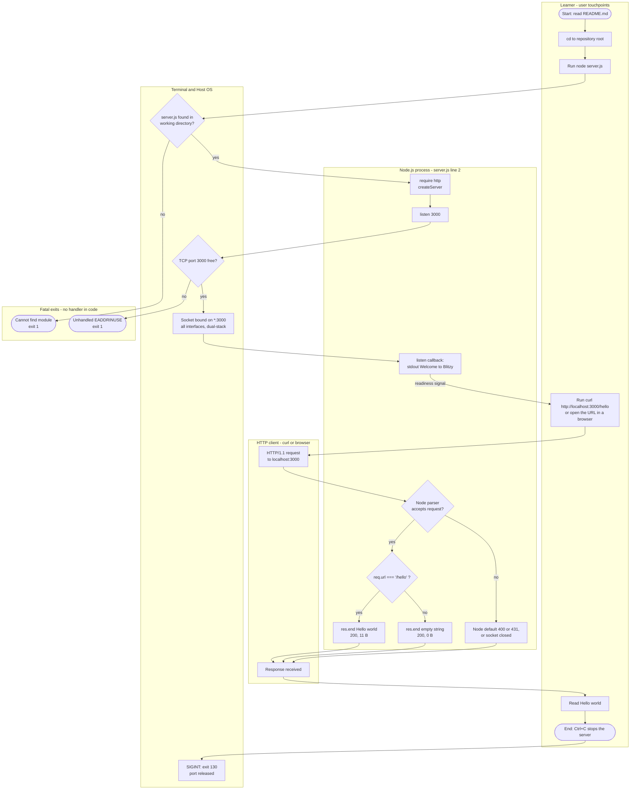
```mermaid
flowchart TB
    subgraph LaneLearner["Learner - user touchpoints"]
        L1(["Start: read README.md"]) --> L2["cd to repository root"]
        L2 --> L3["Run node server.js"]
        L6["Run curl http://localhost:3000/hello<br/>or open the URL in a browser"]
        L9["Read Hello world"]
        L10(["End: Ctrl+C stops the server"])
    end
    subgraph LaneHost["Terminal and Host OS"]
        H1{"server.js found in<br/>working directory?"}
        H2{"TCP port 3000 free?"}
        H3["Socket bound on *:3000<br/>all interfaces, dual-stack"]
        H4["SIGINT: exit 130<br/>port released"]
    end
    subgraph LaneNode["Node.js process - server.js line 2"]
        N1["require http<br/>createServer"]
        N2["listen 3000"]
        N3["listen callback:<br/>stdout Welcome to Blitzy"]
        N4{"Node parser<br/>accepts request?"}
        N5{"req.url === '/hello' ?"}
        N6["res.end Hello world<br/>200, 11 B"]
        N7["res.end empty string<br/>200, 0 B"]
        N8["Node default 400 or 431,<br/>or socket closed"]
    end
    subgraph LaneClient["HTTP client - curl or browser"]
        C1["HTTP/1.1 request<br/>to localhost:3000"]
        C2["Response received"]
    end
    subgraph LaneFatal["Fatal exits - no handler in code"]
        E1(["Cannot find module<br/>exit 1"])
        E2(["Unhandled EADDRINUSE<br/>exit 1"])
    end
    L3 --> H1
    H1 -->|"no"| E1
    H1 -->|"yes"| N1
    N1 --> N2
    N2 --> H2
    H2 -->|"no"| E2
    H2 -->|"yes"| H3
    H3 --> N3
    N3 -->|"readiness signal"| L6
    L6 --> C1
    C1 --> N4
    N4 -->|"no"| N8
    N4 -->|"yes"| N5
    N5 -->|"yes"| N6
    N5 -->|"no"| N7
    N6 --> C2
    N7 --> C2
    N8 --> C2
    C2 --> L9
    L9 --> L10
    L10 --> H4
```

### 4.4.2 Detailed Process Flows for Core Features

#### 4.4.2.1 Startup and Readiness — F-003, F-004 (WF-2)

The welcome line is the readiness signal. Because it sits in the `listen` callback, a failed bind never prints it (F-004-RQ-002). In the local check it appeared about 43 ms after launch; no startup target is defined.

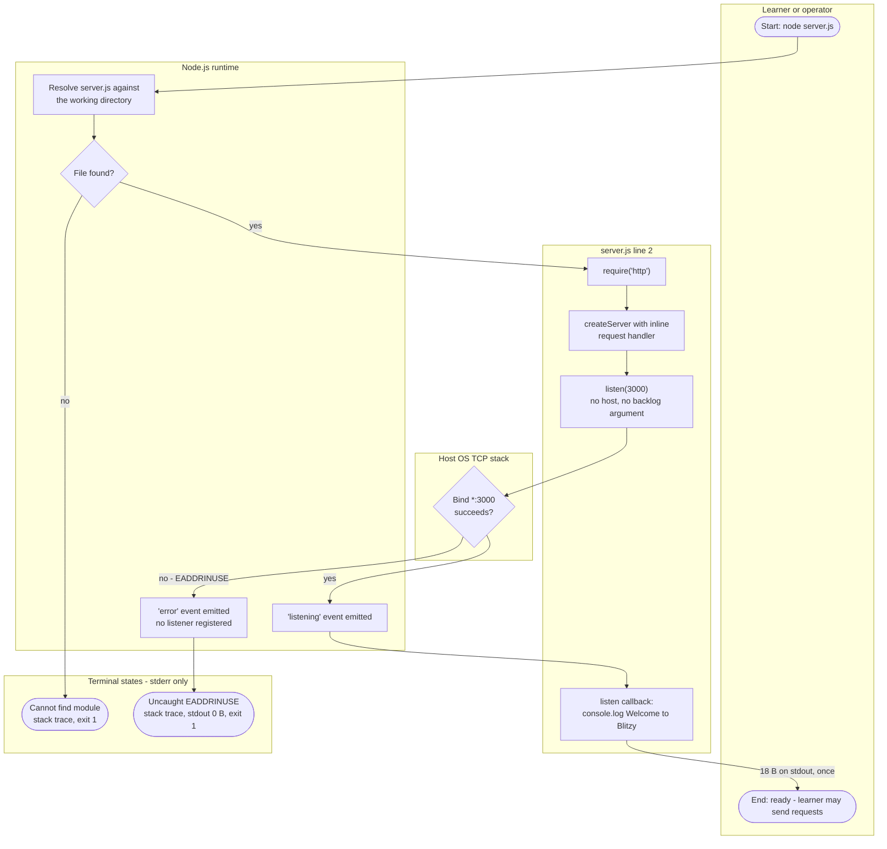
```mermaid
flowchart TD
    subgraph LaneOp["Learner or operator"]
        S0(["Start: node server.js"])
        SR(["End: ready - learner may send requests"])
    end
    subgraph LaneRt["Node.js runtime"]
        S1["Resolve server.js against<br/>the working directory"]
        S2{"File found?"}
        S7["'error' event emitted<br/>no listener registered"]
        S8["'listening' event emitted"]
    end
    subgraph LaneCode["server.js line 2"]
        S3["require('http')"]
        S4["createServer with inline<br/>request handler"]
        S5["listen(3000)<br/>no host, no backlog argument"]
        S9["listen callback:<br/>console.log Welcome to Blitzy"]
    end
    subgraph LaneOS["Host OS TCP stack"]
        S6{"Bind *:3000<br/>succeeds?"}
    end
    subgraph LaneExit["Terminal states - stderr only"]
        SX1(["Cannot find module<br/>stack trace, exit 1"])
        SX2(["Uncaught EADDRINUSE<br/>stack trace, stdout 0 B, exit 1"])
    end
    S0 --> S1
    S1 --> S2
    S2 -->|"no"| SX1
    S2 -->|"yes"| S3
    S3 --> S4
    S4 --> S5
    S5 --> S6
    S6 -->|"no - EADDRINUSE"| S7
    S7 --> SX2
    S6 -->|"yes"| S8
    S8 --> S9
    S9 -->|"18 B on stdout, once"| SR
```

#### 4.4.2.2 Request Handling and Connection Reuse — F-001, F-002, F-007 (WF-3, WF-4)

The application lane holds the single decision in the code. Everything in the platform lane is a Node.js default. A HEAD request follows the `/hello` path, but Node suppresses the body. An HTTP/1.0 request gets `Connection: close` (local check). PRI is left out of the diagram because the sources disagree on its outcome (Section 4.3.2, E-7); in both accounts it never reaches the handler.

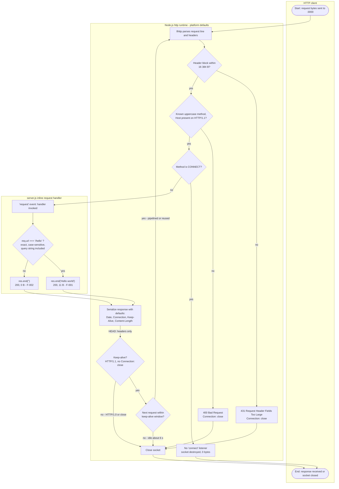
```mermaid
flowchart TD
    subgraph LaneCli["HTTP client"]
        R0(["Start: request bytes sent to :3000"])
        RZ(["End: response received or socket closed"])
    end
    subgraph LanePlat["Node.js http runtime - platform defaults"]
        R1["llhttp parses request line and headers"]
        R2{"Header block within<br/>16 384 B?"}
        R3{"Known uppercase method,<br/>Host present on HTTP/1.1?"}
        R4{"Method is CONNECT?"}
        RE1["431 Request Header Fields Too Large<br/>Connection: close"]
        RE2["400 Bad Request<br/>Connection: close"]
        RE3["No 'connect' listener<br/>socket destroyed, 0 bytes"]
        R9["Serialize response with defaults:<br/>Date, Connection, Keep-Alive, Content-Length"]
        R10{"Keep-alive?<br/>HTTP/1.1, no Connection: close"}
        R11{"Next request within<br/>keep-alive window?"}
        R12["Close socket"]
    end
    subgraph LaneApp["server.js inline request handler"]
        R5["'request' event: handler invoked"]
        R6{"req.url === '/hello' ?<br/>exact, case-sensitive,<br/>query string included"}
        R7["res.end('Hello world')<br/>200, 11 B - F-001"]
        R8["res.end('')<br/>200, 0 B - F-002"]
    end
    R0 --> R1
    R1 --> R2
    R2 -->|"no"| RE1
    R2 -->|"yes"| R3
    R3 -->|"no"| RE2
    R3 -->|"yes"| R4
    R4 -->|"yes"| RE3
    R4 -->|"no"| R5
    R5 --> R6
    R6 -->|"yes"| R7
    R6 -->|"no"| R8
    R7 --> R9
    R8 --> R9
    R9 -->|"HEAD: headers only"| R10
    R10 -->|"yes"| R11
    R10 -->|"no - HTTP/1.0 or close"| R12
    R11 -->|"yes - pipelined or reused"| R1
    R11 -->|"no - idle about 6 s"| R12
    RE1 --> R12
    RE2 --> R12
    RE3 --> RZ
    R12 --> RZ
```

The 408 path for headers that never complete appears in Figure 4.4.5.2.

#### 4.4.2.3 Maintainer Verification and Package Gate — F-005, F-006 (WF-6)

This expands the linear change workflow in Section 3.6.4 with its pass/fail decisions and the internal steps of the package gate (`Project Guide.md` §9.5, Appendix F, Appendix G).

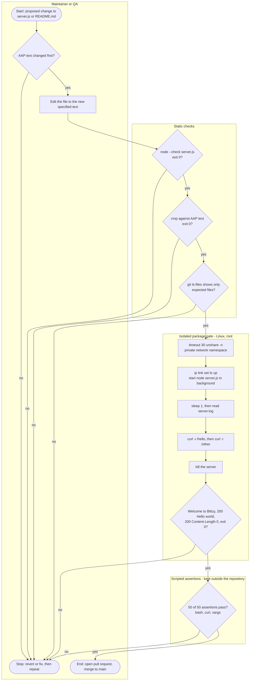
```mermaid
flowchart TD
    subgraph LaneMaint["Maintainer or QA"]
        V0(["Start: proposed change to server.js or README.md"])
        V1{"AAP text changed first?"}
        V2["Edit the file to the new specified text"]
        VF(["Stop: revert or fix, then repeat"])
        VE(["End: open pull request, merge to main"])
    end
    subgraph LaneStatic["Static checks"]
        V3{"node --check server.js<br/>exit 0?"}
        V4{"cmp against AAP text<br/>exit 0?"}
        V5{"git ls-files shows only<br/>expected files?"}
    end
    subgraph LaneGate["Isolated package gate - Linux, root"]
        V6["timeout 30 unshare -n<br/>private network namespace"]
        V7["ip link set lo up<br/>start node server.js in background"]
        V8["sleep 1, then read server.log"]
        V9["curl -i /hello, then curl -i /other"]
        V10["kill the server"]
        V11{"Welcome to Blitzy, 200 Hello world,<br/>200 Content-Length 0, exit 0?"}
    end
    subgraph LaneSuite["Scripted assertions - kept outside the repository"]
        V12{"50 of 50 assertions pass?<br/>bash, curl, xargs"}
    end
    V0 --> V1
    V1 -->|"no"| VF
    V1 -->|"yes"| V2
    V2 --> V3
    V3 -->|"no"| VF
    V3 -->|"yes"| V4
    V4 -->|"no"| VF
    V4 -->|"yes"| V5
    V5 -->|"no"| VF
    V5 -->|"yes"| V6
    V6 --> V7
    V7 --> V8
    V8 --> V9
    V9 --> V10
    V10 --> V11
    V11 -->|"no"| VF
    V11 -->|"yes"| V12
    V12 -->|"no"| VF
    V12 -->|"yes"| VE
```

### 4.4.3 Error Handling Flowcharts

#### 4.4.3.1 Startup Failure Recovery (E-1, E-2)

Both startup failures end the process. Recovery is manual and loops back to the launch. The port cannot be changed, so a port held by someone else's process is a dead end (constraint C-6).

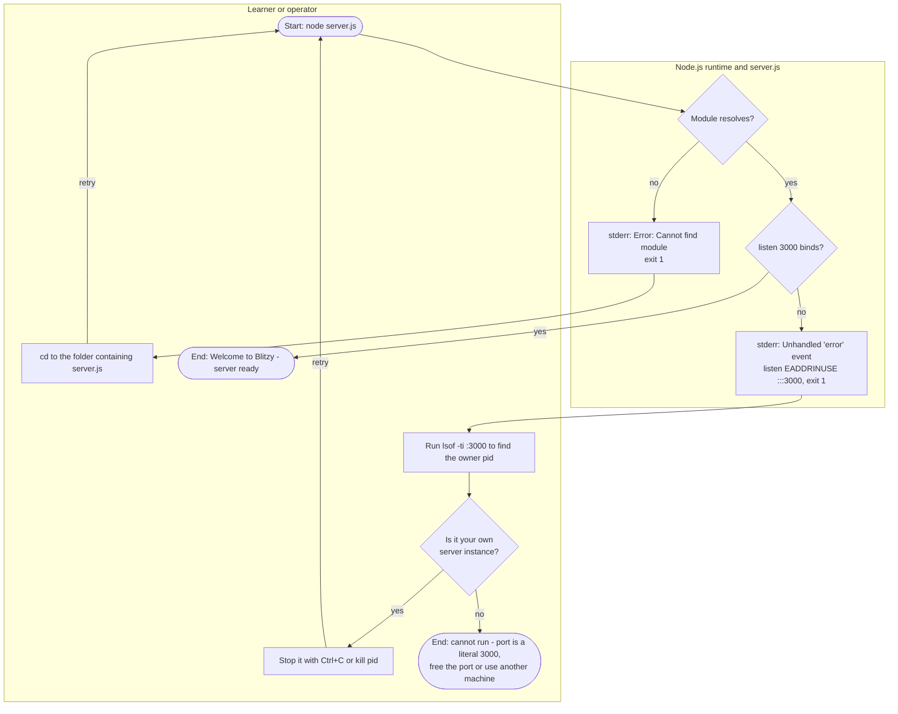
```mermaid
flowchart TD
    subgraph LaneUser["Learner or operator"]
        F0(["Start: node server.js"])
        F3["cd to the folder containing server.js"]
        F6["Run lsof -ti :3000 to find the owner pid"]
        F7{"Is it your own<br/>server instance?"}
        F8["Stop it with Ctrl+C or kill pid"]
        F9(["End: cannot run - port is a literal 3000,<br/>free the port or use another machine"])
        FE(["End: Welcome to Blitzy - server ready"])
    end
    subgraph LaneNodeRt["Node.js runtime and server.js"]
        F1{"Module resolves?"}
        F2["stderr: Error: Cannot find module<br/>exit 1"]
        F4{"listen 3000 binds?"}
        F5["stderr: Unhandled 'error' event<br/>listen EADDRINUSE :::3000, exit 1"]
    end
    F0 --> F1
    F1 -->|"no"| F2
    F2 --> F3
    F3 -->|"retry"| F0
    F1 -->|"yes"| F4
    F4 -->|"no"| F5
    F5 --> F6
    F6 --> F7
    F7 -->|"yes"| F8
    F8 -->|"retry"| F0
    F7 -->|"no"| F9
    F4 -->|"yes"| FE
```

#### 4.4.3.2 Learner Troubleshooting (E-8 to E-10)

This follows the symptom table in `Project Guide.md` §9.7.

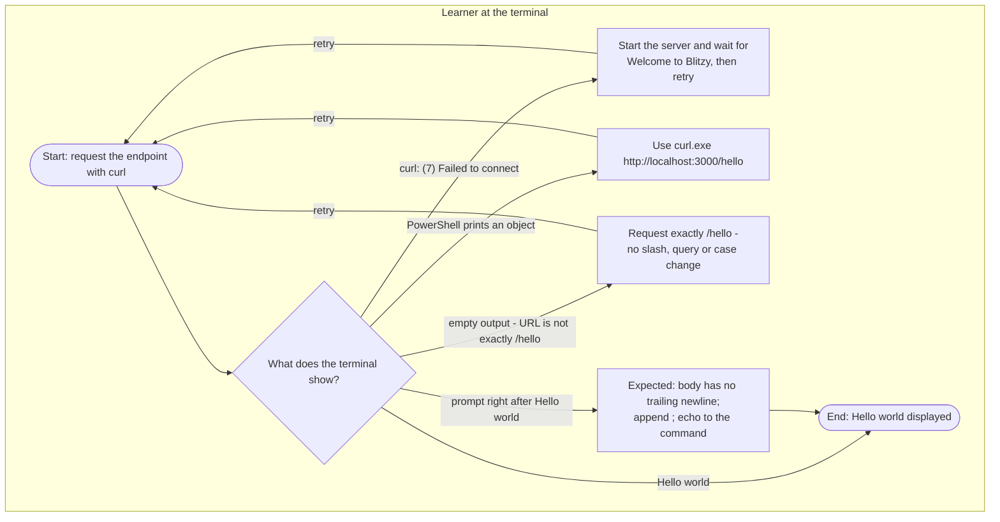
```mermaid
flowchart TD
    subgraph LaneLrn["Learner at the terminal"]
        T0(["Start: request the endpoint with curl"])
        T1{"What does the terminal show?"}
        T2["Start the server and wait for<br/>Welcome to Blitzy, then retry"]
        T3["Use curl.exe http://localhost:3000/hello"]
        T4["Request exactly /hello -<br/>no slash, query or case change"]
        T5["Expected: body has no trailing newline;<br/>append ; echo to the command"]
        TE(["End: Hello world displayed"])
    end
    T0 --> T1
    T1 -->|"curl: (7) Failed to connect"| T2
    T1 -->|"PowerShell prints an object"| T3
    T1 -->|"empty output - URL is not exactly /hello"| T4
    T1 -->|"prompt right after Hello world"| T5
    T1 -->|"Hello world"| TE
    T2 -->|"retry"| T0
    T3 -->|"retry"| T0
    T4 -->|"retry"| T0
    T5 --> TE
```

#### 4.4.3.3 Error Notification Channels

No error is logged by the application. Fatal errors reach the operator through stderr. Request-level errors reach only the client.

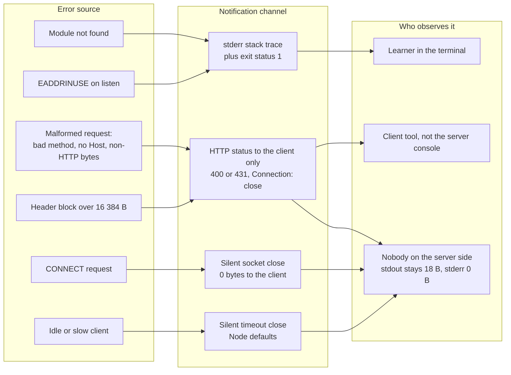
```mermaid
flowchart LR
    subgraph LaneSrc["Error source"]
        X1["Module not found"]
        X2["EADDRINUSE on listen"]
        X3["Malformed request:<br/>bad method, no Host, non-HTTP bytes"]
        X4["Header block over 16 384 B"]
        X5["CONNECT request"]
        X6["Idle or slow client"]
    end
    subgraph LaneChan["Notification channel"]
        Y1["stderr stack trace<br/>plus exit status 1"]
        Y2["HTTP status to the client only<br/>400 or 431, Connection: close"]
        Y3["Silent socket close<br/>0 bytes to the client"]
        Y4["Silent timeout close<br/>Node defaults"]
    end
    subgraph LaneObs["Who observes it"]
        Z1["Learner in the terminal"]
        Z2["Client tool, not the server console"]
        Z3["Nobody on the server side<br/>stdout stays 18 B, stderr 0 B"]
    end
    X1 --> Y1
    X2 --> Y1
    X3 --> Y2
    X4 --> Y2
    X5 --> Y3
    X6 --> Y4
    Y1 --> Z1
    Y2 --> Z2
    Y2 --> Z3
    Y3 --> Z3
    Y4 --> Z3
```

"Silent timeout close" covers idle keep-alive sockets, which close with no bytes. A connection whose headers never complete gets a 408 first (E-5).

### 4.4.4 Integration Sequence Diagrams

#### 4.4.4.1 Startup and First Request

This expands the README walkthrough sequence in Section 1.3.1 with the OS bind, the parser stage and timing notes.

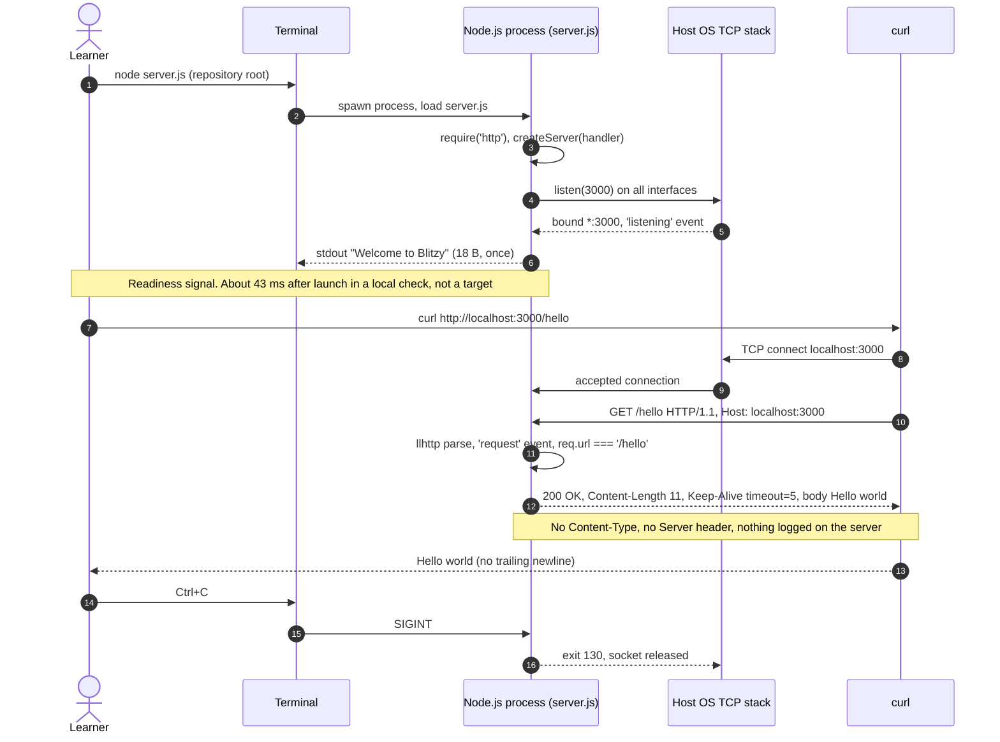
```mermaid
sequenceDiagram
    autonumber
    actor Learner
    participant Term as Terminal
    participant Proc as Node.js process (server.js)
    participant OS as Host OS TCP stack
    participant Cli as curl
    Learner->>Term: node server.js (repository root)
    Term->>Proc: spawn process, load server.js
    Proc->>Proc: require('http'), createServer(handler)
    Proc->>OS: listen(3000) on all interfaces
    OS-->>Proc: bound *:3000, 'listening' event
    Proc-->>Term: stdout "Welcome to Blitzy" (18 B, once)
    Note over Learner,Proc: Readiness signal. About 43 ms after launch in a local check, not a target
    Learner->>Cli: curl http://localhost:3000/hello
    Cli->>OS: TCP connect localhost:3000
    OS->>Proc: accepted connection
    Cli->>Proc: GET /hello HTTP/1.1, Host: localhost:3000
    Proc->>Proc: llhttp parse, 'request' event, req.url === '/hello'
    Proc-->>Cli: 200 OK, Content-Length 11, Keep-Alive timeout=5, body Hello world
    Note over Cli,Proc: No Content-Type, no Server header, nothing logged on the server
    Cli-->>Learner: Hello world (no trailing newline)
    Learner->>Term: Ctrl+C
    Term->>Proc: SIGINT
    Proc-->>OS: exit 130, socket released
```

#### 4.4.4.2 Keep-Alive, Pipelining and Idle Close (WF-4)

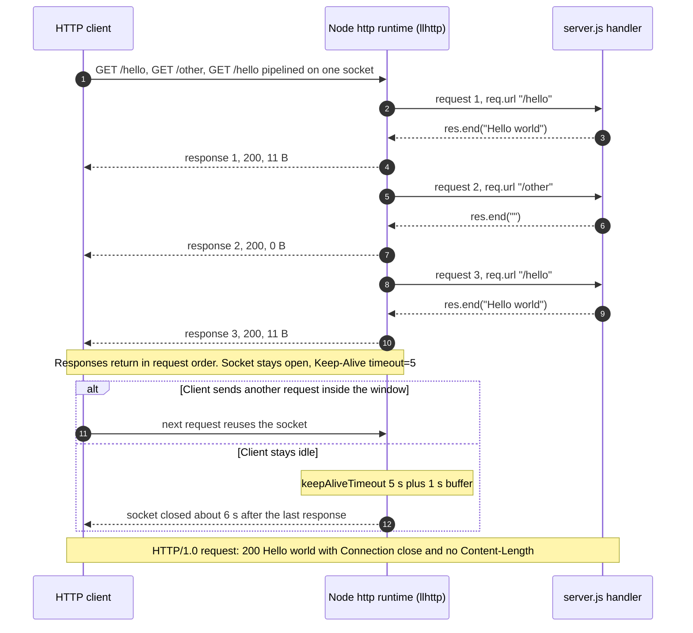
```mermaid
sequenceDiagram
    autonumber
    participant Cli as HTTP client
    participant Http as Node http runtime (llhttp)
    participant Hdl as server.js handler
    Cli->>Http: GET /hello, GET /other, GET /hello pipelined on one socket
    Http->>Hdl: request 1, req.url "/hello"
    Hdl-->>Http: res.end("Hello world")
    Http-->>Cli: response 1, 200, 11 B
    Http->>Hdl: request 2, req.url "/other"
    Hdl-->>Http: res.end("")
    Http-->>Cli: response 2, 200, 0 B
    Http->>Hdl: request 3, req.url "/hello"
    Hdl-->>Http: res.end("Hello world")
    Http-->>Cli: response 3, 200, 11 B
    Note over Cli,Http: Responses return in request order. Socket stays open, Keep-Alive timeout=5
    alt Client sends another request inside the window
        Cli->>Http: next request reuses the socket
    else Client stays idle
        Note over Http: keepAliveTimeout 5 s plus 1 s buffer
        Http-->>Cli: socket closed about 6 s after the last response
    end
    Note over Cli,Hdl: HTTP/1.0 request: 200 Hello world with Connection close and no Content-Length
```

The pipelining, idle-close and HTTP/1.0 behaviour is from the local check. `Project Guide.md` §2.1 records keep-alive, pipelining and HTTP/1.0 as verified without giving timings.

#### 4.4.4.3 Parser Rejections and Service Continuity (F-007-RQ-003)

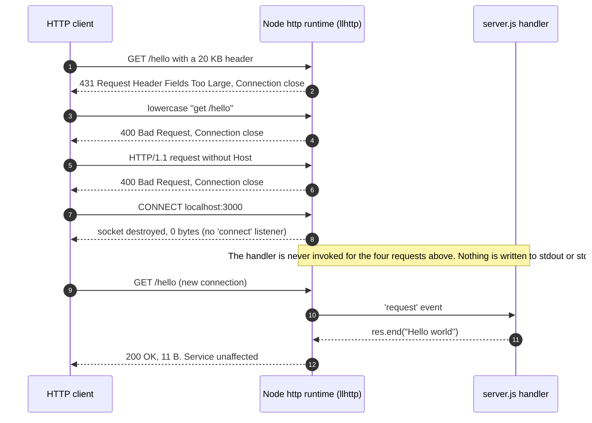
```mermaid
sequenceDiagram
    autonumber
    participant Cli as HTTP client
    participant Http as Node http runtime (llhttp)
    participant Hdl as server.js handler
    Cli->>Http: GET /hello with a 20 KB header
    Http-->>Cli: 431 Request Header Fields Too Large, Connection close
    Cli->>Http: lowercase "get /hello"
    Http-->>Cli: 400 Bad Request, Connection close
    Cli->>Http: HTTP/1.1 request without Host
    Http-->>Cli: 400 Bad Request, Connection close
    Cli->>Http: CONNECT localhost:3000
    Http-->>Cli: socket destroyed, 0 bytes (no 'connect' listener)
    Note over Http,Hdl: The handler is never invoked for the four requests above. Nothing is written to stdout or stderr
    Cli->>Http: GET /hello (new connection)
    Http->>Hdl: 'request' event
    Hdl-->>Http: res.end("Hello world")
    Http-->>Cli: 200 OK, 11 B. Service unaffected
```

#### 4.4.4.4 Port Collision Between Two Instances (F-003-RQ-003, F-003-RQ-004)

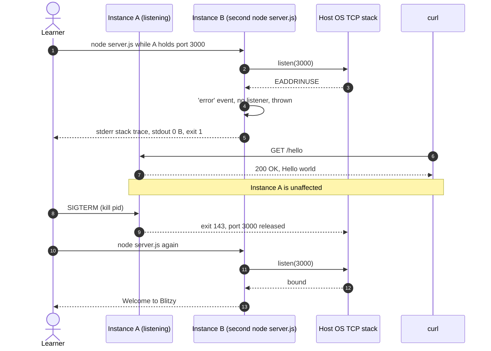
```mermaid
sequenceDiagram
    autonumber
    actor Op as Learner
    participant A as Instance A (listening)
    participant B as Instance B (second node server.js)
    participant OS as Host OS TCP stack
    participant Cli as curl
    Op->>B: node server.js while A holds port 3000
    B->>OS: listen(3000)
    OS-->>B: EADDRINUSE
    B->>B: 'error' event, no listener, thrown
    B-->>Op: stderr stack trace, stdout 0 B, exit 1
    Cli->>A: GET /hello
    A-->>Cli: 200 OK, Hello world
    Note over A,Cli: Instance A is unaffected
    Op->>A: SIGTERM (kill pid)
    A-->>OS: exit 143, port 3000 released
    Op->>B: node server.js again
    B->>OS: listen(3000)
    OS-->>B: bound
    B-->>Op: Welcome to Blitzy
```

### 4.4.5 State Transition Diagrams

#### 4.4.5.1 Process Lifecycle

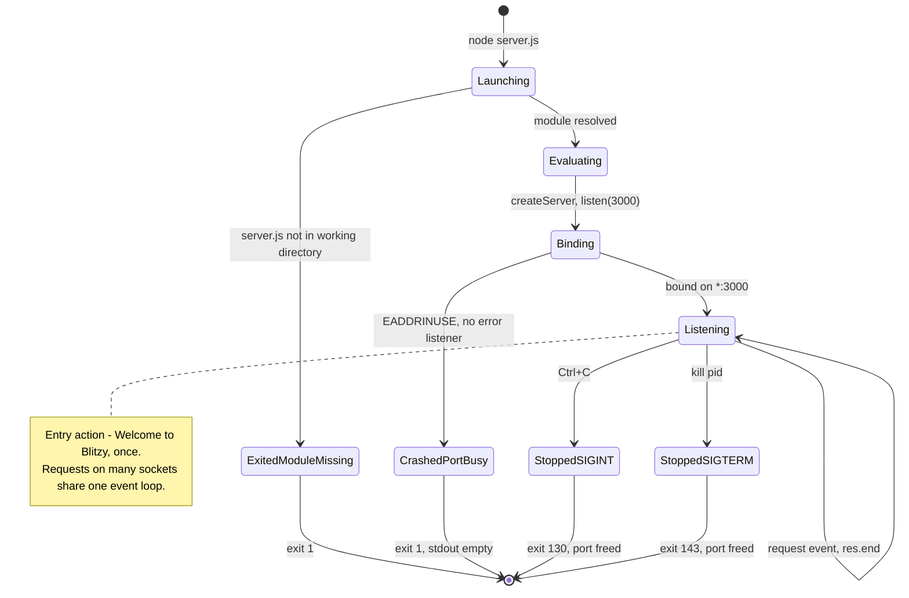
```mermaid
stateDiagram-v2
    [*] --> Launching: node server.js
    Launching --> ExitedModuleMissing: server.js not in working directory
    Launching --> Evaluating: module resolved
    Evaluating --> Binding: createServer, listen(3000)
    Binding --> CrashedPortBusy: EADDRINUSE, no error listener
    Binding --> Listening: bound on *:3000
    Listening --> Listening: request event, res.end
    Listening --> StoppedSIGINT: Ctrl+C
    Listening --> StoppedSIGTERM: kill pid
    note right of Listening
        Entry action - Welcome to Blitzy, once.
        Requests on many sockets share one event loop.
    end note
    ExitedModuleMissing --> [*]: exit 1
    CrashedPortBusy --> [*]: exit 1, stdout empty
    StoppedSIGINT --> [*]: exit 130, port freed
    StoppedSIGTERM --> [*]: exit 143, port freed
```

#### 4.4.5.2 Connection Lifecycle

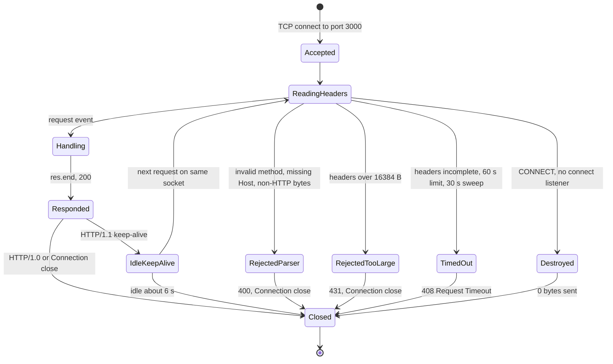
```mermaid
stateDiagram-v2
    [*] --> Accepted: TCP connect to port 3000
    Accepted --> ReadingHeaders
    ReadingHeaders --> RejectedParser: invalid method, missing Host, non-HTTP bytes
    ReadingHeaders --> RejectedTooLarge: headers over 16384 B
    ReadingHeaders --> TimedOut: headers incomplete, 60 s limit, 30 s sweep
    ReadingHeaders --> Destroyed: CONNECT, no connect listener
    ReadingHeaders --> Handling: request event
    Handling --> Responded: res.end, 200
    Responded --> IdleKeepAlive: HTTP/1.1 keep-alive
    Responded --> Closed: HTTP/1.0 or Connection close
    IdleKeepAlive --> ReadingHeaders: next request on same socket
    IdleKeepAlive --> Closed: idle about 6 s
    RejectedParser --> Closed: 400, Connection close
    RejectedTooLarge --> Closed: 431, Connection close
    TimedOut --> Closed: 408 Request Timeout
    Destroyed --> Closed: 0 bytes sent
    Closed --> [*]
```

### 4.4.6 Diagram-to-Requirement Traceability

| Figure | Workflow | Features and Requirements | Related Sections |
|---|---|---|---|
| 4.4.1 High-Level System Workflow | WF-1, WF-2, WF-3, WF-5 | F-001 to F-005 | 1.2.2, 1.3.1, 2.3.2 |
| 4.4.2.1 Startup and Readiness | WF-2 | F-003-RQ-001, F-004-RQ-001 to RQ-003 | 2.2.3, 2.2.4 |
| 4.4.2.2 Request Handling | WF-3, WF-4 | F-001-RQ-001 to RQ-004, F-002-RQ-001/002, F-007-RQ-001/003 | 2.2.1, 2.2.2, 2.2.7 |
| 4.4.2.3 Maintainer Verification | WF-6 | F-005-RQ-005, F-006-RQ-001 to RQ-004 | 2.6.3 (C-1, C-2), 3.6.4 |
| 4.4.3.1 Startup Failure Recovery | WF-2 | F-003-RQ-003; assumptions A-1, A-2 | 2.6.2, 4.3.2 |
| 4.4.3.2 Learner Troubleshooting | WF-1 | F-001-RQ-004, F-005-RQ-004; assumption A-4 | 2.6.2, 4.3.2 |
| 4.4.3.3 Error Notification Channels | WF-2, WF-3 | F-004-RQ-003, F-007-RQ-003 | 4.3.2 |
| 4.4.4.1 Startup and First Request | WF-1, WF-2, WF-3, WF-5 | F-001-RQ-001, F-004-RQ-002, F-005-RQ-003/004 | 1.3.1 |
| 4.4.4.2 Keep-Alive and Pipelining | WF-4 | F-003-RQ-002 | 2.2.3, 4.2.2 |
| 4.4.4.3 Parser Rejections | WF-3 | F-007-RQ-002/003 | 2.2.7 |
| 4.4.4.4 Port Collision | WF-2, WF-5 | F-003-RQ-003, F-003-RQ-004 | 2.2.3 |
| 4.4.5.1 Process Lifecycle | WF-2, WF-5 | F-003, F-004 | 4.3.1 |
| 4.4.5.2 Connection Lifecycle | WF-3, WF-4 | F-001, F-002, F-007 | 4.2.2, 4.3.1 |

## 4.5 References

#### Repository Files and Folders

- `server.js` - The single CommonJS statement (line 2) behind every runtime workflow. It holds the request-handler callback with the only application decision (`req.url === '/hello'`), the `listen(3000)` call and the `listen` callback that prints `Welcome to Blitzy`. It has no error, `'connect'` or signal handlers and no application state. Line 1 is the JSDoc summary.
- `README.md` - The learner journey (WF-1): prerequisite and no-install statement (line 3), start command with expected output and port (line 4), and test request with expected response (line 5).
- `blitzy/documentation/Project Guide.md` - Verified behaviour and operations used throughout: accomplishments (§1.3); open issues (§1.4); no credentials, environment variables or external services (§1.5); verification scope covering keep-alive, pipelining and HTTP/1.0 (§2.1); the 50-assertion results, including lifecycle, concurrency and 431 recovery (§3); runtime validation of the bind, CONNECT, `EADDRINUSE` and wrong-directory failures (§4); compliance matrix (§5.1); divergences D1–D5, including the CONNECT/PRI, HEAD and parser-400 behaviour and the timeout defaults (§5.2); risks and mitigations (§6); production-readiness limits (§8); setup (§9.2); foreground and background startup and stop (§9.4); verification commands and the isolated package gate (§9.5); example usage (§9.6); troubleshooting (§9.7); and Appendices B (port), E (no environment variables), F (developer checks) and G (exact-match routing, package gate).
- `blitzy/documentation/` - Contains only `Project Guide.md`.
- `blitzy/` - Documentation root; its only child is `blitzy/documentation/`.
- Repository root (`""`) - Contains only `server.js`, `README.md` and `blitzy/`. There is no manifest, test suite, CI, container or infrastructure definition, which confirms the absence of batch, pipeline and deployment workflows.

#### Runtime Verification

- Local check: `server.js` was run unchanged on Node v22.23.3 while writing this section. It confirmed the Project Guide's behaviour and added these observations: startup in about 43 ms; HEAD omits `Content-Length`; HTTP/1.0 gets `Connection: close`; absolute-form targets get the empty fallback; a 1 MB body is ignored; `Upgrade` requests get a plain 200; a missing `Host` or a TLS ClientHello gets 400; idle keep-alive sockets close after about 6 s; incomplete headers get 408 after 89.8 s; SIGINT exits 130; and the `http.Server` defaults. It also produced the PRI result (400 with `Connection: close`) that conflicts with `Project Guide.md` §1.4 and §5.2 D2.

#### Cross-Referenced Technical Specification Sections

- Section 1.2.2 High-Level Description - Component flowchart and design-choice table.
- Section 1.3.1 In-Scope - README walkthrough sequence diagram and workflow table.
- Section 1.3.2 Out-of-Scope - Absence of logging, monitoring, persistence and authentication.
- Section 2.2 Functional Requirements Table - Requirement IDs F-001-RQ-001 to F-007-RQ-005, used in flow labels and traceability.
- Section 2.3.2 Request and Startup Processing Flow - Feature-mapped summary flow that Section 4.4 expands.
- Section 2.4 Implementation Considerations - Statement that no SLA or latency target is defined.
- Section 2.6.2 and 2.6.3 - Assumptions A-1 to A-7 and constraints C-1 to C-6.
- Section 3.6.4 Source Control and CI/CD - Linear change workflow that Figure 4.4.2.3 expands.

No web sources were used.

# 5. System Architecture

## 5.1 High-Level Architecture

The system is one Node.js process. Its entire application logic is a single CommonJS statement at `server.js` line 2. Node.js built-in `http` defaults supply the rest of the HTTP service: connection handling, parsing, response framing, timeouts and error responses. The Agent Action Plan (AAP) fixes the scope. The delivered file contents are the acceptance criterion, and the target is a learner's own machine, not a network-facing service (`Project Guide.md` §1.1).

### 5.1.1 System Overview

#### Architecture Style and Rationale

| Attribute | Architecture | Evidence |
|---|---|---|
| Style | Single-process monolith: one module, one statement, no internal module boundaries | `server.js` lines 1–2 |
| Execution model | Event-driven (reactor). The libuv event loop dispatches the `'request'` and `'listening'` events to two inline arrow callbacks on one JavaScript thread | `server.js` line 2 |
| Layering | A thin application layer over the Node.js HTTP platform. The application sets no status, headers, timeouts or error handling | `server.js` line 2; `Project Guide.md` §5.2 D3 |
| Interaction style | Synchronous HTTP/1.1 request–response, inbound only | `Project Guide.md` Appendix B |
| State model | Stateless: no variables, sessions, caches or storage | Section 4.3.1 |
| Deployment unit | `node server.js`, run by hand on the learner's machine; no container, supervisor or cloud target | Section 3.6.5 |

The style follows from three drivers:

- **Audience.** Developers new to server-side JavaScript must be able to read the whole server in one line (`Project Guide.md` §1.1).
- **Binding constraints.** The AAP requires one JSDoc line and one statement, built-in modules only, and no handlers, headers, configuration or hardening (C-1, C-3, C-5, C-6 in Section 2.6.3). A modular, framework-based or layered-by-code design would break these.
- **Single quality goal.** The system is ready for "a local tutorial on the learner's own machine". Network exposure is out of scope (`Project Guide.md` §8).

#### Key Architectural Principles and Patterns

| Principle or Pattern | How It Is Realised | Evidence |
|---|---|---|
| Minimalism | One untagged JSDoc line and one statement: 2 lines, 247 B | `Project Guide.md` §5.1 item 6 |
| Zero dependencies | Only `require('http')`. No `package.json`, lockfile or install step | `Project Guide.md` §5.1 item 7, §9.3 |
| Platform defaults as policy | Status 200, the header set, timeouts, parser rejections and the bind address all come from Node.js defaults | `Project Guide.md` §3, §5.2 D3 |
| Statelessness | The handler reads only `req.url` and writes a literal. Nothing is shared between requests | `server.js` line 2 |
| Literal configuration | Port `3000`, path `/hello` and both messages are literals; there is no `process.env` reference | `Project Guide.md` Appendix E |
| Reactor / event emitter | `createServer(handler)` registers the `'request'` listener. `listen(3000, cb)` registers a one-time `'listening'` listener | `server.js` line 2 |
| Fluent chaining | `require('http').createServer(...).listen(...)`. The server object is never assigned to a name | `server.js` line 2 |
| Single-handler dispatch | One ternary on `req.url` stands in for a router. Unmatched targets get an empty 200 (a null-response fallback, never a 404) | `server.js` line 2; `Project Guide.md` §1.3 |
| Event-ordered readiness | The welcome line sits in the `listen` callback, so it appears only after a successful bind | `Project Guide.md` §5.1 item 2 |
| Fail-fast startup | There is no `'error'` listener. A failed bind or a missing module ends the process with exit 1 | `Project Guide.md` §4, §5.2 D3 |
| Exact-content conformance | Both files must stay byte-identical to the AAP text. `git diff` against the delivered commit should stay empty | `Project Guide.md` §5.1 item 9, Appendix F |

#### System Boundaries and Major Interfaces

| Interface | Direction | Specification | Evidence |
|---|---|---|---|
| HTTP endpoint | Inbound | HTTP/1.1 over TCP port 3000 on all interfaces (`::`, dual-stack). `/hello` returns `Hello world`; every other target returns an empty 200 | `server.js` line 2; `Project Guide.md` Appendix B |
| Command line | Inbound | `node server.js`, run from the repository root; no arguments or options | `README.md` line 4; `Project Guide.md` §5.2 D5 |
| Termination signals | Inbound | SIGINT (Ctrl+C) gives exit 130. SIGTERM gives exit 143 and frees the port | `Project Guide.md` §3; Section 4.3.1 |
| Readiness signal | Outbound | stdout `Welcome to Blitzy\n` (18 B), printed once, after the bind | `Project Guide.md` §3 |
| Fatal error channel | Outbound | stderr stack trace and exit status 1, for a missing module or `EADDRINUSE` | `Project Guide.md` §4 |

Everything else lies outside the boundary. The process makes no outbound network call, writes no file, reads no environment variable or credential, and opens no database (`Project Guide.md` §1.5, §9.2, Appendix E). `README.md` and `blitzy/documentation/Project Guide.md` live in the repository but take no part in the runtime.

#### Architectural Assumptions

The architecture is valid only while these assumptions hold. IDs A-1 to A-7 come from Section 2.6.2; AR-1 is specific to this section.

- **A-1** The process starts from the repository root. Otherwise the CommonJS loader cannot find `server.js`.
- **A-2** Port 3000 is free. Because the port is fixed, only one instance can run per host.
- **A-3** The Node.js release is maintained and patched. The runtime is the entire supply-chain and security surface.
- **A-5** The host sits on a trusted network. The all-interface bind lets other machines reach the endpoint.
- **A-7** Node.js `http` defaults behave on macOS, Windows and Node 24 LTS as they did on the verified host (Linux, v22.23.2).
- **AR-1** The runtime release defines every behaviour the code does not set: headers, timeouts, method dispatch and error responses. Local checks on v22.23.3 matched the guide except for PRI handling (Section 4.3.2, E-7).

### 5.1.2 Core Components Table

Five runtime components and two documentation components make up the system. Terminology used throughout Section 5:

**Responsibilities and dependencies**

| Component | Primary Responsibility | Key Dependencies | Location |
|---|---|---|---|
| Request Handler | Select the body by the exact match `req.url === '/hello'`, then end every response with a single `res.end` | Node.js HTTP Platform (`'request'` event, `ServerResponse`) | `server.js` line 2, first arrow callback |
| Server Bootstrap and Listener | Load `http`, create the server with the handler, bind port 3000 on all interfaces | Node.js Runtime (CommonJS loader); host OS TCP stack | `server.js` line 2, `require('http')` through `.listen(3000, …)` |
| Startup Notifier | Print `Welcome to Blitzy` once, after the bind | `'listening'` event; `console` writing to stdout | `server.js` line 2, second arrow callback |
| Node.js HTTP Platform | Accept connections, parse HTTP/1.1 (llhttp 9.4.3), dispatch methods, frame responses, add default headers, enforce timeouts, reject malformed input | Node.js Runtime | Built-in `http` module |
| Node.js Runtime | Load the module, run the event loop, map signals to exit statuses | Host OS; release unpinned (v22.23.2 verified) | Outside the repository |
| Learner Guide | State the prerequisite, the start command and the expected `curl` result | The literals in `server.js`: port, message, path and body | `README.md` lines 1–5; JSDoc at `server.js` line 1 |
| Project Status Report | Record delivery status, verification evidence, divergences D1–D5, risks and the operations guide | None at runtime | `blitzy/documentation/Project Guide.md` |

**Integration points and critical considerations**

| Component | Integration Points | Critical Considerations |
|---|---|---|
| Request Handler | Called once per dispatched request with `(req, res)`; reads `req.url` only | Exact match only, so `/hello/`, `/HELLO`, `/hello?x=1` and absolute-form targets get the empty fallback. It never reads method, headers or body, so nothing is reflected. No `Content-Type` is sent |
| Server Bootstrap and Listener | CLI launch; OS bind on `::` port 3000 | With no host argument it binds all interfaces. With no `'error'` listener, `EADDRINUSE` crashes the process. A second instance cannot start |
| Startup Notifier | stdout | The only operational signal. It must stay inside the `listen` callback to keep its after-bind guarantee |
| Node.js HTTP Platform | TCP sockets; handler via `'request'`; clients via status codes | Its defaults are the only guards: `maxHeaderSize` 16 384 B, `headersTimeout` 60 s, `requestTimeout` 300 s, no connection cap. CONNECT and PRI never reach the handler (D2) |
| Node.js Runtime | `node` CLI; signals; stderr | Unpinned (D4). Guidance: Node.js 24 LTS, never below 22.23.2 / 24.18.1 / 26.5.1 |
| Learner Guide | Read by the learner | Coupled to the `server.js` literals: a change to either needs the other updated. Omits the run directory (D5) |
| Project Status Report | Read by the owner and QA | Never executed. Its `git ls-files` scope check predates the guide's own commit `92db56b` |

### 5.1.3 Data Flow Description

#### Primary Data Flows

1. **Startup.** The operator runs `node server.js`. The CommonJS loader resolves `server.js` against the working directory, and evaluating line 2 runs the Server Bootstrap and Listener. `createServer` registers the Request Handler, and `listen(3000)` asks the OS to bind `::` port 3000. The `'listening'` event then fires the Startup Notifier, which writes 18 bytes to stdout. A failure on this path produces a stderr stack trace and exit 1 (Figure 5.2.9.2).
2. **Request.** Client bytes arrive on TCP port 3000, and the platform's llhttp parser builds `req` (method, target, headers). The `'request'` event invokes the Request Handler, which compares `req.url` and calls `res.end(literal)`. The platform frames a 200 response with `Date`, `Connection`, `Keep-Alive` and `Content-Length` and sends it back over the same socket (Figure 5.2.9.1).
3. **Rejection.** Requests the parser refuses never reach application code. They receive 400 (malformed request, lowercase method token, missing `Host`), 431 (headers over 16 384 B) or 408 (headers incomplete when `headersTimeout` expires), or a destroyed socket (CONNECT). The server keeps serving (Section 4.3.2, E-3 to E-6).
4. **Shutdown.** SIGINT or SIGTERM ends the process through Node.js default handling, with exit 130 or 143. Open sockets close and the port is released.

Only three things leave the process: HTTP responses, the welcome line and fatal stack traces.

#### Integration Patterns and Protocols

| Pattern | Between | Protocol / Mechanism |
|---|---|---|
| Synchronous request–response | Client and HTTP Platform | HTTP/1.1 over TCP; HTTP/1.0 is also accepted. No TLS or HTTP/2; an `Upgrade` request gets a plain 200 (local check) |
| Persistent connections and pipelining | Client and HTTP Platform | `Connection: keep-alive`, `Keep-Alive: timeout=5`; pipelined requests are answered in order (`Project Guide.md` §2.1; local check) |
| In-process events | HTTP Platform and application callbacks | Node.js `EventEmitter` events `'request'` and `'listening'` |
| One-way notification | Startup Notifier to operator | A plain-text line on stdout |
| Process exit status | Runtime to operator or script | 1 for a startup failure, 130 for SIGINT, 143 for SIGTERM |

#### Data Transformation Points

| Point | Component | Input | Output |
|---|---|---|---|
| T-1 Parse | Node.js HTTP Platform (llhttp) | Raw request bytes | `req` with `method`, `url` and `headers`, or a 4xx rejection |
| T-2 Route | Request Handler | `req.url` string | `'Hello world'` (11 B) if strictly equal to `/hello`, otherwise `''` |
| T-3 Frame | `ServerResponse` | Body literal | Status 200 with `Date`, `Content-Length` (11 or 0), `Connection` and `Keep-Alive`. HTTP/1.0 gets `Connection: close` and no `Content-Length`; HEAD gets no body |
| T-4 Notify | Startup Notifier | `'Welcome to Blitzy'` | `Welcome to Blitzy\n` on stdout (18 B) |

Request bodies are never transformed. The handler does not read them, so the platform discards them. In a local check, a 1 MB POST to `/hello` still returned `Hello world`, and the next request was served normally.

#### Data Stores and Caches

The system has no data store or cache.

| Store Type | Present | Detail |
|---|---|---|
| Database or file storage | No | No database and no file writes (`Project Guide.md` §9.2) |
| Configuration store | No | Literals only (`Project Guide.md` Appendix E) |
| In-memory application state or cache | No | No variables or closures holding data (Section 4.3.1) |
| HTTP caching | No | No `Cache-Control`, `ETag` or `Last-Modified` headers (`Project Guide.md` §3) |
| Transient buffers | Platform-owned only | Node.js and the OS hold socket and parser buffers for the life of each connection |
| Logs | Only when redirected | A background run writes stdout and stderr to `"$d/server.log"` through `nohup … 2>&1` (`Project Guide.md` §9.4) |

### 5.1.4 External Integration Points

**Integration type and exchange**

| System Name | Integration Type | Data Exchange Pattern | Protocol / Format |
|---|---|---|---|
| HTTP clients (curl, web browser) | Inbound API consumer | Synchronous request–response with keep-alive reuse | HTTP/1.1 over TCP 3000. Body is `Hello world` or empty, with no `Content-Type` |
| Operator terminal | Process control and console | Launches the process and sends signals in; receives a one-way stdout notification, and a stderr trace on a fatal error | CLI `node server.js`; plain-text line; process exit status |
| Host OS network stack | Socket binding | Listens on `::` port 3000 and accepts connections | TCP, dual-stack IPv4/IPv6 |
| Node.js runtime | Execution platform | In-process module loading and event dispatch | CommonJS `require('http')` |
| Host file system | Module source | One read of `server.js` at load time; no writes | Path relative to the working directory |
| GitHub | Source hosting, off the runtime path | Push and pull-request merge | Git remote `origin`; PR #1 merged by `blitzy-qa[bot]` |
| Databases, external APIs, identity providers, monitoring services | None | — | — |

**Service levels**

| System Name | SLA Requirements | Evidence |
|---|---|---|
| HTTP clients | None defined. Verified: every request answered under 200 parallel requests and under a 100/100 mixed load | `Project Guide.md` §3; Section 2.4 |
| Operator terminal | None defined. The readiness line appears only after the bind. In normal operation stdout stays at 18 B and stderr stays empty | `Project Guide.md` §3 |
| Host OS network stack | Port 3000 must be free before launch | `Project Guide.md` §9.1 |
| Node.js runtime | No pin (AAP 0.3.1). Guidance: Node.js 24 LTS; never below 22.23.2 / 24.18.1 / 26.5.1; avoid 20.x, 23.x and 25.x | `Project Guide.md` §5.2 D4, §9.1 |
| Host file system | The process must start in the folder containing `server.js` | `Project Guide.md` §5.2 D5 |
| GitHub | None; not on the runtime path | Section 3.6.4 |

## 5.2 Component Details

The three application components share one statement at `server.js` line 2. They are separated here by responsibility, not by file or module. The two platform components are Node.js itself, and the two documentation components take no part in the runtime.

### 5.2.1 Request Handler

| Aspect | Specification | Evidence |
|---|---|---|
| Purpose and responsibilities | Decide the body for every dispatched request, then end the response in one call | `server.js` line 2 |
| Technologies | JavaScript arrow function in CommonJS module scope, running on the main event-loop thread | `server.js` line 2 |
| Key interfaces | Input: `req` (`http.IncomingMessage`), from which only `url` is read. Output: `res.end('Hello world')` or `res.end('')` on `http.ServerResponse`. It never calls `writeHead` or `setHeader` and never sets `statusCode` | `server.js` line 2 |
| Data persistence | None. Both bodies are literals | Section 4.3.1 |
| Scaling considerations | Constant work per request: one strict string comparison and one write, with no I/O wait. It is stateless and needs no coordination. Throughput is bounded by the single JavaScript thread it shares with the platform | `server.js` line 2; Section 2.4.1 |

Routing semantics: only an origin-form target of exactly `/hello` matches. Trailing slashes, case variants, query strings and absolute-form targets (`GET http://localhost:3000/hello`) all fall through to the empty body (`Project Guide.md` Appendix G; local check). The handler answers 33 of Node's 35 `http.METHODS` the same way (`Project Guide.md` §5.2 D2).

### 5.2.2 Server Bootstrap and Listener

| Aspect | Specification | Evidence |
|---|---|---|
| Purpose and responsibilities | Load the `http` module, create the server with the Request Handler, and bind the only listener | `server.js` line 2 |
| Technologies | `require('http')`, `http.createServer(requestListener)` and `server.listen(port, callback)`, chained in one expression | `server.js` line 2 |
| Key interfaces | Started by the CLI command `node server.js`. Binds `::` port 3000: with no host argument the address is unspecified, and the dual-stack socket also accepts IPv4 (the local check host has `net.ipv6.bindv6only` = 0). Emits `'listening'` on success and `'error'` on failure | `Project Guide.md` §4, Appendix B; local check |
| Data persistence | None. The server object lives in memory for the life of the process and is never assigned to a name | `server.js` line 2 |
| Scaling considerations | One listener per host, because the port is fixed. No `cluster` module, worker threads or port sharing. Any multi-instance topology needs a new scope. The guide mentions a reverse proxy only as a limit-enforcing front for a deployment (`Project Guide.md` §6) | `Project Guide.md` §3, §6 |
| Failure behaviour | `EADDRINUSE` with no `'error'` listener becomes an unhandled `'error'` event: exit 1, with nothing on stdout. An instance already running on the port is unaffected | `Project Guide.md` §3, §4 |

### 5.2.3 Startup Notifier

| Aspect | Specification | Evidence |
|---|---|---|
| Purpose and responsibilities | Tell the operator that the port is bound and requests can be sent | `server.js` line 2 |
| Technologies | `console.log` inside the `listen` callback | `server.js` line 2 |
| Key interfaces | stdout: `Welcome to Blitzy\n`, 18 B, no ANSI codes | `Project Guide.md` §3 |
| Data persistence | None, unless stdout is redirected (background mode in `Project Guide.md` §9.4) | `Project Guide.md` §9.4 |
| Scaling considerations | One write per process lifetime. Nothing is printed per request; stdout stays at 18 B after all traffic | `Project Guide.md` §3 |

### 5.2.4 Node.js HTTP Platform

| Aspect | Specification | Evidence |
|---|---|---|
| Purpose and responsibilities | Accept TCP connections, parse requests, dispatch methods, frame responses, add default headers, enforce timeouts, and answer malformed input on the application's behalf | `Project Guide.md` §3, §5.2 D2–D3 |
| Technologies | Node.js built-in `http` module (`http.Server`, `IncomingMessage`, `ServerResponse`) and the bundled llhttp 9.4.3 parser | `Project Guide.md` Appendix D |
| Key interfaces | Raises `'request'` to the Request Handler and `'listening'` to the Startup Notifier. Sends only `Date`, `Connection`, `Keep-Alive` and `Content-Length` | `Project Guide.md` §3, §4 |
| Data persistence | None. Socket and parser buffers last only as long as their connection | Section 4.3.1 |
| Scaling considerations | Non-blocking I/O multiplexed on one event loop. No connection, rate or idle cap. Verified correct under 200 parallel requests and a 100/100 mixed load | `Project Guide.md` §3, §6 |

**Effective `http.Server` defaults** (none overridden by `server.js`):

| Setting | Value in Effect | Architectural Effect |
|---|---|---|
| `timeout` | 0 (disabled) | No socket inactivity timeout |
| `requestTimeout` | 300 000 ms | Upper bound for receiving a whole request |
| `headersTimeout` | 60 000 ms, swept every 30 000 ms | Stalled headers get 408 after 60–90 s (89.8 s in the local check) |
| `keepAliveTimeout` | 5 000 ms (plus a 1 000 ms buffer) | Idle keep-alive sockets close after about 6 s |
| `maxHeaderSize` | 16 384 B | A larger header block gets 431 |
| `maxConnections` | Unset | No connection cap |
| `maxRequestsPerSocket` | 0 | Unlimited requests per keep-alive socket |
| `requireHostHeader` | `true` | An HTTP/1.1 request without `Host` gets 400 |

Sources: `Project Guide.md` §5.2 D3 (`timeout`, `requestTimeout`, `maxConnections`) and runtime inspection on Node v22.23.3 (Sections 2.4.3 and 4.3.2).

The sources disagree on method dispatch for PRI. `Project Guide.md` §1.4 and §5.2 D2 say Node closes CONNECT and PRI without a response. The local v22.23.3 check closed CONNECT with 0 bytes but answered PRI with a parser-level 400. Both agree that neither method reaches the handler.

### 5.2.5 Node.js Runtime

| Aspect | Specification | Evidence |
|---|---|---|
| Purpose and responsibilities | Host the process: resolve and load `server.js`, run the event loop, and turn uncaught errors and signals into exit statuses | `Project Guide.md` §3, §4 |
| Technologies | Node.js (V8, libuv) with CommonJS modules. Verified on v22.23.2 (Maintenance LTS "Jod"); Node.js 24 LTS (v24.21.0) is recommended | `Project Guide.md` Appendix D |
| Key interfaces | `node` CLI. SIGINT gives exit 130 and SIGTERM gives exit 143; an uncaught error writes a stderr stack trace and exits 1 | `Project Guide.md` §3; Section 4.3.1 |
| Data persistence | None | `Project Guide.md` §9.2 |
| Scaling considerations | One JavaScript thread per process. Local footprint on v22.23.3: about 47 MB RSS idle, about 60 MB after 5 000 keep-alive requests, 7 OS threads in total | Local check |

The release is not pinned (AAP 0.3.1, D4), so this component's patch level sets the system's security posture. Guidance: never below the July 2026 floors 22.23.2, 24.18.1 and 26.5.1, and never an end-of-life line (20.x, 23.x, 25.x) (`Project Guide.md` §5.2 D4).

### 5.2.6 Documentation Components

| Component | Content | Coupling to Runtime | Evidence |
|---|---|---|---|
| Learner Guide (`README.md`) | Title (line 1), prerequisite (line 3), start command and expected output (line 4), test request and response (line 5) | Repeats the literals `3000`, `Welcome to Blitzy`, `/hello` and `Hello world` | `README.md` lines 1–5 |
| Inline JSDoc (`server.js` line 1) | One-line summary of endpoint, port and startup message; no JSDoc tags | Repeats the same literals | `server.js` line 1 |
| Project Status Report (`blitzy/documentation/Project Guide.md`) | Delivery status, 50 assertions, D1–D5, risks, operations guide | Describes behaviour; not executed | `Project Guide.md` §1–§10 |

The four literals form one change set. Changing any of them in `server.js` makes `README.md` line 4 or 5 and the JSDoc inaccurate. Both files are also bound to the AAP text, so a change needs a specification amendment first and a package-gate run afterwards (Section 2.4.1; `Project Guide.md` Appendix F).

### 5.2.7 Component Interaction Diagram

Figure 5.2.7 shows the layers and each interaction. Solid edges are the normal path; dashed edges are failure or rejection paths. Section 1.2.2 has a simpler process-level view.

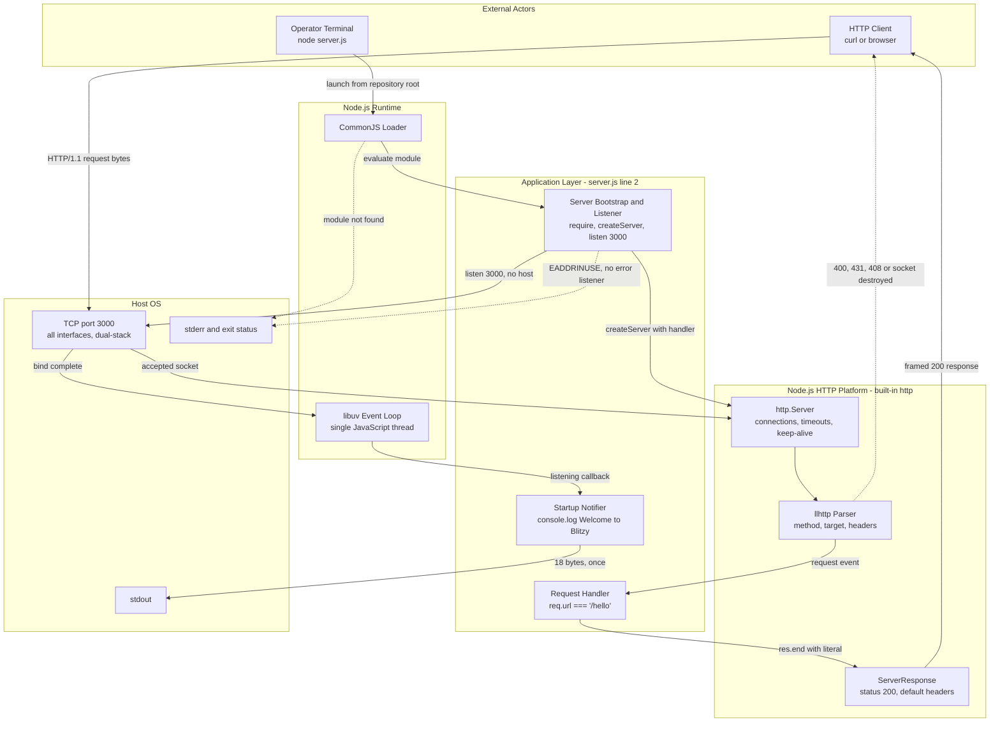
```mermaid
flowchart TB
    subgraph Actors["External Actors"]
        Client["HTTP Client<br/>curl or browser"]
        Operator["Operator Terminal<br/>node server.js"]
    end
    subgraph AppLayer["Application Layer - server.js line 2"]
        Bootstrap["Server Bootstrap and Listener<br/>require, createServer, listen 3000"]
        Handler["Request Handler<br/>req.url === '/hello'"]
        Notifier["Startup Notifier<br/>console.log Welcome to Blitzy"]
    end
    subgraph PlatformLayer["Node.js HTTP Platform - built-in http"]
        HttpServer["http.Server<br/>connections, timeouts, keep-alive"]
        Parser["llhttp Parser<br/>method, target, headers"]
        Response["ServerResponse<br/>status 200, default headers"]
    end
    subgraph RuntimeLayer["Node.js Runtime"]
        Loader["CommonJS Loader"]
        EventLoop["libuv Event Loop<br/>single JavaScript thread"]
    end
    subgraph HostLayer["Host OS"]
        TcpPort["TCP port 3000<br/>all interfaces, dual-stack"]
        StdOut["stdout"]
        StdErr["stderr and exit status"]
    end
    Operator -->|"launch from repository root"| Loader
    Loader -->|"evaluate module"| Bootstrap
    Loader -.->|"module not found"| StdErr
    Bootstrap -->|"createServer with handler"| HttpServer
    Bootstrap -->|"listen 3000, no host"| TcpPort
    Bootstrap -.->|"EADDRINUSE, no error listener"| StdErr
    TcpPort -->|"bind complete"| EventLoop
    EventLoop -->|"listening callback"| Notifier
    Notifier -->|"18 bytes, once"| StdOut
    Client -->|"HTTP/1.1 request bytes"| TcpPort
    TcpPort -->|"accepted socket"| HttpServer
    HttpServer --> Parser
    Parser -->|"request event"| Handler
    Parser -.->|"400, 431, 408 or socket destroyed"| Client
    Handler -->|"res.end with literal"| Response
    Response -->|"framed 200 response"| Client
```

### 5.2.8 State Transition Diagram

Figure 5.2.8 combines two levels of state. The outer states are the process lifecycle. The composite `Serving` state holds the lifecycle of one connection; many connections cycle through it at once, all on the same event loop. Node.js owns every state, and the application adds none. Sections 4.3.1, 4.4.5.1 and 4.4.5.2 give the transition tables and separate diagrams.

```mermaid
stateDiagram-v2
    [*] --> Loading: node server.js
    Loading --> ExitedError: module not found, exit 1
    Loading --> Binding: createServer then listen 3000
    Binding --> ExitedError: EADDRINUSE unhandled, exit 1
    Binding --> Serving: listening event, welcome printed
    state Serving {
        [*] --> AwaitingConnection
        AwaitingConnection --> ParsingRequest: socket accepted
        ParsingRequest --> HandlingRequest: request event
        ParsingRequest --> RejectedByPlatform: 400, 431, 408 or CONNECT
        HandlingRequest --> ResponseEnded: res.end literal
        ResponseEnded --> IdleKeepAlive: HTTP/1.1 keep-alive
        ResponseEnded --> ConnectionClosed: HTTP/1.0 or Connection close
        IdleKeepAlive --> ParsingRequest: next request
        IdleKeepAlive --> ConnectionClosed: idle about 6 s
        RejectedByPlatform --> ConnectionClosed
        ConnectionClosed --> AwaitingConnection
    }
    Serving --> StoppedSIGINT: Ctrl+C, exit 130
    Serving --> StoppedSIGTERM: kill pid, exit 143
    ExitedError --> [*]
    StoppedSIGINT --> [*]
    StoppedSIGTERM --> [*]
```

### 5.2.9 Sequence Diagrams

Both diagrams follow a flow through the architectural layers. Section 4.4.4 covers the same flows from the learner's point of view.

#### 5.2.9.1 Request Processing Across Layers

```mermaid
sequenceDiagram
    autonumber
    participant Client as HTTP Client
    participant Tcp as Host TCP port 3000
    participant Srv as http.Server and llhttp
    participant Handler as Request Handler
    participant Resp as ServerResponse
    Client->>Tcp: TCP connect
    Tcp->>Srv: accepted socket
    Client->>Srv: request line, headers, optional body
    alt malformed, oversized or stalled headers
        Srv-->>Client: 400, 431 or 408 with Connection close
    else CONNECT method
        Srv-->>Client: socket destroyed, 0 bytes
    else dispatched method
        Srv->>Handler: request event with req and res
        alt req.url is exactly /hello
            Handler->>Resp: res.end('Hello world')
        else any other target
            Handler->>Resp: res.end('')
        end
        Resp->>Resp: status 200, Date, Connection, Keep-Alive, Content-Length
        Resp-->>Client: HTTP/1.1 200 OK, 11 or 0 byte body
        Note over Client,Srv: Keep-Alive timeout=5 - socket reused or closed after idle
    end
```

#### 5.2.9.2 Startup and Readiness Across Layers

```mermaid
sequenceDiagram
    autonumber
    actor Operator
    participant Loader as CommonJS Loader
    participant App as Server Bootstrap
    participant Srv as http.Server
    participant OS as Host OS TCP
    participant Out as stdout and stderr
    Operator->>Loader: node server.js
    alt server.js not in working directory
        Loader-->>Out: Cannot find module stack trace
        Loader-->>Operator: exit 1
    else module resolved
        Loader->>App: evaluate line 2
        App->>Srv: require('http').createServer(handler)
        App->>Srv: listen(3000, callback)
        Srv->>OS: bind and listen on all interfaces
        alt port 3000 free
            OS-->>Srv: bound
            Srv->>App: listening event
            App->>Out: Welcome to Blitzy on stdout
            Note over Operator,Out: Readiness - requests accepted from here on
        else port 3000 in use
            OS-->>Srv: EADDRINUSE
            Srv-->>Out: unhandled error event stack trace on stderr
            Srv-->>Operator: exit 1, stdout empty
        end
    end
```

## 5.3 Technical Decisions

Almost every decision below was made by the AAP, not chosen during implementation. The constraints C-1 to C-6 (Section 2.6.3) remove the usual options, so each entry records the choice, the constraint behind it, and the cost the system accepts. `Project Guide.md` §5.2 records the costs that were reviewed as divergences D2 to D5.

### 5.3.1 Architecture Style Decisions and Tradeoffs

| Decision Area | Choice | Excluded Option and Reason | Tradeoff Accepted |
|---|---|---|---|
| Code structure | One chained statement with two anonymous arrow callbacks | Named functions or modules, excluded by C-1 and C-3 | Readable at a glance and verifiable byte for byte, but has no extension points |
| Process model | One process, one JavaScript thread | `cluster` or worker threads, excluded by C-3 (no added code) | Nothing to coordinate; uses one CPU core |
| HTTP stack | Node.js built-in `http` | Any third-party framework, excluded by C-5 | No install and no third-party supply chain; no router, middleware or content negotiation |
| Configuration | Literals in source | Environment variables or a config file, excluded by C-6 | Nothing to set up; a port collision cannot be avoided without editing code (D3) |
| Routing | One strict equality on `req.url`; empty 200 for everything else | A router or a 404 response, excluded by AAP 0.6.3 and C-3 | One comparison per request; path variants fail silently with an empty page |
| Error handling | Platform defaults; fail fast at startup | `'error'`, `'clientError'` and `'connect'` listeners, excluded by C-3 | Fewest lines; operators see raw stack traces, and CONNECT/PRI never reach the handler (D2) |

Scalability follows from these choices: one instance per host, one core per instance, no shared state. That is enough for the learner workload. The verified load (200 parallel requests, then 100/100 mixed) was answered in full (`Project Guide.md` §3). Anything larger is a new scope (`Project Guide.md` §8).

### 5.3.2 Communication Pattern Choices

| Path | Pattern Chosen | Justification | Implication |
|---|---|---|---|
| Client to server | Synchronous HTTP/1.1 request–response over plain TCP | The tutorial teaches the basic Node.js request cycle; `curl` and a browser are the only clients (`README.md` line 5) | No TLS, HTTP/2 or WebSocket upgrade. Traffic is cleartext |
| Connection reuse | Node.js default keep-alive, `Keep-Alive: timeout=5`; pipelining | Platform default; no configuration allowed (C-3) | Sockets stay open about 6 s after the last response; pipelined requests are answered in order |
| Platform to application | In-process `EventEmitter` callbacks (`'request'`, `'listening'`) | The native Node.js model; no extra abstraction | No queue or back-pressure handling beyond the event loop |
| Application to operator | One stdout line as the readiness signal | FR-2: printed once, only after the bind | No health endpoint. The guide's verification steps use a `curl` to `/hello` as the de facto liveness check (`Project Guide.md` §9.5) |
| Outbound | None | No external service in scope (`Project Guide.md` §1.5) | No retries, timeouts or circuit breakers needed |

### 5.3.3 Data Storage Solution Rationale

The system has no storage, by design:

- **No data to keep.** Both response bodies are literals fixed by AAP 0.6.3. The system takes no user input that could be stored, because the handler reads only `req.url`.
- **No configuration to store.** Port, path and messages are literals (C-6; `Project Guide.md` Appendix E).
- **Consequences.** Nothing needs backup, migration, schema or encryption at rest, and a restart loses nothing (Section 4.3.1). The only durable artefacts are the files in Git.

### 5.3.4 Caching Strategy Justification

The system has no cache, and none is needed:

| Factor | Observation | Evidence |
|---|---|---|
| Cost of generating a response | One string comparison and a constant literal (11 B or 0 B); there is nothing to save | `server.js` line 2 |
| Cache headers | No `Cache-Control`, `ETag` or `Last-Modified` is sent, so conditional requests are not supported and client caching is left to client defaults | `Project Guide.md` §3 |
| Server-side cache | No in-memory or external cache; no variables exist | Section 4.3.1 |
| Reuse that does exist | Keep-alive connection reuse at the transport layer, from the platform default | `Project Guide.md` §4 |

### 5.3.5 Security Mechanism Selection

Security was deliberately left at Node.js defaults. The guide records this as the sanctioned divergence D3, which follows the refinement's no-hardening direction in AAP 0.1.2 and 0.8.2.

| Mechanism | Selection in This System | Source |
|---|---|---|
| Transport security | None; plain HTTP | `Project Guide.md` Appendix B |
| Authentication and authorization | None | `Project Guide.md` §4 |
| Network exposure | All-interface bind (`*:3000`); a loopback-only bind would need an AAP amendment | `Project Guide.md` §5.2 D3, §6 |
| Input handling | llhttp rejects malformed, oversized and stalled requests (400, 431, 408). The handler reads only `req.url` and echoes nothing, so CRLF and script payloads cannot be reflected | `Project Guide.md` §1.3, §3 |
| Response headers | No security headers and no `Content-Type`. No `Server` or `X-Powered-By` header, so no version is disclosed | `Project Guide.md` §1.3, §5.2 D3 |
| Resource limits | Node.js defaults only; no connection, rate or idle cap | `Project Guide.md` §5.2 D3, §6 |
| Supply chain | No third-party code. The unpinned Node.js runtime is the only surface | `Project Guide.md` §5.2 D4 |
| Secrets | None read; no credentials or environment variables | `Project Guide.md` §1.5, Appendix E |

These mechanisms are only adequate on a trusted network. For the accepted risks, the guide's mitigations are a trusted network or a host firewall, and a limit-enforcing reverse proxy in front of any deployment. Any public deployment needs a new scope covering binding, limits, headers and error handling (`Project Guide.md` §6, §8).

### 5.3.6 Decision Tree

Figure 5.3.6 shows how the constraints narrow each architectural choice to one option.

```mermaid
flowchart TD
    Start(["Goal: minimal Node.js HTTP<br/>tutorial for a learner's machine"]) --> Q1{"Third-party<br/>packages allowed?"}
    Q1 -->|"No - C-5"| D1["Built-in http module<br/>CommonJS, no package.json"]
    D1 --> Q2{"More than one<br/>statement allowed?"}
    Q2 -->|"No - C-1, C-3"| D2["One chained statement<br/>two inline arrow callbacks"]
    D2 --> Q3{"Configuration or<br/>environment variables?"}
    Q3 -->|"No - C-6"| D3["Literals: port 3000, /hello,<br/>both messages"]
    D3 --> Q4{"Routes beyond<br/>one path?"}
    Q4 -->|"No - AAP 0.6.3"| D4["Strict equality on req.url<br/>empty 200 fallback, no 404"]
    D4 --> Q5{"Error listeners, headers<br/>or hardening allowed?"}
    Q5 -->|"No - C-3"| D5["Node defaults for headers, timeouts,<br/>parser errors and bind address"]
    D5 --> Q6{"Persistence or<br/>caching needed?"}
    Q6 -->|"No - constant bodies"| D6["No store, no cache"]
    D6 --> Q7{"Where will it run?"}
    Q7 -->|"Learner machine,<br/>trusted network"| Accept(["Accepted: local tutorial"])
    Q7 -->|"Shared or public network"| Rescope(["Out of scope: new scope for binding,<br/>limits, headers, error handling"])
```

### 5.3.7 Architecture Decision Records

The repository holds no ADR files. The records below are reconstructed from the code, the AAP clauses cited in `Project Guide.md`, and its divergence log. All ten were delivered and merged into `main` in `04b7b44` (2026-10-01). Owner sign-off is not recorded in the repository (assumption A-6). ADR-07 holds only for the local-tutorial target; any public-deployment scope supersedes it.

| ADR | Decision | Drivers | Consequences |
|---|---|---|---|
| ADR-01 | Single-process, single-statement monolith in `server.js` | C-1, C-3; AAP 0.1.2, 0.9.1 | Byte-for-byte verifiable. Any new capability needs a new scope |
| ADR-02 | Node.js built-in `http`; no framework | C-5 | No install step or third-party code; no router or middleware |
| ADR-03 | CommonJS `require` with no `package.json` | C-5; no manifest needed | No `engines`, `scripts` or `"type"` field; Node.js loads `.js` as CommonJS by default |
| ADR-04 | Literal port, path and messages | C-6 | No set-up. Port fixed at 3000, so one instance per host |
| ADR-05 | Exact-match, method-agnostic routing with an empty-200 fallback | AAP 0.6.3 | No 404. CONNECT/PRI never reach the handler, and HEAD has no body (D2) |
| ADR-06 | Readiness line in the `listen` callback | FR-2 | Guaranteed after-bind ordering; nothing printed on a failed bind |
| ADR-07 | Platform-default security; no hardening | C-3; AAP 0.1.2, 0.8.2 (sanctioned D3) | All-interface bind, no caps, no security headers, raw `EADDRINUSE`. Unsafe beyond localhost |
| ADR-08 | No Node.js version pin | C-4; AAP 0.3.1 | Learners may run an end-of-life runtime. D4 is open; guidance lives outside the repository |
| ADR-09 | No in-repository tests; verification runs outside the tree | C-2; AAP 0.8.2 | No regression suite (risk Low/Medium). Every change is re-verified with `node --check` and the package gate |
| ADR-10 | No storage and no cache | AAP 0.6.3 constant bodies | Nothing to back up or invalidate; restart is lossless |

Figure 5.3.7 traces each record from its driver to its recorded consequence.

```mermaid
flowchart LR
    subgraph Drivers["Governing Constraints and Requirements"]
        K1["C-1 exact content<br/>AAP 0.9.1"]
        K2["C-2 two-file scope<br/>AAP 0.8.2"]
        K3["C-3 no handlers, headers,<br/>config or hardening"]
        K4["C-4 no version pin<br/>AAP 0.3.1"]
        K5["C-5 built-ins only"]
        K6["C-6 literals only"]
        K7["AAP 0.6.3<br/>HTTP contract"]
        K8["FR-2 welcome<br/>once listening"]
    end
    subgraph Records["Architecture Decision Records"]
        R1["ADR-01 single process,<br/>single statement"]
        R2["ADR-02 built-in http,<br/>no framework"]
        R3["ADR-03 CommonJS,<br/>no manifest"]
        R4["ADR-04 literal<br/>configuration"]
        R5["ADR-05 exact-match routing,<br/>empty 200 fallback"]
        R6["ADR-06 readiness in<br/>listen callback"]
        R7["ADR-07 platform-default<br/>security"]
        R8["ADR-08 no runtime pin"]
        R9["ADR-09 verification<br/>outside the tree"]
        R10["ADR-10 no storage<br/>or cache"]
    end
    subgraph Outcomes["Recorded Consequences"]
        O1["D2 CONNECT and PRI<br/>never reach handler"]
        O2["D3 all-interface bind,<br/>no caps, raw EADDRINUSE"]
        O3["D4 learners may run<br/>an end-of-life runtime"]
        O4["No regression suite<br/>risk Low / Medium"]
        O5["One instance per host"]
        O6["Restart loses nothing"]
    end
    K1 --> R1
    K3 --> R1
    K5 --> R2
    K5 --> R3
    K6 --> R4
    K7 --> R5
    K8 --> R6
    K3 --> R7
    K4 --> R8
    K2 --> R9
    K7 --> R10
    R5 --> O1
    R7 --> O2
    R4 --> O5
    R8 --> O3
    R9 --> O4
    R10 --> O6
```

## 5.4 Cross-Cutting Concerns

`server.js` implements no cross-cutting mechanism of its own. Each concern below is answered by a Node.js default, by a manual procedure in `Project Guide.md` §9, or by a deliberate absence under constraint C-3 (no handlers, headers, configuration or hardening). Section 1.3.2 lists logging, monitoring and authentication as out of scope.

### 5.4.1 Monitoring and Observability Approach

No monitoring is built in: no metrics, no health endpoint, no telemetry agent, no alerting. All observation happens from outside the process, by hand.

| Signal | Available | Mechanism | Evidence |
|---|---|---|---|
| Readiness | Yes | The `Welcome to Blitzy` line on stdout, printed once after the bind | `server.js` line 2 |
| Liveness | Indirectly | `curl -s http://localhost:3000/hello` expecting `Hello world`, or `curl -w '%{http_code} %{size_download}'` expecting `200 11` | `Project Guide.md` §9.5, Appendix F |
| Listener presence | Indirectly | `ss -ltnp 'sport = :3000'` or `lsof -ti :3000` | `Project Guide.md` §9.5, Appendix A |
| Process status | Indirectly | The pid captured with `$!` in background mode, and the exit status | `Project Guide.md` §9.4 |
| Header and disclosure check | Indirectly | `curl -s -D - -o /dev/null http://localhost:3000/hello`, expecting only the four default headers | `Project Guide.md` Appendix F |
| Request metrics (count, latency, error rate) | No | — | `server.js` line 2 |
| Resource metrics and alerting | No | Host tools only; nothing configured in the repository | Repository contents |

Implication: an outage or a rejected request shows up only to whoever is watching the terminal or running the client. Adding probes, metrics or alerts would change `server.js` and needs a new scope (`Project Guide.md` §8).

### 5.4.2 Logging and Tracing Strategy

The process emits exactly one log event in its lifetime. It uses no logging framework, levels or structured format.

| Event | Channel | Format | Persisted |
|---|---|---|---|
| Startup success | stdout | `Welcome to Blitzy\n`, 18 B, no ANSI codes | Only if redirected |
| Fatal startup error (missing module, `EADDRINUSE`) | stderr | Node.js default uncaught-error stack trace | Only if redirected |
| Request served | None | — | No |
| Request rejected by the platform (400, 431, 408, CONNECT) | None on the server; the status reaches the client only | — | No |

- **Silence under traffic.** After the full assertion run, stdout is still 18 B and stderr is empty (`Project Guide.md` §3). The local checks gave the same result after the parser-rejection probes and a 5 000-request load.
- **Retention.** The only retention mechanism is the guide's background mode, `nohup node server.js > "$d/server.log" 2>&1 &`, which writes to a `mktemp -d` folder (`Project Guide.md` §9.4).
- **Tracing.** No correlation IDs, trace headers or distributed tracing. None is needed: the system is one process with no outbound calls.
- **Privacy.** No request path, header, body or client address is ever written out (Section 2.4.4).

### 5.4.3 Error Handling Patterns

`server.js` has no `try`/`catch` and no `'error'`, `'clientError'` or `'connect'` listener (Section 4.3.2). Errors are handled through these patterns:

| Pattern | Applies To | Behaviour | Evidence |
|---|---|---|---|
| Delegated platform response | Malformed, oversized or stalled requests (E-3 to E-5) | llhttp and `http.Server` reply 400, 431 or 408 and close the connection; the handler is never called | `Project Guide.md` §3; Section 4.3.2 |
| Silent drop | CONNECT (E-6) | Socket destroyed with 0 bytes | `Project Guide.md` §4, §5.2 D2 |
| Null-response fallback | Any target other than exactly `/hello` (E-9) | 200 with an empty body; never 404 | `server.js` line 2 |
| Fail-fast termination | Missing module or busy port (E-1, E-2) | Uncaught error: stderr stack trace and exit 1 | `Project Guide.md` §4 |
| Fault isolation | All request-level faults | One bad request does not disturb other connections: after a 431 or a CONNECT, the next `/hello` returns `200 11` | `Project Guide.md` §3, §4 |
| Manual retry | Every recoverable fault | No retry loop, backoff, supervisor or auto-restart. The operator fixes the cause and reruns | Section 4.3.2 |

Section 4.3.2 holds the full error catalog (E-1 to E-10). Figures 4.4.3.1 to 4.4.3.3 give the learner-facing recovery flows. Figure 5.4.3 maps each fault to the component that handles it and its outcome.

```mermaid
flowchart TD
    Origin{"Where does the<br/>fault arise?"}
    Origin -->|"process start"| StartKind{"Startup fault"}
    StartKind -->|"server.js not in cwd"| E1["CommonJS loader throws<br/>Cannot find module"]
    StartKind -->|"port 3000 taken"| E2["http.Server emits error<br/>no listener registered"]
    E1 --> Fatal["Uncaught: stack trace on stderr<br/>exit 1, stdout empty"]
    E2 --> Fatal
    Fatal --> Manual["Operator fixes cause:<br/>cd to repo root or free port"]
    Manual --> Rerun(["Rerun node server.js"])
    Origin -->|"request bytes"| ParseKind{"llhttp and http.Server<br/>outcome"}
    ParseKind -->|"bad syntax, method token<br/>or missing Host"| R400["400 Bad Request<br/>Connection close"]
    ParseKind -->|"headers over 16 384 B"| R431["431, connection closed"]
    ParseKind -->|"headers incomplete 60 s"| R408["408 Request Timeout"]
    ParseKind -->|"CONNECT"| RDrop["Socket destroyed<br/>0 bytes"]
    ParseKind -->|"valid, dispatched"| Route{"req.url exactly<br/>/hello ?"}
    Route -->|"yes"| Ok["200 Hello world"]
    Route -->|"no"| Fallback["200 empty body<br/>null-response fallback"]
    R400 --> Continue(["Server keeps serving<br/>nothing logged"])
    R431 --> Continue
    R408 --> Continue
    RDrop --> Continue
    Origin -->|"operator signal"| SigKind{"Signal"}
    SigKind -->|"SIGINT"| X130(["exit 130, port freed"])
    SigKind -->|"SIGTERM"| X143(["exit 143, port freed"])
    Origin -->|"client side"| ClientKind{"Client fault"}
    ClientKind -->|"connection refused"| C7["curl 7 Failed to connect<br/>wait for Welcome to Blitzy"]
    ClientKind -->|"PowerShell curl alias"| CPs["Use curl.exe"]
```

PRI is left out of the figure because the sources disagree on its outcome (Section 5.2.4; Section 4.3.2, E-7).

### 5.4.4 Authentication and Authorization Framework

The system has no authentication or authorization framework. Every request is anonymous. Nothing checks identity, credentials, sessions, tokens or roles, and nothing is configured for them (`Project Guide.md` §4, §1.5). Network reachability is the only access control.

| Aspect | State | Consequence | Evidence |
|---|---|---|---|
| Identity and credentials | None read or stored | No secrets to manage or leak | `Project Guide.md` §1.5, Appendix E |
| Access scope | Any host that can reach port 3000 | With the all-interface bind, machines on the same network can call the endpoint | `Project Guide.md` §5.2 D3 |
| Data exposure | Constant public strings only | Unauthenticated access discloses nothing beyond `Hello world` | `server.js` line 2 |
| Mitigation (guide) | Trusted network or host firewall; a reverse proxy in front of any deployment | Applied outside the repository | `Project Guide.md` §6 |

Adding an identity layer or a loopback-only bind would change the exact content of `server.js`. It needs an AAP amendment and a new scope (`Project Guide.md` §6, §8).

### 5.4.5 Performance Requirements and SLAs

The repository defines no latency, throughput or availability SLA or SLO (Section 2.4). The table separates the verified results from the guide's test host and the indicative local measurements.

| Metric | Target | Observed | Source |
|---|---|---|---|
| Correctness under concurrency | Every request answered (AAP deliverable #5) | 200 parallel requests and a 100/100 mixed load, all correct; 400 requests in total | `Project Guide.md` §3, §5.1 item 5 |
| Startup to readiness | None | Welcome line about 43 ms after launch | Local check, Node v22.23.3 |
| Request latency | None | About 3.8 ms for the first `curl` to `/hello`, then about 0.4–0.5 ms | Local check, Node v22.23.3 |
| Throughput | None | 5 000/5 000 correct keep-alive requests over 50 sockets in 270 ms (about 18 500 req/s), one run | Local check, Node v22.23.3 |
| Memory footprint | None | About 47 MB RSS idle and about 60 MB after that load; 7 OS threads | Local check, Node v22.23.3 |
| Availability | None | Exactly one manually started instance per host; no restart policy | `server.js` line 2; Section 4.3.2 |

The local figures come from one development host and a different patch release from the guide's v22.23.2. They indicate the order of magnitude only and are not requirements.

These factors set the performance limits:

- **Single thread.** All parsing, dispatch and response writing share one JavaScript thread, so throughput is capped by one CPU core.
- **No admission control.** With `maxConnections` unset and `timeout` 0, an exposed server has no defence against connection or slow-client exhaustion (risk Medium/Low; `Project Guide.md` §6).
- **Platform timeouts.** `headersTimeout` 60 s, `requestTimeout` 300 s and `keepAliveTimeout` 5 s set how long a socket can be held (Section 5.2.4).
- **Fixed port.** Horizontal scaling on one host is impossible without a code change (ADR-04).

### 5.4.6 Disaster Recovery Procedures

The system is stateless, so disaster recovery comes down to restoring the source files and the runtime, then restarting. No recovery time or recovery point objective is defined, and no backups, replicas, supervisor or failover are configured. The authoritative copy is the `main` branch on the GitHub `origin` remote, which includes merge commit `04b7b44` (Section 3.6.4).

| Scenario | Recovery Procedure | Data Loss | Source |
|---|---|---|---|
| Process crash, terminal closed or host reboot | Rerun `node server.js` from the repository root and wait for `Welcome to Blitzy` | None; no state | `README.md` line 4; Section 4.3.1 |
| Port 3000 held by another process | Run `lsof -ti :3000`. Stop the process only if it is your own server, then restart | None | `Project Guide.md` §9.7 |
| Started from the wrong directory | `cd` to the folder containing `server.js` and rerun | None | `Project Guide.md` §9.7 |
| Local files changed or corrupted | Restore the delivered bytes from Git and confirm `git diff` against the delivered commit is empty | None | `Project Guide.md` Appendix F |
| Local checkout lost | Clone `main` from `origin`, then run `node --check server.js` and the isolated package gate | None | `Project Guide.md` §9.5; Section 3.6.4 |
| Runtime missing, broken or end-of-life | Install a maintained Node.js release (24 LTS recommended; not below 22.23.2 / 24.18.1 / 26.5.1) and rerun the README walkthrough | None | `Project Guide.md` §5.2 D4, §9.1 |
| Background instance orphaned | `kill "$pid"` using the pid captured at start | None | `Project Guide.md` §9.4 |

Every procedure ends with the same acceptance check: `curl http://localhost:3000/hello` returns `Hello world` (`README.md` line 5).

## 5.5 References

**Repository files and folders**

- `server.js` - Line 1: the JSDoc summary. Line 2: the single statement holding the Request Handler, the Server Bootstrap and Listener (`require('http')`, `createServer`, `listen(3000)`) and the Startup Notifier. Shows the absence of error listeners, configuration, state and dependencies
- `README.md` - Learner Guide: Node.js prerequisite (line 3), start command and readiness output (line 4), `curl` acceptance check (line 5). Its literals are change-coupled to `server.js`
- `blitzy/documentation/Project Guide.md` - Project Status Report. Cited for: scope and target environment (§1.1); accomplishments and open issues (§1.3, §1.4); access and external services (§1.5); verification evidence (§2.1, §3, §4); compliance matrix (§5.1); divergences D1–D5 (§5.2); risks and mitigations (§6); production readiness (§8); operations guide covering prerequisites, startup, verification, package gate and troubleshooting (§9.1–§9.7); command and port references, versions, environment variables, developer tools and glossary (Appendices A, B, D, E, F, G)
- `blitzy/documentation/` - Folder holding the Project Status Report, its only file
- `blitzy/` - Folder holding only `blitzy/documentation/`; takes no part in the runtime
- `` (repository root) - Shows the three-file tracked tree with no manifest, lockfile, container, CI, infrastructure or `.blitzyignore` file; the source for the git history (`6cb007c` to `04b7b44`) and the GitHub `origin` remote

**Technical Specification cross-references**

- Section 1.2 System Overview - integration-surface table, process-level component flowchart, design-choice table
- Section 2.4 Implementation Considerations - per-feature constraints, statement that no SLA is defined, `http.Server` defaults
- Section 2.6 Assumptions, Constraints and Requirement Versioning - assumptions A-1 to A-7, constraints C-1 to C-6
- Section 3.6 Development & Deployment - change workflow, deployment and operation model, source control
- Section 4.3 Technical Implementation - process and connection state tables, persistence points, error catalog E-1 to E-10, recovery procedures
- Section 4.4 Required Diagrams - Figures 4.4.3.1–4.4.3.3, 4.4.4 and 4.4.5.1–4.4.5.2, referenced for learner-level flows

**Local runtime checks** (a copy of `server.js` run outside the repository on Node v22.23.3 with llhttp 9.4.3, not the guide's v22.23.2 host)

- Listener on `::` port 3000 with `net.ipv6.bindv6only` = 0 (dual-stack); IPv4 requests served
- Idle footprint about 47 MB RSS with 7 threads; about 60 MB after 5 000 keep-alive requests over 50 sockets in 270 ms, all correct
- First-request latency about 3.8 ms, then about 0.4–0.5 ms; stdout stays 18 B and stderr empty under load; SIGTERM stops the process and frees the port
- Earlier checks carried into Sections 2 to 4: absolute-form target, HTTP/1.0 framing, pipelining, `Upgrade` handling, 1 MB POST, HEAD headers, parser rejections (400, 431, 408), CONNECT and PRI outcomes, keep-alive idle close at about 6 s, about 43 ms to readiness

# 6. SYSTEM COMPONENTS DESIGN

## 6.1 Core Services Architecture

### 6.1.1 Applicability Statement

**Core Services Architecture is not applicable for this system.**

The system is one Node.js process running one CommonJS statement (`server.js` line 2). It has no microservices, no distributed components and no separately deployable services. The repository defines no second process, no service-to-service call, no deployment topology and no orchestration layer. The target is "a learner's own machine, not a network-facing service" (`blitzy/documentation/Project Guide.md` §1.1).

#### Evidence for the Determination

| Criterion | Finding in This System | Evidence |
|---|---|---|
| Deployable units | One: `node server.js`, started by hand. The repository has no `Dockerfile`, compose file, Kubernetes manifest, IaC, `Procfile` or process-manager configuration | `README.md` line 4; repository root; Sections 3.6.3, 3.6.5 |
| Process and thread model | One process with one JavaScript thread. `server.js` makes no use of `cluster`, `worker_threads`, `child_process` or `reusePort` | `server.js` line 2; Section 5.3.1 |
| Network endpoints | One inbound listener on TCP port 3000, all interfaces. In a local check at idle, the process held exactly one socket: the listener on `[::]:3000` | `Project Guide.md` Appendix B; local check, Node v22.23.3 |
| Outbound dependencies | None. No databases, external APIs, identity providers or monitoring services | `Project Guide.md` §1.5; Section 5.1.4 |
| Shared state | None. The handler is stateless, with no store and no cache | Sections 4.3.1, 5.3.3 |
| Configuration and discovery inputs | None. Port, path and messages are literals, and no environment variable is read | `Project Guide.md` Appendix E |
| Intended exposure | Local tutorial only. Any public deployment needs a new scope | `Project Guide.md` §8 |

#### Why Services Cannot Be Introduced Under the Current Scope

The governing constraints forbid the code a service architecture needs:

- **C-1** fixes the exact file contents.
- **C-3** forbids handlers, headers, configuration and hardening.
- **C-5** limits the code to built-in modules.
- **C-6** requires literal configuration (Section 2.6.3).

The resulting decisions are ADR-01 (single-process, single-statement monolith), ADR-04 (literal port, so one instance per host) and ADR-07 (platform-default security), all in Section 5.3.7. The single process is therefore the only "service". Every pattern this section's template names is either absent or supplied by a Node.js default.

#### How the Remaining Sub-sections Are Organised

Sections 6.1.2 to 6.1.4 take each template topic in turn. Each records what the single-process design does in its place, so readers can see what exists today and what a re-scope would have to add.

| Topic Area | Status in This System | Detail |
|---|---|---|
| Service components | Not applicable. One process; components are separated by responsibility, not by process | Section 6.1.2 |
| Scalability design | One instance per host and one CPU core per instance, with no auto-scaling | Section 6.1.3 |
| Resilience patterns | The platform isolates request-level faults. Process-level recovery is a manual, lossless restart | Section 6.1.4 |

#### Re-evaluation Triggers

This section becomes applicable only if a new scope introduces at least one of the following:

| Trigger | Effect on This Section | Source |
|---|---|---|
| Public or shared-network deployment | Binding, limits, headers and error handling must be re-scoped before exposure | `Project Guide.md` §5.2 D3, §8 |
| A limit-enforcing reverse proxy in front of the server | Adds a second component and a network hop. Load balancing, health checking and upstream timeouts then become relevant | `Project Guide.md` §6 |
| More than one instance per host | Needs a configurable port or port sharing, which C-6 and ADR-04 exclude | Sections 2.6.3, 5.3.7 |
| An outbound dependency such as a database or external API | Brings timeouts, retries and circuit breaking into scope. None is needed today because nothing is called | Section 5.3.2 |

### 6.1.2 Service Components

The Node.js process is the only service. Its components, defined in Section 5.1.2, are separated by responsibility inside one statement, not by process or network. No traffic passes between services because only one exists.

#### Service Boundaries and Responsibilities

| Boundary | Contents | What Crosses It | Evidence |
|---|---|---|---|
| Process boundary (the single service) | Request Handler, Server Bootstrap and Listener, and Startup Notifier at `server.js` line 2, hosted by the Node.js HTTP Platform and Node.js Runtime | Inbound HTTP/1.1 on TCP 3000; CLI launch and signals; the stdout readiness line; the stderr trace and exit status | Sections 5.1.1, 5.1.2 |
| Application and platform (in-process) | The application callbacks above; `http.Server`, llhttp and `ServerResponse` below | The `'request'` and `'listening'` events; `res.end(literal)` | Section 5.2.7 |
| Host | The process and the OS TCP stack | A bind on `::` port 3000, dual-stack | `Project Guide.md` Appendix B |
| Repository, not runtime | `README.md` and `blitzy/documentation/Project Guide.md` | Nothing at runtime; documentation only | Section 5.2.6 |

#### Service Pattern Assessment

| Pattern | Status | What Exists Instead | Evidence |
|---|---|---|---|
| Inter-service communication | Not applicable | There is no second service. Clients reach the server through synchronous HTTP/1.1 with keep-alive and in-order pipelining. The platform reaches the application through in-process `EventEmitter` callbacks | Sections 5.1.3, 5.3.2 |
| Service discovery | None | The address is a literal: the port is set in `server.js` line 2, and `README.md` line 5 publishes `http://localhost:3000/hello`. No registry, DNS record or environment variable is involved | `Project Guide.md` Appendix E |
| Load balancing | None | One listener per host. The libuv event loop multiplexes every connection on one thread, and keep-alive reuses sockets (`Keep-Alive: timeout=5`). The guide mentions a reverse proxy only as a limit-enforcing front for a future deployment | `Project Guide.md` §6; Section 5.2.2 |
| Circuit breaker | None, and none is needed outbound | There are no outbound calls to protect. On the inbound side nothing trips or sheds load, because `maxConnections` is unset. The parser rejections (400, 431, 408) guard individual requests; they are not breakers | Sections 5.2.4, 5.3.2 |
| Retry | None in code | No retry loop, backoff or auto-restart. Every retry is manual: rerun `node server.js` or the client command | Section 4.3.2 |
| Fallback | One functional fallback | Any target other than exactly `/hello` gets 200 with an empty body (F-002). Fatal startup errors have no fallback and exit 1 | `server.js` line 2; Section 4.3.2 |

#### Service Interaction Diagram

Figure 6.1.2 shows the complete interaction surface. Solid edges are the only interactions that exist. Crossed dashed edges point to patterns with no artefact in the repository. Section 5.2.7 has the layer-by-layer component view.

```mermaid
flowchart LR
    subgraph Callers["Inbound Callers - learner machine or trusted network"]
        Client["HTTP Client<br/>curl or browser"]
        Operator["Operator Terminal"]
    end
    subgraph Unit["Single Deployable Unit - one node server.js process"]
        subgraph Platform["Node.js HTTP Platform - built-in http"]
            Listener["Listener on port 3000<br/>all interfaces, dual-stack"]
            Parser["llhttp parser and<br/>http.Server defaults"]
        end
        subgraph AppCode["Application Code - server.js line 2"]
            Handler["Request Handler<br/>req.url === '/hello'"]
            Notifier["Startup Notifier<br/>console.log"]
        end
    end
    subgraph Absent["Not Present - no artefact in the repository"]
        LB["Load balancer or<br/>reverse proxy"]
        Registry["Service registry<br/>or discovery"]
        Downstream["Downstream services,<br/>databases, external APIs"]
        Supervisor["Process supervisor<br/>or orchestrator"]
    end
    Operator -->|"launch and bind"| Listener
    Listener -->|"in-process 'listening' event"| Notifier
    Notifier -->|"stdout readiness line"| Operator
    Client -->|"HTTP/1.1 to literal address :3000"| Listener
    Listener --> Parser
    Parser -->|"in-process 'request' event"| Handler
    Handler -->|"200 with 11 or 0 byte body"| Client
    Client -.-x|"no intermediary"| LB
    Client -.-x|"no lookup"| Registry
    Handler -.-x|"no outbound calls"| Downstream
    Operator -.-x|"manual start and stop"| Supervisor
```

*Figure 6.1.2 — Service interaction: one deployable unit, inbound-only traffic, and no inter-service hops.*

### 6.1.3 Scalability Design

The system scales neither horizontally nor automatically. Its capacity is that of one process on one JavaScript thread. The repository defines no latency, throughput or availability target (Sections 2.4, 5.4.5).

#### Scaling Approach

| Aspect | Current Design | Evidence |
|---|---|---|
| Horizontal scaling on one host | Not possible as built. The port is a literal, and the code uses no `reusePort`, `cluster` or port sharing. A second instance exits 1 with `Error: listen EADDRINUSE: address already in use :::3000`, and the first keeps serving | `server.js` line 2; `Project Guide.md` §3, §4; ADR-04 |
| Horizontal scaling across hosts | Only as independent copies: each learner runs a process on their own machine. Copies share no state, and no load balancer or router connects them | `Project Guide.md` §1.1; Section 4.3.1 |
| Vertical scaling | Bounded by one CPU core. Parsing, dispatch and response writing all run on one JavaScript thread, so extra cores do not raise throughput. A faster core is the only effective vertical lever | Sections 5.3.1, 5.4.5; local check |
| Auto-scaling triggers and rules | None. The process emits no metrics that could drive scaling, and there is no orchestrator | Sections 3.6.5, 5.4.1 |

#### Scalability Architecture Diagram

Figure 6.1.3 shows the effective scaling topology: one serialised event loop per host, a second same-host instance that fails to bind, and independent copies on other hosts.

```mermaid
flowchart TB
    subgraph HostA["Learner Host A"]
        subgraph ProcA["Instance 1 - node server.js"]
            SockA["Listener on port 3000<br/>maxConnections unset"]
            ConnsA["Concurrent keep-alive sockets<br/>idle close after about 6 s"]
            LoopA["One JavaScript thread<br/>libuv event loop"]
        end
        Second["Instance 2 on the same host<br/>node server.js"]
        Fail["EADDRINUSE<br/>exit 1, stdout empty"]
        Cores["Remaining CPU cores<br/>unused by application code"]
    end
    subgraph HostB["Learner Host B"]
        ProcB["Independent copy<br/>own port 3000, shares nothing"]
    end
    ClientsA["Clients of Host A"] -->|"HTTP/1.1"| SockA
    SockA --> ConnsA
    ConnsA -->|"parse, dispatch and write<br/>serialised on one thread"| LoopA
    Second -.->|"listen 3000 again"| Fail
    LoopA -.-|"no cluster, worker threads<br/>or port sharing"| Cores
    ClientsB["Clients of Host B"] -->|"HTTP/1.1"| ProcB
```

*Figure 6.1.3 — Scalability architecture: one instance per host, one core per instance, no coordination between copies.*

#### Resource Allocation Strategy

The application allocates nothing explicitly. It sets no limits, so Node.js defaults govern every resource (Section 5.2.4).

| Resource | Allocation in Effect | Evidence |
|---|---|---|
| CPU | One JavaScript thread for all application and HTTP work; 7 OS threads in total, including runtime helpers | Section 5.2.5; local check |
| Memory | No heap limit set. About 47 MB RSS idle and about 66 MB after a 20 000-request run | Local check, Node v22.23.3 |
| Connections | `maxConnections` unset: no cap. `maxRequestsPerSocket` 0: unlimited requests per socket | `Project Guide.md` §5.2 D3; Section 5.2.4 |
| Socket time | `timeout` 0, `headersTimeout` 60 s, `requestTimeout` 300 s, `keepAliveTimeout` 5 s (idle sockets close after about 6 s) | Section 5.2.4 |
| Request size | Header blocks up to 16 384 B; anything larger gets 431. Request bodies are never read and are discarded | Sections 5.1.3, 5.2.4 |
| Ports | One: TCP 3000 | `Project Guide.md` Appendix B |

#### Performance Optimization Techniques

The design keeps per-request work minimal and uses no tuning:

- **Constant work per request.** One strict string comparison and one `res.end` with a literal; no I/O wait (Section 5.2.1).
- **No per-request logging.** stdout stays at 18 B under load (`Project Guide.md` §3; local check after 20 000 requests).
- **Connection reuse.** Platform-default keep-alive and in-order pipelining (Section 5.3.2).
- **No cache required.** Both bodies are constants (Section 5.3.4).
- **Nothing else.** No compression, clustering or timeout tuning, because C-3 forbids added configuration (Section 2.6.3).

#### Capacity Planning Guidelines

The guide verified correctness under load, not throughput. The local figures come from one development host (44 cores) running a different patch release, so they show the order of magnitude only.

| Measure | Verified (guide host, Node v22.23.2) | Indicative (local host, Node v22.23.3) |
|---|---|---|
| Concurrency correctness | 200 parallel requests and a 100/100 mixed load, all answered correctly; 400 requests in total | 20 000/20 000 correct responses over 200 keep-alive sockets |
| Throughput | Not reported | About 33 000 req/s (20 000 requests in about 0.6 s). An earlier run gave about 18 500 req/s with 5 000 requests over 50 sockets (Section 5.4.5) |
| Server CPU under load | Not reported | 0.68 core (0.43 s of CPU in 0.63 s of wall time) |
| Memory | Not reported | About 47 MB idle, about 66 MB after the run |
| Latency | Not reported | About 3.8 ms for the first request, then about 0.4–0.5 ms (Section 5.4.5) |

Guidelines supported by the evidence:

1. **Size for one learner per host.** The verified envelope is 200 parallel requests (`Project Guide.md` §3, §5.1 item 5).
2. **Treat one core as the ceiling.** No admission control protects the event loop. With `maxConnections` unset and `timeout` 0, an exposed server risks resource exhaustion (accepted risk, `Project Guide.md` §6).
3. **Do not plan multi-instance capacity on one host.** The literal port prevents it (ADR-04).
4. **Re-scope before any exposure.** For any deployment, the guide recommends a reverse proxy in front of the server to enforce limits. Public deployment needs a new scope covering binding, limits, headers and error handling (`Project Guide.md` §6, §8).

### 6.1.4 Resilience Patterns

Resilience rests on two properties. Node.js confines request-level faults to one connection, and the process is stateless, so a restart loses nothing. There is no redundancy, failover or degradation mechanism. The code contains no `'error'`, `'clientError'`, `'connect'`, `uncaughtException` or signal handler (Section 4.3.2). This is the sanctioned no-hardening posture, divergence D3 (`Project Guide.md` §5.2).

#### Resilience Pattern Assessment

| Pattern | Status | Behaviour | Evidence |
|---|---|---|---|
| Fault tolerance at request level | Provided by the platform | Malformed, oversized and stalled requests get 400, 431 or 408, and CONNECT sockets are destroyed. The handler is never called, and the next `/hello` still returns `200 11` | `Project Guide.md` §3, §4; Section 4.3.2 (E-3 to E-6) |
| Fault tolerance at process level | None | Startup faults fail fast with exit 1. A killed process stays down: in a local check after SIGKILL, clients got connection refused (`curl` exit 7) and nothing restarted the server | Section 4.3.2; local check |
| Disaster recovery | Manual and lossless | Restore the source from `main` on the GitHub `origin` remote, then rerun. No RTO or RPO is defined. Section 5.4.6 has the full scenario table | Sections 3.6.4, 5.4.6 |
| Data redundancy | Not applicable at runtime | There is no runtime data. The only durable artefacts are the source files, held in the local clone and on `origin` | Sections 5.3.3, 3.6.4 |
| Failover | None | One instance per host. A standby cannot bind the same port, and no supervisor exists to promote one | ADR-04; `Project Guide.md` §3 |
| Service degradation | None designed | No load shedding, rate limiting or reduced-function mode; `maxConnections` is unset. The empty-200 fallback is routing behaviour, not degradation | `Project Guide.md` §5.2 D3, §6 |

#### Failure Modes and Recovery

| Failure Mode | Detection | Recovery | Data Loss |
|---|---|---|---|
| Bad request (E-3 to E-6) | The client sees a 4xx status or a closed socket; the server logs nothing | None needed; service continues | None |
| Port 3000 busy at start (E-2) | stderr stack trace, exit 1, stdout empty | Run `lsof -ti :3000`, free the port, rerun | None |
| Started outside the repository root (E-1) | `Cannot find module`, exit 1 | `cd` to the folder containing `server.js` and rerun | None |
| Process stopped, crashed or killed | Clients get `curl: (7) Failed to connect`; the exit status is 130, 143 or a kill | Rerun `node server.js` and wait for `Welcome to Blitzy` | None; stateless |
| Terminal closed or host rebooted | Same as a stopped process | Same as a stopped process | None |
| Checkout lost or corrupted | Missing files, or a non-empty `git diff` against the delivered commit | Clone or restore `main`, run `node --check server.js` and the isolated package gate, then rerun | None |
| Resource exhaustion if exposed | Not detected; there is no monitoring (Section 5.4.1) | Not handled. Keep the server local, or put a limit-enforcing reverse proxy in front of it | None; no data |

Sources: `Project Guide.md` §3, §6, §9.4, §9.5, §9.7, Appendix F; Sections 4.3.2, 5.4.6; local check. In the local check, a manual restart restored identical behaviour: the welcome line printed once, `/hello` returned `200 Hello world` and `/other` returned `200` with an empty body.

#### Resilience Pattern Diagram

Figure 6.1.4 traces each fault class to its outcome and shows the manual recovery loop. Figure 5.4.3 gives the per-error handling detail, and Figure 4.4.3.1 gives the learner-facing startup recovery.

```mermaid
flowchart TD
    Serving(["Serving on port 3000<br/>single instance"])
    Serving --> Fault{"Fault class"}
    Fault -->|"malformed, oversized<br/>or stalled request"| Reject["Platform answers 400, 431 or 408<br/>or destroys the CONNECT socket"]
    Reject -->|"fault isolated to<br/>one connection"| Serving
    Fault -->|"load or slow clients<br/>beyond capacity"| NoShed["No admission control<br/>maxConnections unset, timeout 0"]
    NoShed --> Exhaust["Accepted risk: resource<br/>exhaustion if exposed"]
    Fault -->|"process killed or crashed,<br/>host rebooted"| Down["Service unavailable<br/>clients get curl 7"]
    Down --> NoSup{"Supervisor or<br/>standby instance?"}
    NoSup -->|"none configured"| Rerun["Operator reruns node server.js<br/>from the repository root"]
    Fault -->|"source files lost<br/>or corrupted"| Restore["Clone or restore main<br/>from GitHub origin"]
    Restore --> Gate["node --check and<br/>isolated package gate"]
    Gate --> Rerun
    Rerun --> Bind{"Port 3000 free?"}
    Bind -->|"no"| Busy["EADDRINUSE, exit 1<br/>free the port first"]
    Busy --> Rerun
    Bind -->|"yes"| Ready["Welcome to Blitzy printed<br/>stateless, nothing to recover"]
    Ready --> Serving
```

*Figure 6.1.4 — Resilience pattern implementation: platform-level request isolation and manual, lossless process recovery.*

### 6.1.5 References

#### Repository Files and Folders

- `server.js` - Line 2 is the system's only runtime code: a single process, the literal port 3000, two inline callbacks, and no `cluster`, `worker_threads`, `child_process`, `reusePort`, retry or outbound calls. It sets no `'error'` or signal handler
- `README.md` - Line 4 gives the manual start command (`node server.js`) and line 5 the fixed client address `http://localhost:3000/hello`, which serves as the only form of discovery
- `blitzy/documentation/Project Guide.md` - §1.1: local-machine target. §1.5: no external services. §3: concurrency and lifecycle tests, `EADDRINUSE` on a second instance, SIGTERM exit 143. §4: `*:3000` dual-stack bind, busy-port crash. §5.1 item 5: 400-request concurrency evidence. §5.2 D3: no hardening, `maxConnections` unset, `timeout` 0. §6: risks and the reverse-proxy mitigation. §8: production readiness is local only. §9.4, §9.5, §9.7: manual start, stop, verification and recovery. Appendices B, E and F: the only listener, no environment variables, the exact-content check
- `blitzy/documentation/` - Contains only the Project Guide; it does not take part in the runtime
- `""` (repository root) - Three tracked files. No `Dockerfile`, compose, Kubernetes, IaC, proxy, process-manager, `package.json` or CI artefacts

#### Runtime Observations

- Local check on a temporary copy of `server.js` (Node v22.23.3, 44-core development host; not the guide's v22.23.2 host). Findings: 7 OS threads, about 47 MB idle RSS, and one socket (the `[::]:3000` listener) with no outbound connections. A second instance exits 1 with `EADDRINUSE`. The process answered 20 000/20 000 keep-alive requests in about 0.6 s using 0.68 core, ending at about 66 MB RSS. After SIGKILL the service stays down with no restart, and a manual restart behaves identically

#### Technical Specification Cross-References

- Section 1.2 System Overview - Integration surface and major components
- Section 2.4 Implementation Considerations - No SLA defined
- Section 2.6.3 - Constraints C-1, C-3, C-5 and C-6
- Sections 3.6.3, 3.6.4, 3.6.5 - No containerization or CI/CD; GitHub `origin`; manual deployment model
- Sections 4.3.1, 4.3.2 - Stateless design, process and connection lifecycle, error catalog E-1 to E-10, manual retry, fallbacks
- Figure 4.4.3.1 - Startup failure recovery flow
- Sections 5.1.1 to 5.1.4 - Single-process monolith style, component terminology, data flows, external integration points
- Sections 5.2.1 to 5.2.7 - Component scaling considerations, effective `http.Server` defaults, Figure 5.2.7
- Sections 5.3.1, 5.3.2, 5.3.3, 5.3.4, 5.3.7 - Process-model and communication decisions; ADR-01, ADR-04, ADR-07 and ADR-10
- Sections 5.4.1, 5.4.3, 5.4.5, 5.4.6 - Monitoring, error-handling patterns (Figure 5.4.3), performance figures, disaster recovery scenarios

## 6.2 Database Design

### 6.2.1 Applicability Statement

**Database Design is not applicable to this system.**

The system has no database and no persistent storage. Its only runtime code, `server.js` line 2, compares `req.url` with `/hello`, picks one of two string literals and writes it with `res.end`. It declares no variables, writes no files, connects to no data service and reads no configuration. The Project Guide states that no "database or environment variable is needed" (`blitzy/documentation/Project Guide.md` §9.2).

#### Evidence for the Determination

| Criterion | Finding in This System | Evidence |
|---|---|---|
| Database engine, driver or ORM | None. The only module loaded is the built-in `http`. With no `package.json`, no driver or ORM can be installed | `server.js` line 2; `Project Guide.md` §9.3 |
| Schema, migration or seed files | None in the working tree. None in any of the 5 commits either: the history adds only `README.md`, `server.js` and `Project Guide.md` | Repository root; Git history |
| Connection settings | None. No connection string, config file or `process.env` reference | `Project Guide.md` §1.5, Appendix E |
| Runtime writes | None. In a local check, the server ran from a write-protected copy and answered requests normally. It held no file open except stdout and stderr, and its only socket was the listener | Local check; `Project Guide.md` §2.1 (read-only copies) |
| State kept between requests | None. No variables, sessions or caches | Section 4.3.1 |
| Data that would need storing | None. Both response bodies are literals fixed by AAP 0.6.3 | Section 5.3.3; ADR-10 in Section 5.3.7 |

#### Why Storage Cannot Be Introduced Under the Current Scope

The constraints in Section 2.6.3 rule out each building block a database needs:

- **C-5** (built-in modules only) rules out a database driver or ORM.
- **C-3** (no handlers, headers, configuration or hardening) and **C-6** (literals only) rule out connection settings and credentials.
- **C-1** (exact file contents) and **C-2** (two-file boundary) rule out schema, migration and seed files.

ADR-10 ("No storage and no cache") records the resulting decision. Its stated consequence is that nothing needs backup or invalidation, and a restart loses nothing (Section 5.3.7).

#### How the Remaining Sub-sections Are Organised

Sections 6.2.2 to 6.2.7 take each template topic in turn. Each states what the system does in place of the database feature, so the absence is documented rather than assumed.

| Topic Area | Status in This System | Section |
|---|---|---|
| Data inventory | Transient request data and source literals only; Git holds the only durable copy | 6.2.2 |
| Schema design | No entities, indexes or database constraints. Protocol- and code-level integrity rules are listed instead | 6.2.3 |
| Data management | No migrations or archival. Code changes follow the Git change workflow | 6.2.4 |
| Compliance | Nothing is retained or logged per request; no audit trail or access control at runtime | 6.2.5 |
| Performance | No queries or pools. Per-request work is constant | 6.2.6 |
| Required diagrams | Data flow and source-replication diagrams. No ERD, because no entities exist | 6.2.7 |

#### Re-evaluation Triggers

This section becomes applicable only if a new scope adds one of the following:

| Trigger | Design Work It Would Require | Current Constraint |
|---|---|---|
| A feature that must remember data, such as counters, user records or submitted bodies | Store selection, schema, migrations, backup and retention | AAP 0.6.3 constant bodies; C-3; ADR-10 |
| Externalised configuration | A configuration store or environment variables | C-6; ADR-04 |
| Per-request logging or metrics | Log storage, retention and privacy rules | Today stdout stays at 18 B under load (`Project Guide.md` §3) |
| Public or shared-network deployment | Data protection in transit, plus binding, limits, headers and error handling | `Project Guide.md` §8 limits readiness to a local tutorial |

### 6.2.2 Data Inventory and Storage Boundaries

All the data the system touches is listed below. None of it reaches a store controlled by the application.

#### Data Items and Lifetimes

| Data Item | Origin and Lifetime | Persisted | Evidence |
|---|---|---|---|
| Request target (`req.url`) | Parsed by llhttp for each request, compared once, then released with the request | No | `server.js` line 2 |
| Method, headers and body | Parsed or buffered by the platform, never read by the handler, then discarded. A 1 MB POST to `/hello` still returned `Hello world` | No | Section 5.1.3 |
| Response bodies | The literals `'Hello world'` (11 B) and `''` (0 B), compiled from source at load | Only as source text in Git | `server.js` line 2 |
| Port, path and messages | The literals `3000`, `/hello`, `Welcome to Blitzy` | Only as source text in Git | `Project Guide.md` Appendix E |
| Startup line | `Welcome to Blitzy\n` (18 B), written to stdout once, after the bind | Only if the operator redirects stdout | `Project Guide.md` §3, §9.4 |
| Fatal stack trace | Written to stderr on a missing module or `EADDRINUSE` (E-1, E-2) | Only if the operator redirects stderr | Section 4.3.2; `Project Guide.md` §9.4 |
| Socket and parser buffers | Owned by Node.js and the OS for the life of each connection | No | Section 5.1.3 |
| Source and documentation files | `server.js`, `README.md`, `blitzy/documentation/Project Guide.md` | Yes: the local clone and the GitHub `origin` remote | `git ls-files`; Section 3.6.4 |

#### Storage Boundaries

- **Application boundary.** The process reads `server.js` once, through the CommonJS loader at start-up, and never writes to the file system (Section 5.1.4).
- **Operator boundary.** The guide's background recipe, `nohup node server.js > "$d/server.log" 2>&1 &`, writes process output to a file in a `mktemp -d` folder. The operator's shell creates and owns that file, not the application, and it holds only the startup line or a fatal trace (`Project Guide.md` §9.4).
- **Repository boundary.** Git is the only durable store. It holds the three tracked files and five commits, with `main` at `04b7b44` on `origin`.

#### Local Verification

A local check ran on a write-protected copy of `server.js`, using Node.js v22.23.3. This is not the guide's v22.23.2 verification host. Findings:

- The server started, and its open descriptors were stdout, stderr, `/dev/null`, event-loop handles, pipes and exactly one socket: the listener on `:::3000`. No repository file stayed open after load.
- Three POSTs to `/hello` with the body `name=alice&email=a@example.com`, and a GET of `/anything?user=bob`, returned `200` with 11 B and 0 B bodies. Afterwards stdout was still 18 B, stderr was 0 B, and the directory was unchanged.
- After a stop and restart, the server returned identical responses, which confirms that nothing is carried across restarts.

### 6.2.3 Schema Design

No schema exists. The system defines no entity, table, collection, document type or key–value namespace. Only two values ever leave the process as data: the literals `'Hello world'` and `''`.

#### Schema Design Assessment

| Design Area | Status | What Exists Instead | Evidence |
|---|---|---|---|
| Entity relationships | None | No entities. Each request–response exchange is transient and independent of every other | `server.js` line 2; Section 4.3.1 |
| Data models and structures | None defined by the application | Node.js creates an `IncomingMessage` (`req`) and a `ServerResponse` (`res`) per request and never stores them. The application reads only the `req.url` string | Section 5.1.3 (T-1 to T-3) |
| Indexing strategy | None | The only lookup is one strict equality, `req.url === '/hello'`. With two possible outputs, there is nothing to index | `server.js` line 2 |
| Partitioning approach | None | No data to partition. Each learner host runs an independent copy that shares nothing | Section 6.1.3 |
| Replication configuration | None at runtime | Git replicates only the source files, between the local clone and the GitHub `origin` remote (Figure 6.2.7.2) | Section 3.6.4 |
| Backup architecture | None at runtime | `main` on `origin` (`04b7b44`) is the recovery source for the only durable artefacts | Sections 5.4.6, 6.1.4 |

#### Indexes and Constraints

The system has no database objects:

| Database Object | Defined | Detail |
|---|---|---|
| Primary, secondary, unique or full-text indexes | None | No tables or collections exist |
| Primary and foreign keys | None | No entities exist to identify or relate |
| Unique, check and not-null constraints | None | No columns or fields exist |
| Triggers, views and stored procedures | None | No database engine exists |

Integrity rules do govern the data that the system handles. They are enforced by the code, the Node.js platform or the delivery process, not by a database:

| Integrity Rule | Enforced By | Effect | Evidence |
|---|---|---|---|
| The response body is one of two literals and is never derived from input | The ternary at `server.js` line 2 | `Hello world` (11 B) for `/hello`; empty (0 B) otherwise | `server.js` line 2 |
| The target must match exactly | Strict string equality | `/hello/`, `/HELLO`, `/hello?x=1` and absolute-form targets get the empty body | Section 4.3.2 (E-9) |
| The header block must not exceed 16 384 B | Node.js `maxHeaderSize` | `431`, after which the server recovers | Section 4.3.2 (E-4) |
| The request must be well-formed, with a `Host` header on HTTP/1.1 | llhttp; `requireHostHeader` | `400 Bad Request`, `Connection: close` | Section 4.3.2 (E-3) |
| Source files must stay byte-identical to the AAP text | C-1; an empty `git diff` against the delivered commit | Any deviation is a defect | `Project Guide.md` §5.1 item 9, Appendix F |

No entity-relationship diagram is drawn, because there are no entities or relationships to show. The data flow diagram (Figure 6.2.7.1) takes its place.

### 6.2.4 Data Management

With no stored data, data management reduces to how the source literals are loaded, served and changed.

#### Data Management Assessment

| Area | Status | What Exists Instead | Evidence |
|---|---|---|---|
| Migration procedures | None | No schema or stored data to migrate. A change to a literal is a source edit that follows the change workflow: AAP amendment, edit, `node --check`, exact-content check, isolated package gate, pull request, merge | Section 3.6.4; `Project Guide.md` §9.5, Appendix F |
| Versioning strategy | No schema versions | Git commits version the source. The repository has no tags and no `package.json` `version` field. Requirement baseline 1.0 is the AAP as reported in the guide (Section 2.6) | Git history; `Project Guide.md` §9.3 |
| Archival policies | None | Nothing accumulates at runtime. Git history archives every revision of the source files | Git history |
| Storage mechanism | In-memory literals | At start-up the CommonJS loader reads `server.js` from the working directory, and the literals become constants in the compiled function. A wrong directory gives `Cannot find module` and exit 1 (E-1) | Section 5.1.4; Section 4.3.2 |
| Retrieval mechanism | One in-memory selection per request | The ternary picks `'Hello world'` or `''` and `res.end` writes it. No file, network or database I/O happens per request | `server.js` line 2 |
| Caching policies | None | No server-side cache and no `Cache-Control`, `ETag` or `Last-Modified` header. Client caching follows each client's defaults | Section 5.3.4; `Project Guide.md` §3 |

#### Data Lifecycle

1. **Authoring.** The literals are written into `server.js` under the exact text fixed by AAP 0.9.1 (C-1).
2. **Distribution.** Git carries the file from `origin` to the learner's clone.
3. **Loading.** `node server.js` reads the file once and compiles the literals into memory.
4. **Serving.** Each request selects one literal. Request data is discarded when the request ends.
5. **Disposal.** The process exits on SIGINT (130), SIGTERM (143) or a startup failure (1), and its memory is released. Nothing needs flushing or closing (Section 4.3.1).

### 6.2.5 Compliance Considerations

The repository names no regulatory regime, data classification or compliance requirement. Because the system collects and keeps no data, most controls are satisfied by omission rather than by mechanism.

#### Compliance Assessment

| Area | Status | Current Behaviour | Evidence |
|---|---|---|---|
| Data retention rules | None defined; none needed at runtime | Request data lives only as long as its request. The operator's optional log file holds only the startup line or a fatal trace, and stays until the operator deletes its `mktemp -d` folder. Git keeps source history indefinitely. The repository sets no retention policy | `Project Guide.md` §9.4; Section 4.3.1 |
| Backup and fault tolerance | No runtime backup; restart is lossless | Being stateless, a crash or restart loses nothing. To recover lost files: restore `main` from `origin`, run `node --check` and the package gate, then rerun. No RPO or RTO is defined | Sections 5.4.6, 6.1.4 |
| Privacy controls | By omission | The handler reads only `req.url`. It never reads headers, cookies or bodies, sets no cookies, echoes nothing, and logs nothing per request. The local check with a `name`/`email` payload confirmed this | `Project Guide.md` §1.3, §3; Section 6.2.2 |
| Privacy exposure in transit | Not addressed | Plain HTTP with an all-interface bind. Anything a client sends crosses the network in cleartext and is reachable from the network, so the deployment relies on a trusted network (assumption A-5) | `Project Guide.md` Appendix B, §5.2 D3 |
| Audit mechanisms | None at runtime | No access log, audit trail or metrics; stdout stays at 18 B under load | `Project Guide.md` §3; Section 5.4.1 |
| Change audit | Git history only | 5 commits. PR #1 was merged by `blitzy-qa[bot]` as `04b7b44` on 2026-10-01. Owner sign-off is not recorded in the repository (assumption A-6) | Git history; Section 5.3.7 |
| Access controls | None at application level | No authentication or authorization. Every client that reaches port 3000 gets the same public literal, so there is no data-level access to control | Section 5.3.5; `Project Guide.md` §4 |
| Source and secret protection | Outside the repository | The source is protected only by host file permissions and GitHub repository permissions. The process reads no credentials or secrets, so it needs no encryption at rest | `Project Guide.md` §1.5; Section 5.3.3 |

#### Compliance Posture Summary

- **Holds today:** no personal data is collected, stored, logged or shared, and no secrets are handled.
- **Does not hold:** confidentiality in transit and network-level access restriction. Both are accepted under D3 for a local tutorial only (`Project Guide.md` §6, §8).
- **Re-scope requirement:** any change that stores or logs request data needs retention, privacy and access-control rules first (Section 6.2.1, Re-evaluation Triggers).

### 6.2.6 Performance Optimization

There is no data tier to optimise. A request does constant work, with no I/O wait: one string comparison and one `res.end` with a literal.

#### Performance Assessment

| Area | Status | What Exists Instead | Evidence |
|---|---|---|---|
| Query optimization patterns | Not applicable; no queries | The "lookup" is `req.url === '/hello'`, evaluated once per request on the event-loop thread | `server.js` line 2; Section 5.2.1 |
| Caching strategy | None needed | Both bodies are constants, so a cache could not save any work. No HTTP cache headers are sent | Section 5.3.4 |
| Connection pooling | No database pool | The only connection reuse is inbound HTTP keep-alive, a platform default: `Keep-Alive: timeout=5`, with idle sockets closed after about 6 s. `maxConnections` is unset and `maxRequestsPerSocket` is 0 (unlimited) | Sections 5.2.4, 5.3.2 |
| Read/write splitting | Not applicable | The system never writes. Every request reads in-memory literals only | Section 6.2.2 |
| Batch processing | None | No jobs, schedulers, queues or bulk loads. Pipelined requests on one socket are answered in order, one at a time; this is not batching | Section 5.1.3 |

#### Observed Performance

The repository defines no latency or throughput target (Section 2.4). The guide verified correctness, not speed: 200 parallel requests and a 100/100 mixed load were all answered correctly (`Project Guide.md` §3). Local figures from a different host and patch release show only the order of magnitude. The first request took about 3.8 ms and later ones about 0.4–0.5 ms, and throughput was about 33 000 req/s on one JavaScript thread (Sections 5.4.5, 6.1.3). None of this time is spent on data access.

### 6.2.7 Required Diagrams

| Required Diagram | Provided | Reason |
|---|---|---|
| Database schema diagram (ERD) | No | There are no entities, tables, keys or relationships. Drawing one would invent structure the system does not have (Section 6.2.3) |
| Data flow diagram | Figure 6.2.7.1 | Shows every path data takes, and the stores it never reaches |
| Replication architecture | Figure 6.2.7.2 | Shows the only replication that exists: Git copies of the source files. The runtime has no replicas |

#### Data Flow Diagram

Figure 6.2.7.1 traces every data item from Section 6.2.2. Solid edges carry data. Dashed arrows are optional or discard paths. Crossed dashed edges point to stores that have no artefact in the repository.

```mermaid
flowchart LR
    subgraph Inputs["Inputs"]
        Client["HTTP client<br/>curl or browser"]
        Source["server.js on disk<br/>read once at load"]
    end
    subgraph Proc["node server.js process - memory only"]
        Parser["llhttp parser<br/>builds req"]
        Handler["Request Handler<br/>reads req.url only"]
        Literals["String literals<br/>'Hello world' and ''"]
        Discard["Method, headers, body<br/>never read, discarded"]
        Notifier["Startup Notifier<br/>console.log"]
    end
    subgraph Outputs["Outputs"]
        Resp["HTTP 200 response<br/>11 B or 0 B body"]
        Stdout["stdout: Welcome to Blitzy<br/>18 B, once"]
        OpLog["Operator log file<br/>only if redirected by nohup"]
    end
    subgraph NoStore["Not Present - no artefact in the repository"]
        DB["Database"]
        Cache["Cache"]
        Files["File writes"]
        Config["Config store or env vars"]
    end
    Source -->|"CommonJS load"| Literals
    Client -->|"request bytes on TCP 3000"| Parser
    Parser -->|"req.url"| Handler
    Parser -.->|"unused fields"| Discard
    Literals --> Handler
    Handler -->|"res.end(literal)"| Resp
    Resp --> Client
    Notifier --> Stdout
    Stdout -.->|"operator shell redirect"| OpLog
    Handler -.-x|"no reads or writes"| DB
    Handler -.-x|"no lookups"| Cache
    Handler -.-x|"no writes"| Files
    Source -.-x|"no config read"| Config
```

*Figure 6.2.7.1 — Data flow: request data is used once or discarded, responses come from in-memory literals, and no store is read or written.*

#### Replication Architecture

Figure 6.2.7.2 shows where durable copies exist. The source files are the only persisted data. Git replicates them between the GitHub `origin` remote and each local clone. The process reads `server.js` once and writes nothing back, and no database replica or standby exists.

```mermaid
flowchart TB
    subgraph Origin["GitHub origin - lakshya-blitzy repository"]
        Main["main branch<br/>head 04b7b44, PR #1 merged"]
        Feature["blitzy-55f24713 branch<br/>head 92db56b, PR #1 source"]
    end
    subgraph Clone["Local clone - learner or maintainer host"]
        Tracked["Working tree<br/>server.js, README.md,<br/>Project Guide.md"]
        History["Local Git history<br/>5 commits"]
    end
    subgraph Runtime["Runtime - node server.js"]
        Mem["Process memory<br/>no persisted data"]
    end
    NoRep["Database replica or standby<br/>not present"]
    Feature -->|"pull request merge"| Main
    Main -->|"git clone or pull"| History
    History -->|"checkout"| Tracked
    History -->|"git push by maintainer"| Feature
    Tracked -->|"one read of server.js<br/>at module load"| Mem
    Mem -.-x|"nothing written back"| Tracked
    Mem -.-x|"no runtime replication"| NoRep
```

*Figure 6.2.7.2 — Replication architecture: Git replication of source files is the only redundancy. Merge `04b7b44` has parents `6cb007c` and `92db56b`, the head of the `blitzy-55f24713-9d6d-4411-ab75-a0d36011f13c` branch.*

### 6.2.8 References

#### Repository Files and Folders

- `server.js` - Line 2 is the only runtime code. It loads only `http`, selects the literal `'Hello world'` or `''` by `req.url === '/hello'`, and writes it with `res.end`. It has no variables, file-system calls, database or cache clients, or `process.env` references. Line 1 is the JSDoc summary
- `README.md` - Line 3 says nothing needs installing, so no database or driver is involved. Line 4 gives the start command `node server.js`, and line 5 the client request
- `blitzy/documentation/Project Guide.md` - §1.3: the handler echoes nothing. §1.5: no credentials, environment variables or external services. §2.1: the walkthrough ran from read-only copies. §3: header set with no cache headers, concurrency results, stdout fixed at 18 B. §4: no authentication. §5.1 item 9 and Appendix F: exact-content check. §5.2 D3 and Appendix B: plain HTTP, all-interface bind, no hardening. §6, §8: risks and local-only readiness. §9.2: no database or environment variable needed. §9.3: no `package.json`. §9.4: operator-redirected log file. §9.5: verification steps. Appendix E: literals only
- `blitzy/documentation/` - Holds only the Project Guide; no data, schema or configuration files
- `blitzy/` - Holds only the documentation folder
- `""` (repository root) - Three tracked files. No schema, migration, seed, ORM, database configuration, compose file, `.env` or `package.json`. The Git history (5 commits, no tags) never added any such file. The `origin` remote holds `main` at `04b7b44` and `blitzy-55f24713-9d6d-4411-ab75-a0d36011f13c` at `92db56b`

#### Runtime Observations

- Local check on a write-protected copy of `server.js`, using Node.js v22.23.3; not the guide's v22.23.2 host. Open descriptors were limited to stdout, stderr, `/dev/null`, event-loop handles, pipes and one listener socket on `:::3000`. Nothing was written to disk. POSTs carrying `name`/`email` fields and a GET with a query string returned `200` with 11 B or 0 B bodies and left stdout at 18 B and stderr at 0 B. A restart gave identical responses. Both Mermaid diagrams were validated with the Mermaid CLI

#### Technical Specification Cross-References

- Section 2.4 Implementation Considerations - No latency or throughput target defined
- Section 2.6 and 2.6.3 - Requirement baseline 1.0 and constraints C-1, C-2, C-3, C-5, C-6; assumptions A-5, A-6
- Section 3.5 Databases & Storage - No database, persistence, cache, storage service or configuration store
- Section 3.6.4 - Change workflow and GitHub `origin` remote
- Sections 4.3.1, 4.3.2 - Stateless design, data persistence points, transaction boundaries, error catalog E-1 to E-4 and E-9
- Sections 5.1.3, 5.1.4 - Transformation points T-1 to T-3, data stores and caches, one read of `server.js` at load
- Sections 5.2.1, 5.2.4 - Per-request work; effective `http.Server` defaults
- Sections 5.3.2 to 5.3.5, 5.3.7 - Communication patterns, storage and caching rationale, security mechanisms, ADR-04 and ADR-10
- Sections 5.4.1, 5.4.5, 5.4.6 - No monitoring, performance figures, disaster recovery scenarios
- Sections 6.1.3, 6.1.4 - Independent per-host copies, indicative throughput, lossless manual recovery

## 6.3 Integration Architecture

### 6.3.1 Applicability Statement

**Integration Architecture is not applicable for this system.**

The system integrates with no external system or service. Its only runtime code, the single CommonJS statement at `server.js` line 2, loads Node.js's built-in `http` module, binds TCP port 3000 and answers requests with constant strings. It makes no outbound call, uses no SDK, reads no credential, and connects to no database, broker, identity provider, gateway or legacy system. The project "reads no credentials, environment variables or external services" (`blitzy/documentation/Project Guide.md` §1.5), and its runtime validation found "no UI, authentication or external integration to exercise" (§4). The target is "a learner's own machine, not a network-facing service" (§1.1).

What remains is one inbound, unauthenticated HTTP/1.1 endpoint called by the learner's own `curl` or browser (`README.md` line 5). Sections 6.3.2 to 6.3.4 record that endpoint, and every template topic, as it exists today, so readers can see what a re-scope would have to add.

#### Evidence for the Determination

| Criterion | Finding in This System | Evidence |
|---|---|---|
| Outbound integrations | None. `server.js` contains no `fetch`, `http.request`, `net`, `dns`, `tls`, broker or database client reference. In a local check under load, the process held exactly one socket, the `[::]:3000` listener, and opened no outbound connection | `server.js` line 2; local check, Node v22.23.3 |
| Inbound API surface | One HTTP/1.1 listener on TCP 3000, all interfaces. `/hello` returns `Hello world`; every other target returns an empty 200 | `server.js` line 2; `Project Guide.md` Appendix B |
| Third-party packages and SDKs | None. Only `require('http')`; no `package.json`, lockfile or install step | `Project Guide.md` §5.1 item 7, §9.3, Appendix D |
| Credentials, secrets and configuration | None. No `process.env` reference; port, path and messages are literals | `Project Guide.md` §1.5, Appendix E |
| Messaging infrastructure | None. No queue, broker, stream processor, scheduler or timer | `server.js` line 2; Section 6.3.3 |
| Intermediaries | None. The repository holds no gateway, reverse-proxy, load-balancer or firewall configuration; clients connect straight to port 3000 | Repository root; Section 6.1.2 |
| Development-time services | GitHub hosts the `origin` remote and pull request #1. It is not on the runtime path | Sections 3.4, 3.6.4 |
| Intended exposure | Local tutorial only. "Any public deployment requires a new scope covering binding, limits, headers and error handling" | `Project Guide.md` §8 |

#### Why Integrations Cannot Be Added Under the Current Scope

The governing constraints in Section 2.6.3 forbid the code an integration layer needs:

- **C-1** fixes the exact contents of `server.js` and `README.md` (AAP 0.9.1).
- **C-3** forbids added handlers, headers, configuration and hardening (AAP 0.1.2, 0.8.2).
- **C-5** limits the code to built-in modules, which excludes SDKs, client libraries and API frameworks.
- **C-6** requires literal configuration, which leaves nowhere to hold an endpoint URL, key or token.

The matching decisions in Section 5.3.7 are ADR-02 (built-in `http`, no framework), ADR-05 (exact-match, method-agnostic routing with an empty-200 fallback) and ADR-07 (platform-default security, no hardening).

#### How the Remaining Sub-sections Are Organised

| Topic Area | Status in This System | Detail |
|---|---|---|
| API design | One unversioned, unauthenticated, unthrottled HTTP/1.1 endpoint. Its protocol behaviour comes from Node.js defaults | Section 6.3.2 |
| Message processing | No messaging. In-process `EventEmitter` dispatch on one event loop is the only event handling | Section 6.3.3 |
| External systems | None integrated. The only dependencies are the Node.js runtime, the host OS and the learner's client tools | Section 6.3.4 |

#### Re-evaluation Triggers

This section becomes applicable only if a new scope introduces at least one of the following:

| Trigger | Effect on Integration Architecture | Source |
|---|---|---|
| Public or shared-network deployment | Binding, limits, headers and error handling must be re-scoped before exposure. TLS, authentication and rate limiting become design questions | `Project Guide.md` §5.2 D3, §8 |
| A limit-enforcing reverse proxy or gateway in front of the server | Adds an intermediary, a network hop and a gateway contract (Section 6.3.4) | `Project Guide.md` §6 |
| An outbound dependency such as a database, external API or identity provider | Brings client libraries, credentials, timeouts, retries and service contracts into scope. Each conflicts with C-5 and C-6 | Sections 2.6.3, 5.3.2 |
| A second endpoint, a changed body or a new client type | Requires an AAP amendment and a versioning and documentation approach (Section 6.3.2) | Sections 2.6, 2.6.3 |

### 6.3.2 API Design

The system exposes one HTTP interface. The application decides only which body to send, by comparing `req.url` with `/hello` (`server.js` line 2). Everything else in the protocol, including status, headers, framing, timeouts and rejections, comes from Node.js `http` defaults (Section 5.2.4). The contract is fixed by AAP 0.6.3, which the guide classes as the system's "API contract" (`Project Guide.md` §5.1 item 4).

Runtime observations in this section come from `Project Guide.md` (Linux, Node v22.23.2) unless marked as a local check. Local checks ran on a temporary copy of `server.js` under Node v22.23.3, a different patch release on a different host.

#### Protocol Specifications

| Attribute | Specification | Evidence |
|---|---|---|
| Application protocol | HTTP/1.1. HTTP/1.0 requests are accepted and answered with `Connection: close` and no `Content-Length` | `Project Guide.md` §2.1, Appendix B; Section 5.1.3 |
| Transport | TCP port 3000, bound on all interfaces (`::`, dual-stack IPv4 and IPv6). The port is a literal | `server.js` line 2; `Project Guide.md` §4, Appendix B |
| Transport security | None; cleartext HTTP. No TLS listener exists | `Project Guide.md` Appendix B; Section 5.3.5 |
| HTTP/2 and upgrades | Not supported. A prior-knowledge HTTP/2 connection fails. A WebSocket `Upgrade` request gets a plain `200` with no `101` switch | Section 3.2 local checks |
| Request target matching | Strict string equality on `req.url`. Case, trailing slash and query string all count, so `/hello/`, `/HELLO`, `/hello?x=1` and absolute-form targets do not match | `server.js` line 2; `Project Guide.md` Appendix G; Section 5.1.2 |
| Request format | Any method Node.js dispatches, any headers, any body. The handler reads only `req.url`; headers and body are ignored | `server.js` line 2; Section 5.1.3 |
| Response format | Status 200 with a raw byte body: `Hello world` (11 B, no trailing newline) or empty. No `Content-Type`, charset or JSON envelope | `Project Guide.md` §1.3, §5.2 D3, D5 |
| Connection management | Keep-alive with `Keep-Alive: timeout=5`; idle sockets close after about 6 s. Pipelined requests are answered in order | `Project Guide.md` §2.1, §4; Section 5.3.2 |
| Request limits | Header block up to 16 384 B, otherwise 431. `Host` is required on HTTP/1.1, otherwise 400. Bodies are never read and are discarded | `Project Guide.md` §3; Sections 5.1.3, 5.2.4 |

#### Endpoint Specification

| Request | Methods | Response | Evidence |
|---|---|---|---|
| Target exactly `/hello` | Every method Node.js dispatches: 33 of the 35 in `http.METHODS`. Verified: GET, POST, PUT, DELETE, PATCH, OPTIONS, TRACE, PURGE | `200 OK`, `Content-Length: 11`, body `Hello world` | `Project Guide.md` §3, §5.1 item 4 |
| Target exactly `/hello` | HEAD | `200 OK`, headers only, no body | `Project Guide.md` §3, §5.2 D2 |
| Any other target, for example `/`, `/other`, `/favicon.ico`, `/v1/hello`, `/api/hello` | Any dispatched method | `200 OK`, `Content-Length: 0`, empty body. Never 404 | `Project Guide.md` §1.3, §4; local check |
| Any target | CONNECT | Socket destroyed with 0 bytes; the handler is never called | `Project Guide.md` §4, §5.2 D2 |
| Any target | PRI | Never reaches the handler. The guide reports the connection closed without a response. A local check on v22.23.3 got a parser `400` with `Connection: close` (Section 4.3.2, E-7) | `Project Guide.md` §1.4, §5.2 D2; local check |
| Malformed request, lowercase or unknown method token, or missing `Host` | — | `400 Bad Request`, connection closed | `Project Guide.md` §5.2 D2; Section 4.3.2 |
| Header block over 16 384 B | — | `431`; the server keeps serving | `Project Guide.md` §3 |
| Header block still incomplete when `headersTimeout` (60 s) expires | — | `408 Request Timeout`, enforced by a 30 s sweep, so it arrives 60 to 90 s after connecting | Section 4.3.1 local check |

#### Response Header Contract

| Header | Value | Evidence |
|---|---|---|
| `Date` | Current time, set by Node.js | `Project Guide.md` §3, §4 |
| `Connection` | `keep-alive`, or `close` for HTTP/1.0 and parser rejections | `Project Guide.md` §4; Section 5.1.3 |
| `Keep-Alive` | `timeout=5` | `Project Guide.md` §4 |
| `Content-Length` | `11` for `/hello`, `0` otherwise. Omitted for HEAD and HTTP/1.0 | `Project Guide.md` §4; Section 5.1.3 |
| Never sent | `Content-Type`, `Server`, `X-Powered-By`, `Cache-Control`, `ETag`, security headers and `Access-Control-*` headers | `Project Guide.md` §1.3, §5.2 D3; local check |

#### Authentication Methods

There is no authentication. Every request is anonymous, and the handler never reads a header, so credentials have no effect on the response (Section 5.4.4).

| Mechanism | Status | Observed Behaviour (local check) |
|---|---|---|
| Bearer token (`Authorization: Bearer …`) | Not implemented | `200`, 11 B; header ignored |
| HTTP Basic (`curl -u user:pass`) | Not implemented | `200`, 11 B; no `401` challenge |
| Session cookie | Not implemented | `200`, 11 B; no `Set-Cookie` ever sent |
| API key, OAuth 2.0 or OpenID Connect | Not implemented | No key store, token endpoint or identity provider exists (`Project Guide.md` §1.5) |
| Mutual TLS | Not possible | No TLS listener (`Project Guide.md` Appendix B) |

Network reachability is the only access control. Because the server binds all interfaces, "any machine on the same network can reach the endpoint" (`Project Guide.md` §5.2 D3). The guide's mitigation is a trusted network or a host firewall (§6). The exposed data is a constant public string.

#### Authorization Framework

No authorization framework exists. There are no roles, scopes, permissions, ACLs or tenants. Every caller has the same, and only, capability: reading a constant body. The handler performs no state change, so no operation needs protecting.

Cross-origin access is not configured either. A local check sent a CORS preflight (`OPTIONS` with `Origin` and `Access-Control-Request-Method`). It was answered like any other request, with `200 Hello world` and no `Access-Control-*` headers. Browsers therefore keep the default same-origin policy (Figure 6.3.4.2). The guide's security verification covered "CORS in a browser" (`Project Guide.md` §2.1).

#### Rate Limiting Strategy

The system has no rate limiting, quota, throttling or `429` response. AAP 0.1.2 and 0.8.2 sanction this as part of divergence D3 (`Project Guide.md` §5.2). Only these Node.js defaults bound client behaviour (Section 5.2.4):

| Platform Guard | Value in Effect | Effect on Clients |
|---|---|---|
| `maxConnections` | Unset | No cap on concurrent connections |
| `maxRequestsPerSocket` | 0 | Unlimited requests per keep-alive socket |
| `timeout` | 0 | No socket inactivity timeout |
| `headersTimeout` | 60 000 ms | Stalled header blocks end with 408 |
| `requestTimeout` | 300 000 ms | Upper bound on receiving one request |
| `keepAliveTimeout` | 5 000 ms | Idle sockets close after about 6 s |
| `maxHeaderSize` | 16 384 B | Larger header blocks get 431 |

In local checks, 1 000 back-to-back keep-alive requests from one client all returned `200` in 72 ms, and 300 requests at a parallelism of 100 also all returned `200`. Nothing throttled either run. The guide rates the missing cap as a Medium/Low security risk and recommends "a reverse proxy that enforces limits" in front of any deployment (`Project Guide.md` §6).

#### Versioning Approach

The API carries no version identifier.

| Versioning Channel | Status | Evidence |
|---|---|---|
| URI path (`/v1/hello`, `/api/v1/hello`) | None. Such paths get the empty-200 fallback | Local check |
| Request headers (`Accept-Version`, `API-Version`) | None. The headers are ignored and the response is unchanged | Local check |
| Media type or content negotiation | None. `Accept: application/json` still gets the plain body with no `Content-Type` | Local check |
| Contract version | Requirements baseline 1.0, the AAP as reported in the guide. The exact-content rule (C-1) freezes it. Any change needs an AAP amendment and a re-run of the package gate | Sections 2.6, 2.6.3; `Project Guide.md` §5.2 D5 |
| Implementation version | Git history: the endpoint was added in `06b5c87` and merged into `main` in `04b7b44`. The repository has no tags | Section 3.6.4 |

Compatibility is held by the exact-content rule rather than by version negotiation. The guide's exact-content check expects `git diff` against the delivered commit to stay empty unless the specification itself changes (`Project Guide.md` Appendix F). Three artefacts repeat the API literals: the JSDoc at `server.js` line 1, `README.md` lines 4 and 5, and the Project Guide. A change to the port, path or body must update all three together (Section 5.1.2).

#### Documentation Standards

No machine-readable API description exists. The repository has no OpenAPI or Swagger file, JSON Schema, API reference generator or published documentation site. The contract is documented in prose and examples:

| Artefact | API Content | Location |
|---|---|---|
| JSDoc summary | One untagged line naming the endpoint, the port and the startup message | `server.js` line 1 |
| Learner guide | Start command, readiness message, port, and the example `curl http://localhost:3000/hello` returning `Hello world` | `README.md` lines 3–5 |
| Verification and usage examples | `curl` checks for status, size and headers; POST and non-matching examples; browser behaviour | `Project Guide.md` §9.5, §9.6, Appendix F |
| Reference tables | Command reference, the port reference (3000, HTTP/1.1, all interfaces) and the exact-match routing definition | `Project Guide.md` Appendices A, B, G |
| Troubleshooting | Client-side symptoms: connection refused, missing trailing newline, PowerShell `curl` alias, empty body for `/hello/` | `Project Guide.md` §9.7 |

The JSDoc line has no `@param` or `@returns` tags (`Project Guide.md` §5.1 item 6). The README is capped at under five lines by FR-3, so it covers only the success path.

#### API Architecture Diagram

Figure 6.3.2.1 shows the layers a request passes through. Crossed dashed edges mark the API concerns that have no artefact in the repository.

```mermaid
flowchart TB
    subgraph Consumers["API Consumers - learner machine or trusted network"]
        Curl["curl<br/>README.md line 5"]
        Browser["Web browser<br/>page load or in-page fetch"]
        AnyClient["Any HTTP/1.1 client"]
    end
    subgraph Transport["Transport Layer"]
        Tcp["TCP port 3000<br/>all interfaces, dual-stack<br/>plain text, no TLS"]
    end
    subgraph PlatformLayer["Node.js HTTP Platform - built-in http"]
        Parse["llhttp parser<br/>HTTP/1.1 and HTTP/1.0"]
        Dispatch["Method dispatch<br/>33 of 35 http.METHODS"]
        Frame["ServerResponse framing<br/>Date, Connection, Keep-Alive,<br/>Content-Length"]
    end
    subgraph AppLayer["Application Layer - server.js line 2"]
        Handler["Request Handler<br/>req.url === '/hello'"]
    end
    subgraph NotPresent["Not Present - no artefact in the repository"]
        Gateway["API gateway or<br/>reverse proxy"]
        AuthMw["Authentication and<br/>authorization middleware"]
        Limiter["Rate limiter"]
        Versioner["Version router"]
        Spec["OpenAPI or schema file"]
    end
    Curl --> Tcp
    Browser --> Tcp
    AnyClient --> Tcp
    Tcp --> Parse
    Parse -->|"valid request"| Dispatch
    Parse -->|"malformed: 400, 431, 408"| Tcp
    Dispatch -->|"'request' event"| Handler
    Handler -->|"res.end 'Hello world' or ''"| Frame
    Frame -->|"HTTP 200"| Tcp
    Tcp -.-x|"no intermediary"| Gateway
    Dispatch -.-x|"no identity check"| AuthMw
    Dispatch -.-x|"no throttling"| Limiter
    Handler -.-x|"no version prefix"| Versioner
    Handler -.-x|"contract only in prose"| Spec
```

*Figure 6.3.2.1 — API architecture: one endpoint behind Node.js defaults, with no gateway, identity, throttling, versioning or schema layer.*

#### Key Flow: API Request and Response

Figure 6.3.2.2 traces one API call, including the platform rejection path and the two handler outcomes. Figure 5.2.9.1 gives the component-level request sequence, and Figure 4.4.4.2 covers keep-alive and pipelining.

```mermaid
sequenceDiagram
    autonumber
    participant C as API Consumer
    participant P as Node.js HTTP Platform
    participant H as Request Handler
    C->>P: GET /hello HTTP/1.1, Host, optional Authorization, Origin, Accept
    alt request rejected by llhttp or http.Server
        P-->>C: 400, 431 or 408 with Connection close
        Note over P,H: Handler never invoked, nothing logged
    else request accepted and method dispatched
        Note over P: No authentication, authorization,<br/>rate-limit or version check exists
        P->>H: 'request' event with req and res
        H->>H: compare req.url with '/hello'
        alt exact match
            H->>P: res.end('Hello world')
            P-->>C: 200, Content-Length 11, body Hello world
        else any other target, e.g. /v1/hello or /hello?x=1
            H->>P: res.end('')
            P-->>C: 200, Content-Length 0, empty body
        end
        Note over C,P: Socket kept alive about 6 s for reuse
    end
```

*Figure 6.3.2.2 — API request and response sequence: credentials and version headers are ignored, and only the exact target selects the body.*

### 6.3.3 Message Processing

The system has no message processing infrastructure. There is no broker, queue, topic, stream processor, scheduler or batch job, and `server.js` contains no timer, promise or asynchronous work of its own (`server.js` line 2). The only event handling is in-process: the Node.js runtime's libuv event loop dispatches `EventEmitter` events from `http.Server` to two inline arrow callbacks on one JavaScript thread (Section 5.1.1).

#### Event Processing Patterns

`createServer(handler)` subscribes the Request Handler to `'request'`. `listen(3000, cb)` subscribes the Startup Notifier to `'listening'` once. A local check of the running server's listeners confirmed that these are the only application subscriptions. The remaining `http.Server` listeners (`'connection'`, plus a `'listening'` listener for connection tracking) belong to Node.js itself, and the process has no `SIGTERM`, `SIGINT` or `uncaughtException` listener.

| Event | Application Listener | Behaviour | Evidence |
|---|---|---|---|
| `'request'` | Request Handler, persistent | Runs once per dispatched request. Compares `req.url` and calls `res.end` synchronously, to completion | `server.js` line 2; local check |
| `'listening'` | Startup Notifier, one-shot | Writes `Welcome to Blitzy` to stdout once, after the bind succeeds | `server.js` line 2; `Project Guide.md` §5.1 item 2 |
| `'connection'` | None (platform only) | Node.js attaches the parser to each accepted socket | Local check |
| `'error'` | None | `EADDRINUSE` at bind time is unhandled: stderr stack trace and exit 1 | `Project Guide.md` §4, §5.2 D3 |
| `'clientError'` | None | Platform default reply: 400, 431 or 408, then the connection closes | `Project Guide.md` §3; Section 4.3.2 |
| `'connect'` | None | CONNECT sockets are destroyed with 0 bytes | `Project Guide.md` §5.2 D2 |
| `'upgrade'` | None | An `Upgrade: websocket` request is served as a plain `200`; no protocol switch | Sections 3.2.4, 5.1.3 |
| `'checkContinue'` | None | Node.js answers `Expect: 100-continue` with `100 Continue` automatically, then dispatches `'request'` | Local check |
| Process signals | None | Runtime defaults: SIGINT exits 130, SIGTERM exits 143 and frees the port | `Project Guide.md` §3; Section 4.3.1 |

The pattern is a single-threaded reactor with run-to-completion handlers. Each `'request'` callback finishes before the loop takes the next event, so no locking, ordering guarantee or concurrency control is needed beyond the platform's in-order handling of pipelined requests on a socket (`Project Guide.md` §2.1). Events are not persisted, replayed or acknowledged. An event that has no application listener falls to the Node.js default in the table.

#### Message Queue Architecture

Not applicable. No message broker, queue client or in-process work queue exists, and nothing is published, enqueued or consumed (`server.js` line 2; Section 5.3.2). The only buffering is platform-owned: Node.js and the OS hold socket and parser buffers for the life of each connection, and the platform answers pipelined requests on one socket in order (Section 5.1.3). The guide's local-tutorial scope provides no back-pressure or admission control beyond these defaults (`Project Guide.md` §5.2 D3, §6).

#### Stream Processing Design

Not applicable. The system neither consumes nor produces streams:

| Stream | Handling | Evidence |
|---|---|---|
| Request body (`IncomingMessage` readable stream) | Never read. Node.js discards the bytes and keeps the connection usable | Section 5.1.3; local check |
| Large or chunked uploads | In local checks, a 2 MB `Transfer-Encoding: chunked` POST and a 2 MB POST sent with `Expect: 100-continue` both returned `200` with 11 B, and the next request was served normally | Local check |
| Response body | Written in one `res.end(literal)` call with a computed `Content-Length`. No chunked streaming, Server-Sent Events or WebSocket frames | `server.js` line 2; `Project Guide.md` §4 |
| stdout | One 18 B line per process lifetime. It is not a log stream; nothing is written per request | `Project Guide.md` §3 |

#### Batch Processing Flows

No batch processing exists at runtime. `server.js` schedules nothing, using no `setTimeout`, `setInterval`, cron or job runner. The repository contains no job definition or pipeline configuration (Sections 3.6.4, 3.6.5).

The only batch-like flows are manual, off-tree verification runs. These are the 50-assertion scripted suite, executed in an isolated network namespace, and the package gate, `node --check` followed by the `unshare -n` smoke run (`Project Guide.md` §3, §9.5). Nothing in the tree re-runs them automatically (`Project Guide.md` §3, "Not Covered"). Section 3.6.4 shows the change workflow they belong to.

#### Error Handling Strategy

No message-level error handling applies: there are no dead-letter queues, redelivery, poison-message handling or compensating transactions. Request-level and process-level errors follow the patterns in Section 5.4.3 and the catalog E-1 to E-10 in Section 4.3.2.

| Failure | Handling | What the Consumer Receives |
|---|---|---|
| Malformed, oversized or stalled request (E-3 to E-5) | Delegated to the platform; the handler is never called; nothing is logged | 400, 431 or 408, then the connection closes |
| CONNECT (E-6) | Silent drop by the platform | Closed socket, 0 bytes |
| Target other than exactly `/hello` (E-9) | Null-response fallback in the handler | `200` with an empty body; never 404 |
| Port 3000 busy or module not found (E-1, E-2) | Fail-fast: uncaught error | No service: clients see `curl: (7) Failed to connect` |
| Process stopped or killed | No supervisor and no auto-restart | Connection refused until the operator reruns `node server.js` |

Retrying is the client's or operator's job, and it is always safe. The handler changes no state, so a repeated request of any method returns the same response (Section 4.3.1). No retry, backoff or timeout logic is needed on the server side, because the server calls nothing outbound (Section 5.3.2).

#### Message Flow Diagram

Figure 6.3.3.1 shows every event source, the events `http.Server` emits, which ones the application subscribes to, and the effects. The crossed dashed edge marks the messaging infrastructure that does not exist.

```mermaid
flowchart LR
    subgraph Sources["Event Sources"]
        Sock["Client bytes on<br/>TCP port 3000"]
        Bind["OS bind result<br/>for port 3000"]
        Sig["Operator signals<br/>SIGINT, SIGTERM"]
    end
    subgraph Loop["Node.js Runtime - one JavaScript thread"]
        Uv["libuv event loop<br/>in-memory, no persistence"]
    end
    subgraph Emitter["http.Server EventEmitter"]
        EvConn["'connection'<br/>platform listener"]
        EvReq["'request'<br/>application listener"]
        EvListen["'listening'<br/>one-shot application callback"]
        EvErr["'error', 'connect', 'upgrade',<br/>'clientError', 'checkContinue'<br/>no application listener"]
    end
    subgraph Effects["Effects"]
        Resp["HTTP 200 written<br/>to the same socket"]
        Ready["stdout line<br/>Welcome to Blitzy"]
        Defaults["Platform defaults: parser 4xx,<br/>CONNECT destroyed, plain 200 on Upgrade,<br/>auto 100 Continue, crash on EADDRINUSE"]
        Exit["Default signal exit<br/>130 or 143"]
    end
    subgraph NoBroker["Not Present"]
        Queue["Message broker, queue,<br/>stream processor, batch scheduler"]
    end
    Sock --> Uv
    Bind --> Uv
    Sig --> Uv
    Uv --> EvConn
    EvConn -->|"parsed request"| EvReq
    Uv --> EvListen
    Uv --> EvErr
    EvReq -->|"res.end literal"| Resp
    EvListen --> Ready
    EvErr --> Defaults
    Uv -->|"no signal handler"| Exit
    EvReq -.-x|"no publish or enqueue"| Queue
```

*Figure 6.3.3.1 — Message flow: in-process event dispatch on one event loop, with no broker, queue, stream or batch stage.*

#### Key Flow: Event Dispatch Sequence

Figure 6.3.3.2 follows the in-process events across one process lifetime: the startup subscription and readiness event, a large upload whose body is never read, and default signal handling. Figure 5.2.9.2 gives the component-level startup sequence.

```mermaid
sequenceDiagram
    autonumber
    actor O as Operator
    participant R as Node.js Runtime and event loop
    participant S as http.Server EventEmitter
    participant A as Application callbacks
    participant C as HTTP Client
    O->>R: node server.js
    R->>S: createServer registers 'request' listener
    R->>S: listen(3000, cb) registers one-shot 'listening'
    S-->>A: 'listening' event
    A-->>O: stdout Welcome to Blitzy
    C->>S: POST /hello with Expect 100-continue and 2 MB body
    S-->>C: 100 Continue sent by platform default
    S->>A: 'request' event, body stream never read
    A->>S: res.end('Hello world')
    S-->>C: 200, Content-Length 11
    Note over S,A: Unread body bytes are discarded,<br/>no buffering, queueing or replay
    O->>R: SIGTERM
    R-->>O: exit 143, port released, open sockets closed
```

*Figure 6.3.3.2 — Event dispatch sequence: two application subscriptions, platform-default handling for everything else.*

### 6.3.4 External Systems

No external system is integrated. The runtime depends only on the Node.js runtime, the host operating system and the learner's client tools. GitHub takes part only at development time (Sections 3.4, 5.1.4).

#### Third-Party Integration Patterns

| Pattern | Status | Evidence |
|---|---|---|
| Outbound REST, GraphQL or SOAP calls | None. No HTTP client use and no outbound socket | `server.js` line 2; local check |
| Vendor SDKs or client libraries | None. Built-ins only, with no manifest | `Project Guide.md` §5.1 item 7, Appendix D |
| Webhooks, inbound or outbound | None. The single endpoint accepts any method but ignores the payload and triggers nothing | `server.js` line 2; Section 6.3.3 |
| Federated identity (OAuth 2.0, OpenID Connect, SAML) | None. No identity provider; Auth0 from the default stack is not adopted | Sections 3.4, 5.4.4 |
| Database or cache connectors | None | Sections 3.5, 6.2 |
| File or batch exchange (SFTP, object storage, CSV drops) | None. The process reads `server.js` once at load and writes no file | Section 5.1.4; `Project Guide.md` §9.2 |
| Telemetry export (metrics, traces, log shipping) | None. The only output is one stdout line | Sections 5.4.1, 5.4.2 |
| Cloud or managed services | None. AWS from the default stack is not adopted | Section 3.4 |

#### Legacy System Interfaces

None. The system replaces and wraps no earlier application, and it has no adapter, translation layer or compatibility shim. The only predecessor artefact in the repository is the one-line placeholder `README.md` from the initial commit `6cb007c`. Commit `c2647de` overwrote it in full, and divergence D1 records the overwrite. It was never an interface (`Project Guide.md` §5.2 D1).

#### API Gateway Configuration

No API gateway, reverse proxy, load balancer or service mesh is configured, and the repository contains no configuration for one (Section 6.1.1). Clients connect straight to the Node.js listener on port 3000. The guide names a gateway-style component only as a mitigation for a future deployment: "front any deployment with a reverse proxy that enforces limits" (`Project Guide.md` §6). Any public deployment needs a new scope (§8).

These observed behaviours would constrain any intermediary added under a new scope:

| Concern | Current Behaviour | Implication for an Intermediary | Evidence |
|---|---|---|---|
| Path forwarding | Exact match on `req.url`. An absolute-form target such as `GET http://localhost:3000/hello` gets an empty 200 | The proxy must forward the origin-form target `/hello` unchanged, with no prefix, trailing slash or query string | Section 4.1 local check; `Project Guide.md` Appendix G |
| Forwarding headers | `X-Forwarded-For`, `X-Forwarded-Proto` and a rewritten `Host` are ignored; the response is unchanged | No client-address or scheme awareness exists to preserve | Local check |
| Direct reachability | The server binds all interfaces, so port 3000 stays reachable around any proxy | A host firewall must also be in place. A loopback-only bind needs an AAP amendment | `Project Guide.md` §5.2 D3, §6 |
| Limits and TLS | No connection, rate or idle cap; no TLS | Limits and TLS termination would belong to the intermediary | `Project Guide.md` §5.2 D3; Section 6.3.2 |
| Health checking | No health endpoint. `/hello` returning `200` with 11 B is the de facto liveness check | A probe could target `GET /hello` and expect body `Hello world` | `Project Guide.md` §9.5; Section 5.4.1 |

#### External Service Contracts

The system offers one contract and relies on five external parties. None of them has a formal SLA (Section 5.1.4).

| Contract | Counterparty | Terms | Evidence |
|---|---|---|---|
| Offered: HTTP contract (AAP 0.6.3) | API consumers: curl, browsers, any HTTP/1.1 client | Exactly `/hello` returns `200 Hello world`, and every other target returns `200` with an empty body. The guarantee holds for the 33 of 35 methods Node.js dispatches (caveat D2) | `server.js` line 2; `Project Guide.md` §5.1 item 4, §5.2 D2 |
| Consumed: execution platform | Node.js runtime with bundled llhttp | Unpinned (AAP 0.3.1). Verified on v22.23.2 with llhttp 9.4.3. Guidance: Node.js 24 LTS, never below 22.23.2 / 24.18.1 / 26.5.1, never 20.x, 23.x or 25.x. Node.js 24, macOS and Windows are unverified | `Project Guide.md` §1.4, §5.2 D4, §9.1, Appendix D |
| Consumed: network stack | Host OS | Port 3000 must be free; bind on `::`, dual-stack | `Project Guide.md` §9.1, Appendix B |
| Consumed: file system | Host OS | `node server.js` must run in the folder containing `server.js` (D5) | `Project Guide.md` §5.2 D5, §9.7 |
| Consumed: client tooling | curl and web browsers | The README's `curl` example must reach `localhost:3000`. On Windows PowerShell 5.1, `curl` is an alias for `Invoke-WebRequest`, so learners use `curl.exe` | `README.md` line 5; `Project Guide.md` §6, §9.1 |
| Development-time: source hosting | GitHub `origin` remote | Holds `main` and the merged pull request #1 (`04b7b44`, merged by `blitzy-qa[bot]`). Not used at runtime | Sections 3.4, 3.6.4 |

#### External Dependency Inventory

| Dependency | Type | Version or Requirement | Evidence |
|---|---|---|---|
| Node.js | Runtime, required | Any maintained release; v22.23.2 verified; 24 LTS recommended | `Project Guide.md` §9.1, Appendix D |
| `http` built-in module | Runtime library, bundled | Ships with the runtime | `server.js` line 2 |
| llhttp | HTTP parser, bundled | 9.4.3 in the verified runtime | `Project Guide.md` Appendix D |
| Host operating system and TCP stack | Platform, required | Any OS Node.js supports; Linux verified; port 3000 free | `Project Guide.md` §9.1 |
| curl | Client tool, required by the README | Any version; `curl.exe` on Windows PowerShell | `README.md` line 5; `Project Guide.md` §9.1 |
| Web browser | Client, optional | Chrome verified headless | `Project Guide.md` §4 |
| `lsof` or `ss` | Operator tool, optional | Used to find the owner of port 3000 | `Project Guide.md` §9.1, Appendix A |
| GitHub | Source hosting, development time | `origin` remote, PR #1 | Section 3.6.4 |
| npm packages, databases, external APIs, identity providers, monitoring services, message brokers | — | None | `Project Guide.md` §1.5, §9.2, §9.3 |

#### Integration Flow Diagram

Figure 6.3.4.1 places every runtime and development-time integration around the single process. Crossed dashed edges mark the external system categories with no integration. Figure 6.1.2 gives the service-level view of the same surface.

```mermaid
flowchart LR
    subgraph RuntimePath["Runtime Integrations - learner host"]
        Clients["HTTP clients<br/>curl, browser"]
        Term["Operator terminal<br/>CLI, signals, stdout, stderr"]
        OsNet["Host OS TCP stack<br/>bind :: port 3000"]
        Fs["Host file system<br/>one read of server.js"]
        subgraph Proc["node server.js process"]
            NodeRt["Node.js Runtime<br/>unpinned, v22.23.2 verified"]
            HttpMod["Built-in http module<br/>llhttp 9.4.3"]
            App["server.js line 2<br/>Request Handler, Listener,<br/>Startup Notifier"]
        end
    end
    subgraph DevPath["Development-Time Integration - off the runtime path"]
        GitHub["GitHub origin remote<br/>main, PR #1"]
        Bot["blitzy-qa bot<br/>merge 04b7b44"]
    end
    subgraph External["External Systems - none integrated"]
        Db["Databases"]
        Apis["Third-party APIs and SDKs"]
        Idp["Identity providers"]
        Mon["Monitoring or telemetry"]
        Legacy["Legacy systems"]
    end
    Clients -->|"HTTP/1.1 request"| OsNet
    OsNet -->|"accepted socket"| HttpMod
    HttpMod -->|"'request' event"| App
    App -->|"200 response"| Clients
    Term -->|"launch, SIGINT, SIGTERM"| NodeRt
    Fs -->|"CommonJS load"| NodeRt
    NodeRt --> HttpMod
    App -->|"readiness line"| Term
    GitHub -->|"clone or pull"| Fs
    Bot -->|"merged PR #1"| GitHub
    App -.-x|"no outbound calls"| Db
    App -.-x|"no outbound calls"| Apis
    App -.-x|"no identity check"| Idp
    App -.-x|"no telemetry"| Mon
    App -.-x|"no interface"| Legacy
```

*Figure 6.3.4.1 — Integration flow: inbound HTTP and operator control at runtime, GitHub at development time, and no external systems.*

#### Key Flow: Browser Client Integration

Figure 6.3.4.2 shows the browser, the second client type the guide exercises. In headless Chrome, the page text was exactly `Hello world`, the automatic `/favicon.ico` request returned an empty 200, and in-page `fetch` POST and PUT both returned `200 Hello world`. All 8 requests returned 200, with no console errors (`Project Guide.md` §4). The cross-origin step is different. Its server side, a preflight answered with no `Access-Control-*` headers, comes from a local check. The browser's refusal to expose that response to the page is standard browser CORS enforcement and was not observed in this repository's checks. Section 1.3.1 has the README walkthrough sequence for the `curl` client.

```mermaid
sequenceDiagram
    autonumber
    participant B as Browser
    participant P as Node.js HTTP Platform
    participant H as Request Handler
    B->>P: GET /hello, same origin localhost:3000
    P->>H: 'request' event
    H-->>B: 200, body Hello world, no Content-Type
    B->>P: GET /favicon.ico, automatic
    P->>H: 'request' event
    H-->>B: 200, empty body, no error shown
    B->>P: in-page fetch POST /hello, same origin
    P->>H: 'request' event
    H-->>B: 200 Hello world
    B->>P: OPTIONS /hello preflight from another origin
    P->>H: 'request' event, Origin header ignored
    H-->>B: 200 Hello world, no Access-Control headers
    Note over B: Browser same-origin policy withholds<br/>the cross-origin response from the page
```

*Figure 6.3.4.2 — Browser client integration: same-origin calls succeed; cross-origin access is not enabled.*

### 6.3.5 References

#### Repository Files and Folders

- `server.js` - Line 2 is the only runtime code and the whole integration surface: `require('http')`, the `'request'` handler with exact `req.url === '/hello'` matching, `res.end` with a literal body, `listen(3000)` on all interfaces, and the one-shot `'listening'` callback. It has no outbound client, SDK, queue, timer, `process.env`, authentication or error listener. Line 1 is the JSDoc summary of the API
- `README.md` - Line 3: Node.js is the only prerequisite and nothing is installed. Line 4: the start command and readiness message. Line 5: the consumer contract `curl http://localhost:3000/hello` returning `Hello world`
- `blitzy/documentation/Project Guide.md` - §1.1: local-machine target. §1.3: default headers only, no reflection. §1.4 and §5.2 D2: CONNECT/PRI behaviour and the 33 of 35 methods. §1.5: no credentials, environment variables or external services. §2.1: keep-alive, pipelining, HTTP/1.0 and CORS verification. §3: 50 assertions covering the contract, headers, limits, concurrency and lifecycle. §4: no authentication or external integration; Chrome client results; `*:3000` bind. §5.1 items 2, 4, 6, 7: readiness ordering, the API contract, the untagged JSDoc, built-ins only. §5.2 D1, D3, D4, D5: placeholder README, no hardening or limits, unpinned runtime, run directory. §6: risks, firewall and reverse-proxy mitigations, PowerShell `curl` alias. §8: a new scope is needed for public deployment. §9.1 to §9.3: prerequisites, no configuration or dependencies. §9.5 to §9.7: verification, example usage, troubleshooting. Appendices A, B, D, E, F, G: commands, the port reference, versions, no environment variables, the exact-content check, exact-match routing
- `blitzy/documentation/` - Contains only the Project Guide; it has no part in the runtime
- `""` (repository root) - Three tracked files. No `package.json`, OpenAPI or schema file, gateway or proxy configuration, broker or job configuration, `Dockerfile` or CI artefacts

#### Runtime Observations

- Local check on a temporary copy of `server.js` (Node v22.23.3; not the guide's v22.23.2 host). Credentials (`Authorization: Bearer`, Basic, `Cookie`), version headers, `Accept: application/json`, CORS `Origin` and preflight headers, and `X-Forwarded-*` headers were all ignored, and each request got the unchanged `200` with 11 B and no `Access-Control-*` headers. `/v1/hello`, `/api/hello`, `/api/v1/hello` and `/hello.json` returned `200` with 0 B. 1 000 sequential keep-alive requests took 72 ms and 300 parallel requests all succeeded, with no throttling. The process held one socket, the `[::]:3000` listener, and made no outbound connection. The listener probe found the application subscribed only to `'request'` and a one-shot `'listening'`, with no signal or `uncaughtException` listeners. `Expect: 100-continue` got an automatic `100 Continue`. 2 MB chunked and expect-continue uploads returned `200` with 11 B and their bodies were never read. stdout stayed at 18 B and stderr stayed empty

#### Technical Specification Cross-References

- Section 1.3.1 Scope - README walkthrough sequence for the `curl` client
- Sections 2.6, 2.6.3 - Requirements baseline 1.0; constraints C-1, C-3, C-5, C-6
- Sections 3.2.4, 3.4, 3.5, 3.6.4, 3.6.5 - No TLS, HTTP/2 or WebSocket; no third-party, auth, monitoring or cloud services; no storage; the GitHub change workflow; manual operation
- Sections 4.1, 4.3.1, 4.3.2 - Local checks of absolute-form targets and the 408 sweep; stateless design; error catalog E-1 to E-10, including the PRI conflict E-7
- Figure 4.4.4.2 - Keep-alive and pipelining sequence
- Sections 5.1.1 to 5.1.4 - Boundaries, component terminology, data flows and integration patterns, external integration points
- Section 5.2.4 and Figures 5.2.9.1, 5.2.9.2 - Effective `http.Server` defaults; request and startup sequences
- Sections 5.3.2, 5.3.5, 5.3.7 - Communication patterns, security mechanisms, ADR-02, ADR-05, ADR-07
- Sections 5.4.1 to 5.4.4 - Monitoring, logging, error-handling patterns (Figure 5.4.3), no authentication or authorization framework
- Sections 6.1.1, 6.1.2 and Figure 6.1.2 - No intermediaries; service interaction view
- Section 6.2 Database Design - No database or cache connectors

## 6.4 Security Architecture

### 6.4.1 Applicability Statement

**Detailed Security Architecture is not applicable for this system.**

The system is a local tutorial. Its only runtime code, the single CommonJS statement at `server.js` line 2, serves two constant strings over plain HTTP on TCP port 3000. It has no users, credentials, sessions, stored data, secrets or outbound connections, so there is no identity, authorization or data-protection layer to design. `blitzy/documentation/Project Guide.md` describes the target as "a learner's own machine, not a network-facing service" (§1.1). It states that the project "reads no credentials, environment variables or external services" (§1.5), and its runtime validation found "no UI, authentication or external integration to exercise" (§4). Security is left at Node.js platform defaults on purpose. The guide records this as the sanctioned divergence D3 (§5.2), and this specification records it as ADR-07 (Section 5.3.7) and feature F-007 (Section 2.4.7).

The system still has security properties and one real exposure. Because the listener binds all interfaces, the endpoint can be reached from the local network. The guide accepts this risk only for the local-tutorial target. Sections 6.4.2 to 6.4.5 record each template topic as it exists today, the standard practices used in place of a dedicated architecture, and the conditions that would make a full architecture mandatory.

Runtime observations come from `Project Guide.md` (Linux, Node v22.23.2) unless marked as a local check. Local checks ran on a temporary copy of `server.js` under Node v22.23.3, a different patch release on a different host.

#### Evidence for the Determination

| Criterion | Finding in This System | Evidence |
|---|---|---|
| Protected assets | None of value. The only data served is the public literal `Hello world` or an empty body | `server.js` line 2; Section 6.2 |
| Identities and credentials | None. No user store, login, token, password or `process.env` reference | `Project Guide.md` §1.5, Appendix E |
| Secrets and keys | None read, stored or committed. A local scan of the full Git history for passwords, keys, secrets and tokens matched only guide prose about HTTP method tokens | `Project Guide.md` §1.5; local check |
| Personal or client data | None retained. The handler reads only `req.url`, request bodies are discarded, and nothing is logged | `server.js` line 2; `Project Guide.md` §3; Section 5.4.2 |
| State-changing operations | None. Every dispatched method gets the same constant response | `server.js` line 2; Section 4.3.1 |
| Outbound connections | None. The process holds only its listener socket | Section 6.3.1; local check |
| Third-party code | None. Built-in `http` only, with no manifest | `Project Guide.md` §5.1 item 7, Appendix D |
| Intended exposure | Local learner machine. "Any public deployment requires a new scope covering binding, limits, headers and error handling" | `Project Guide.md` §1.1, §8 |

#### Standard Security Practices Followed Instead

| Practice | How It Is Applied | Evidence |
|---|---|---|
| Minimal attack surface | One statement, one endpoint, built-in modules only, nothing to install, so there is no third-party supply chain | `Project Guide.md` §5.1 items 6–7 |
| Platform-enforced protocol validation | llhttp and `http.Server` reject malformed, smuggled, oversized and stalled requests (400, 431, 408) before the handler runs. The server keeps serving afterwards | `Project Guide.md` §1.3, §3; local check |
| No reflection of input | The handler never echoes the path, headers or body, so CRLF and script payloads cannot reach a response | `Project Guide.md` §1.3, §3 |
| No information disclosure | Only `Date`, `Connection`, `Keep-Alive` and `Content-Length` are sent. There is no `Server`, `X-Powered-By` or version banner, and parser error replies carry no stack trace | `Project Guide.md` §1.3, §4; local check |
| No secrets in code or configuration | Port, path and messages are literals. No environment variable is read | `Project Guide.md` §1.5, Appendix E |
| Privacy by omission | No request data reaches stdout or stderr. stdout stays at 18 B under traffic | `Project Guide.md` §3; Section 5.4.2 |
| Patched runtime | Run a maintained Node.js release: Node.js 24 LTS recommended, never below 22.23.2 / 24.18.1 / 26.5.1, never 20.x, 23.x or 25.x. Re-check published advisories | `Project Guide.md` §2.1, §5.2 D4, §9.1 |
| Network containment | Run on a trusted network or behind a host firewall | `Project Guide.md` §6 |
| Limits at the edge | Put a limit-enforcing reverse proxy in front of any deployment | `Project Guide.md` §6 |
| Code integrity | Exact-content rule: `git diff` against the delivered commit stays empty. After any change, run `node --check server.js` and the package gate | `Project Guide.md` §9.5, Appendix F |
| Isolated verification | The package gate runs in a private network namespace (`unshare -n`), so it never touches the host's port 3000 | `Project Guide.md` §9.5 |
| Operator hygiene | Check the owner of port 3000 with `lsof -ti :3000` and stop only your own process. In background mode, stop by the captured pid | `Project Guide.md` §9.4, §9.7 |

#### Why Security Controls Cannot Be Added Under the Current Scope

The governing constraints in Section 2.6.3 forbid the code that any security layer needs:

- **C-1** fixes the exact contents of `server.js` and `README.md` (AAP 0.9.1). Even a loopback-only bind "would require amending the AAP's exact content" (`Project Guide.md` §6).
- **C-3** forbids added handlers, headers, configuration and hardening (AAP 0.1.2, 0.8.2). This rules out authentication middleware, security headers, an `'error'` listener and connection caps.
- **C-4** forbids a Node.js version pin (AAP 0.3.1), so runtime patch currency cannot be enforced from the repository.
- **C-5** limits the code to built-in modules, which excludes authentication, rate-limiting and helmet-style libraries.
- **C-6** requires literal configuration, which leaves nowhere to hold a key, certificate or allowed-host list.

The matching decisions are ADR-07 (platform-default security, no hardening) and ADR-08 (no runtime pin) in Section 5.3.7.

#### How the Remaining Sub-sections Are Organised

| Topic Area | Status in This System | Detail |
|---|---|---|
| Authentication framework | None. Every request is anonymous and credentials are ignored | Section 6.4.2 |
| Authorization system | None. Network reachability is the only access control | Section 6.4.3 |
| Data protection | No sensitive data held. No encryption, keys or masking needed. Transport is cleartext | Section 6.4.4 |
| Security zones, control matrix and compliance | Five trust zones. Controls are platform defaults or environmental. Compliance means the AAP security requirement (caveat D3) and the runtime security floors | Section 6.4.5 |

#### Re-evaluation Triggers

A detailed security architecture becomes mandatory if a new scope introduces any of the following:

| Trigger | Security Architecture Impact | Source |
|---|---|---|
| Exposure beyond the learner's host or a trusted network (shared, public or cloud) | Binding, limits, headers and error handling must be re-scoped before exposure. TLS and authentication become design questions | `Project Guide.md` §5.2 D3, §8; Section 6.3.1 |
| Stored, user-supplied or personal data | Data classification, encryption at rest, retention and access control come into scope | Section 6.2 |
| User accounts, protected operations or further endpoints | Identity, sessions, RBAC and audit logging come into scope. Each needs an AAP amendment under C-1 and C-3 | Section 2.6.3 |
| A reverse proxy or gateway in front of the server | The proxy becomes the enforcement point for limits and TLS. A host firewall must also close direct access to port 3000 | `Project Guide.md` §6; Section 6.3.4 |
| A runtime below the security floors, or an advisory affecting Node.js `http` or llhttp | Upgrade the runtime and re-run the verification and package gate | `Project Guide.md` §5.2 D4, §9.1, §9.5 |

### 6.4.2 Authentication Framework

The system has no authentication framework. Every HTTP request is anonymous. The Request Handler reads only `req.url`, so no credential a client sends can change the response (`server.js` line 2; Section 5.4.4). Authentication happens only outside the application: the operator logs in to the host operating system, and maintainers authenticate to GitHub. The repository configures neither.

#### Identity Management

| Identity Type | Where It Exists | Managed By | Evidence |
|---|---|---|---|
| End users and API consumers | Not modelled. No user store, registration, directory or account | — | `server.js` line 2; `Project Guide.md` §4 |
| Service identities (API keys, client certificates, service accounts) | None. The server makes no outbound call and has no TLS listener | — | `Project Guide.md` §1.5, Appendix B |
| Operator | The OS user account that runs `node server.js`. The process inherits that account's privileges | Host OS, outside the repository | `Project Guide.md` §9.4 |
| Maintainers and automation | Git commit authors: `lakshya-blitzy` (`6cb007c`), `Blitzy Agent` (`06b5c87`, `c2647de`, `92db56b`) and `blitzy-qa[bot]`, which merged pull request #1 (`04b7b44`) | GitHub, at development time only | Git history; Section 3.6.4 |

No identity federation (OAuth 2.0, OpenID Connect, SAML) or identity provider is integrated. Auth0 from the default stack is not adopted (Section 3.4).

#### Multi-Factor Authentication

Not applicable. The application has no login to strengthen. The repository holds no configuration for operator or GitHub account MFA. Any such control belongs to the host and the GitHub account settings and is not evidenced here.

#### Session Management

| Session Aspect | Behaviour | Evidence |
|---|---|---|
| Server-side session store | None. The process keeps no variables or per-client state, and a restart loses nothing | Section 4.3.1 |
| Session cookies | None. `Set-Cookie` is never sent, and a client `Cookie` header is ignored (`200`, 11 B) | Local check; Section 6.3.2 |
| Connection reuse | HTTP keep-alive (`Keep-Alive: timeout=5`) reuses the transport; it is not a session. Idle sockets close after about 6 s and carry no identity | `Project Guide.md` §4; Section 5.3.2 |
| Session timeout, fixation and invalidation | Not applicable; no session exists | — |

#### Token Handling

| Token Concern | Behaviour | Evidence |
|---|---|---|
| Issuance | None. No token endpoint, signing key or JWT library exists | `server.js` line 2; `Project Guide.md` §5.1 item 7 |
| Validation | None. `Authorization: Bearer …` is ignored and the request gets `200` with 11 B | Local check |
| Storage | None. Nothing is persisted (Section 6.2) | Section 6.2 |
| Transmission | Any token a client sends travels in cleartext, because there is no TLS. The server never reads it | `Project Guide.md` Appendix B; local check |
| Logging | Never. After credential-bearing requests, stdout stays at 18 B and stderr stays empty | Local check; `Project Guide.md` §3 |

#### Password Policies

No passwords exist, so no policy on length, complexity, rotation, lockout or hashing applies. HTTP Basic credentials (`curl -u user:pass`) get `200` with no `401` challenge, and a query string such as `/login?user=a&password=b` gets the empty-200 fallback. No credential is stored in the repository or its history (local check).

#### Authentication Flow

Figure 6.4.2 shows how identity is (and is not) established at runtime. The operator's only authentication is to the host OS. HTTP clients are never authenticated, and a TLS attempt fails because the listener speaks plain HTTP.

```mermaid
sequenceDiagram
    autonumber
    actor O as Operator - OS user
    participant R as Node.js Runtime
    actor U as HTTP client - learner or network peer
    participant P as Node.js HTTP Platform - llhttp
    participant H as Request Handler - server.js line 2
    Note over O,R: Operator authenticates only to the host OS, outside the repository
    O->>R: node server.js, no credentials, keys or env vars read
    R-->>O: stdout Welcome to Blitzy
    Note over U,H: No identity provider, credential store, session store or token validator exists
    alt client attempts TLS, https://host:3000
        U->>P: TLS ClientHello bytes
        P-->>U: 400 Bad Request, Connection close
        Note over U: Handshake fails, curl exit 35
    else plain HTTP/1.1 request
        U->>P: GET /hello with optional Authorization, Basic or Cookie
        P->>H: 'request' event, no authentication step
        H->>H: read req.url only, credentials never inspected
        H-->>U: 200 Hello world, 11 B, no 401 challenge, no Set-Cookie
    end
    Note over U,H: Response is identical with or without credentials, nothing is logged
```

*Figure 6.4.2 — Authentication flow: operator access is governed by the host OS; HTTP clients are anonymous, and TLS is not offered (local check, Node v22.23.3).*

### 6.4.3 Authorization System

No authorization system exists. There are no roles, scopes, permissions, ACLs or tenants. The handler changes no state, so there is no operation to protect (Section 6.3.2). Network reachability is the only access control. Because the listener binds all interfaces, "any machine on the same network can reach the endpoint" (`Project Guide.md` §5.2 D3).

#### Role-Based Access Control

There is no RBAC. The table shows what each actor can do as a result of the architecture, since no role grants or limits anything.

| Actor | Effective Capability | What Limits It | Evidence |
|---|---|---|---|
| Learner on the host (curl, browser) | `Hello world` at `/hello`; an empty 200 everywhere else | Nothing | `README.md` line 5; `server.js` line 2 |
| Any machine on the same network | The same as the learner | Only a host firewall or network policy, outside the repository | `Project Guide.md` §5.2 D3, §6 |
| Cross-origin web page in a browser | Can send requests but cannot read the responses, because no `Access-Control-*` headers are sent | Standard browser same-origin enforcement, not observed in this repository's checks | Section 6.3.2; Figure 6.3.4.2 |
| Operator (OS user) | Start the server, stop it (SIGINT exits 130, SIGTERM exits 143), read stdout and stderr | OS process ownership. The guide says to stop only your own process | `Project Guide.md` §3, §9.4, §9.7 |
| Maintainer | Change the code through Git and a pull request | Exact-content rule and package gate. GitHub permissions are outside the repository | `Project Guide.md` §9.5, Appendix F; Section 3.6.4 |

#### Permission Management

| Permission Scope | State | Evidence |
|---|---|---|
| Application permissions | None to grant, revoke or review | `server.js` line 2 |
| Tracked file permissions | All three tracked files are mode `100644` (not executable). The process reads `server.js` once at load and writes nothing | Git index; Section 5.1.4 |
| Process privileges | Port 3000 is above 1023, so on Linux the bind needs no elevated privilege. The server runs as whichever OS user starts it. Nothing in the repository drops privileges or sandboxes the process | `server.js` line 2; `Project Guide.md` §9.4 |
| Verification privileges | The isolated package gate runs as root, because it creates a private network namespace with `unshare -n` | `Project Guide.md` §9.5 |

#### Resource Authorization

| Resource | Exposure | Protection | Evidence |
|---|---|---|---|
| `/hello` response body | Public: `Hello world` for every dispatched method | None needed; it is a constant public string | `server.js` line 2 |
| Any other target, for example `/admin`, `/login?user=a&password=b`, `/../../etc/passwd`, a `<script>` path | `200` with an empty body | Exact-match routing maps every other target to the empty literal. No file, directory or resource is resolved from the path, and the path is never echoed | Local check; `Project Guide.md` §3, Appendix G |
| Request headers and bodies | Never read; bodies are discarded | Not processed | Sections 5.1.3, 6.3.3 |
| Host file system | Not reachable over HTTP | No file-serving code exists | `server.js` line 2 |
| Process control | Not reachable over HTTP | Only OS users with rights over the process can send signals | `Project Guide.md` §9.4 |

#### Policy Enforcement Points

| Enforcement Point | Owner | What It Enforces | Evidence |
|---|---|---|---|
| Host firewall or network policy | Learner or host administrator, outside the repository | Which machines can reach port 3000. This is the guide's mitigation for the all-interface bind | `Project Guide.md` §6 |
| OS socket bind | Node.js default, since `listen(3000)` passes no host | Listens on `::`, all interfaces, dual-stack. It restricts nothing | `Project Guide.md` Appendix B; local check |
| llhttp parser and `http.Server` | Node.js runtime | Protocol validity: `400` for malformed lines, a bare CR in a header, `Content-Length` with `Transfer-Encoding`, duplicate `Content-Length`, lowercase or unknown methods, or a missing `Host`; `431` for header blocks over 16 384 B; `408` when headers are still incomplete after 60 s; CONNECT sockets destroyed | `Project Guide.md` §3, §5.2 D2; Section 4.3.2; local check |
| `http.Server` timeouts | Node.js defaults | `requestTimeout` 300 s and `keepAliveTimeout` 5 s. There is no inactivity timeout (`timeout` 0) and no `maxConnections` cap | `Project Guide.md` §5.2 D3; Section 5.2.4 |
| Request Handler | `server.js` line 2 | Picks the body by exact `req.url` match. This is a routing choice, not an access decision | `server.js` line 2 |
| Browser same-origin policy | The client's browser | Keeps cross-origin responses without `Access-Control-*` headers away from the page | Section 6.3.2 |
| Reverse proxy | Not present | The guide's recommended limit enforcement for any deployment | `Project Guide.md` §6 |

#### Audit Logging

No audit logging exists. The process writes one line in its lifetime, and request-level activity leaves no trace on the server.

| Auditable Event | Recorded | Where | Evidence |
|---|---|---|---|
| Server start (successful bind) | Yes | stdout `Welcome to Blitzy`, once. Kept only if the operator redirects it | `Project Guide.md` §3, §9.4 |
| Fatal startup error (`EADDRINUSE`, missing module) | Yes, unstructured | Node.js default stack trace on stderr. Kept only if redirected | `Project Guide.md` §4 |
| Request served: client, target, time | No | — | `Project Guide.md` §3; Section 5.4.2 |
| Request rejected by the platform (400, 431, 408, CONNECT) | No | The status reaches the client only | Section 5.4.2 |
| Authentication or authorization decisions | Not applicable | None are made | Section 6.4.2 |
| Process stop by signal | No log line | The exit status (130 or 143) is visible only to the launching shell | `Project Guide.md` §3; Section 4.3.1 |
| Code changes | Yes | Git history and pull request #1 on GitHub. Owner sign-off of the D2 and D3 caveats is not recorded (assumption A-6) | Sections 3.6.4, 5.3.7 |

As a result, access from another machine cannot be detected or reconstructed afterwards. Any audit requirement would need access logging in `server.js`, which needs a new scope.

#### Authorization Flow

Figure 6.4.3 follows one inbound connection through every point where access could be limited. Only the first decision (an environmental firewall) and the parser checks can stop a request. No step checks identity or permission.

```mermaid
flowchart TD
    Req(["Inbound connection<br/>to TCP port 3000"]) --> Fw{"Host firewall or<br/>network policy permits?"}
    Fw -->|"blocked: environmental control,<br/>not in the repository"| Blocked(["Connection refused<br/>or dropped"])
    Fw -->|"permitted, or no firewall"| Bind["Listener on :: port 3000<br/>all interfaces, dual-stack"]
    Bind --> Parse{"llhttp parser and<br/>http.Server checks"}
    Parse -->|"malformed line, bare CR in header,<br/>CL plus TE, duplicate CL, no Host"| R400["400 Bad Request<br/>Connection close"]
    Parse -->|"header block over 16 384 B"| R431["431 Request Header<br/>Fields Too Large"]
    Parse -->|"headers incomplete after 60 s"| R408["408 Request Timeout"]
    Parse -->|"CONNECT"| Drop["Socket destroyed<br/>0 bytes"]
    Parse -->|"valid request,<br/>dispatched method"| NoCheck["No identity, role, scope,<br/>ACL or ownership check"]
    NoCheck --> Match{"req.url exactly<br/>/hello ?"}
    Match -->|"yes, any dispatched method"| Ok["200 Hello world<br/>constant public string"]
    Match -->|"no: /admin, /login, traversal,<br/>script paths, query strings"| Empty["200 empty body<br/>no file or resource access"]
    Ok --> Origin{"Cross-origin<br/>browser caller?"}
    Empty --> Deliver(["Response delivered,<br/>nothing logged"])
    Origin -->|"no"| Deliver
    Origin -->|"yes"| Sop["No Access-Control headers:<br/>browser withholds the<br/>response from the page"]
```

*Figure 6.4.3 — Authorization flow: enforcement comes only from the environment, the Node.js parser and the client's browser, never from an access check in the application.*

### 6.4.4 Data Protection

The system holds no data that needs protection. It serves only constant public strings and never stores, logs or forwards anything a client sends (Sections 5.3.3, 6.2). For that reason encryption, key management and masking are absent rather than designed. The real data-protection concerns are cleartext transport and the platform-level handling of hostile input.

#### Data Inventory and Classification

| Data Item | Classification | Handling | Evidence |
|---|---|---|---|
| Response bodies (`Hello world`, empty string) | Public, constant | Literals in source | `server.js` line 2 |
| Request target (`req.url`) | Client-supplied, transient | Compared with `/hello`, then dropped. Never echoed, logged or stored | `server.js` line 2; `Project Guide.md` §1.3 |
| Request headers, including any credentials or cookies | Client-supplied, transient, possibly sensitive | Parsed by Node.js, never read by the handler, never logged | Local check; Section 6.4.2 |
| Request bodies | Client-supplied, possibly sensitive | Never read. Node.js discards the bytes | Sections 5.1.3, 6.3.3 |
| Client address | Transient metadata | Never read or logged | Section 5.4.2 |
| Startup line `Welcome to Blitzy` | Public, operational | stdout, 18 B, once | `Project Guide.md` §3 |
| Source files | Public tutorial content | Tracked in Git | Section 6.2 |

#### Encryption Standards

| Scope | State | Evidence |
|---|---|---|
| Data at rest | Not applicable. There is no store, cache or log of request data | Sections 5.3.3, 6.2 |
| Data in transit | None. The server speaks cleartext HTTP/1.1 only, and `server.js` loads neither `https` nor `tls`. An `https://` request to port 3000 fails the handshake (curl exit 35), and raw TLS ClientHello bytes get `400 Bad Request` | `Project Guide.md` Appendix B; local check |
| HTTP/2 and protocol upgrades | Not supported. Prior-knowledge HTTP/2 fails; a WebSocket `Upgrade` gets a plain `200` | Section 6.3.2 |
| Cryptographic modules | None loaded by the application. The runtime's built-in `crypto`, `tls` and `https` modules go unused | `server.js` line 2 |

#### Key Management

There are no keys, certificates, secrets or credentials, so nothing needs generating, storing, rotating or revoking. The project reads no environment variable, has no configuration file, and holds port, path and messages as literals (`Project Guide.md` §1.5, Appendix E). A local scan of the full Git history found no committed secret. If a future scope adds TLS, certificate and key handling has to be designed then. Section 6.3.4 places TLS termination with any intermediary added in front of the server.

#### Data Masking Rules

No masking rule is needed, because no output channel ever carries client data.

| Output Channel | Content | Masking Requirement | Evidence |
|---|---|---|---|
| HTTP response body | `Hello world` or empty; never derived from input | None | `Project Guide.md` §1.3, §3 |
| HTTP response headers | `Date`, `Connection`, `Keep-Alive`, `Content-Length`. No `Server`, `X-Powered-By` or version | None | `Project Guide.md` §1.3, §4 |
| Parser error replies | Status line plus `Connection: close`, for example `HTTP/1.1 400 Bad Request`, with no body, stack trace or version | None | Local check |
| stdout | `Welcome to Blitzy` only | None | `Project Guide.md` §3 |
| stderr | Node.js default stack trace on a fatal startup error. It can show local file paths, such as `Cannot find module '/…/server.js'` | None. It reaches only the operator's console and is never sent over HTTP | `Project Guide.md` §4, §9.7 |

#### Secure Communication

| Channel | Protocol and Protection | Exposure | Evidence |
|---|---|---|---|
| Learner client to server on the same host | Plain HTTP over loopback (`http://localhost:3000`) | Traffic stays on the host | `README.md` line 5 |
| Network peer to server | Plain HTTP over the all-interface bind. No TLS and no HSTS | Cleartext, and reachable by any machine on the network. Risk Medium/Medium, accepted under D3 | `Project Guide.md` §5.2 D3, §6 |
| Operator to process | Local terminal: CLI, signals, stdout and stderr | Host-local only | `Project Guide.md` §9.4 |
| Source distribution | Clone or pull from the GitHub `origin` remote | Development time, off the runtime path | Section 3.6.4 |
| Outbound | None | — | Section 6.3.1 |

The guide never exercised clients connecting from another machine over the all-interface bind (`Project Guide.md` §4).

#### Input Integrity Protections

The Node.js HTTP platform provides the only defence against hostile input. The guide verified these protections, and local checks reproduced them.

| Attack Class | Outcome | Evidence |
|---|---|---|
| CRLF or response-header injection | An encoded CRLF in the path gets `200` with an empty body and no injected header. A bare CR inside a header gets `400` | `Project Guide.md` §3; local check |
| Request smuggling | `Content-Length` with `Transfer-Encoding: chunked`, and duplicate `Content-Length` headers, both get `400` and the connection closes | `Project Guide.md` §1.3; local check |
| Oversized headers | A 20 KB header gets `431`, and the server recovers | `Project Guide.md` §3 |
| Slow headers | `408` once `headersTimeout` (60 s) expires, enforced by a 30 s sweep | `Project Guide.md` §2.1; Section 4.3.1 |
| Reflected script via the path | A `<script>` path gets `200` with an empty body and is not reflected | `Project Guide.md` §3; local check |
| Path traversal | `/../../etc/passwd` gets `200` with an empty body; no file is read | Local check |
| Large or chunked bodies | 1 MB and 2 MB bodies are ignored, and the next request is served normally | Section 6.3.3 |
| Connection or slow-client exhaustion | Not defended: no `maxConnections`, no rate cap, `timeout` 0. Risk Medium/Low, accepted under D3 | `Project Guide.md` §5.2 D3, §6 |

#### Compliance Controls

The repository names no regulatory framework (such as GDPR, PCI DSS, HIPAA or SOC 2), and no personal, payment or health data is collected, stored or processed. These data-handling controls apply by construction:

| Control | State | Evidence |
|---|---|---|
| Data minimisation | Nothing collected. The handler reads only `req.url` | `server.js` line 2 |
| Retention and deletion | Nothing retained. The optional `nohup` log in a `mktemp -d` folder holds only the startup line or a startup error | `Project Guide.md` §9.4 |
| Logging privacy | No path, header, body or client address is ever written | Section 5.4.2 |
| Data residency and onward transfer | Not applicable. No data is stored or sent on | Sections 6.2, 6.3.1 |

The project's own security compliance requirements, which come from the AAP and the guide's risk acceptance, are in Section 6.4.5.

### 6.4.5 Security Zones, Control Matrix and Compliance Requirements

#### Security Zones

The system defines no zones in code. The table derives five trust zones from where each party sits relative to the listener. The trust assumptions are the guide's.

| Zone | Members | Trust Assumption | Boundary Control |
|---|---|---|---|
| A — Server process | `node server.js`: Node.js runtime, listener, llhttp parser, Request Handler, Startup Notifier | Trusted. Runs the delivered bytes as the operator's OS user | Exact-content check and package gate before running (`Project Guide.md` §9.5, Appendix F) |
| B — Host loopback | The learner's curl and browser on `localhost:3000` | Trusted. This is the tutorial's intended path (`README.md` line 5) | None needed |
| C — Local or shared network | Other machines that can reach the host | Must be trusted. Reachable because of the `*:3000` bind | Host firewall or network policy, outside the repository (`Project Guide.md` §6) |
| D — Public internet | Untrusted public clients | Out of scope. The system must not be exposed | A new scope covering binding, limits, headers and error handling is required first (`Project Guide.md` §8) |
| E — Development time | GitHub `origin` remote, pull request #1, `blitzy-qa[bot]` | Off the runtime path | Git history and pull request review (Section 3.6.4) |

The application does not enforce the boundary between Zones B and C. With no host firewall, a Zone C peer reaches Zone A exactly as a loopback client does. Figure 6.4.5 shows the zones, the traffic between them and the one boundary that has no control.

```mermaid
flowchart LR
    subgraph ZoneD["Zone D - Public internet: out of scope"]
        Internet["Untrusted public clients"]
    end
    subgraph ZoneC["Zone C - Local or shared network: must be trusted"]
        Peer["Other machines on<br/>the same network"]
    end
    subgraph HostZone["Learner host"]
        Fw["Host firewall<br/>environmental control,<br/>not in the repository"]
        subgraph ZoneB["Zone B - Host loopback: trusted"]
            Curl["curl or browser<br/>http://localhost:3000"]
        end
        subgraph ZoneA["Zone A - node server.js process: trusted"]
            Runtime["Node.js runtime<br/>unpinned, floors apply"]
            Listener["Listener :: port 3000<br/>plain HTTP, no auth"]
            Parser["llhttp parser<br/>400, 431, 408, CONNECT drop"]
            Handler["Request Handler<br/>constant bodies, no input echo"]
            Notifier["Startup Notifier<br/>one stdout line"]
        end
        Term["Operator terminal<br/>OS user session"]
        Checkout["Repository checkout<br/>3 files, mode 100644"]
    end
    subgraph ZoneE["Zone E - Development time: off the runtime path"]
        GitHub["GitHub origin remote<br/>main, PR #1"]
    end
    Curl -->|"loopback HTTP"| Listener
    Peer -->|"cleartext HTTP"| Fw
    Fw -->|"if permitted"| Listener
    Internet -.-x|"must not be exposed"| Fw
    Listener --> Parser
    Parser --> Handler
    Term -->|"launch, SIGINT, SIGTERM"| Runtime
    Runtime --> Listener
    Notifier -->|"Welcome to Blitzy"| Term
    Checkout -->|"one CommonJS read"| Runtime
    GitHub -->|"clone or pull"| Checkout
```

*Figure 6.4.5 — Security zones: Zone A trusts Zones B and C equally. The only separation from the network is a host firewall that the repository does not provide.*

#### Security Control Matrix

Status values: **Platform** means a Node.js default provides the control. **Omission** means it is satisfied because the feature does not exist. **Environmental** means it is applied outside the repository. **Absent** means it is not implemented. **Accepted** and **Open** refer to the guide's risk register.

| Control Domain | Control | Status | Evidence |
|---|---|---|---|
| Authentication | User and service authentication, MFA | Absent. No identities exist | Section 6.4.2 |
| Session management | Cookies, session store, timeouts | Omission. Stateless, no `Set-Cookie` | Section 4.3.1; local check |
| Credential handling | Tokens, passwords, password policy | Omission. Credentials are ignored, never stored or logged | Section 6.4.2 |
| Authorization | RBAC, ACLs, resource ownership | Absent. Network reachability only | `Project Guide.md` §5.2 D3 |
| Network exposure | Bind address | All interfaces (`::`). A loopback bind needs an AAP amendment. Accepted (D3) | `Project Guide.md` §6, Appendix B |
| Network exposure | Host firewall or trusted network | Environmental. Recommended by the guide, not provided | `Project Guide.md` §6 |
| Transport security | TLS, HSTS | Absent. Cleartext HTTP | `Project Guide.md` Appendix B; Section 6.4.4 |
| Input validation | Protocol parsing, header size, smuggling, stalled headers | Platform (llhttp, `http.Server`) | `Project Guide.md` §1.3, §3 |
| Output encoding | Reflection of input | Omission. Nothing is echoed | `Project Guide.md` §1.3 |
| Information disclosure | Server banner, version, error detail | Platform. No `Server` or `X-Powered-By`; parser errors are bare | `Project Guide.md` §1.3, §4; local check |
| Security headers | `Content-Type`, CSP, `X-Content-Type-Options`, `X-Frame-Options` | Absent. Accepted (D3) | `Project Guide.md` §5.2 D3 |
| Cross-origin access | CORS policy | Absent; the browser same-origin policy applies | Section 6.3.2 |
| Availability | Connection, rate and idle caps | Absent. Accepted (D3); a reverse proxy is recommended | `Project Guide.md` §5.2 D3, §6 |
| Availability | Request and header timeouts | Platform: `headersTimeout` 60 s, `requestTimeout` 300 s, `keepAliveTimeout` 5 s | Section 5.2.4 |
| Error handling | Startup failures | Raw `EADDRINUSE` stack trace on local stderr. Accepted (D3) | `Project Guide.md` §4, §6 |
| Secrets management | Credential and key storage | Omission. There are no secrets | `Project Guide.md` §1.5, Appendix E |
| Cryptography | Encryption at rest, key management | Omission. There is no data and there are no keys | Section 6.4.4 |
| Audit logging | Access and decision logs | Absent. Startup line only | Section 6.4.3 |
| Supply chain | Third-party dependencies | Omission. Built-ins only, no manifest | `Project Guide.md` §5.1 item 7 |
| Runtime patching | Node.js version currency | Unpinned; guidance kept outside the repository. Open (D4) | `Project Guide.md` §5.2 D4, §6 |
| Code integrity | Exact-content check, `node --check`, package gate | Manual. There is no CI | `Project Guide.md` §9.5, Appendix F; Section 3.6.4 |
| Security regression testing | Automated re-verification | Absent. Off-tree assertions only. Accepted (AAP 0.8.2) | `Project Guide.md` §3, §6 |

#### Compliance Requirements

| Requirement | Source | Status | Evidence |
|---|---|---|---|
| NFR security: Node.js defaults, nothing added | AAP deliverable 8 | PASS, caveat D3. Default headers only, no reflection, the parser rejects malformed input | `Project Guide.md` §5.1 item 8 |
| NFR dependencies: built-ins only, no install (supply chain) | AAP deliverable 7 | PASS | `Project Guide.md` §5.1 item 7 |
| Enterprise best practice | AAP 0.10, overridden by the no-hardening direction of AAP 0.1.2 and 0.8.2 | Sanctioned divergence D3 | `Project Guide.md` §5.2 D3 |
| User-supplied rules | AAP 0.10 | PASS; none were supplied | `Project Guide.md` §5.1 item 12 |
| Supported, patched runtime | Implicit requirement in the guide | Open (D4). AAP 0.3.1 forbids a pin and AAP 0.8.2 forbids README guidance | `Project Guide.md` §5.2 D4 |
| Owner sign-off of the D2 and D3 caveats | Guide next step 1 | Pull request #1 is merged (`04b7b44`). The sign-off itself is not recorded (assumption A-6) | `Project Guide.md` §1.6; Section 5.3.7 |
| Production readiness | Guide summary | Local tutorial only. Any public deployment needs a new scope | `Project Guide.md` §8 |
| Regulatory frameworks | — | None identified in the repository | Section 6.4.4 |

#### Accepted Security Risks

The guide's risk register has three Security-category entries (`Project Guide.md` §6):

| Risk | Severity / Probability | Mitigation | Status |
|---|---|---|---|
| All-interface bind (`*:3000`) lets other machines on a shared network reach the endpoint | Medium / Medium | Trusted network or host firewall. Loopback binding needs an AAP amendment | Accepted (D3) |
| No connection, rate or idle cap; resource exhaustion if exposed | Medium / Low | Keep the tutorial local. Put a limit-enforcing reverse proxy in front of any deployment | Accepted (D3) |
| Unpinned runtime lets learners run an end-of-life or unpatched Node.js | Medium / Medium | Publish guidance: Node.js 24 LTS; floors 22.23.2 / 24.18.1 / 26.5.1; no 20.x, 23.x or 25.x | Open (D4) |

#### Security Verification Evidence

| Verification | Scope | Result | Evidence |
|---|---|---|---|
| Security verification (3.0 h) | Injection and reflection, CRLF, request smuggling, oversized input, slow-client and idle-socket exhaustion, disclosure, CORS in a browser | Recorded as completed work | `Project Guide.md` §2.1 |
| Headers, disclosure and input assertions | 9 scripted assertions | 9 of 9 pass on Node v22.23.2 | `Project Guide.md` §3 |
| Runtime currency verification (2.0 h) | `http.Server` defaults, default headers, deprecation status, published advisories | v22.23.2 had no known unpatched advisories | `Project Guide.md` §2.1, §5.2 D4 |
| Browser check | Headless Chrome | No server or version banner; zero console errors | `Project Guide.md` §4 |
| Local checks (Node v22.23.3) | Credentials, TLS attempts, CRLF, smuggling, traversal, reflection, open sockets, log output | Consistent with the guide | Sections 6.4.2 to 6.4.4 |
| Not exercised | Remote clients over the all-interface bind; macOS, Windows, Node.js 24 LTS | Open | `Project Guide.md` §1.4, §4 |

### 6.4.6 References

#### Repository Files and Folders

- `server.js` - Line 2 is the whole security surface: `require('http')` only, an anonymous `'request'` handler that reads only `req.url` and ends with a literal body, `listen(3000)` with no host argument (all-interface bind), and no authentication, TLS, header, logging, `process.env` or error-listener code. Line 1 is the JSDoc summary
- `README.md` - Line 3: Node.js is the only prerequisite and nothing is installed. Line 4: the start command. Line 5: the loopback `curl http://localhost:3000/hello` contract that defines the trusted path
- `blitzy/documentation/Project Guide.md` - §1.1: local-machine target, no hardening. §1.3: default headers only, no reflection, parser rejects injection, smuggling and oversized input. §1.4: open items, including absent hardening and the unpinned runtime. §1.5: no credentials, environment variables or external services. §1.6: owner sign-off as next step. §2.1: security and runtime-currency verification scope. §3: 9 of 9 header, disclosure and input assertions; 20 KB header gets 431. §4: no authentication; `*:3000` bind; no banner in curl or Chrome; remote clients never exercised. §5.1 items 6, 7, 8, 12: minimalism, supply chain, NFR security (caveat D3), no user rules. §5.2 D2, D3, D4: CONNECT/PRI handling, sanctioned no-hardening, runtime security floors. §6: the three Security-category risks and their mitigations. §8: public deployment needs a new scope. §9.1, §9.4, §9.5, §9.7: prerequisites and floors, background run and pid control, isolated `unshare -n` package gate, troubleshooting. Appendices B, E, F, G: plain HTTP on port 3000 on all interfaces, no environment variables, header inspection and the exact-content check, exact-match routing
- `blitzy/documentation/` - Contains only the Project Guide. It has no part in the runtime
- `""` (repository root) - Three tracked files, all mode `100644`. There is no `package.json`, TLS certificate, key, `.env`, proxy or firewall configuration, CI or deployment artefact

#### Runtime and Repository Observations

- Local check on a temporary copy of `server.js` (Node v22.23.3; not the guide's v22.23.2 host). `Authorization: Bearer`, HTTP Basic and `Cookie` requests each got `200` with 11 B. `/admin`, `/login?user=a&password=b`, `/../../etc/passwd` and a `<script>` path each got `200` with an empty body and no reflection. Response headers were only `Date`, `Connection`, `Keep-Alive` and `Content-Length`, with no `Set-Cookie`, security or `Access-Control-*` header even with a foreign `Origin`. `https://` to port 3000 failed with curl exit 35, and raw TLS ClientHello bytes got `400`. An encoded CRLF in the path got an empty 200 with no injected header. A bare CR in a header, `Content-Length` with `Transfer-Encoding`, and duplicate `Content-Length` each got `400`. The parser's `400` reply carried only `Connection: close`. The process held one socket, the `::` port 3000 listener, and made no outbound connection. stdout stayed at 18 B and stderr stayed empty
- Git history - Commit authors `lakshya-blitzy`, `Blitzy Agent` and `blitzy-qa[bot]`, with pull request #1 merged in `04b7b44`. A scan of every commit's patch for passwords, secrets, API keys, tokens and private keys matched only guide prose about HTTP method tokens

#### Technical Specification Cross-References

- Sections 2.4.7, 2.6.3 - Feature F-007 platform-default security posture; constraints C-1 to C-6
- Sections 3.4, 3.6.4 - No identity, monitoring or cloud services; GitHub change workflow
- Sections 4.3.1, 4.3.2 - Stateless design, process signals, 408 sweep; error catalog E-1 to E-10
- Sections 5.1.3, 5.1.4, 5.2.4 - Request bodies discarded; one read of `server.js`; effective `http.Server` defaults
- Sections 5.3.2, 5.3.3, 5.3.5, 5.3.7 - Cleartext transport, no storage, security mechanism selection, ADR-07, ADR-08 and assumption A-6
- Sections 5.4.2, 5.4.4 - One log event and logging privacy; no authentication or authorization framework
- Section 6.2 - No database, cache or stored data
- Sections 6.3.1 to 6.3.4 and Figure 6.3.4.2 - No integrations; authentication methods, CORS and platform guards; body handling; intermediary and TLS-termination constraints; browser same-origin behaviour

## 6.5 Monitoring and Observability

### 6.5.1 Applicability Statement

**Detailed Monitoring Architecture is not applicable for this system.**

The system is one Node.js process started by hand on a learner's machine. Its only runtime code, the single CommonJS statement at `server.js` line 2, serves two constant strings on TCP port 3000 and writes one line, `Welcome to Blitzy`, in its whole lifetime. It has no metrics, health endpoint, telemetry agent, log pipeline, trace context or alerting, and no service level is defined that monitoring could measure (Sections 2.4, 5.4.5). `blitzy/documentation/Project Guide.md` describes the target as "a learner's own machine, not a network-facing service" (§1.1) and limits production readiness to "a local tutorial on the learner's own machine" (§8). Section 1.3.2 lists logging and monitoring as out of scope.

Observation therefore happens outside the process, by hand: the startup line, a content-checked `curl` probe, host socket tools, process exit status and the maintainer's package gate. Sections 6.5.2 to 6.5.4 record each monitoring topic as it exists today, the basic practices that replace it, and the conditions that would make a full monitoring architecture mandatory. Section 5.4.1 gives the high-level signal summary. This section goes into thresholds, health-check design, capacity and incident handling.

Runtime observations come from `Project Guide.md` (Linux, Node v22.23.2) unless marked as a local check. Local checks ran on a temporary copy of `server.js` under Node v22.23.3, a different patch release on a different host, and indicate magnitudes only.

#### Evidence for the Determination

| Criterion | Finding in This System | Evidence |
|---|---|---|
| Deployment topology | One manually started process per host. No supervisor, container, orchestrator or cloud platform | `server.js` line 2; Sections 3.6.5, 6.1.1 |
| Instrumentation in code | None. The only output is `console.log('Welcome to Blitzy')` in the `listen` callback. There is no counter, timer, access log or `'error'` listener | `server.js` line 2 |
| Monitoring libraries and agents | None. Built-in `http` only, with no manifest | `Project Guide.md` §5.1 item 7, Appendix D |
| Monitoring services | None integrated: no APM, log service, metrics backend or pager | Section 3.4 |
| Health or metrics endpoints | None. `/health`, `/healthz`, `/ready`, `/live`, `/status`, `/metrics` and `/debug/vars` each return `200` with 0 B through the empty-body fallback | Local check; `server.js` line 2 |
| Log volume | Exactly one 18 B line per lifetime. stdout stays at 18 B and stderr stays empty under traffic | `Project Guide.md` §3 |
| Service levels | No latency, throughput or availability SLA or SLO | Sections 2.4, 5.4.5 |
| Automated verification | None in the tree. `node --test` reports `# tests 0`, and nothing re-runs checks automatically | `Project Guide.md` §3 |
| Intended exposure | Local learner machine. Public deployment needs a new scope | `Project Guide.md` §1.1, §8 |

#### Basic Monitoring Practices Followed Instead

| Practice | How It Is Applied | Evidence |
|---|---|---|
| Readiness gate | Wait for `Welcome to Blitzy` before sending requests. It is printed only after the bind succeeds, so it marks readiness exactly | `server.js` line 2; `Project Guide.md` §1.3, §9.7 |
| Content-checked liveness probe | `curl -s http://localhost:3000/hello` must return `Hello world`, or `curl -w '%{http_code} %{size_download}'` must report `200 11`. A status-only probe is not valid, because every path returns `200` | `README.md` line 5; `Project Guide.md` §9.5, Appendix F; local check |
| Fallback probe | `/other` must report `200 0` | `Project Guide.md` §9.5 |
| Listener inspection | `ss -ltnp 'sport = :3000'` expects `LISTEN … *:3000 … "node"`. `lsof -ti :3000` shows the owning pid | `Project Guide.md` §9.5, Appendix A |
| Process tracking | In background mode, capture the pid with `$!` and stop it with `kill "$pid"`. The exit status distinguishes failure (1) from an operator stop (130, 143) | `Project Guide.md` §3, §9.4 |
| Log capture | `nohup node server.js > "$d/server.log" 2>&1 &` keeps stdout and stderr in a `mktemp -d` folder | `Project Guide.md` §9.4 |
| Output hygiene check | stdout must be exactly `Welcome to Blitzy\n` (18 B) and stderr empty after traffic | `Project Guide.md` §3 |
| Header inspection | `curl -s -D - -o /dev/null …/hello` must show only `Date`, `Connection`, `Keep-Alive` and `Content-Length` | `Project Guide.md` Appendix F |
| Change verification | `node --check server.js`, an empty `git diff` against the delivered commit, and the isolated package gate exiting 0 | `Project Guide.md` §9.5, Appendix F |
| Runtime currency | `node --version` must show a maintained release at or above the security floors 22.23.2 / 24.18.1 / 26.5.1 | `Project Guide.md` §5.2 D4, §9.1 |
| Symptom-driven troubleshooting | A symptom, cause and resolution table for every known failure | `Project Guide.md` §9.7 |

#### Why Instrumentation Cannot Be Added Under the Current Scope

The constraints in Section 2.6.3 forbid the code and files that monitoring needs:

- **C-1** fixes the exact bytes of `server.js` and `README.md` (AAP 0.9.1). A health route, counter or log line would change them.
- **C-2** limits the deliverable to two files (AAP 0.8.2), which leaves no place for exporter, dashboard or alert-rule configuration.
- **C-3** forbids added handlers, headers, configuration and hardening (AAP 0.1.2, 0.8.2). This rules out an `'error'` listener, an access log and timing headers such as `Server-Timing`.
- **C-5** limits the code to built-in modules, which excludes metrics, tracing and structured-logging libraries.
- **C-6** requires literal configuration, so there is nowhere to set a log level, exporter endpoint or sampling rate.

The matching decisions are ADR-01 (single process), ADR-07 (platform defaults, no hardening) and ADR-09 (no in-repository tests) in Section 5.3.7. Section 5.4.1 notes that adding probes, metrics or alerts "would change `server.js` and needs a new scope".

#### How the Remaining Sub-sections Are Organised

| Topic Area | Status in This System | Detail |
|---|---|---|
| Metrics, logs, tracing, alerts, dashboards | No infrastructure. Out-of-process signals, one log line, no tracing, human-observed alerts, terminal panels in place of a dashboard | Section 6.5.2 |
| Health checks, performance, business metrics, SLA, capacity | Manual probes with fixed expected values; indicative local measurements; delivery KPIs; no SLA; Node.js platform limits; alert threshold matrix | Section 6.5.3 |
| Alert routing, escalation, runbooks, post-mortems, improvement tracking | Operator-observed signals; four escalation levels taken from the guide's ownership; eight runbooks; no post-mortem process; the guide's open items and risk register | Section 6.5.4 |

#### Re-evaluation Triggers

A detailed monitoring architecture becomes mandatory if a new scope introduces any of the following:

| Trigger | Monitoring Impact | Source |
|---|---|---|
| Exposure beyond the learner's host or a trusted network | Access logging, connection and error-rate metrics, and availability alerting become necessary alongside the hardening the guide requires | `Project Guide.md` §5.2 D3, §8 |
| Unattended or long-running operation | A supervisor, restart policy and liveness alerting are needed. Today nothing restarts the process after a crash or SIGKILL | `Project Guide.md` §9.4; Section 6.1.4; local check |
| A reverse proxy, load balancer or several instances | Upstream health checks must probe `/hello` and check the 11 B body, because every other path also returns `200` | Section 6.3.4; local check |
| A defined SLA or SLO | Latency percentiles, availability and error budgets must be measured continuously | Sections 2.4, 5.4.5 |
| Further endpoints, stored data or outbound calls | Per-route metrics, dependency health and distributed tracing come into scope | Sections 6.2, 6.3.1 |
| CI or scheduled regression runs | Pipeline results become a monitored quality signal in place of manual re-verification | `Project Guide.md` §3, §6; Section 3.6.4 |

### 6.5.2 Monitoring Infrastructure

No monitoring infrastructure exists in the repository or around it. There is no exporter, collector, log shipper, tracing backend, alert manager or dashboard. The three tracked files (`server.js`, `README.md`, `blitzy/documentation/Project Guide.md`) contain no monitoring configuration, and Section 3.4 records that no monitoring service is integrated. Every signal leaves the process through one of four channels: stdout, stderr, the exit status seen by the launching shell, or the HTTP response a probe receives. The operator reads each one directly.

#### Monitoring Architecture

Figure 6.5.2.1 shows where each signal comes from, the tools that read it, and the monitoring components that do not exist.

```mermaid
flowchart LR
    subgraph HostBox["Learner host"]
        subgraph ProcBox["node server.js process"]
            Notifier["Startup Notifier<br/>console.log once after bind"]
            Handler["Request Handler<br/>server.js line 2"]
            Platform["Node.js HTTP Platform<br/>llhttp, http.Server defaults"]
            Runtime["Node.js Runtime<br/>uncaught errors, exit codes"]
        end
        Stdout["stdout<br/>Welcome to Blitzy, 18 B"]
        Stderr["stderr<br/>fatal stack trace only"]
        LogFile["Optional nohup server.log<br/>in mktemp -d folder"]
        Shell["Launching shell<br/>pid and exit status<br/>1, 130, 143"]
        HostTools["Host tools<br/>ss -ltnp, lsof -ti :3000"]
        Probe["curl probes<br/>/hello expect 200 11"]
        Gate["Package gate<br/>node --check, unshare -n smoke"]
        Operator(("Operator or<br/>learner"))
    end
    subgraph AbsentBox["Not present in the repository"]
        Metrics["Metrics endpoint<br/>or exporter"]
        Aggregator["Log aggregator"]
        Tracer["Tracing backend"]
        Alerter["Alert manager<br/>or pager"]
        Dash["Dashboard"]
    end
    Notifier --> Stdout
    Runtime --> Stderr
    Runtime --> Shell
    Stdout -. "if redirected" .-> LogFile
    Stderr -. "if redirected" .-> LogFile
    Probe -->|"HTTP/1.1 TCP 3000"| Platform
    Platform --> Handler
    Handler -->|"status, size, body"| Probe
    HostTools -->|"inspect listener"| Platform
    Gate -->|"isolated run"| ProcBox
    Stdout --> Operator
    Stderr --> Operator
    Shell --> Operator
    Probe --> Operator
    HostTools --> Operator
    Gate --> Operator
    ProcBox -.-x Metrics
    ProcBox -.-x Aggregator
    ProcBox -.-x Tracer
    Operator -.-x Alerter
    Operator -.-x Dash
```

*Figure 6.5.2.1 — Monitoring architecture: every signal reaches the operator directly. Crossed edges mark components that do not exist.*

#### Metrics Collection

The process keeps no counters, gauges or histograms and exposes no metrics endpoint; `/metrics` returns `200` with 0 B like any other non-matching path (local check). The only metrics available are those an operator measures from outside.

| Metric | Collection Method | Expected or Observed Value | Evidence |
|---|---|---|---|
| Startup to readiness | Time from launch to the `Welcome to Blitzy` line | About 28 ms and 43 ms in two local runs. The package gate allows 1 s | Local check; Section 5.4.5; `Project Guide.md` §9.5 |
| Response status and size | `curl -s -o /dev/null -w '%{http_code} %{size_download}\n' <url>` | `200 11` for `/hello`, `200 0` for any other target | `Project Guide.md` Appendix F |
| Request latency | `curl -w '%{time_total}'` or a client-side timer | About 3.8 ms for the first request; p50 0.072 ms, p95 0.139 ms, p99 0.236 ms over 2 000 keep-alive requests | Local check |
| Listener state | `ss -ltnp 'sport = :3000'` | `LISTEN … *:3000 … "node"` | `Project Guide.md` §9.5 |
| Memory and threads | `/proc/<pid>/status` or `ps` for the captured pid | About 47–49 MB RSS idle, about 58–66 MB after load; 7 OS threads | Local check; Section 5.4.5 |
| Process outcome | Exit status in the launching shell | 1 for a startup failure, 130 for Ctrl+C, 143 for SIGTERM | `Project Guide.md` §3; local check |
| Request count, error rate, open connections | Not collectable. Nothing counts or logs requests, and platform rejections (400, 431, 408) reach only the client | — | `server.js` line 2; Section 5.4.2 |

#### Log Aggregation

There is no log aggregation, rotation, shipping, level, timestamp or structured format. Output goes to the terminal, or to a file the operator chooses with `nohup` (`Project Guide.md` §9.4). Section 5.4.2 summarises the logging strategy. The table lists every event the process can emit and its exact signature, which is what an operator matches on.

| Event | Channel and Signature | Retention | Evidence |
|---|---|---|---|
| Successful start | stdout: `Welcome to Blitzy\n`, 18 B, no ANSI codes, no timestamp | Terminal scrollback, or `server.log` in a `mktemp -d` folder if redirected | `Project Guide.md` §1.3, §3, §9.4 |
| Port 3000 busy | stderr: Node.js default trace, 26 lines (about 1 KB), beginning `node:events:497` and containing `Error: listen EADDRINUSE: address already in use :::3000` and `code: 'EADDRINUSE'`. stdout empty; exit 1 | Same as above | `Project Guide.md` §4; local check |
| Started outside the repository root | stderr: `node:internal/modules/cjs/loader:1433` followed by `Error: Cannot find module '/…/server.js'`; exit 1 | Same as above | `Project Guide.md` §4, §9.7; local check |
| Operator stop (SIGINT, SIGTERM) | Nothing written. Exit 130 or 143 is visible only to the launching shell | None | `Project Guide.md` §3; local check |
| Forced kill or host failure | Nothing written. The next probe gets `curl: (7)` | None | Local check |
| Request served or rejected | Nothing written. stdout stays at 18 B after all traffic | None | `Project Guide.md` §3 |

Because no request data is ever written, the logs hold no client paths, headers, bodies or addresses (Section 6.4.4). For the same reason they cannot show traffic volume, failed requests or who connected (Section 6.4.3).

#### Distributed Tracing

Distributed tracing is not applicable. The system is one process with no outbound calls (Section 6.3.1), so there is no cross-service hop to correlate. The handler reads only `req.url`, so any incoming trace or correlation header has no effect. Responses carry only `Date`, `Connection`, `Keep-Alive` and `Content-Length`, with no trace, request-ID or `Server-Timing` header (`Project Guide.md` §1.3; local check). A single request can be followed only from the client side, with `curl -i` or `curl -D -` (`Project Guide.md` §9.5, Appendix F).

#### Alert Management

No alert rules, notification channels, on-call rotation or paging exist. An "alert" is a signal a person happens to see:

| Signal | Raised By | Where It Appears | Evidence |
|---|---|---|---|
| Fatal startup trace | Node.js runtime, uncaught error | Server terminal (stderr), exit 1 | `Project Guide.md` §4 |
| `curl: (7) Failed to connect` | Client, connection refused | Client terminal | `Project Guide.md` §9.7 |
| Wrong status, size or body | Client probe | Client terminal | `Project Guide.md` Appendix F |
| Package gate failure | `node --check`, smoke run or the `timeout 30` limit | Maintainer terminal, non-zero exit status | `Project Guide.md` §9.5 |
| Content drift | `git diff` against the delivered commit is not empty | Maintainer terminal | `Project Guide.md` Appendix F |
| Runtime below the security floors | `node --version` compared with the guide's floors | Maintainer or learner terminal | `Project Guide.md` §5.2 D4, §9.1 |

Section 6.5.3 sets the threshold for each signal in the alert threshold matrix, and Section 6.5.4 covers how a signal is handled. As Section 5.4.1 notes, an outage shows up only to whoever is watching the terminal or running the client.

#### Dashboard Design

No dashboard exists. The guide's verification commands (`Project Guide.md` §9.4, §9.5, Appendices A and F) group naturally into four terminal panels that an operator can keep open in place of one. Every panel refreshes only when the operator re-runs its commands.

| Panel | Purpose | Commands | Evidence |
|---|---|---|---|
| A — Server terminal | Readiness, fatal errors, stop status | `node server.js` in the foreground, or `cat "$d/server.log"` | `Project Guide.md` §9.4 |
| B — Client probes | Liveness, contract, headers | `curl -s …/hello`, `curl -w '%{http_code} %{size_download}'`, `curl -s -D - -o /dev/null` | `Project Guide.md` §9.5, Appendix F |
| C — Host status | Listener and process ownership | `ss -ltnp 'sport = :3000'`, `lsof -ti :3000`, the captured `$pid` | `Project Guide.md` §9.4, §9.5, Appendix A |
| D — Integrity and verification | Code, content and runtime state | `node --check server.js`, `git diff`, the package gate, `node --version` | `Project Guide.md` §9.1, §9.5, Appendix F |

```mermaid
flowchart TB
    subgraph Workspace["Operator workspace: terminal panels in place of a dashboard"]
        direction TB
        subgraph PanelA["Panel A - Server terminal"]
            A1["Readiness: Welcome to Blitzy<br/>expect exactly one line, 18 B"]
            A2["Errors: stderr<br/>expect empty"]
            A3["Exit status on stop<br/>130 Ctrl+C, 143 SIGTERM, 1 failure"]
        end
        subgraph PanelB["Panel B - Client probes"]
            B1["Liveness: curl -s /hello<br/>expect Hello world"]
            B2["Contract: curl -w code size<br/>expect 200 11 and 200 0"]
            B3["Headers: curl -s -D -<br/>expect Date, Connection,<br/>Keep-Alive, Content-Length"]
        end
        subgraph PanelC["Panel C - Host status"]
            C1["Listener: ss -ltnp sport = :3000<br/>expect LISTEN *:3000 node"]
            C2["Port owner: lsof -ti :3000<br/>expect own pid or nothing"]
            C3["Background pid from $!<br/>expect process alive"]
        end
        subgraph PanelD["Panel D - Integrity and verification"]
            D1["node --check server.js<br/>expect exit 0"]
            D2["git diff vs delivered commit<br/>expect empty"]
            D3["Package gate in unshare -n<br/>expect exit 0 within 30 s"]
            D4["node --version<br/>expect maintained release<br/>at or above security floors"]
        end
    end
    PanelA --> PanelB
    PanelB --> PanelC
    PanelC --> PanelD
```

*Figure 6.5.2.2 — Dashboard layout: four terminal panels, read in order from readiness to integrity, each showing its expected healthy value.*

### 6.5.3 Observability Patterns

Each pattern below is applied by hand, with an expected value fixed by the delivered contract (`server.js` line 2, `README.md` lines 4–5) and the guide's verification steps (`Project Guide.md` §3, §9.5, Appendix F). None runs continuously.

#### Health Checks

The system has no health endpoint. Health is inferred from the readiness line and a content-checked request to `/hello`.

| Check | Method | Healthy Result | Evidence |
|---|---|---|---|
| Readiness | Watch stdout after `node server.js` | `Welcome to Blitzy` exactly once, printed only after the bind succeeds. Nothing is printed on a failed bind | `server.js` line 2; `Project Guide.md` §1.3; local check |
| Liveness | `curl -s http://localhost:3000/hello; echo` | `Hello world` (`200`, 11 B, no trailing newline) | `README.md` line 5; `Project Guide.md` §9.5 |
| Fallback path | `curl -s -o /dev/null -w '%{http_code} %{size_download}\n' …/other` | `200 0` | `Project Guide.md` §9.5 |
| Listener | `ss -ltnp 'sport = :3000'` | `LISTEN … *:3000 … "node"` | `Project Guide.md` §9.5 |
| Header set | `curl -s -D - -o /dev/null …/hello` | Only `Date`, `Connection`, `Keep-Alive`, `Content-Length` | `Project Guide.md` Appendix F |
| End-to-end, isolated | Package gate under `timeout 30 unshare -n` | `Welcome to Blitzy`, then `200` with `Hello world`, then `200` with `Content-Length: 0`; exit 0 | `Project Guide.md` §9.5 |

Health-check design rules follow from the routing contract:

- **Probe exactly `/hello`.** Routing is an exact string match, so `/hello/`, `/HELLO` and `/hello?x=1` get the empty fallback (`Project Guide.md` Appendix G).
- **Assert the body or its size, never the status alone.** Every target returns `200`. Conventional probe paths such as `/health`, `/healthz`, `/ready`, `/live` and `/metrics` return `200` with 0 B (local check), so a status-only check passes even when the contract is broken.
- **Do not probe with HEAD.** `HEAD /hello` returns `200` with neither a body nor `Content-Length` (local check), so it cannot confirm the payload.
- **Wait for readiness first.** `curl: (7) Failed to connect` before the welcome line is expected, not a fault (`Project Guide.md` §9.7).
- **Probe over loopback.** Probing from another machine across the all-interface bind was never exercised (`Project Guide.md` §4).
- **A passing probe says nothing about recovery.** No supervisor exists, so a later crash stays undetected until the next probe (Section 6.1.4).

```mermaid
flowchart TD
    Start(["Health check requested"]) --> Ready{"Welcome to Blitzy<br/>on stdout?"}
    Ready -->|"no, process exited"| ExitCode{"Exit status and stderr"}
    ExitCode -->|"1, EADDRINUSE"| PortBusy["Port 3000 held<br/>runbook RB-1"]
    ExitCode -->|"1, Cannot find module"| WrongDir["Wrong directory<br/>runbook RB-2"]
    Ready -->|"no, still starting"| Wait["Wait; package gate<br/>allows 1 s"]
    Wait --> Ready
    Ready -->|"yes"| Probe["curl -s -o /dev/null<br/>-w code size /hello"]
    Probe --> Conn{"curl exit code"}
    Conn -->|"7, connection refused"| Down["Server not listening<br/>runbook RB-3"]
    Conn -->|"0"| Status{"Status 200 and<br/>size 11 B?"}
    Status -->|"no"| Contract["Contract failure<br/>runbook RB-4"]
    Status -->|"yes"| Body{"Body exactly<br/>Hello world?"}
    Body -->|"no"| Contract
    Body -->|"yes"| Healthy(["Healthy"])
    Probe -.->|"wrong path, for example<br/>/health or /metrics"| FalsePos["200 with 0 B for any path:<br/>status-only check is<br/>a false positive"]
```

*Figure 6.5.3.1 — Health-check flow: readiness first, then a content-checked `/hello` probe. Runbook IDs refer to Section 6.5.4.*

#### Performance Metrics

The repository sets no performance target except correctness under concurrency (AAP deliverable 5). The other figures are indicative local measurements, not requirements.

| Metric | Target | Observed | Source |
|---|---|---|---|
| Correctness under concurrency | Every request answered | 200 parallel requests and a 100/100 mixed load, all correct; 400 requests in total | `Project Guide.md` §3, §5.1 item 5 |
| Startup to readiness | None | About 28 ms and 43 ms in two local runs | Local check; Section 5.4.5 |
| First-request latency | None | About 3.8 ms | Local check; Section 5.4.5 |
| Steady-state latency | None | 2 000 of 2 000 correct over one keep-alive socket: p50 0.072 ms, p95 0.139 ms, p99 0.236 ms, max 6.1 ms (client-side, loopback) | Local check |
| Throughput | None | About 18 500 req/s (5 000 requests, 50 sockets) and about 33 000 req/s (20 000 requests, 200 sockets, 0.68 cores used) in separate runs | Sections 5.4.5, 6.1.3 |
| Memory | None | About 47–49 MB RSS idle; about 58–66 MB after load | Local check; Sections 5.4.5, 6.1.3 |

All local figures come from one development host under Node v22.23.3, not the guide's v22.23.2, and show order of magnitude only.

#### Business Metrics

The system has no business transactions. Its purpose is to let a learner run the tutorial, and the guide defines success as the README steps producing `Welcome to Blitzy` and `Hello world` "on every supported learner platform and runtime" (`Project Guide.md` §8). The measurable indicators are delivery and verification KPIs:

| KPI | Definition | Current Value | Evidence |
|---|---|---|---|
| Learner success | README walkthrough works on each supported platform and runtime | Met on Linux with Node v22.23.2. macOS, Windows and Node.js 24 LTS not exercised | `Project Guide.md` §1.4, §4, §8 |
| Deliverable completion | AAP deliverables passing | 12 of 12 | `Project Guide.md` §5.1 |
| Verification pass rate | Scripted assertions passing | 50 of 50 (100%) | `Project Guide.md` §3 |
| Project completion | Completed hours over total | 75.0% (12.0 of 16.0 h) | `Project Guide.md` §1.2 |
| Open sign-off items | Unresolved owner items | 5 items, 4.0 h remaining | `Project Guide.md` §1.4, §2.2 |
| Risk status | Risk register entries by status | 8 risks: 2 Open, 6 Accepted | `Project Guide.md` §6 |

Usage metrics such as requests served or number of learners cannot be measured, because nothing is logged or counted (Section 6.5.2).

#### SLA Monitoring

No SLA, SLO or error budget is defined (Sections 2.4, 5.4.5). The only service-level commitments are acceptance-time contracts, verified once against the delivered commit rather than monitored continuously.

| Service Level | Requirement | Measurement | Status |
|---|---|---|---|
| Availability | None. One manually started instance; no restart policy, RTO or RPO | Manual liveness probe (Section 6.5.3) | Not monitored; Section 5.4.6 covers recovery |
| Latency and throughput | None | `curl -w '%{time_total}'` or a load client, on demand | Not monitored; indicative values above |
| Response contract | `/hello` returns `200` `Hello world`; every other target `200` empty; every request answered (AAP 0.6.3, deliverable 5) | 21 HTTP-contract and 2 concurrency assertions; package gate | PASS on Node v22.23.2. Caveat D2: holds for 33 of 35 methods |
| Startup output | `Welcome to Blitzy` once, bare, after the bind (FR-2) | stdout exactly 18 B, stderr empty, no ANSI | PASS (4 console assertions) |
| Header and disclosure contract | Node.js default headers only | 9 header, disclosure and input assertions | PASS |
| Platform coverage | README works on every supported learner platform and runtime | README walkthrough per platform | Linux only; macOS, Windows, Node.js 24 LTS open |

Sources: `Project Guide.md` §3, §5.1, §5.2 D2, §8.

#### Capacity Tracking

No capacity is tracked or trended. The capacity envelope is fixed by Node.js `http.Server` defaults (Section 5.2.4) and the single-process design (Section 6.1.3).

| Resource | Limit or Default | Observation | Implication |
|---|---|---|---|
| CPU | One JavaScript thread | 0.68 cores used at about 33 000 req/s | Throughput is capped by one core |
| Concurrent connections | `maxConnections` unset | No cap | Connection exhaustion is possible if exposed. Risk Medium/Low, accepted under D3 |
| Idle and slow sockets | `timeout` 0; `keepAliveTimeout` 5 s; `headersTimeout` 60 s; `requestTimeout` 300 s | Idle keep-alive sockets close after about 6 s. Incomplete headers get `408` after 60–90 s | A slow client can hold a socket for minutes |
| Header size | `maxHeaderSize` 16 384 B | A 20 KB header gets `431`, and the server recovers | Oversized requests are bounded |
| Memory | No limit set | About 47–66 MB RSS | Small and stable in local runs |
| Instances per host | Port 3000 is a literal | A second instance exits with `EADDRINUSE` | One instance per host (ADR-04) |
| Disk | No writes by the process | Optional `nohup` log: 18 B per successful start, about 1 KB per failed one | Log growth is negligible |

Sources: `Project Guide.md` §3, §5.2 D3, §6; Sections 4.3.1, 5.4.5, 6.1.3; local check.

#### Alert Threshold Matrix

The repository defines no alerts or severities. Each threshold below is the expected value the guide's verification asserts, so any deviation is a fault. Severity is this specification's classification by impact: **Critical** means the service is unavailable, **Major** means the contract is broken, and **Minor** means drift or a risk that does not yet affect learners. Runbook IDs refer to Section 6.5.4.

| Signal | Healthy Threshold | Alert Condition | Severity and Response |
|---|---|---|---|
| Readiness line | `Welcome to Blitzy` within 1 s of launch (the package gate's wait) | Line absent after 1 s, or the process has exited | Critical: read stderr, then RB-1 or RB-2 |
| Startup exit status | Process keeps running | Exit 1 | Critical: RB-1 for `EADDRINUSE`, RB-2 for `Cannot find module` |
| Probe connection | `curl` exit 0 | `curl` exit 7 | Critical: RB-3 |
| `/hello` contract | `200`, 11 B, body `Hello world` | Any other status, size or body | Major: RB-4 |
| Fallback contract | `/other` returns `200 0` | Non-`200` or a non-empty body | Major: RB-4 |
| stdout volume | Exactly 18 B after any traffic | More than 18 B, or a second line | Major: RB-7 |
| stderr volume | 0 B while running | Any output | Critical: read the trace, then the matching runbook |
| Response headers | Exactly `Date`, `Connection`, `Keep-Alive`, `Content-Length` | Any header added or missing, such as `Server` or `X-Powered-By` | Minor: RB-7, or review a runtime change |
| Unplanned exit | Exit only on operator stop (130 or 143) | Process gone without an operator stop | Critical: RB-3, then restart |
| Package gate | Exit 0 within `timeout 30` | Non-zero exit or timeout | Major: block the change, RB-7 |
| Content integrity | `git diff` against the delivered commit is empty | Any difference | Major: RB-7 |
| Runtime version | Maintained release at or above 22.23.2 / 24.18.1 / 26.5.1 | Below a floor, or an end-of-life line (20.x, 23.x, 25.x) | Minor: RB-8 |
| Port ownership before start | `lsof -ti :3000` prints nothing, or only your own pid | Another process's pid | Minor: RB-1 before starting |

Sources: `Project Guide.md` §3, §5.2 D4, §9.1, §9.4, §9.5, §9.7, Appendix F.

### 6.5.4 Incident Response

Incident response is manual and local. No paging, on-call rotation, incident tracker or status page exists. Recovery is a short runbook followed by the acceptance check `curl http://localhost:3000/hello` returning `Hello world` (`README.md` line 5). Because the system is stateless, no incident loses data (Sections 4.3.1, 5.4.6).

#### Alert Routing

Nothing routes alerts automatically. Each signal reaches only the person at the terminal where it appears. The roles come from the guide's ownership columns (`Project Guide.md` §1.4) and the Git history (Section 3.6.4).

| Signal | Appears At | Who Acts | Evidence |
|---|---|---|---|
| Fatal startup trace, exit 1 | Terminal that launched `node server.js` | Learner or operator | `Project Guide.md` §4, §9.7 |
| `curl: (7)`, wrong status or body | Client terminal or browser | Learner or operator | `Project Guide.md` §9.7, Appendix F |
| Package gate, `node --check` or `git diff` failure | Maintainer's terminal during a change | Maintainer | `Project Guide.md` §6, §9.5, Appendix F |
| Runtime below the security floors, or a new advisory | Outside the repository: release notes and advisories | Project owner, who owns D4 | `Project Guide.md` §1.4, §5.2 D4 |
| Behaviour on an unverified platform (macOS, Windows, Node.js 24 LTS) | Learner's platform | QA or project owner | `Project Guide.md` §1.4, §6 |
| Need for exposure, hardening, probes or alerts | Design decision | Project owner, through a new scope | `Project Guide.md` §8 |

#### Escalation Procedures

The repository defines no escalation policy or response-time target. The ETA column in `Project Guide.md` §1.4 gives effort in hours, not response times. The levels below follow the guide's ownership and the change rules in Section 2.6.3.

| Level | Role | Handles | Escalate When |
|---|---|---|---|
| 0 | Learner or operator | Local environment faults with the `Project Guide.md` §9.7 troubleshooting table: runbooks RB-1, RB-2, RB-3, RB-5 and RB-6 | The fault persists with the server started from the repository root on a free port |
| 1 | Maintainer | Content drift, contract deviation and runtime currency: RB-4, RB-7 and RB-8. Restore from Git, then re-run `node --check` and the package gate | The fix would change `server.js` or `README.md` bytes |
| 2 | Project owner (QA for platform checks) | Accepting a caveat (D2 to D5) or amending the AAP text, then re-running the package gate | The fix needs hardening, new behaviour or monitoring |
| 3 | New scope | Binding, limits, headers and error handling for any exposure, plus any probes, metrics or alerting | — |

Sources: `Project Guide.md` §1.4, §5.2, §6, §8; Section 2.6.3 (C-1, C-3).

Figure 6.5.4.1 traces a signal from detection through these levels to verification and tracking.

```mermaid
flowchart TD
    subgraph Detect["Detection: human observation only"]
        S1["Server terminal:<br/>stderr trace or exit 1"]
        S2["Client: curl exit 7,<br/>wrong status or body"]
        S3["Maintainer: node --check,<br/>git diff or package gate fails"]
        S4["Runtime below floors<br/>or new advisory"]
    end
    S1 --> Notice["Operator reads the signal<br/>no automated routing or paging"]
    S2 --> Notice
    S3 --> Notice
    S4 --> Notice
    Notice --> Classify{"Classify the fault"}
    Classify -->|"local environment:<br/>port, directory, not started,<br/>PowerShell alias, orphan"| L0["Level 0 - Learner or operator<br/>runbooks RB-1, RB-2, RB-3,<br/>RB-5, RB-6"]
    Classify -->|"content drift or<br/>contract deviation"| L1["Level 1 - Maintainer<br/>RB-4, RB-7: restore from Git,<br/>re-run package gate"]
    Classify -->|"runtime currency"| L1R["Level 1 - Maintainer<br/>RB-8: install maintained Node.js,<br/>re-run README walkthrough"]
    L0 --> Fixed{"Resolved?"}
    L1 --> Fixed
    L1R --> Fixed
    Fixed -->|"no, behaviour needs<br/>a code or text change"| L2["Level 2 - Project owner<br/>accept caveat or amend AAP"]
    L2 --> Scope{"Exposure, hardening,<br/>probes or alerts needed?"}
    Scope -->|"yes"| L3["Level 3 - New scope<br/>binding, limits, headers,<br/>error handling"]
    Scope -->|"no"| Amend["AAP text amended;<br/>package gate re-run"]
    Fixed -->|"yes"| Verify["Acceptance check:<br/>curl /hello returns Hello world"]
    Amend --> Verify
    Verify --> Track["Record outcome in the<br/>Project Guide open items<br/>and risk register"]
    L3 --> Track
```

*Figure 6.5.4.1 — Alert flow: detection is human, classification picks a runbook level, and every path ends with the acceptance check and an entry in the guide's tracking tables.*

#### Runbooks

Each runbook is drawn from the guide's troubleshooting table, operating steps and divergence notes. Section 4.3.2 holds the matching error catalog (E-1 to E-10).

| ID | Symptom | Diagnosis | Resolution and Verification |
|---|---|---|---|
| RB-1 | `Error: listen EADDRINUSE: address already in use :::3000`, exit 1, no welcome line | `lsof -ti :3000` or `ss -ltnp 'sport = :3000'` shows which pid holds the port. The first instance keeps serving | Stop the process only if it is your own server, then run `node server.js` again and wait for `Welcome to Blitzy` (`Project Guide.md` §4, §9.7) |
| RB-2 | `Error: Cannot find module '/…/server.js'`, exit 1 | The command ran outside the repository root (D5) | `cd` to the folder containing `server.js` and rerun (`Project Guide.md` §5.2 D5, §9.7) |
| RB-3 | `curl: (7) Failed to connect`, or the process has disappeared | The server has not started, is not yet listening, or has stopped or crashed. Nothing restarts it | Start it, wait for `Welcome to Blitzy`, then re-probe `/hello` (`Project Guide.md` §9.7; Section 6.1.4) |
| RB-4 | Empty body, wrong size or unexpected body from a probe | Check the target is exactly `/hello`: `/hello/`, `/HELLO`, `/hello?x=1` and absolute-form targets get the empty fallback. A prompt printed right after `Hello world` is expected, because the body has no trailing newline | Request exactly `/hello`, appending `; echo` if needed. If the contract is still broken, continue with RB-7 (`Project Guide.md` §5.2 D5, §9.7, Appendix G; Section 4.3.2) |
| RB-5 | PowerShell prints an object instead of `Hello world` | In Windows PowerShell 5.1, `curl` is an alias for `Invoke-WebRequest` | Use `curl.exe http://localhost:3000/hello` (`Project Guide.md` §9.7) |
| RB-6 | A background instance is still running, or port 3000 stays taken after a session | An orphaned `nohup` instance | `kill "$pid"` with the pid captured from `$!`. Start `nohup … &` on its own line so `$!` captures Node.js (`Project Guide.md` §9.4) |
| RB-7 | Package gate fails, `git diff` is not empty, stdout exceeds 18 B, or the header set changes | Local content drift, or a changed runtime | Restore the delivered bytes from Git until `git diff` is empty. Run `node --check server.js` and the package gate, and expect exit 0. If the runtime changed, compare its defaults (`Project Guide.md` §9.5, Appendix F; Section 5.4.6) |
| RB-8 | `node --version` is below 22.23.2 / 24.18.1 / 26.5.1, or on 20.x, 23.x or 25.x | Unpinned runtime (D4) | Install a maintained release (Node.js 24 LTS recommended) and rerun the README walkthrough (`Project Guide.md` §5.2 D4, §9.1) |

#### Post-Mortem Processes

No post-mortem process, template, incident log or blameless-review practice exists in the repository. Incidents leave no persistent damage, because the process holds no state and recovery loses no data (Section 5.4.6). The guide's own analysis tables are the only structures for recording root cause and follow-up:

| Post-Mortem Element | Closest Existing Record | Evidence |
|---|---|---|
| Timeline | None. No timestamps are logged, and only Git commit times exist | Section 6.5.2; Git history |
| Root cause | "Why It Diverged" column of the divergence table D1 to D5 | `Project Guide.md` §5.2 |
| Impact | "Impact" columns of the divergence table and the open-issues table | `Project Guide.md` §1.4, §5.2 |
| Corrective action | "Remediation" and "Mitigation" columns | `Project Guide.md` §5.2, §6 |
| Follow-up status | Risk register "Status" column (Open or Accepted) | `Project Guide.md` §6 |
| Change record | Commits and pull request #1 (`04b7b44`) | Section 3.6.4 |

#### Improvement Tracking

The repository has no issue tracker configuration. Improvements are tracked in the Project Guide's open-issues table with owner and effort (§1.4), its recommended next steps by priority (§1.6), its remaining-work table (§2.2) and its risk register (§6). Pull request #1 has been merged (`04b7b44`), but the owner sign-off of D2 and D3 is not recorded (assumption A-6, Section 5.3.7).

| Improvement Item | Priority | Effort and Owner | Status |
|---|---|---|---|
| Sign off accepted caveats D2 and D3, then merge | High | 1.0 h, project owner | Merge done; sign-off not recorded |
| Verify on Node.js 24 LTS and publish runtime guidance (D4) | Medium | 1.0 h, project owner | Open |
| Run the README walkthrough on macOS and Windows | Medium | 1.5 h, QA or owner | Open |
| Decide on README run-directory wording (D5) | Low | 0.5 h, project owner | Open |
| Re-verify after any change, since no regression suite exists | — | Maintainer, manual package gate | Accepted (AAP 0.8.2) |

Sources: `Project Guide.md` §1.4, §1.6, §2.2, §6.

Monitoring itself is not on any improvement list. The guide treats probes, alerting and hardening as part of the new scope that any public deployment requires (`Project Guide.md` §8). Section 6.5.1 lists the conditions that would trigger it.

### 6.5.5 References

#### Repository Files and Folders

- `server.js` - Line 2 is the whole observable surface: `console.log('Welcome to Blitzy')` in the `listen` callback is the only output, there is no metrics, health, logging, tracing or `'error'`-listener code, and exact-match routing sends every target other than `/hello` to the `200` empty-body fallback. Line 1 is the JSDoc summary
- `README.md` - Line 4: `node server.js` prints the readiness line and listens on port 3000. Line 5: the `curl http://localhost:3000/hello` liveness expectation used as the acceptance check
- `blitzy/documentation/Project Guide.md` - §1.1: local-machine target. §1.2: 75.0% completion. §1.3: welcome printed once, 18 B, after the bind. §1.4: five open items with owner and ETA. §1.6: prioritised next steps. §2.1 and §2.2: verification scope and remaining work. §3: 50 of 50 assertions, stdout 18 B and stderr empty after traffic, lifecycle exit codes, no in-repository suite. §4: `*:3000` bind, `EADDRINUSE` and `Cannot find module` failures, platforms never exercised. §5.1: 12 deliverables, including deliverable 5 (every request answered). §5.2 D2 to D5: method caveat, no hardening, runtime security floors, run-directory assumption. §6: risk register with statuses. §8: success definition and local-only readiness. §9.1, §9.4, §9.5, §9.7: prerequisites, foreground and `nohup` background runs, verification commands and package gate, troubleshooting. Appendices A, F, G: command reference, contract and header spot-checks, exact-content check, exact-match routing
- `blitzy/documentation/` - Contains only the Project Guide
- `""` (repository root) - Three tracked files. There is no monitoring, logging, alerting, dashboard, container, CI or manifest file

#### Runtime Observations

- Local check on a temporary copy of `server.js` (Node v22.23.3; not the guide's v22.23.2 host). stdout was exactly `Welcome to Blitzy\n` (18 B) and stderr 0 B, before and after traffic; readiness came about 28 ms after launch. `/health`, `/healthz`, `/ready`, `/live`, `/status`, `/metrics` and `/debug/vars` each returned `200` with 0 B, and `/hello` returned `200` with 11 B and only the four default headers. 2 000 sequential keep-alive requests were all correct (p50 0.072 ms, p95 0.139 ms, p99 0.236 ms, max 6.1 ms). RSS was about 49 MB idle and 58.6 MB afterwards, with 7 threads. SIGTERM exited 143 and SIGINT 130, both silently. A second instance exited 1 with a 26-line `EADDRINUSE` trace and empty stdout. After SIGKILL the next `curl` got exit 7 and nothing restarted the process. Starting from another directory produced a `Cannot find module` trace and exit 1

#### Technical Specification Cross-References

- Sections 1.3.2, 2.4, 2.6.3 - Logging and monitoring out of scope; no SLA defined; constraints C-1 to C-6
- Sections 3.4, 3.6.4, 3.6.5 - No monitoring services; GitHub change workflow; manual deployment and operation model
- Sections 4.3.1, 4.3.2 - Stateless process and connection lifecycles; error catalog E-1 to E-10
- Sections 5.2.4, 5.3.7 - Effective `http.Server` defaults; ADR-01, ADR-04, ADR-07, ADR-09 and assumption A-6
- Sections 5.4.1, 5.4.2, 5.4.5, 5.4.6 - Monitoring signal summary, one-event logging strategy, performance measurements, disaster recovery procedures
- Sections 6.1.1, 6.1.3, 6.1.4 - Single-process classification, throughput and CPU measurement, no supervisor or restart
- Sections 6.2, 6.3.1, 6.3.4 - No stored data; no outbound integrations; intermediary constraints
- Sections 6.4.3, 6.4.4 - No audit logging; no client data in any output channel

## 6.6 Testing Strategy

### 6.6.1 Applicability Statement

**Detailed Testing Strategy is not applicable for this system.**

The system is a two-file Node.js tutorial. Its only executable code is the single CommonJS statement at `server.js` line 2, which serves two constant strings on TCP port 3000 and prints one startup line. The agreed scope makes the absence of tests part of the acceptance criterion: `blitzy/documentation/Project Guide.md` describes the deliverable as "one JSDoc line and one statement, no dependencies, no install step, no tests or hardening" (§1.1), and states that "the repository carries no test suite — the AAP forbids one (0.8.2), and `node --test` reports `# tests 0`" (§3). There are no modules to integrate, no database, no external service and no user interface (Sections 6.2, 6.3.1; `Project Guide.md` §4). The file contents are also fixed byte for byte (constraint C-1), so the code cannot change unless the AAP text is amended first. A layered strategy with unit, integration and end-to-end suites, CI pipelines and coverage gates would have nothing to protect that a small black-box check of the running process does not already cover.

What the system has instead is a **basic, process-level unit verification approach**: a 50-assertion scripted suite and the package gate. Both run outside the repository against the delivered tree. All 50 assertions passed on Linux with Node v22.23.2 (`Project Guide.md` §3). Section 6.6.2 documents that approach. Section 6.6.3 documents the gates, the manual automation model and the quality metrics. Section 6.6.4 holds the required diagrams.

Results come from `Project Guide.md` (Linux, Node v22.23.2) unless marked as a **local check**. Local checks ran on temporary copies of the files under Node v22.23.3, a different patch release on a different host, inside a private network namespace. They reproduce the documented patterns and indicate magnitudes only. The guide's own assertion script is not in the repository. Patterns attributed to a local check are reconstructions of its documented assertion groups.

#### Evidence for the Determination

| Criterion | Finding in This System | Evidence |
|---|---|---|
| Testable units | One chained statement with two anonymous arrow callbacks. It has no exports or named functions. Requiring the module binds port 3000 as a side effect and keeps the process running, so a test cannot exercise any part of it in-process | `server.js` line 2; local check |
| In-repository tests | None. AAP 0.8.2 forbids them, and `node --test` reports `# tests 0` | `Project Guide.md` §3, Appendix A; local check |
| Test tooling and configuration | None tracked: no `package.json`, test framework, coverage tool, linter, git hook or CI file, in the tree or in its history | Repository root; Sections 3.6.1, 3.6.4 |
| Integration surface | No database, cache, outbound call, environment variable or third-party package | `Project Guide.md` §1.5, Appendix E; Sections 6.2, 6.3.1 |
| User interface | None. The Figma console is excluded, and a browser shows plain text only | `Project Guide.md` §4, §5.1 item 11 |
| Rate of change | Zero without an AAP amendment, because the exact file contents are the acceptance criterion | `Project Guide.md` §5.1 item 9, Appendix F; Section 2.6.3 (C-1) |
| Verification performed | 50 of 50 scripted assertions, the package gate, and runtime checks with curl, raw sockets and headless Chrome | `Project Guide.md` §3, §4 |
| Intended exposure | Local learner machine only. A public deployment needs a new scope | `Project Guide.md` §1.1, §8 |

#### Basic Testing Practices Followed Instead

| Practice | How It Is Applied | Evidence |
|---|---|---|
| Black-box process testing | The running `node server.js` process is the unit under test. It is observed through HTTP responses, stdout, stderr, exit status and port state | `Project Guide.md` §3 |
| Syntax gate | `node --check server.js` must exit 0 | `Project Guide.md` §9.5, Appendix F |
| Exact-content check | `cmp` against the specified text, and an empty `git diff` against the delivered commit | `Project Guide.md` §3, §5.1 item 9, Appendix F |
| Isolated smoke run | The package gate runs the server in a private network namespace (`unshare -n`), so it never touches the host's port 3000 | `Project Guide.md` §9.5, Appendix G |
| Requirement-driven assertions | Seven assertion groups, each mapped to requirement IDs in Section 2.5.3 | `Project Guide.md` §3; Section 2.5.3 |
| Manual re-verification | After any change, re-run `node --check server.js` and the isolated package gate | `Project Guide.md` §6 |

#### Why a Test Suite Cannot Be Added Under the Current Scope

The constraints in Section 2.6.3 rule out the files and code seams that a conventional suite needs:

- **C-2** limits the deliverable to two files (AAP 0.8.2). A test file, fixture folder, `package.json` script or CI workflow would break it. Section 5.3.7 records the decision as ADR-09: "No in-repository tests; verification runs outside the tree."
- **C-1** fixes the exact bytes of `server.js` and `README.md` (AAP 0.9.1), which rules out adding `module.exports`, named functions or an injectable handler for unit tests.
- **C-3** forbids added handlers and configuration, so no test-only hook, `'error'` listener or alternative startup path can exist.
- **C-5** limits the code to built-in modules, which excludes Jest, Mocha and similar frameworks. The built-in `node:test` runner is available, but its test files would still break C-2.
- **C-6** makes the port the literal `3000`, so two test runs on one host collide unless each has its own network namespace.

#### How the Remaining Sub-sections Are Organised

| Topic Area | Status in This System | Detail |
|---|---|---|
| Unit testing: tools, organisation, mocking, coverage, naming, test data, patterns, security tests, environment and resources | Process-level black-box assertions, run outside the tree | Section 6.6.2 |
| Integration and end-to-end testing | Mostly not applicable. The HTTP contract and the README walkthrough serve as the API and end-to-end checks | Section 6.6.3 |
| Test automation, quality metrics and quality gates | No CI. Re-verification is manual, with fixed pass conditions and requirement-coverage metrics | Section 6.6.3 |
| Diagrams: test execution flow, test environment architecture, test data flow | Three figures | Section 6.6.4 |

#### Re-evaluation Triggers

A detailed testing strategy becomes necessary if a new scope introduces any of the following:

| Trigger | Testing Impact | Source |
|---|---|---|
| In-repository tests permitted (AAP 0.8.2 relaxed) | Commit the assertion suite, preferably on the built-in `node:test` runner, and run it in CI on every pull request | `Project Guide.md` §3, §6; Section 3.6.4 |
| New behaviour, endpoints or code structure | Unit tests need an exported handler or factory, which requires amending C-1 and C-3 | Section 2.6.3 |
| Exposure beyond a trusted network | Load, soak, slow-client and penetration tests are needed alongside the required hardening | `Project Guide.md` §5.2 D3, §8 |
| Stored data or outbound integrations | Database integration tests and external-service mocks come into scope | Sections 6.2, 6.3.1 |
| A user interface (the Figma console brought back into scope) | UI automation and cross-browser testing come into scope | `Project Guide.md` §5.1 item 11 |
| New learner platforms or runtimes | A platform and runtime matrix (macOS, Windows, Node.js 24 LTS) runs on every change | `Project Guide.md` §1.4, §6 |

### 6.6.2 Basic Unit Testing Approach

The unit under test is the whole `node server.js` process. `server.js` has no callable parts (Section 6.6.1), so every assertion drives the real process from outside and compares an observed signal with a literal expected value. This is unit testing at the process boundary. The suite exercises one statement and nothing it depends on is replaced.

#### Unit Under Test and Test Boundary

| Interface | Observed Signal | Expected Value Comes From | Evidence |
|---|---|---|---|
| HTTP on TCP port 3000 | Status, body size, body bytes, response header names | AAP 0.6.3 contract: `200` with `Hello world` (11 B) for `/hello`, and `200` with 0 B for anything else. Node.js default headers | `server.js` line 2; `Project Guide.md` §3 |
| stdout | Exact bytes over the process lifetime | FR-2: `Welcome to Blitzy\n` (18 B), once, after the bind | `Project Guide.md` §1.3, §3 |
| stderr | Byte count | Empty while running. The `EADDRINUSE` trace appears only for a second instance | `Project Guide.md` §3, §4 |
| Exit status and port state | Code seen by the launching shell; whether port 3000 is free afterwards | 1 for a startup failure. SIGTERM gives 143 and frees the port | `Project Guide.md` §3 |
| Source files | Bytes and tracked-file set | AAP 0.9.1 exact text; the two-file boundary of AAP 0.8.2 | `Project Guide.md` §3, §5.1 items 9–10 |

#### Testing Frameworks and Tools

No test framework is used or configured. The suite is a Bash script that drives standard command-line tools. Only the Node.js and llhttp versions were recorded.

| Tool | Role in Verification | Version | Evidence |
|---|---|---|---|
| `node --check` | Syntax gate; exit 0 means valid | Node.js v22.23.2 (verified) | `Project Guide.md` §9.5, Appendix D |
| `node --test` | Confirms that no test suite exists (`# tests 0`) | Same runtime | `Project Guide.md` Appendix A; local check |
| Bash | Assertion harness: runs each check and counts passes and failures | Not recorded | `Project Guide.md` §3 |
| curl | HTTP client: `-w '%{http_code} %{size_download}'`, `-D -`, `-i`, `-X`, `-I` | Not recorded (8.5.0 in the local check) | `Project Guide.md` §3, §9.5, Appendix F |
| `xargs -P` | Parallel request load for the concurrency group | Not recorded | `Project Guide.md` §3 |
| `cmp`, `git ls-files`, `git archive`, `git diff` | Byte identity, scope check, clean-copy creation, drift check | Not recorded (git 2.43.0 in the local check) | `Project Guide.md` §2.1, §3, Appendix F |
| `unshare -n`, `ip`, `timeout` | Private network namespace for the isolated package gate, with a 30 s bound | Not recorded | `Project Guide.md` §9.5 |
| `env -i` | Minimal-environment boot for the README walkthrough | Not recorded | `Project Guide.md` §3 |
| Raw sockets | Protocol probes curl cannot send: CONNECT, pipelining, malformed lines | Not recorded | `Project Guide.md` §4 |
| Headless Chrome | Browser check: page text, in-page `fetch`, network log, console errors | Not recorded | `Project Guide.md` §4 |
| `ss`, `lsof` | Listener and port-owner inspection | Not recorded | `Project Guide.md` §9.5, Appendix A |

The Node.js runtime under test bundled llhttp 9.4.3 (`Project Guide.md` Appendix D). Section 3.6.1 lists the same tools from the development perspective.

#### Test Organisation Structure

The suite has seven assertion groups and 50 assertions in total. The requirement mapping follows Section 2.5.3.

| Assertion Group | Assertions | What It Proves | Requirements Covered |
|---|---|---|---|
| Static and package gate (`node --check`, `cmp`, `unshare -n` smoke) | 4 | Both files are syntactically valid and byte-identical to the specification, and the package gate passes | F-006-RQ-001, RQ-003 |
| HTTP contract (bash and curl) | 21 | `/hello` returns `Hello world` for GET, POST, PUT, DELETE, PATCH, OPTIONS, TRACE and PURGE. HEAD returns `200` with no body. 11 non-matching URLs return `200` empty | F-001-RQ-001 to RQ-004; F-002-RQ-001, RQ-002 |
| Headers, disclosure and input handling (bash and curl) | 9 | Only `Date`, `Connection`, `Keep-Alive` and `Content-Length` are sent. Script paths are not reflected and CRLF cannot inject headers. A 20 KB header gets `431` and the server recovers | F-007-RQ-001 to RQ-003 |
| Concurrency (bash, curl, `xargs`) | 2 | 200 parallel requests and a 100/100 mixed load all get correct bodies | F-003-RQ-002 |
| Console output (bash) | 4 | After all traffic, stdout is exactly `Welcome to Blitzy\n` (18 B), stderr is empty, and there are no ANSI codes | F-004-RQ-001 to RQ-003 |
| Process lifecycle (bash) | 5 | A second instance fails with `EADDRINUSE` and the first keeps serving. SIGTERM exits 143 and frees the port | F-003-RQ-003, RQ-004 |
| README walkthrough (bash) | 5 | Commands extracted from `README.md` boot a clean two-file copy under `env -i` and return `Hello world` | F-005-RQ-002 to RQ-005; F-006-RQ-002 |

Source: `Project Guide.md` §3; Section 2.5.3.

The order of groups within a run matters. Static checks run before the server starts. The console group runs after all HTTP traffic, because its expected value is "18 B after all traffic". Lifecycle runs last because SIGTERM stops the system under test. The README walkthrough boots its own clean copy. The local reconstruction followed this order and ran all 50 assertions in about 1.8 s (local check).

The scripted suite was one part of the recorded verification effort:

| Verification Activity | Effort | Scope | Evidence |
|---|---|---|---|
| Exact-content and scope conformance | 0.5 h | Byte comparison with AAP 0.9.1, one untagged JSDoc line, two-file boundary, `node --check` | `Project Guide.md` §2.1 |
| Functional runtime verification | 3.0 h | Contract across methods and URLs, header set, keep-alive, pipelining and HTTP/1.0, load, lifecycle signals, console hygiene, browser client | `Project Guide.md` §2.1 |
| Security verification | 3.0 h | Injection and reflection, CRLF, request smuggling, oversized input, slow-client and idle-socket exhaustion, disclosure, CORS in a browser | `Project Guide.md` §2.1 |
| Node.js runtime currency verification | 2.0 h | `http.Server` defaults, default headers, API deprecation status, published advisories | `Project Guide.md` §2.1 |
| README walkthrough and clean-copy boot | 1.0 h | README commands run literally from clean, `git archive`, minimal-environment and read-only copies | `Project Guide.md` §2.1 |

#### Mocking Strategy

Nothing is mocked, stubbed or faked. The system has no outbound calls, database, configuration or environment input to replace (`Project Guide.md` §1.5). Its behaviour is defined largely by Node.js platform defaults, so a mock would also hide the behaviour under test (Section 5.3.7). Isolation comes from the environment, not from test doubles.

| Dependency | Real or Substitute | Reason | Evidence |
|---|---|---|---|
| Node.js runtime, `http.Server`, llhttp | Real | They decide header set, HEAD handling, parser rejections and timeouts | `Project Guide.md` §5.2 D2, D3 |
| Network | Real loopback inside a private namespace (`unshare -n`) | Gives the server its own port 3000. This replaces port injection, which C-6 rules out | `Project Guide.md` §9.5, Appendix G |
| File system | Real. The delivered tree, plus clean, `git archive` and read-only copies | Proves no install step and no writes | `Project Guide.md` §2.1 |
| Process environment | Emptied with `env -i` | Proves the server reads no environment variables | `Project Guide.md` §3, Appendix E |
| Clock | Not controlled | Only the presence of the `Date` header is asserted, never its value | `Project Guide.md` §3 |
| Browser | Real headless Chrome | Confirms plain-text rendering and a clean console | `Project Guide.md` §4 |
| External services | None exist | Nothing to mock | Section 6.3.1 |

#### Code Coverage Requirements

The repository defines no coverage target, and no coverage tool exists. The guide reports coverage as "n/a" for every group (`Project Guide.md` §3). Two measures take its place:

- **Requirement coverage.** All 28 requirement IDs in Section 2.2 are traced to verification evidence (Section 2.5.2). Scripted assertions cover 22 of them. The other six are verified by runtime validation, inspection or the divergence log: F-003-RQ-001 (§4 startup, §9.5 `ss`), F-005-RQ-001 (§5.1 item 3), F-006-RQ-004 (§5.1 items 10–11, `node --test`), F-006-RQ-005 (D4), F-007-RQ-004 (§1.5, Appendix E) and F-007-RQ-005 (§5.1 item 8, D3).
- **Structural coverage, by inspection.** `server.js` line 2 has one conditional: the ternary on `req.url === '/hello'`. The HTTP contract group exercises both of its branches. The console group exercises the `listen` callback. No tool measured this.

Under the current scope, the requirement is that every requirement ID stays traced to passing evidence, and that both ternary branches and the `listen` callback are exercised on every re-verification.

#### Test Naming Conventions

The repository defines no naming convention. The guide names each group by area and by the requirement it proves, for example "HTTP contract (FR-1, AAP 0.6.3)" (`Project Guide.md` §3). The local reconstruction gave each assertion a `<group>-<case>` identifier. This specification adopts that convention for any future re-verification script:

| Prefix | Assertion Group | Example Identifiers | Traces To |
|---|---|---|---|
| `static-` | Static and package gate | `static-check`, `static-cmp-js`, `gate-smoke` | F-006 |
| `contract-`, `fallback-` | HTTP contract | `contract-GET`, `contract-HEAD`, `fallback-/hello/` | F-001, F-002 |
| `hdr-`, `in-` | Headers, disclosure and input | `hdr-set`, `in-crlf`, `in-431`, `in-recover` | F-007 |
| `conc-` | Concurrency | `conc-200`, `conc-mixed` | F-003-RQ-002 |
| `con-` | Console output | `con-bytes`, `con-stderr`, `con-no-ansi` | F-004 |
| `life-` | Process lifecycle | `life-second-exit1`, `life-sigterm-143` | F-003-RQ-003, RQ-004 |
| `readme-` | README walkthrough | `readme-welcome`, `readme-hello` | F-005 |

#### Test Data Management

All test data is constant. There are no fixture files, generated data sets or seeded stores, and the system under test is stateless and writes nothing (Section 4.3.1). No data reset is needed between runs.

| Data Category | Content | Source and Lifecycle | Evidence |
|---|---|---|---|
| Request fixtures | 8 dispatched methods and HEAD; 11 non-matching targets such as `/other`, `/hello/`, `/HELLO`, `/hello?x=1`, `/favicon.ico`; a 20 KB header; CRLF and `<script>` payloads; parallel counts 200 and 100/100 | Literals in the assertion script, created and discarded with each run | `Project Guide.md` §3, §4 |
| Expected values (test oracle) | `200 11` with body `Hello world`; `200 0`; `Welcome to Blitzy\n` (18 B); the four header names; exit codes 1 and 143 | Fixed by AAP 0.6.3, FR-2 and Node.js defaults | `Project Guide.md` §3, §5.1 |
| Reference bytes | The specified file contents | AAP 0.9.1 text for `cmp`. After delivery, commit `04b7b44` serves as the reference for `git diff` | `Project Guide.md` §5.1 item 9, Appendix F |
| README-derived commands | `node server.js` and `curl http://localhost:3000/hello` | Extracted from `README.md` lines 4–5 at run time, so documentation drift fails the walkthrough | `Project Guide.md` §3 |
| Run artefacts | `server.log` in a `mktemp -d` folder; clean copies | Created per run. The guide's commands do not delete them | `Project Guide.md` §9.4, §9.5 |

**Setup and teardown.** Each run creates a temporary folder, starts `node server.js` in the background with output redirected to it, captures the pid from `$!`, and waits for readiness. Teardown sends SIGTERM to the captured pid and asserts exit 143 and a freed port. Inside `unshare -n`, the namespace ends with its last process. Start the background process on its own line. If it is chained after `&&`, `$!` captures a subshell instead of Node.js (`Project Guide.md` §9.4). The local reconstruction hit this pitfall: the kill missed Node.js, a lifecycle assertion failed, and two orphaned servers stayed alive until they were stopped by pid (local check).

#### Example Test Patterns

The patterns below come from `Project Guide.md` §9.5 and Appendix F, or are reconstructions verified in the local check. Each one compares an observed value with a literal.

Contract and fallback spot-checks (expect `200 11`, then `200 0`):

```bash
curl -s -o /dev/null -w '%{http_code} %{size_download}\n' http://localhost:3000/hello
curl -s -o /dev/null -w '%{http_code} %{size_download}\n' http://localhost:3000/other
```

Header-set assertion (expect exactly `Connection Content-Length Date Keep-Alive`):

```bash
curl -s -D - -o /dev/null http://localhost:3000/hello | tr -d '\r' | cut -d: -f1 | sed '/^$/d;1d' | sort | tr '\n' ' '
```

Console exactness after traffic, and lifecycle exit code:

```bash
[ "$(wc -c < "$d/server.log")" = 18 ] && [ ! -s "$d/err.log" ]
kill -TERM "$pid"; wait "$pid"; [ $? -eq 143 ]
```

Concurrency with one record per request (expect `200 200:11`):

```bash
seq 200 | xargs -P 200 -I{} curl -s -o /dev/null -w '%{http_code}:%{size_download}\n' http://localhost:3000/hello | sort | uniq -c
```

Readiness by polling instead of a fixed sleep:

```bash
for i in $(seq 1 50); do grep -q 'Welcome to Blitzy' "$d/server.log" && break; sleep 0.05; done
```

Isolated package gate (from `Project Guide.md` §9.5, abbreviated):

```bash
d=$(mktemp -d) && timeout 30 unshare -n sh -c 'ip link set lo up; node server.js > "$0/server.log" 2>&1 & p=$!; sleep 1; ...; kill $p' "$d"
```

#### Security Testing Requirements

Security tests are part of the same black-box suite. Each verifies a platform default that F-007 relies on (Section 2.4.7). None of them tests a hardening control, because none exists (D3).

| Security Test | Input | Expected Result | Evidence |
|---|---|---|---|
| Information disclosure | `GET /hello`, headers inspected in curl and Chrome | Only `Date`, `Connection`, `Keep-Alive` and `Content-Length`. No `Server`, `X-Powered-By` or version | `Project Guide.md` §3, §4 |
| Reflection | A `<script>` path | `200` with an empty body; nothing reflected | `Project Guide.md` §3 |
| Header injection | An encoded CRLF in the path; a bare CR inside a header | No injected header; `400` for the bare CR | `Project Guide.md` §3; local check |
| Request smuggling | `Content-Length` with `Transfer-Encoding: chunked`; duplicate `Content-Length` | `400`, connection closed | `Project Guide.md` §1.3; local check |
| Oversized input | A 20 KB header | `431`, and the next `/hello` returns `200 11` | `Project Guide.md` §3 |
| Slow headers | A request whose headers never complete | `408` after 60–90 s (`headersTimeout`, enforced by a 30 s sweep) | `Project Guide.md` §2.1; Section 4.3.1 |
| Malformed protocol | A lowercase method, TLS ClientHello bytes, HTTP/1.1 without `Host` | `400`; the handler is never invoked | Section 4.3.2; local check |
| Credentials ignored | `Authorization: Bearer`, HTTP Basic, `Cookie` | `200 11`, no `401`, no `Set-Cookie` | Section 6.4.2; local check |
| Cross-origin | CORS preflight and fetch from a browser | No `Access-Control-*` headers; the browser withholds cross-origin responses | `Project Guide.md` §2.1; Section 6.3.2 |
| Logging privacy | Any traffic | stdout stays at 18 B and stderr stays empty | `Project Guide.md` §3 |
| Runtime currency | `node --version` and published advisories | A maintained release at or above 22.23.2 / 24.18.1 / 26.5.1 | `Project Guide.md` §2.1, §5.2 D4 |

Two security behaviours are recorded but never asserted as passing. Connection and rate exhaustion is undefended, accepted under D3 (`Project Guide.md` §6). Clients connecting from another machine over the all-interface bind were never exercised (`Project Guide.md` §4). Re-run the security tests after any runtime upgrade and any AAP amendment. Any exposure beyond a trusted network needs a new scope with its own security testing first (`Project Guide.md` §8).

#### Test Environment and Resource Requirements

| Resource | Requirement | Evidence |
|---|---|---|
| Operating system | Linux for the isolated package gate. The README walkthrough must also run on each supported learner platform; only Linux has been exercised | `Project Guide.md` §1.4, §9.5 |
| Privileges | Root for `unshare -n`. Plain host-port runs need none, because port 3000 is above 1023 | `Project Guide.md` §9.5; Section 6.4.3 |
| Node.js | A maintained release at or above the security floors. The verified runtime is v22.23.2, and Node.js 24 LTS is recommended but not yet exercised | `Project Guide.md` §9.1, Appendix D |
| Tools | Bash, curl, `xargs`, `cmp`, git, `timeout`, `env`, `unshare` and `ip` (iproute2). `ss` or `lsof` optional. Headless Chrome for the browser check | `Project Guide.md` §3, §4, §9.1, §9.5 |
| Network | Loopback only. No internet or external service. Port 3000 must be free for host-port runs; the namespace removes that need | `Project Guide.md` §9.1, §9.5 |
| CPU and memory | One core for the server. About 47–49 MB RSS idle and about 58–66 MB after load. The concurrency group runs up to 200 client processes at once | Section 6.5.3; local check |
| Time | The package gate needs about 1 s (its `sleep 1`) within a 30 s bound. The local reconstruction of all 50 assertions ran in about 1.8 s. The slow-header check needs up to 90 s | `Project Guide.md` §9.5; Section 4.3.1; local check |
| Disk | Negligible: `server.log` holds 18 B per successful start | Section 6.5.3 |

**Precondition check.** Confirm that `ip` exists before running the gate. In the local check `ip` was not installed, so `ip link set lo up` failed with `ip: not found`. Loopback stayed down, both curl requests failed silently (curl exit 7), and the gate still exited 0 (local check). Section 6.6.3 explains why the gate's exit status alone is not a pass signal.

### 6.6.3 Verification Gates, Automation and Quality Metrics

#### Test Strategy Matrix

| Test Type | Status in This System | Basis | Evidence |
|---|---|---|---|
| Unit, at the process boundary | Applied, off-tree | 50 scripted assertions against the running process | `Project Guide.md` §3 |
| API testing | Applied | The 21-assertion HTTP contract group and the 9-assertion header group | `Project Guide.md` §3 |
| Service integration | Not applicable | One process and one component, with no internal or external service boundary | Sections 6.1.1, 6.3.1 |
| Database integration | Not applicable | No database, cache or store | Section 6.2 |
| External service mocking | Not applicable | No outbound calls | `Project Guide.md` §1.5 |
| End-to-end | Applied as the README walkthrough | Learner commands extracted from `README.md` and run on a clean copy | `Project Guide.md` §3 |
| UI automation | Minimal | One headless Chrome check of plain-text output. There is no UI | `Project Guide.md` §4 |
| Cross-browser | Chrome only | No other browser was exercised | `Project Guide.md` §4 |
| Performance | Correctness under load only | 200 parallel requests and a 100/100 mixed load. No latency or throughput targets | `Project Guide.md` §3; Section 2.4 |
| Security | Applied | Header, disclosure, input and browser checks (Section 6.6.2) | `Project Guide.md` §2.1, §3 |
| Automated regression | Absent | No in-repository suite or CI. Accepted risk, Low/Medium | `Project Guide.md` §6 |
| Platform and runtime matrix | Linux with Node v22.23.2 only | macOS, Windows and Node.js 24 LTS are open sign-off items | `Project Guide.md` §1.4 |

#### Integration Testing

The system has no integration boundary inside the application. Its one runtime integration is with the Node.js platform, and the black-box suite already exercises it.

| Integration Topic | Approach in This System | Evidence |
|---|---|---|
| Service integration | None needed. The only interaction is platform to handler through in-process `'request'` and `'listening'` events, exercised by every HTTP and console assertion | Section 5.3.2 |
| API testing strategy | Contract testing over raw HTTP/1.1: each dispatched method and each non-matching target is checked against the literal status, size and body. Keep-alive, pipelining and HTTP/1.0 were verified as functional runtime checks | `Project Guide.md` §2.1, §3 |
| Database integration | Not applicable. No persistence exists | Section 6.2 |
| External service mocking | Not applicable. The process holds only its listener socket | Section 6.3.1 |
| Test environment management | One throwaway private network namespace per run, plus `mktemp -d` scratch folders and clean copies. No shared or long-lived test environment exists | `Project Guide.md` §2.1, §9.5 |

#### End-to-End Testing

The end-to-end scenario is the learner journey in `README.md`: start the server, see the welcome line, request `/hello`, get `Hello world`. Section 1.3.1 shows it as a sequence diagram.

| E2E Topic | Approach in This System | Evidence |
|---|---|---|
| E2E scenarios | (1) README walkthrough from clean, `git archive`, minimal-environment and read-only copies. (2) Browser journey: `/hello` renders exactly `Hello world`, `/other` and `/favicon.ico` render blank, in-page `fetch` POST and PUT return `Hello world`, 8 of 8 requests return 200 and the console is clean | `Project Guide.md` §2.1, §3, §4 |
| UI automation | Headless Chrome reads page text, the network log and console messages. No UI framework exists to automate | `Project Guide.md` §4 |
| Test data setup and teardown | Copy the two files, start the server under `env -i`, run the README `curl`, stop the server by pid. Nothing persists between runs | `Project Guide.md` §3, §9.4 |
| Performance requirements | Every request must be answered correctly under the concurrency load (AAP deliverable 5). No latency, throughput or availability threshold is defined | `Project Guide.md` §5.1 item 5; Sections 2.4, 5.4.5 |
| Cross-browser strategy | Not required for plain-text output. Chrome is the only browser exercised | `Project Guide.md` §4 |
| Cross-platform strategy | Run the README walkthrough on macOS and Windows (use `curl.exe` in Windows PowerShell 5.1) and on Node.js 24 LTS. Still open, 2.5 h in total | `Project Guide.md` §1.6, §2.2 |

#### Test Automation

**CI/CD integration.** None. The repository has no `.github/` directory or other pipeline file, and pull request #1 was merged by `blitzy-qa[bot]` with no in-tree checks (Section 3.6.4). Under the current scope, a pipeline would have no in-repository tests to run (C-2).

**Test triggers.** Nothing triggers verification automatically. The guide and the divergence log require manual re-verification on these events:

| Event | Required Re-verification | Evidence |
|---|---|---|
| Any edit to `server.js` or `README.md` (after an AAP amendment) | `node --check server.js`, the exact-content check and the isolated package gate. Re-run the assertion suite as well | `Project Guide.md` §6, §9.5, Appendix F |
| AAP text amended, for example the D5 run-directory wording | Re-run the package gate | `Project Guide.md` §5.2 D5 |
| Node.js runtime upgrade or new advisory | Runtime currency check, the README walkthrough and the security tests | `Project Guide.md` §1.6, §5.2 D4 |
| New learner platform | README walkthrough on that platform | `Project Guide.md` §1.4, §6 |
| Local drift (`git diff` not empty) | Restore from Git, then re-run the gate | Section 6.5.4 (RB-7) |

**Parallel test execution.** No test runner parallelises the suite. Parallelism exists only inside the concurrency group (`xargs -P`). Because the port is the literal 3000, two runs on one host collide unless each has its own network namespace. In the local check, a namespace gate passed while another instance was serving on the host's port 3000.

**Test reporting.** Results are recorded by hand in `Project Guide.md` §3. Each row gives the area, the framework, tests, passed, failed, coverage and what the row proves, followed by a "Not Covered" list. No JUnit, TAP or HTML report is produced or kept. Behaviour that is not tested as a pass, such as CONNECT and PRI, goes to the divergence log rather than the results table (`Project Guide.md` §3, §5.2 D2).

**Failed test handling.** Any failure blocks the change. Restore or fix the bytes, then re-run from `node --check` (Section 6.5.4, RB-7). Before blaming the product, decide whether the server or the harness is at fault (see flaky test management below). **The package gate's exit status is necessary but not sufficient.** The gate's `sh -c` script ends with `kill $p`, so its exit status reports whether the server process was still alive, not whether the HTTP checks passed. Section 6.5.3 treats "exit 0 within `timeout 30`" as the healthy gate threshold. The guide's own expected result also requires the printed welcome line and both responses (`Project Guide.md` §9.5). Local checks showed the difference:

| Case (local check) | `node --check` | Gate Exit Status | Assertion Suite |
|---|---|---|---|
| Delivered `server.js` | 0 | 0, with the expected output | 50 of 50 pass |
| Copy whose body is `Hello` instead of `Hello world` | 0 | 0, while printing `Hello` | 16 failures: byte check, contract, recovery, concurrency, lifecycle |
| Copy with a syntax error | 1 | 1 (`kill: No such process`) | Not run; blocked at the syntax gate |
| `ip` missing, loopback down | 0 | 0, with no HTTP output (curl exit 7) | Not applicable; the environment is invalid |

Inspect the gate's printed output on every run, and use the assertion suite to catch contract regressions.

**Flaky test management.** The repository has no flaky-test tracking, retry policy or quarantine list. The guide records no flaky results. The local reconstruction found these sources of non-determinism, all in the harness and none in the server:

| Source | Symptom | Mitigation | Evidence |
|---|---|---|---|
| Parallel output interleaving | A mixed-load check that compared concatenated bodies from 100 parallel curl processes failed in 15 of 20 and 8 of 10 runs. The server had answered all 200 requests correctly | Assert one newline-terminated `status:size` record per request. The fixed check then passed 30 of 30 runs | Local check |
| `$!` capturing a subshell | The kill missed Node.js, `readme-stopped` failed and orphaned servers remained | Start the background process on its own line, then scan for and stop leftovers by pid | `Project Guide.md` §9.4; local check |
| Fixed-sleep readiness | `curl: (7)` if the server is not yet listening. The gate uses `sleep 1`; readiness locally came at about 28–43 ms | Poll stdout for `Welcome to Blitzy` before probing | `Project Guide.md` §9.5, §9.7; Section 6.5.2 |
| Header values | `Date` changes on every response | Assert header names, not values | `Project Guide.md` §3 |
| Timer-driven behaviour | Keep-alive closes after about 6 s. A `408` arrives somewhere between 60 and 90 s | Use bounds rather than exact times | Section 4.3.1 |
| Host port collisions | `EADDRINUSE` when another process holds port 3000 | Run inside `unshare -n` | `Project Guide.md` §9.5 |

#### Quality Metrics

| Metric | Target | Current Value | Evidence |
|---|---|---|---|
| Assertion pass rate | 100%; any failure blocks the change | 50 of 50 on Linux, Node v22.23.2 | `Project Guide.md` §3 |
| AAP deliverables passing | 12 of 12 | 12 of 12; two with caveats (D2, D3) | `Project Guide.md` §5.1 |
| Requirement traceability | Every requirement ID traced to evidence | 28 of 28 traced; 22 by scripted assertions | Sections 2.5.2, 2.5.3 |
| Code coverage | None defined; no tool | Not reported. Both ternary branches and the `listen` callback are exercised, by inspection | `Project Guide.md` §3; Section 6.6.2 |
| Exact content | `cmp` exit 0; `git diff` empty | Met | `Project Guide.md` §5.1 item 9, Appendix F |
| Security assertions | All pass | 9 of 9 | `Project Guide.md` §3 |
| Platform coverage | Every supported learner platform and runtime | Linux with Node v22.23.2 only | `Project Guide.md` §4, §8 |

**Performance test thresholds.** The only performance requirement is functional: every request is answered (AAP deliverable 5). Section 6.5.3 lists indicative local latency and throughput figures. They are not thresholds.

| Check | Threshold | Observed | Evidence |
|---|---|---|---|
| Parallel load | 200 of 200 parallel requests return `Hello world` | Pass | `Project Guide.md` §3 |
| Mixed load | 100 `/hello` requests return 11 B and 100 non-matching requests return 0 B | Pass | `Project Guide.md` §3 |
| Readiness | Welcome line within the gate's 1 s wait | About 28–43 ms (local check) | `Project Guide.md` §9.5; Section 6.5.2 |
| Gate duration | Finishes inside `timeout 30` | About 1 s (local check) | `Project Guide.md` §9.5 |
| Latency, throughput, availability | None defined | Not tested as requirements | Sections 2.4, 5.4.5 |

**Quality gates.** Every change passes these gates in order. The first four are the guide's change rules and package gate. The last four are its open sign-off and merge steps.

| Gate | Pass Condition | On Failure | Evidence |
|---|---|---|---|
| G1 Specification | The AAP text is amended before any byte changes | Reject the edit (C-1) | `Project Guide.md` §5.2 D5; Section 3.6.4 |
| G2 Syntax | `node --check server.js` exits 0 | Fix or restore | `Project Guide.md` §9.5 |
| G3 Exact content | `cmp` exits 0 against the AAP text; `git diff` against the delivered commit is empty unless the AAP changed | Restore from Git | `Project Guide.md` Appendix F |
| G4 Package gate | Exit 0 within 30 s **and** output shows the welcome line, `200` with `Hello world`, then `200` with `Content-Length: 0` | Block the change | `Project Guide.md` §9.5, Appendix G |
| G5 Assertion suite | 50 of 50 pass | Triage product or harness, then re-run | `Project Guide.md` §3 |
| G6 Platform walkthrough | README steps work on each supported platform and runtime | Open item for QA or owner | `Project Guide.md` §1.4, §8 |
| G7 Owner sign-off | Caveats D2 and D3 accepted | Not recorded in the repository (assumption A-6) | `Project Guide.md` §1.6; Section 5.3.7 |
| G8 Merge | Pull request merged to `main` | — | Section 3.6.4 (`04b7b44`) |

**Documentation requirements.** Record each verification run in the format of `Project Guide.md` §3, with the runtime version and platform. List untested areas under "Not Covered". Add behaviour that is accepted rather than passed to the divergence table (§5.2), and update the risk register's status (§6). When a requirement changes, update the traceability matrix in Section 2.5. Testing guidance must not be added to `README.md`, because AAP 0.8.2 forbids extra README content (`Project Guide.md` §5.2 D4).

### 6.6.4 Test Diagrams

The three figures cover the test execution flow, the test environment architecture and the test data flow. Figure 6.6.4.1 expands the change workflow in Section 3.6.4 with the decision points and failure loops of Section 6.6.3.

#### Test Execution Flow

Every change passes gates G1 to G5 in order. A failure at any gate returns to the syntax gate after a fix or a restore from Git. A suite failure is triaged first, because the local reconstruction showed that harness defects can look like product failures (Section 6.6.3).

```mermaid
flowchart TD
    Trigger([Change proposed to server.js or README.md]) --> Spec{AAP text amended first?}
    Spec -->|no| Reject([Stop: C-1 exact content forbids the edit])
    Spec -->|yes| Edit[Apply the amended bytes]
    Edit --> Syntax[node --check server.js]
    Syntax --> SynOk{exit 0?}
    SynOk -->|no| Fix[Fix or restore from Git]
    SynOk -->|yes| Content[Exact-content check<br/>cmp and git diff]
    Content --> ContOk{Bytes match the AAP text?}
    ContOk -->|no| Fix
    ContOk -->|yes| Gate[Isolated package gate<br/>timeout 30 unshare -n]
    Gate --> GateOk{Exit 0 AND output shows<br/>Welcome, 200 Hello world,<br/>200 Content-Length 0?}
    GateOk -->|no| Fix
    GateOk -->|yes| Suite[Scripted assertion suite<br/>7 groups, 50 assertions]
    Suite --> SuiteOk{50 of 50 pass?}
    SuiteOk -->|no| Triage{Product defect or<br/>harness defect?}
    Triage -->|product| Fix
    Triage -->|harness| Harness[Repair the assertion,<br/>re-run the full suite]
    Harness --> Suite
    SuiteOk -->|yes| Extra[Supplementary checks<br/>raw sockets, headless Chrome,<br/>security probes]
    Extra --> Platform[README walkthrough on each<br/>learner platform and runtime]
    Platform --> Record[Record results in the<br/>Project Guide test tables]
    Record --> PR[Pull request on GitHub]
    PR --> Merge([Merge to main])
    Fix --> Syntax
```

*Figure 6.6.4.1 — Test execution flow: manual gates G1 to G5, then the supplementary checks, the platform walkthroughs (open for macOS, Windows and Node.js 24 LTS), result recording and merge. No step runs automatically.*

#### Test Environment Architecture

According to the guide, the server ran both on the host port and inside an isolated network namespace, and was driven with curl, raw sockets and headless Chrome (`Project Guide.md` §4). The guide does not say which client used which run. The figure places the browser and raw-socket checks on the host-port run, and the scripted suite and package gate in the namespace (`Project Guide.md` §3, §9.5). Each namespace has its own loopback and its own port 3000. In the local check, a namespace run and a host-port instance served at the same time without conflict.

```mermaid
flowchart LR
    subgraph Host["Linux verification host - root; Node v22.23.2 in the guide"]
        Tools["Host tools<br/>bash, curl, xargs, cmp, git,<br/>timeout, unshare, ip"]
        Repo["Repository checkout<br/>server.js, README.md"]
        subgraph HostNet["Host network stack"]
            HostRun["Host-port run<br/>node server.js, README flow"]
            Chrome["Headless Chrome<br/>page text, fetch, network log"]
            HostCurl["curl and raw sockets"]
        end
        subgraph Scratch["Scratch storage"]
            TmpLog["mktemp -d folder<br/>server.log"]
            CleanCopy["Clean copies<br/>git archive, env -i, read-only"]
        end
        subgraph NetNS["Private network namespace - unshare -n"]
            Lo["Loopback lo<br/>ip link set lo up"]
            SUT["System under test<br/>node server.js on port 3000"]
            Clients["Test clients<br/>curl, xargs"]
        end
    end
    subgraph NotExercised["Never exercised - open sign-off items"]
        Mac["macOS"]
        Win["Windows, PowerShell 5.1"]
        Node24["Node.js 24 LTS"]
        Remote["Remote clients over<br/>the all-interface bind"]
    end
    Repo -->|"copied or archived"| CleanCopy
    Repo -->|"delivered tree"| SUT
    CleanCopy -->|"README walkthrough boot"| SUT
    Repo -->|"node server.js"| HostRun
    Tools -->|"spawned inside namespace"| Clients
    Clients -->|"HTTP/1.1"| Lo
    Lo --> SUT
    SUT -->|"stdout and stderr"| TmpLog
    Chrome -->|"localhost:3000"| HostRun
    HostCurl -->|"localhost:3000"| HostRun
    HostRun -.-x|"separate port 3000,<br/>no conflict"| SUT
    Mac -.-x HostRun
    Win -.-x HostRun
    Node24 -.-x HostRun
    Remote -.-x HostRun
```

*Figure 6.6.4.2 — Test environment architecture: one Linux host, an isolated namespace for the scripted suite and package gate, a host-port run for browser and raw-socket checks, and scratch storage. Crossed edges mark platforms, runtimes and client paths that were never exercised.*

#### Test Data Flow

Test data flows one way. Constant fixtures go into a stateless process. The observed outputs are compared exactly with literal expected values from the AAP and Node.js defaults. The verdicts become the per-group counts in `Project Guide.md` §3 and the coverage mapping in Section 2.5.3. The process keeps nothing, so no state carries into the next run.

```mermaid
flowchart LR
    subgraph Fixtures["Test inputs listed in Project Guide section 3"]
        F1["8 dispatched methods<br/>plus HEAD on /hello"]
        F2["11 non-matching targets<br/>/other, /hello/, /HELLO, /hello?x=1"]
        F3["Hostile inputs<br/>20 KB header, CRLF, script path,<br/>smuggling bytes, POST bodies"]
        F4["Load profiles<br/>200 parallel, 100/100 mixed"]
        F5["Lifecycle actions<br/>second instance, SIGTERM"]
        F6["README commands<br/>extracted from lines 4-5"]
    end
    subgraph SUTBox["System under test"]
        Proc["node server.js<br/>stateless, constant bodies"]
    end
    subgraph Observed["Observed outputs"]
        O1["Status, size, body"]
        O2["Response header names"]
        O3["stdout bytes, stderr bytes"]
        O4["Exit codes 1, 143;<br/>port state"]
    end
    subgraph Oracle["Expected values - test oracle"]
        X1["AAP 0.6.3 contract<br/>200 11 Hello world, 200 0"]
        X2["Node default headers<br/>Date, Connection, Keep-Alive,<br/>Content-Length"]
        X3["FR-2 stdout 18 B,<br/>stderr empty, no ANSI"]
        X4["AAP 0.9.1 reference bytes<br/>for cmp"]
    end
    Compare{"Assertion<br/>exact comparison"}
    Report["Pass and fail counts per group<br/>Project Guide section 3"]
    Trace["Requirement coverage<br/>Section 2.5.3"]
    Teardown["Teardown<br/>kill captured pid; namespace ends<br/>with its last process; mktemp<br/>folders kept for inspection"]
    F1 --> Proc
    F2 --> Proc
    F3 --> Proc
    F4 --> Proc
    F5 --> Proc
    F6 --> Proc
    Proc --> O1
    Proc --> O2
    Proc --> O3
    Proc --> O4
    O1 --> Compare
    O2 --> Compare
    O3 --> Compare
    O4 --> Compare
    X1 --> Compare
    X2 --> Compare
    X3 --> Compare
    X4 --> Compare
    Compare --> Report
    Report --> Trace
    Report --> Teardown
```

*Figure 6.6.4.3 — Test data flow: constant fixtures, a stateless system under test, an exact-comparison oracle drawn from the AAP and Node.js defaults, and per-run teardown. No fixture store or test database exists.*

### 6.6.5 References

#### Repository Files and Folders

- `server.js` - Line 2 is the whole unit under test: one CommonJS statement with no exports or named functions. It has one ternary on `req.url === '/hello'` with two branches, and a `listen(3000)` callback that prints `Welcome to Blitzy`. Requiring it binds the port as a side effect. Line 1 is the JSDoc summary
- `README.md` - Line 3: Node.js is the only prerequisite and nothing is installed. Lines 4–5: the `node server.js` and `curl http://localhost:3000/hello` commands that the README walkthrough extracts and runs as the end-to-end scenario
- `blitzy/documentation/Project Guide.md` - §1.1: "no tests or hardening" scope. §1.3: verified accomplishments. §1.4 and §1.6: open platform and runtime checks with owners. §1.5: no credentials, environment variables or external services. §2.1: verification effort by activity (exact content, functional, security, runtime currency, README walkthrough). §2.2: remaining verification work. §3: no in-repository suite, `node --test` reports `# tests 0`, no coverage tooling, the 50 of 50 assertion table by group, and "Not Covered". §4: curl, raw-socket and headless Chrome runtime validation; platforms never exercised. §5.1: 12 deliverables with evidence, including items 5, 9, 10 and 11. §5.2 D2 to D5: behaviour accepted rather than tested as a pass, runtime floors, re-running the package gate after an AAP amendment. §6: risk "no in-repository regression suite", Low/Medium, accepted under AAP 0.8.2. §8: success definition and local-only readiness. §9.1: prerequisites. §9.4: background runs and the `$!` pitfall. §9.5: verification commands and the isolated `unshare -n` package gate with its expected output. §9.7: troubleshooting. Appendices A, D, F, G: the `node --test` command, verified Node.js v22.23.2 and llhttp 9.4.3, contract and header spot-checks, the exact-content check, and the package gate and network namespace definitions
- `blitzy/documentation/` - Contains only the Project Guide. It holds no test script or results artefact
- `blitzy/` - Contains only the documentation folder
- `""` (repository root) - Three tracked files. There is no test directory, `package.json`, test framework, coverage, lint or CI configuration, in the tree or in its five-commit history

#### Runtime Observations (Local Check)

- Local checks used temporary copies under Node v22.23.3, inside `unshare -n` with loopback brought up, not the guide's v22.23.2 host. `node --check` exited 0, `cmp` exited 0, and `node --test` reported `# tests 0`. A reconstruction of the guide's seven assertion groups passed 50 of 50 in about 1.8 s per run. Two harness flakes appeared: parallel output interleaving, and `$!` capturing a subshell. After both were fixed, 30 consecutive runs passed. A copy whose body was `Hello` passed the gate with exit 0 but failed 16 assertions. A syntax-error copy failed `node --check` and the gate. With `ip` absent, the gate exited 0 with no HTTP output. A namespace gate passed while a host-port instance was running. Polling for readiness succeeded in about 100 ms

#### Technical Specification Cross-References

- Sections 1.3.1, 2.2, 2.4, 2.4.7 - README walkthrough sequence; requirement IDs F-001-RQ-001 to F-007-RQ-005; no SLA defined; platform-default security feature
- Sections 2.5.2, 2.5.3 - Requirement-to-verification traceability and assertion-group coverage
- Section 2.6.3 - Constraints C-1 to C-6
- Sections 3.6.1, 3.6.4 - Development and verification tools; no CI; manual change workflow
- Sections 4.3.1, 4.3.2 - Keep-alive and `408` timing; error catalog
- Sections 5.3.2, 5.3.7, 5.4.5 - Platform-to-handler events; ADR-09 and assumption A-6; performance measurements
- Sections 6.1.1, 6.2, 6.3.1, 6.3.2 - Single process; no storage; no outbound integration; CORS behaviour
- Sections 6.4.2, 6.4.3 - Credential probes; verification privileges
- Sections 6.5.2, 6.5.3, 6.5.4 - Readiness timing; health-check rules, performance figures and gate threshold; runbook RB-7

# 7. User Interface Design

## 7.1 User Interface Applicability

**No user interface required.**

The repository has no screens, UI technologies, UI schemas or visual design to document. The basis for this note:

| Evidence | Finding |
|---|---|
| `server.js` line 2 | The only outputs are a plain-text HTTP body (`Hello world` at `/hello`, empty for every other path) and one console line (`Welcome to Blitzy`). The server sends no HTML, templates or static assets, and no `Content-Type` header. |
| Repository tree and Git history | Only `server.js`, `README.md` and `blitzy/documentation/Project Guide.md` are tracked. No HTML, stylesheet, script bundle, template, image or design file has been committed in any of the five commits. |
| `blitzy/documentation/Project Guide.md` §4, §5.1 item 11 | States "There is no UI, authentication or external integration to exercise." The Figma console is excluded under AAP 0.8.2, which leaves "No UI, asset or design file in the tree". |
| `blitzy/documentation/Project Guide.md` §9.6; Section 1.3.1 | A browser is only an optional HTTP client. It shows `Hello world` as plain text, and any other path gives a blank page. |

Users interact with the system only through the terminal (`node server.js`, per `README.md` lines 4–5) and HTTP clients such as curl or a browser. Sections 1.3.1, 5.1.1 and 6.3.2 cover these interfaces.

## 7.2 References

- `server.js` - Shows the only system outputs: plain-text response bodies and one console line. No HTML, templates, static assets or `Content-Type` header.
- `README.md` - Shows a terminal-and-curl workflow only (lines 4–5).
- `blitzy/documentation/Project Guide.md` - §4 states there is no UI. §5.1 item 11 records that the Figma console is excluded and that the tree holds no UI, asset or design file. §9.6 describes the plain-text browser view.
- `blitzy/documentation/` - Holds only the Project Guide. No UI material.
- `blitzy/` - Holds only the documentation folder.
- Repository root (`""`) - Holds only `server.js`, `README.md` and `blitzy/`. Git history shows no UI file has ever been committed.
- Section 1.3.1 In-Scope - Lists the browser as an optional client and the browser check workflow.
- Section 5.1.1 System Overview - Lists the system's interfaces: HTTP endpoint, CLI and stdout.
- Section 6.3.2 API Design - Specifies the HTTP contract that browsers and curl use.

# 8. Infrastructure

## 8.1 Applicability Statement

**Detailed Infrastructure Architecture is not applicable for this system.**

The system is a standalone tutorial program. It runs as one Node.js process that a learner starts by hand on their own machine with `node server.js` (`README.md` line 4). Its only runtime code is the single CommonJS statement at `server.js` line 2, which loads the built-in `http` module and listens on TCP port 3000. The repository tracks three files (`server.js`, `README.md`, `blitzy/documentation/Project Guide.md`) and no deployment definition of any kind. `Project Guide.md` describes the target as "a learner's own machine, not a network-facing service" (§1.1). It limits production readiness to "a local tutorial on the learner's own machine" and states that "any public deployment requires a new scope" (§8). Nothing is provisioned, packaged, hosted or deployed. GitHub hosts the source and nothing else.

The rest of this section therefore covers only the minimal build and distribution requirements: the target environment and its sizing (Section 8.2), build and distribution (Section 8.3), and environment management, maintenance and recovery (Section 8.4). Section 8.5 records why each remaining infrastructure domain does not apply and what replaces it.

Runtime observations come from `Project Guide.md` (Linux, Node v22.23.2) unless marked as a local check. Local checks ran on a temporary copy of `server.js` under Node v22.23.3 on a different host. They show order of magnitude only.

### 8.1.1 Evidence for the Determination

| Criterion | Finding in This System | Evidence |
|---|---|---|
| Deployment definitions | None. No `Dockerfile`, compose file, Kubernetes or Helm manifest, Terraform or other IaC, `Procfile` or process-manager file exists in the working tree or in any of the five commits | Repository root; Git history |
| Build and packaging | None. There is no `package.json`, lockfile or build step, and Node.js runs `server.js` exactly as committed | `Project Guide.md` §9.2, §9.3; Section 3.6.2 |
| Pipeline definitions | None. There is no `.github/` directory or other CI/CD file | Section 3.6.4 |
| Runtime topology | One process, one JavaScript thread and one listener on TCP 3000, with no supervisor | `server.js` line 2; Section 6.1.1 |
| External services | None. The program reads no credentials, environment variables or external services | `Project Guide.md` §1.5, Appendix E |
| Hosting target | The learner's own machine, on any OS Node.js supports. No server, cloud account or region is involved | `Project Guide.md` §1.1, §8, §9.1 |
| Persistent state | None. The process writes nothing and keeps no data | Sections 5.3.3, 6.2 |
| Distribution | The GitHub `origin` repository, branch `main` at merge commit `04b7b44`. There are no tags, release artefacts or package-registry entries | Git history; Section 3.6.4 |

### 8.1.2 Why Infrastructure Cannot Be Added Under the Current Scope

The constraints in Section 2.6.3 rule out the files and code that infrastructure tooling needs:

- **C-1** fixes the exact bytes of `server.js` and `README.md` (AAP 0.9.1). A configurable bind address, port or shutdown handler would change them.
- **C-2** limits the deliverable to two files (AAP 0.8.2). That leaves no place for a `Dockerfile`, workflow file, IaC template or manifest.
- **C-3** forbids added handlers, headers, configuration and hardening (AAP 0.1.2, 0.8.2). This excludes the health endpoints, signal handling and limits that hosted or orchestrated deployment expects.
- **C-4** forbids a runtime version pin (AAP 0.3.1). This excludes `.nvmrc`, an `engines` field and pinned base-image tags.
- **C-5** limits the code to built-in modules. No deployment or telemetry library can be added.
- **C-6** requires literal configuration. No environment variable exists to inject a host or port, such as a `PORT` value supplied by a hosting platform.

The matching decisions are ADR-01 (single process), ADR-04 (literal port, so one instance per host), ADR-07 (platform-default security), ADR-08 (no runtime pin) and ADR-09 (no in-repository tests), all in Section 5.3.7. `Project Guide.md` §8 states that public deployment needs a new scope covering binding, limits, headers and error handling.

### 8.1.3 Infrastructure Domain Disposition

| Domain | Status in This System | What Applies Instead | Detail |
|---|---|---|---|
| Deployment environment | The learner's own machine, set up by hand | Prerequisites, sizing guidelines, network exposure, compliance position and cost | Section 8.2 |
| Build and distribution | No build. Source is distributed through Git | Package gate; `git clone` or `git archive` | Section 8.3 |
| Environment management | No IaC, no configuration and no staged environments | Branch-to-`main` promotion, Git-based rollback and recovery, maintenance procedures | Section 8.4 |
| Cloud services | Not used | — | Section 8.5.1 |
| Containerization | Not used | A Linux network namespace (`unshare -n`) isolates the port during verification only | Section 8.5.2 |
| Orchestration | Not required | Manual start and stop | Section 8.5.3 |
| CI/CD pipeline | Not present | The manual change workflow in Section 3.6.4 | Section 8.5.4 |
| Infrastructure monitoring | Not present | Host tools and the manual practices in Section 6.5 | Section 8.5.5 |

### 8.1.4 Re-evaluation Triggers

A detailed infrastructure architecture becomes necessary if a new scope introduces any of the following:

| Trigger | Infrastructure Impact | Source |
|---|---|---|
| Public or shared-network deployment | A hosting target, network controls (bind address, TLS termination, firewall rules) and resource limits. Hardening must come first | `Project Guide.md` §5.2 D3, §8 |
| A limit-enforcing reverse proxy | A second component and a network hop, plus proxy configuration and an upstream health check that verifies the 11 B `/hello` body | `Project Guide.md` §6; Section 6.5.1 |
| Unattended or long-running operation | A supervisor or restart policy and log retention. Today nothing restarts the process after a crash | Section 6.1.4 |
| Several instances or hosts | A configurable port, a load balancer and orchestration, all excluded today by ADR-04 and C-6 | Sections 5.3.7, 6.1.3 |
| A pinned or published runtime matrix | `.nvmrc`, an `engines` field or a base-image tag, plus a CI runtime matrix | `Project Guide.md` §5.2 D4; C-4 |
| In-repository tests or CI | A pipeline definition, runners and storage for results | `Project Guide.md` §3, §6; C-2 |
| Packaging as an npm module or container image | A manifest, a registry and a versioning and tagging scheme | C-2, C-5 |

## 8.2 Target Environment, Resource Sizing and Cost

The target environment is the learner's own workstation. The program needs a maintained Node.js runtime, a free TCP port 3000 and a client such as curl. Nothing else is provisioned (`README.md` line 3; `Project Guide.md` §9.1, §9.2).

### 8.2.1 Environment Type and Geographic Distribution

| Aspect | Specification | Evidence |
|---|---|---|
| Environment type | A local workstation. The system is not deployed to on-premises servers, cloud, hybrid or multi-cloud infrastructure | `Project Guide.md` §1.1, §8 |
| Operating system | Any platform Node.js supports. Verified on Linux only; macOS and Windows are not yet exercised | `Project Guide.md` §1.4, §9.1 |
| Runtime | Any maintained Node.js release, unpinned. Verified on v22.23.2 (llhttp 9.4.3). The guide recommends Node.js 24 LTS (v24.21.0 as of 30 September 2026) and sets security floors of 22.23.2, 24.18.1 and 26.5.1. The end-of-life 20.x, 23.x and 25.x lines must be avoided | `Project Guide.md` §5.2 D4, §9.1, Appendix D |
| Geographic distribution | None required. Each learner runs an independent copy that shares nothing with any other. There are no regions, edge locations or data-residency concerns | `Project Guide.md` §1.1; Section 6.1.3 |
| Instances per host | One. The port is a literal, so a second instance exits 1 with `EADDRINUSE` | `server.js` line 2; `Project Guide.md` §3; ADR-04 |
| Operator | The learner. Start and stop are manual: foreground with Ctrl+C, or background with `nohup` and `kill` | `Project Guide.md` §9.4 |

### 8.2.2 Resource Requirements and Sizing Guidelines

The application sets no resource limits, so Node.js defaults govern every resource (Section 6.1.3). No sizing requirement is defined in the repository. The table gives the observed envelope.

| Resource | Requirement | Observed | Evidence |
|---|---|---|---|
| CPU | One core. All application and HTTP work runs on one JavaScript thread | 0.43 s of CPU for 2 000 requests on new connections; 0.68 core at about 33 000 req/s over keep-alive | Local check; Section 6.1.3 |
| Memory | No limit set | 47 MB RSS idle, 58.6 MB after 2 000 requests, about 66 MB after 20 000 | Local check; Section 6.1.3 |
| Threads and descriptors | No limit set | 7 OS threads and 22 file descriptors at idle | Local check |
| Disk, application | Two deliverables totalling 476 B (`server.js` 247 B, `README.md` 229 B); 29 739 B including the Project Guide | About 52 KB checked out plus about 200 KB of `.git` (a 15 KiB pack) | `Project Guide.md` §1.3; local check |
| Disk, runtime | A Node.js installation; its size depends on platform and distribution | The local `node` binary alone is 124 827 920 B (about 125 MB) | Local check |
| Disk, logs | The process writes nothing | An optional `nohup` log grows by 18 B per successful start and about 1 KB per failed start | `Project Guide.md` §9.4; Section 6.5.3 |
| Network | TCP port 3000 free. No outbound access at runtime; network access is needed only to clone | One socket, the `::` port 3000 listener | `Project Guide.md` §9.1, Appendix B; local check |
| Startup time | None defined | About 25 ms from launch to `Welcome to Blitzy`. The package gate waits 1 s | Local check; `Project Guide.md` §9.5 |

Sizing guidelines derived from this envelope:

1. **Any machine that runs a maintained Node.js release is large enough.** The observed peak is one core and about 66 MB of resident memory.
2. **Reserve port 3000 and run one instance per host.** Check with `lsof -ti :3000` before starting (`Project Guide.md` §9.4).
3. **Budget disk for the runtime, not the application.** The repository adds well under 1 MB.
4. **Do not size for shared or public load.** The verified envelope is 200 parallel requests (`Project Guide.md` §3, §5.1 item 5). There is no admission control (`maxConnections` unset, `timeout` 0), so a larger audience needs the re-scope in Section 8.1.4.
5. **Size the maintainer's verification host separately.** It must run Linux as root and provide `unshare`, `timeout`, `ip` and curl for the package gate (`Project Guide.md` §9.5). Section 6.6 notes that `ip` is missing on some hosts and that the gate's exit status alone does not prove a pass.

### 8.2.3 Infrastructure Architecture

Figure 8.2.3 shows every piece of infrastructure the system touches. GitHub holds the source, a maintainer's Linux host verifies changes, and the learner's host runs the process. Crossed edges mark infrastructure that does not exist.

```mermaid
flowchart TB
    subgraph OriginBox["GitHub origin repository - source hosting only"]
        FeatBr["Feature branch blitzy-55f24713...<br/>head 92db56b"]
        PullReq["Pull request #1<br/>merged by blitzy-qa bot"]
        MainBr["Branch main<br/>head 04b7b44, no tags"]
    end
    subgraph MaintBox["Maintainer verification host - Linux, root"]
        GateRun["Package gate<br/>node --check, unshare -n smoke"]
        AssertRun["Scripted assertions<br/>bash, curl, xargs"]
    end
    subgraph HostBox["Learner host - any OS Node.js supports"]
        Checkout["Repository checkout<br/>server.js 247 B, README.md 229 B"]
        Runtime["Node.js runtime<br/>unpinned, maintained release"]
        NodeProc["node server.js process<br/>one JS thread, 47-66 MB RSS"]
        Listener["TCP 3000 listener<br/>all interfaces, dual-stack"]
        Term["Terminal<br/>stdout, stderr, exit status"]
        Client["curl or browser"]
    end
    subgraph AbsentBox["Not present in or around the repository"]
        Cloud["Cloud provider"]
        Registry["Container registry"]
        CIRun["CI/CD runner"]
        IaCState["IaC templates or state"]
        Orch["Orchestrator or supervisor"]
        MonStack["Monitoring stack"]
    end
    FeatBr --> PullReq
    PullReq --> MainBr
    FeatBr -->|"verified tree"| GateRun
    GateRun --> AssertRun
    AssertRun -->|"results recorded in Project Guide"| FeatBr
    MainBr -->|"git clone or git archive"| Checkout
    Checkout -->|"read once at start"| NodeProc
    Runtime -->|"executes"| NodeProc
    NodeProc -->|"bind"| Listener
    NodeProc -->|"Welcome to Blitzy"| Term
    Client -->|"HTTP/1.1"| Listener
    NodeProc -.-x Cloud
    Checkout -.-x Registry
    MainBr -.-x CIRun
    Checkout -.-x IaCState
    NodeProc -.-x Orch
    NodeProc -.-x MonStack
```

*Figure 8.2.3 — Infrastructure architecture: source hosting, a manual verification host and the learner's machine. Crossed edges mark absent infrastructure.*

### 8.2.4 Network Architecture

The only network element is the listener created by `.listen(3000, …)` with no host argument (`server.js` line 2).

| Element | Configuration | Exposure | Evidence |
|---|---|---|---|
| Listener | TCP 3000, HTTP/1.1, bound to `::` (all interfaces, dual-stack) | Reachable from any machine on the same network unless a host firewall blocks it | `Project Guide.md` §5.2 D3, Appendix B; local check |
| Transport security | None. Plain HTTP; a TLS handshake to port 3000 fails | Traffic is unencrypted | Sections 5.3.5, 6.4.4 |
| Outbound traffic | None. The running process holds one socket, the listener | No egress rules needed | Section 6.3.1; local check |
| Host firewall | Not configured by the repository. The guide's mitigation is a trusted network or a host firewall | Operator responsibility | `Project Guide.md` §6 |
| Reverse proxy or load balancer | None. Mentioned only as a limit-enforcing front for a future deployment | — | `Project Guide.md` §6 |
| DNS, CDN, ingress | None. Clients use `http://localhost:3000/hello` | — | `README.md` line 5 |
| Verification isolation | `unshare -n` gives the gate instance a private network namespace with its own loopback and port 3000, so it never touches the host's port | Maintainer host only | `Project Guide.md` §9.5, Appendix G |
| Remote clients | Never exercised over the all-interface bind | Untested | `Project Guide.md` §4 |

```mermaid
flowchart LR
    subgraph HostNet["Learner host network stack"]
        LocalClient["Local curl or browser<br/>http://localhost:3000/hello"]
        Loopback["Loopback<br/>127.0.0.1 and ::1"]
        LanIf["LAN interface"]
        Listener["Listener on :: port 3000<br/>dual-stack, plain HTTP/1.1, no TLS"]
    end
    subgraph NsBox["Private network namespace - unshare -n, verification only"]
        NsCurl["Gate curl probes"]
        NsLo["Namespace loopback<br/>ip link set lo up"]
        NsProc["Gate instance<br/>own port 3000"]
    end
    subgraph SegBox["Same network segment"]
        Peer["Other machines<br/>reach port 3000 if allowed<br/>never exercised"]
    end
    Firewall{"Host firewall<br/>operator-supplied,<br/>not in repository"}
    Internet["Internet<br/>no outbound calls,<br/>no exposure intended"]
    LocalClient --> Loopback
    Loopback --> Listener
    Peer --> Firewall
    Firewall -->|"if permitted"| LanIf
    LanIf --> Listener
    NsCurl --> NsLo
    NsLo --> NsProc
    Listener -.-x|"no outbound connections"| Internet
    Internet -.-x|"no public deployment in scope"| Firewall
```

*Figure 8.2.4 — Network architecture: loopback access is the intended path. The all-interface bind also admits same-segment peers unless a firewall blocks them.*

### 8.2.5 Compliance and Regulatory Requirements

The repository names no compliance framework and no regulatory obligation. The system processes no regulated data, so the requirements reduce to runtime currency and keeping the server off untrusted networks.

| Area | Position | Evidence |
|---|---|---|
| Regulated data (personal, payment, health) | None processed, stored or logged. The handler reads only `req.url`, request bodies are discarded, and stdout stays at 18 B under traffic | `server.js` line 2; `Project Guide.md` §3; Section 6.2 |
| Compliance frameworks | None referenced. No user rules were supplied (AAP 0.10) | `Project Guide.md` §5.1 item 12 |
| Data residency | Not applicable, because no data is held | Section 6.2 |
| Runtime security currency | Run a maintained release at or above the security floors. Recording this guidance is open item D4 | `Project Guide.md` §5.2 D4, §6 |
| Network exposure | Local or trusted network only. Hardening is deliberately absent (accepted divergence D3) | `Project Guide.md` §5.2 D3, §6 |
| Distribution licence | No licence file is tracked, so the repository declares no distribution terms | Repository root |

Section 6.4 holds the security control matrix and compliance requirements in full.

### 8.2.6 External Dependencies

| Dependency | Kind | Needed When | Evidence |
|---|---|---|---|
| Node.js runtime (built-in `http`) | Runtime, unpinned | Always | `README.md` line 3; `Project Guide.md` Appendix D |
| Host TCP stack, port 3000 | Operating system | Always; the port must be free | `Project Guide.md` §9.1, Appendix B |
| curl (`curl.exe` on Windows PowerShell 5.1) or a browser | Client | Validating the server | `README.md` line 5; `Project Guide.md` §9.1, §9.6 |
| GitHub `origin` repository and git | Source hosting and tool | Obtaining, updating or restoring the files; never at runtime | Section 3.6.4 |
| `lsof` or `ss` | Optional diagnostic | Checking which process holds port 3000 | `Project Guide.md` §9.1, Appendix A |
| Linux `unshare`, `ip`, `timeout`, root access | Verification tooling | Maintainer's package gate only | `Project Guide.md` §9.5 |
| Third-party packages, databases, external APIs, identity providers, cloud services | — | Never; none exist | `Project Guide.md` §1.5, §9.3; Sections 3.3, 3.4 |

### 8.2.7 Infrastructure Cost Estimates

Recurring infrastructure cost is zero, because nothing is hosted. The only measurable cost is labour, which `Project Guide.md` records in hours.

| Cost Item | Estimate | Basis |
|---|---|---|
| Compute and hosting | $0 recurring | Runs on the learner's existing machine (`Project Guide.md` §1.1) |
| Cloud, storage and network egress | $0 | No cloud service, no storage service, about 30 KB of files (Section 8.2.2) |
| Third-party licences and packages | $0 | No dependencies (`Project Guide.md` §5.1 item 7) |
| CI/CD minutes and monitoring | $0 | No pipeline and no monitoring service (Sections 3.6.4, 6.5) |
| Source hosting | Not recorded | GitHub hosts `origin`. The repository does not record the plan or its cost |
| Remaining one-time labour | 4.0 h | Owner sign-off 1.0 h, Node.js 24 LTS check 1.0 h, macOS and Windows walkthroughs 1.5 h, README wording 0.5 h (`Project Guide.md` §2.2) |
| Labour per change | Not estimated in the repository | Manual re-verification. The package gate itself runs in about 1 s (`Project Guide.md` §6, §9.5) |

There is nothing to optimise today. Cost drivers appear only with the triggers in Section 8.1.4, where hosting, a reverse proxy, CI runners or monitoring would each add recurring cost.

## 8.3 Minimal Build and Distribution Requirements

The program has no build. What gets distributed is the committed source itself, fetched from GitHub and run in place. Section 3.6 covers the development tooling. This section sets out what a change must pass before release, how the files reach a learner, and how a learner deploys and validates them.

### 8.3.1 Build Requirements

| Build Concern | Requirement in This System | Evidence |
|---|---|---|
| Source control triggers | None. No hook, workflow or webhook runs on push or pull request | Repository root; Section 3.6.4 |
| Build environment | None needed. Any host with Node.js can run the source. Verification needs a Linux host with root access (Section 8.2.2) | `Project Guide.md` §9.2, §9.5 |
| Build steps | None. Nothing is transpiled, bundled, minified or packaged; Node.js runs `server.js` as committed | `Project Guide.md` §9.2; Section 3.6.2 |
| Dependency management | None. There is no manifest or lockfile and nothing to `npm install`. The only supply-chain element is the Node.js runtime | `Project Guide.md` §5.1 item 7, §9.3 |
| Runtime version control | None in the repository. A pin is forbidden (C-4, AAP 0.3.1); guidance lives in `Project Guide.md` only | `Project Guide.md` §5.2 D4 |
| Artefact generation | None. The deliverable artefacts are the two source files: `server.js` (2 lines, 247 B) and `README.md` (5 lines, 229 B) | `Project Guide.md` §1.3 |
| Artefact storage | Git objects on the GitHub `origin` repository. No package registry, image registry or release-asset store is used | Section 3.6.4 |

### 8.3.2 Quality Gates

Every gate is run by hand, and nothing in the repository enforces any of them. Section 6.6.3 defines the full gate set and its failure handling.

| Gate | Command or Method | Pass Condition | Evidence |
|---|---|---|---|
| Syntax | `node --check server.js` | Exit 0 | `Project Guide.md` §9.5, Appendix A |
| Exact content | `cmp` against the AAP text; `git diff` against the delivered commit | Byte-identical; empty diff | `Project Guide.md` §5.1 item 9, Appendix F |
| Scope boundary | `git ls-files` | Only the two deliverables, plus the Project Guide added later in `92db56b` | `Project Guide.md` §5.1 item 10; Section 1.2.3 |
| Package gate | `timeout 30 unshare -n sh -c '…'` from `Project Guide.md` §9.5 | Printed output shows `Welcome to Blitzy`, then `200` with `Hello world`, then `200` with `Content-Length: 0`, and the exit status is 0 | `Project Guide.md` §9.5, Appendix G |
| Assertion suite | Off-tree bash, curl and xargs scripts | 50 of 50 pass | `Project Guide.md` §3 |
| Clean-copy boot | README commands run against `git archive`, minimal-environment and read-only copies | `Hello world` returned | `Project Guide.md` §2.1, §3 |

The package gate's exit status comes from its final `kill`. Exit 0 is therefore necessary but not sufficient: the printed output must be compared as well (Section 6.6.3).

### 8.3.3 Distribution Channel and Artefacts

| Aspect | Specification | Evidence |
|---|---|---|
| Channel | The GitHub `origin` repository, branch `main` | Section 3.6.4 |
| Retrieval | `git clone`, or `git archive` for a clean copy. Copying the two files also works, provided `server.js` is in the working directory at launch | `Project Guide.md` §2.1, §5.2 D5 |
| Minimum distributable set | `server.js` and `README.md`. `blitzy/documentation/Project Guide.md` is documentation and is not needed at runtime | `Project Guide.md` Appendix C; Section 5.2.6 |
| Version identification | The commit hash: `main` is at `04b7b44`. There are no tags, version fields or changelog | Git history |
| Release artefacts | None. No tag exists and the repository defines no release asset or archive | Git history |
| Package registry | None. Without a `package.json` the code cannot be published to npm | `Project Guide.md` §9.3 |
| Integrity verification | An empty `git diff` against the delivered commit, or `cmp` against the specified text | `Project Guide.md` Appendix F |
| Size | 476 B of deliverables, 15 KiB packed history | Local check |

### 8.3.4 Deployment Workflow

Deployment means a learner running the program on their own machine. Blue-green, canary and rolling strategies do not apply: there is one instance, the port is a literal, and a second copy cannot bind (ADR-04). Changing versions is a stop-and-restart of that instance, and the outage lasts as long as the restart, about 25 ms to readiness in the local check.

| Deployment Concern | Approach | Evidence |
|---|---|---|
| Strategy | Stop the running instance, update the files, start again | `Project Guide.md` §9.4 |
| Pre-deployment checks | `node --version` against the security floors; `lsof -ti :3000` prints nothing | `Project Guide.md` §9.1, §9.4 |
| Start | `node server.js` from the repository root, in the foreground or with `nohup … &` on its own line | `README.md` line 4; `Project Guide.md` §9.4 |
| Post-deployment validation | `Welcome to Blitzy` on stdout. `curl http://localhost:3000/hello` returns `Hello world`, `/other` returns `200 0`, and only the four default headers are sent | `README.md` line 5; `Project Guide.md` §9.5, Appendix F |
| Stop | Ctrl+C (exit 130) or `kill "$pid"` (exit 143); the port is freed | `Project Guide.md` §3, §9.4 |
| Rollback | Restore the previous commit and restart (Section 8.4.3) | `Project Guide.md` Appendix F |

Figure 8.3.4 traces the learner's deployment from obtaining the files to a validated, running server. The runbook IDs refer to Section 6.5.4.

```mermaid
flowchart TD
    Start(["Learner begins"]) --> Obtain["Obtain the files:<br/>git clone main, or copy<br/>server.js and README.md"]
    Obtain --> NodeV{"node --version maintained<br/>and at or above 22.23.2,<br/>24.18.1 or 26.5.1?"}
    NodeV -->|"no"| InstallNode["Install maintained Node.js<br/>24 LTS recommended - RB-8"]
    InstallNode --> NodeV
    NodeV -->|"yes"| ChangeDir["cd to the folder<br/>containing server.js"]
    ChangeDir --> PortFree{"lsof -ti :3000<br/>prints nothing?"}
    PortFree -->|"no"| FreePort["Stop the holder only if it is<br/>your own server - RB-1"]
    FreePort --> PortFree
    PortFree -->|"yes"| Launch["node server.js<br/>foreground, or nohup in background"]
    Launch --> Welcome{"Welcome to Blitzy<br/>printed?"}
    Welcome -->|"no, exit 1"| Diagnose["Read stderr:<br/>EADDRINUSE - RB-1<br/>Cannot find module - RB-2"]
    Diagnose --> ChangeDir
    Welcome -->|"yes"| Probe["curl http://localhost:3000/hello"]
    Probe --> BodyOk{"Body exactly<br/>Hello world?"}
    BodyOk -->|"no"| FixProbe["RB-3 connection refused<br/>RB-4 wrong target<br/>RB-5 PowerShell alias"]
    FixProbe --> Probe
    BodyOk -->|"yes"| Validated(["Running and validated"])
    Validated --> StopIt["Stop: Ctrl+C exit 130,<br/>or kill pid exit 143"]
```

*Figure 8.3.4 — Deployment workflow: manual install, start and content-checked validation on the learner's machine.*

### 8.3.5 Release Management

| Aspect | Current Practice | Evidence |
|---|---|---|
| Change authority | The AAP text changes first, because the exact file contents are the acceptance criterion (C-1) | `Project Guide.md` §5.2 D5, Appendix F |
| Change flow | Agent commits on a feature branch, pull request #1, merge into `main` by `blitzy-qa[bot]` (`04b7b44`, 2026-10-01) | Git history; Section 3.6.4 |
| Approval | The guide asks for owner sign-off of D2 and D3 before merge. The merge has happened, but no sign-off is recorded (assumption A-6) | `Project Guide.md` §1.6; Section 5.3.7 |
| Versioning | No semantic version or tag. A release is identified by its commit hash | Git history |
| Release notes | No changelog. `Project Guide.md` serves as the status and verification report | `Project Guide.md` §1–§8 |
| Pre-publication checks still open | README walkthrough on Node.js 24 LTS, macOS and Windows "before publishing" | `Project Guide.md` §2.2, §3 |

## 8.4 Environment Management, Maintenance and Disaster Recovery

Nothing in the system's environment is provisioned or configured by the repository. Environment management therefore comes down to keeping the source files intact in Git, keeping the runtime current, and re-verifying every change by hand.

### 8.4.1 Infrastructure as Code and Configuration Management

| Concern | State in This System | Evidence |
|---|---|---|
| Infrastructure as Code | None. There is nothing to provision; the default stack's Terraform is not adopted | Sections 3.6.5, 3.6.6 |
| Configuration files | None. The server reads no configuration; port, path and messages are literals | `Project Guide.md` §9.2, Appendix E |
| Environment variables and secrets | None. There is no `process.env` reference and no credential | `Project Guide.md` §1.5, Appendix E |
| Environment-specific settings | None. Behaviour is identical on every host, apart from untested differences between operating systems and runtimes | `Project Guide.md` §1.4, §4 |
| Drift detection | The exact-content check: `git diff` against the delivered commit must stay empty | `Project Guide.md` Appendix F |
| Host configuration (runtime installation, firewall) | Managed by the learner, outside the repository | `Project Guide.md` §6, §9.1 |

### 8.4.2 Environment Promotion Strategy

There are no development, staging or production environments. A change instead passes through a fixed sequence of stages, from specification to learner machine. The stages come from the change workflow in Section 3.6.4 and the Git history.

| Stage | Where It Runs | Entry Criterion | Exit Criterion |
|---|---|---|---|
| Specification | AAP text | A change request | AAP text amended (C-1) |
| Development | Feature branch on `origin` | Amended AAP text | `node --check server.js` exits 0 |
| Verification | Maintainer's Linux host, on the host port and inside `unshare -n` | Committed tree | Exact-content check empty, package gate output and exit status as expected, 50 of 50 assertions, clean-copy boot |
| Release | Branch `main` on `origin` | Pull request | Merge; owner sign-off expected but not recorded for `04b7b44` |
| Learner | The learner's machine | `git clone` of `main` | README walkthrough returns `Hello world` |

```mermaid
flowchart LR
    subgraph SpecStage["Specification"]
        AAPText["AAP text<br/>exact file contents"]
    end
    subgraph DevStage["Development - feature branch"]
        Commits["Agent commits<br/>06b5c87, c2647de, 92db56b"]
    end
    subgraph VerifyStage["Verification - maintainer Linux host"]
        Syntax["node --check server.js"]
        Exact["cmp and git diff<br/>exact-content check"]
        PkgGate["Package gate<br/>unshare -n, timeout 30<br/>exit 0 and expected output"]
        Suite["50 scripted assertions"]
    end
    subgraph ReleaseStage["Release - GitHub origin"]
        PullReq["Pull request #1"]
        SignOff{"Owner sign-off<br/>of D2 and D3"}
        MergeMain["Merge to main<br/>04b7b44, blitzy-qa bot"]
    end
    subgraph LearnStage["Learner environments"]
        LinuxEnv["Linux, Node v22.23.2<br/>verified"]
        PendingEnv["macOS, Windows,<br/>Node 24 LTS - not exercised"]
    end
    AAPText --> Commits
    Commits --> Syntax
    Syntax --> Exact
    Exact --> PkgGate
    PkgGate --> Suite
    Suite -->|"any failure"| Commits
    Suite --> PullReq
    PullReq --> SignOff
    SignOff -->|"not recorded"| MergeMain
    MergeMain -->|"README walkthrough"| LinuxEnv
    MergeMain -.->|"pending walkthroughs"| PendingEnv
```

*Figure 8.4.2 — Environment promotion flow: specification, feature branch, manual verification, merge to `main`, learner machines. The dashed edge marks learner platforms not yet verified.*

### 8.4.3 Rollback Procedures

The process is stateless, so a rollback involves no data migration and loses nothing (Section 4.3.1).

| Rollback Target | Procedure | Verification | Evidence |
|---|---|---|---|
| Source files | Restore the delivered bytes from Git: the delivered commit, or `main` on `origin` | `git diff` against the delivered commit is empty; `node --check server.js` exits 0 | `Project Guide.md` Appendix F; Section 5.4.6 |
| Running instance | Stop it (Ctrl+C or `kill "$pid"`), then rerun `node server.js` from the repository root | `Welcome to Blitzy`, then `curl …/hello` returns `Hello world` | `README.md` lines 4–5; `Project Guide.md` §9.4 |
| Runtime | Move to another maintained release, never below 22.23.2, 24.18.1 or 26.5.1 and never onto an end-of-life line | README walkthrough | `Project Guide.md` §5.2 D4, §9.1 |
| A merged change | Revert the change in Git and repeat the full promotion sequence in Section 8.4.2 | Package gate output and exit status, then the assertion suite | `Project Guide.md` §6, §9.5 |

An illustrative file restore, using standard Git commands:

```bash
git checkout 04b7b44 -- server.js README.md   # restore the delivered bytes
git diff 04b7b44 -- server.js README.md        # expect no output
```

### 8.4.4 Backup and Disaster Recovery

No backups, replicas, standby instances or recovery objectives (RTO, RPO) are defined. Recovery is lossless because the only durable assets are files under version control. Section 5.4.6 holds the full scenario table, and Section 6.1.4 covers failure modes.

| Asset | Where Copies Exist | Recovery | Evidence |
|---|---|---|---|
| `server.js`, `README.md`, `Project Guide.md` | `main` on the GitHub `origin` remote and every clone | Clone or restore, run `node --check` and the package gate, then start | Sections 3.6.4, 5.4.6 |
| Node.js runtime | Vendor distribution | Reinstall a maintained release | `Project Guide.md` §9.1 |
| Runtime state | None exists | Restart; nothing to restore | Sections 4.3.1, 6.2 |
| Logs | Optional `nohup` log in a `mktemp -d` folder | Not needed; it holds at most the startup line or a fatal trace | `Project Guide.md` §9.4 |
| Verification results | `Project Guide.md` §3, tracked in Git | Restored with the repository | `Project Guide.md` §3 |
| Scripted assertion harness | Not in the repository; AAP 0.8.2 forbids in-repository tests | Cannot be restored from Git; only its recorded results survive | `Project Guide.md` §3 |

Every recovery ends with the same acceptance check: `curl http://localhost:3000/hello` returns `Hello world` (`README.md` line 5).

### 8.4.5 Maintenance Procedures

The repository defines no maintenance schedule. Each procedure below runs when its trigger occurs.

| Procedure | Trigger | Steps | Evidence |
|---|---|---|---|
| Runtime currency review | A new Node.js release or advisory, or a new learner setup | Compare `node --version` with the security floors and end-of-life lines. Install a maintained release if needed, then rerun the README walkthrough (runbook RB-8) | `Project Guide.md` §5.2 D4, §9.1; Section 6.5.4 |
| Change re-verification | Any edit to `server.js` or `README.md` | `node --check`, exact-content check, package gate (output and exit status), assertion suite | `Project Guide.md` §6, §9.5 |
| Platform verification | Before publishing, or when a learner platform is added | README walkthrough on macOS, on Windows using `curl.exe`, and on Node.js 24 LTS | `Project Guide.md` §1.6, §2.2, §3 |
| Port hygiene | Before each start and after background sessions | `lsof -ti :3000`. Stop only your own pid; start `nohup` on its own line so `$!` captures Node.js (runbooks RB-1, RB-6) | `Project Guide.md` §9.4, §9.7 |
| Caveat and risk review | Owner sign-off, or any scope change | Review divergences D2 to D5 and the eight-entry risk register; record the outcome | `Project Guide.md` §1.4, §5.2, §6 |
| Log cleanup | After a background run | Remove the `mktemp -d` folder. The process keeps no other files | `Project Guide.md` §9.4 |

## 8.5 Excluded Infrastructure Domains

Each domain below has no artefact in the repository. For each one, this section gives the reason it does not apply and what the system does instead. The triggers in Section 8.1.4 would bring a domain into scope.

### 8.5.1 Cloud Services

**Not used.** The system runs only on the learner's machine. It calls no external service (`Project Guide.md` §1.1, §1.5), and the default stack's AWS is not adopted (Section 3.6.6).

| Topic | Status | Evidence |
|---|---|---|
| Provider selection | None. There is no hosting target, account or region | `Project Guide.md` §8; Section 3.6.6 |
| Core services and versions | None | Section 3.4 |
| High availability | None. One manually started instance with no failover or standby; a standby could not bind the same port | Section 6.1.4; ADR-04 |
| Cost optimisation | Not needed. Recurring cost is $0 | Section 8.2.7 |
| Security and compliance | No cloud attack surface exists. Any hosted exposure must first be re-scoped and hardened | `Project Guide.md` §5.2 D3, §8 |

### 8.5.2 Containerization

**Not used.** The process runs directly on the host OS. The repository has no `Dockerfile`, compose file or image definition, and C-2 leaves no room for one (Section 3.6.3). For verification only, a Linux network namespace (`unshare -n`) gives the server a private port 3000. It is an isolation technique, not a packaging format (`Project Guide.md` §9.5, Appendix G).

| Topic | Status | Evidence |
|---|---|---|
| Container platform | None | Section 3.6.3 |
| Base image strategy | None. A pinned runtime image would conflict with the no-pin rule C-4 | `Project Guide.md` §5.2 D4; Section 2.6.3 |
| Image versioning | None. Commit hashes identify releases (Section 8.3.3) | Git history |
| Build optimisation | Not applicable. There is no build | Section 3.6.2 |
| Security scanning | None. The supply chain is the Node.js runtime alone, and the equivalent check is the runtime security-floor comparison | `Project Guide.md` §5.1 item 7, §5.2 D4 |

### 8.5.3 Orchestration

**Not required.** The system is one process with one instance per host. No supervisor, scheduler or cluster exists, and nothing restarts the process after a crash (Sections 6.1.1, 6.1.4).

| Topic | Status | Evidence |
|---|---|---|
| Orchestration platform | None. Start and stop are manual | `Project Guide.md` §9.4 |
| Cluster architecture | None. Independent copies on separate hosts share nothing | Section 6.1.3 |
| Service deployment strategy | Stop and restart of the single instance (Section 8.3.4) | `Project Guide.md` §9.4 |
| Auto-scaling | None. The process emits no metrics to drive scaling, and throughput is capped by one core | Sections 5.4.1, 6.1.3 |
| Resource allocation | Node.js defaults only: no memory limit, `maxConnections` unset, `timeout` 0 | `Project Guide.md` §5.2 D3; Sections 5.2.4, 6.1.3 |

### 8.5.4 CI/CD Pipeline

**Not present.** There is no `.github/` directory or other pipeline file, and GitHub hosts the repository only (Sections 3.6.4, 3.6.6). A pipeline would have nothing to run: AAP 0.8.2 forbids in-repository tests (C-2), and the exact-content rule (C-1) leaves only checks of what already exists. The guide accepts the absence of automated regression as a Low-severity, Medium-probability operational risk (`Project Guide.md` §6).

| Pipeline Element | Automated Status | Manual Equivalent |
|---|---|---|
| Source control triggers | None | The maintainer starts verification after committing (Section 8.4.2) |
| Build environment and dependency management | None needed | A Linux host with Node.js and root access for the package gate (Section 8.2.2) |
| Artefact generation and storage | None | Source files stored as Git objects on `origin` (Section 8.3.3) |
| Quality gates | None automated | Syntax, exact-content, scope, package-gate, assertion and clean-copy gates (Section 8.3.2) |
| Deployment strategy | None | Stop and restart on the learner's machine (Section 8.3.4) |
| Environment promotion | None automated | Feature branch, verification, pull request, merge to `main` (Section 8.4.2) |
| Rollback | None automated | Git restore and restart (Section 8.4.3) |
| Post-deployment validation | None automated | The `/hello` acceptance check plus the fallback and header checks (Section 8.3.4) |
| Release management | The pull request was merged by `blitzy-qa[bot]`; no workflow file exists | Commit-hash releases; sign-off not recorded (Section 8.3.5) |

### 8.5.5 Infrastructure Monitoring

**Not present.** No resource, performance, cost, security or compliance monitoring is configured, and no monitoring service is integrated (Sections 3.4, 6.5.1). Observation is manual and on demand. Section 6.5 documents the practices, thresholds and runbooks.

| Topic | Status | What Applies Instead | Evidence |
|---|---|---|---|
| Resource monitoring | None | `/proc/<pid>/status` or `ps` for the captured pid; `ss -ltnp 'sport = :3000'` for the listener | `Project Guide.md` §9.5; Section 6.5.2 |
| Performance metrics collection | None | `curl -w '%{http_code} %{size_download}'` or `%{time_total}` on demand; indicative local measurements | `Project Guide.md` Appendix F; Section 6.5.3 |
| Cost monitoring | Not applicable | Recurring cost is $0 | Section 8.2.7 |
| Security monitoring | None. No access log exists, and platform-rejected requests are not logged | Runtime security-floor check, header inspection, exact-content check | `Project Guide.md` §5.2 D4, Appendix F; Sections 6.4.3, 6.5.2 |
| Compliance auditing | None | Git history and the guide's compliance matrix (12 of 12 deliverables passing) | `Project Guide.md` §5.1; Section 3.6.4 |

## 8.6 References

### 8.6.1 Repository Files and Folders

- `server.js` - Line 2 is the whole runtime: a CommonJS statement using built-in `http`, with `.listen(3000, …)` and no host argument (an all-interface bind), a literal port, no configuration, no environment variables and no outbound calls. Line 1 is the JSDoc summary
- `README.md` - Line 3: Node.js is the only prerequisite and nothing is installed. Line 4: the manual start command `node server.js`, readiness line and port 3000. Line 5: the `curl http://localhost:3000/hello` acceptance check
- `blitzy/documentation/Project Guide.md` - §1.1: local-machine target, not a network-facing service. §1.3: file sizes and two-file deliverable. §1.4: open items, including the unpinned runtime and unverified platforms. §1.5: no credentials, environment variables or external services. §1.6, §2.2: next steps and the 4.0 h of remaining work. §2.1: clean-copy and `git archive` boots. §3: 50 of 50 assertions, no in-repository suite. §4: `*:3000` bind, remote clients never exercised. §5.1 items 5, 7, 9, 10 and 12: concurrency, supply chain, exact content, scope and rules. §5.2 D3, D4, D5: no hardening, runtime security floors, run-directory assumption. §6: risk register, including the reverse-proxy and firewall mitigations. §8: local-only production readiness. §9.1–§9.7: prerequisites, no setup, startup, verification commands, package gate, troubleshooting. Appendices A–G: commands, port reference, key files, versions, environment variables, developer tools, glossary
- `blitzy/documentation/` - Contains only the Project Guide, which is documentation and not needed at runtime
- `blitzy/` - Contains only the `documentation` folder
- `""` (repository root) - Three tracked files. There is no `Dockerfile`, compose, Kubernetes, Helm, Terraform, `Procfile`, `package.json`, lockfile, `.nvmrc`, `.github/` workflow, environment file or licence file, in the working tree or in any of the five commits

### 8.6.2 Repository Metadata and Runtime Observations

- Git history and refs - Commits `6cb007c`, `06b5c87`, `c2647de`, `92db56b` and merge `04b7b44` (2026-10-01, `blitzy-qa[bot]`, parents `6cb007c` and `92db56b`). Branches `main` and `origin/blitzy-55f24713-9d6d-4411-ab75-a0d36011f13c`. No tags. A 15 KiB pack of 15 objects
- Local check on a temporary copy of `server.js` (Node v22.23.3, llhttp 9.4.3, Linux x86_64; not the guide's v22.23.2 host) - About 25 ms from launch to readiness. 47 MB RSS, 7 threads and 22 file descriptors at idle. One listener on `::` port 3000. 2 000 of 2 000 requests on new connections returned `200` with 11 B, using 0.43 s of CPU, with RSS ending at 58.6 MB. stdout stayed at 18 B and stderr empty. SIGTERM exited 143, and the port was then refused. The local `node` binary is 124 827 920 B. The checkout is about 52 KB, plus about 200 KB of `.git`

### 8.6.3 Technical Specification Cross-References

- Sections 1.2.1, 1.2.3 - Integration surface; critical success factors (supported runtime, local-only operation)
- Section 2.6.3 - Constraints C-1 to C-6
- Sections 3.3, 3.4 - No third-party dependencies or services
- Sections 3.6.2 to 3.6.6 - No build, containerization, CI/CD or IaC; GitHub `origin`; change workflow; deployment and operation model; default-stack alignment
- Section 4.3.1 - Stateless process lifecycle
- Sections 5.2.4, 5.2.6, 5.3.3, 5.3.5, 5.3.7 - `http.Server` defaults; documentation-only components; no storage; security mechanisms; ADR-01, ADR-04, ADR-07, ADR-08, ADR-09 and assumption A-6
- Sections 5.4.1, 5.4.6 - Monitoring signals; disaster recovery scenarios
- Sections 6.1.1, 6.1.3, 6.1.4 - Single-process classification, resource allocation and capacity, no supervisor or failover
- Sections 6.2, 6.3.1 - No stored data; no outbound integrations
- Sections 6.4, 6.4.3, 6.4.4 - Security controls, no audit logging, transport and data protection
- Sections 6.5.1 to 6.5.4 - Manual monitoring practices, capacity tracking, alert thresholds, runbooks RB-1 to RB-8
- Sections 6.6, 6.6.3 - Verification gates; the package gate's exit status is necessary but not sufficient

### 8.6.4 External Sources

- No external source was used. A web search for the current Node.js release schedule returned no results, so runtime guidance follows `Project Guide.md` §5.2 D4 and §9.1, dated 30 September 2026

# 9. Appendices

## 9.1 Additional Technical Information

This appendix gathers technical facts from the repository and from `blitzy/documentation/Project Guide.md` that Sections 1 to 8 either omit or spread across several places. It adds artefact fingerprints, the full HTTP method dispatch list, a map of the Project Guide, an index of every identifier scheme and figure, the delivery effort ledger, the provenance of the evidence, and the cross-section consistency notes. Facts marked **local check** were re-observed under Node v22.23.3 on a temporary copy of `server.js`, not on the guide's v22.23.2 host (Section 9.1.6).

### 9.1.1 Repository Artefact Fingerprints

The tracked tree holds three files, all mode `100644`. These values identify the delivered bytes at `main` = `04b7b44`.

| Path | Size and Shape | Git Blob ID | Role |
|---|---|---|---|
| `server.js` | 247 B, 2 lines, final newline present | `5c2d8d7b978f638061ace5db2b9a24b3fbb140f7` | Runtime code: JSDoc summary on line 1, the single statement on line 2 |
| `README.md` | 229 B, 5 lines (4 non-blank), final newline present | `d5d3f070bbea9057208563ea4d0de93d24405a90` | Learner run instructions |
| `blitzy/documentation/Project Guide.md` | 29 263 B, 363 lines | `f1793f67270cd97d08ad73c6500d26f982b91a12` | Project status report. It is never loaded at runtime |

Both deliverable files end with a newline. The missing trailing newline that divergence D5 describes belongs to the HTTP response body `Hello world`, not to either file (`Project Guide.md` §5.2 D5).

#### Repository References

| Reference | Value | Evidence |
|---|---|---|
| Default branch | `main` at `04b7b44`, the merge of pull request #1 by `blitzy-qa[bot]` (2026-10-01 06:42:02 UTC). Parents are `6cb007c` and `92db56b` | Git history |
| Feature branch | `origin/blitzy-55f24713-9d6d-4411-ab75-a0d36011f13c`, head `92db56b` | Git history |
| Merge content | 3 files changed, 370 insertions, 1 deletion, measured against `6cb007c` | `git show --stat 04b7b44` |
| Tags and releases | None | Git history |
| Predecessor `README.md` in `6cb007c` | `# empty_repo_to_push_new_prod_code_3009_alreadyused`, 51 B, no trailing newline. `c2647de` replaced it (D1) | Git history; `Project Guide.md` §5.2 D1 |
| Remote | GitHub, under the remote name `origin` | Section 3.6.4 |

#### Literal Constants in `server.js`

Every value the server uses is a literal on line 2 (constraint C-6). A change to any of them changes the bytes fixed by AAP 0.9.1, and the matching `README.md` text has to change with it.

| Literal | Size | Role | Requirement |
|---|---|---|---|
| `'http'` | — | Built-in module name passed to `require` | F-006-RQ-002 |
| `'/hello'` | 6 characters | Request target compared with strict equality | F-001-RQ-004 |
| `'Hello world'` | 11 B | Body when the target matches | F-001-RQ-001 |
| `''` | 0 B | Body for every other target | F-002-RQ-001 |
| `3000` | Number | TCP port. With no host argument, every interface is bound | F-003-RQ-001 |
| `'Welcome to Blitzy'` | 17 characters, 18 B on stdout with the newline `console.log` adds | Readiness line | F-004-RQ-001 |

### 9.1.2 HTTP Method Dispatch Reference

The guide tested eight methods plus HEAD on `/hello` (`Project Guide.md` §3) and reported that the handler answers "33 of Node's 35 `http.METHODS`" (§5.2 D2). Neither the guide nor Sections 1 to 8 list all 35. The local check sent `<METHOD> /hello HTTP/1.1` over a raw socket for every entry in `http.METHODS`. Its runtime bundles the same llhttp 9.4.3 as the guide's host.

| Outcome | Methods | Count | Evidence |
|---|---|---|---|
| Handler runs; `200 OK` with body `Hello world` | ACL, BIND, CHECKOUT, COPY, DELETE, GET, LINK, LOCK, M-SEARCH, MERGE, MKACTIVITY, MKCALENDAR, MKCOL, MOVE, NOTIFY, OPTIONS, PATCH, POST, PROPFIND, PROPPATCH, PURGE, PUT, QUERY, REBIND, REPORT, SEARCH, SOURCE, SUBSCRIBE, TRACE, UNBIND, UNLINK, UNLOCK, UNSUBSCRIBE | 33 | Local check. The guide asserted GET, POST, PUT, DELETE, PATCH, OPTIONS, TRACE and PURGE (§3) |
| Handler runs; `200 OK`, headers only | HEAD | 1 | `Project Guide.md` §3; local check |
| Handler never runs; socket closed with 0 bytes | CONNECT | 1 | `Project Guide.md` §4; local check |
| Not in `http.METHODS`; parser replies `400 Bad Request`, `Connection: close` | PRI; lowercase or unknown tokens such as `get` | — | Local check; Section 4.3.2 (E-3, E-7) |

On the local runtime, `http.METHODS` has 35 entries. It includes QUERY and does not include PRI, and 34 of the 35 reach the handler. The guide gives the same count of 33 body-returning methods, but attributes the two exceptions to CONNECT and PRI. The guide host's method list was not recorded, so whether v22.23.2 differs cannot be confirmed. Both sources agree that CONNECT and PRI never reach the handler, and the guide's proposed contract wording, "any method Node dispatches" (D2), is accurate under both readings. Section 9.1.7 (CN-3, CN-4) records the discrepancy.

### 9.1.3 Project Guide Document Map

This specification cites the guide as `Project Guide.md` §n, using the guide's own numbering, which is independent of this document's section numbers. A reference inside the guide such as "Section 9.5" means its own §9.5.

| Guide Part | Lines | Content | Main Users in This Specification |
|---|---|---|---|
| §1 Executive Summary | 1–58 | §1.1 overview and scope; §1.2 completion (75.0%); §1.3 accomplishments; §1.4 five open items with owner and ETA; §1.5 access issues; §1.6 prioritised next steps | Sections 1.1–1.3, 2.6.2, 6.5.4 |
| §2 Project Hours Breakdown | 59–93 | §2.1 completed work; §2.2 remaining work; §2.3 hours calculation | Sections 6.6.2, 9.1.5 |
| §3 Test Results | 94–114 | 50 of 50 assertions in seven groups; "Not Covered" list | Sections 2.5, 6.6 |
| §4 Runtime Validation & UI Verification | 115–130 | curl, raw-socket and headless Chrome checks; failure observations; platforms never exercised | Sections 4.1, 6.4, 7.1 |
| §5 Compliance & Quality Review | 131–169 | §5.1 matrix of 12 AAP deliverables; §5.2 divergences D1–D5 | Sections 2.5.1, 5.3, 6.4.5 |
| §6 Risk Assessment | 170–182 | Eight risks with category, severity, probability, mitigation and status | Sections 6.4.5, 6.5.4, 8 |
| §7 Visual Project Status | 183–209 | Hours pie chart, remaining-hours bar chart, priority roll-up | Section 9.1.5 |
| §8 Summary & Recommendations | 210–221 | Success definition; critical path; local-only production readiness | Sections 1.3, 5.3.6, re-evaluation triggers in 6.1–6.6 and 8.1 |
| §9 Development Guide | 222–304 | §9.1 prerequisites; §9.2 environment; §9.3 dependencies; §9.4 startup; §9.5 verification and package gate; §9.6 example usage; §9.7 troubleshooting | Sections 3.6, 4.3.2, 6.5.4, 8.3 |
| §10 Appendices | 305–363 | A command reference; B port reference; C key file locations; D technology versions; E environment variables; F developer tools; G glossary (six terms) | Sections 3.2, 5.1, 6.5, 9.2 |

### 9.1.4 Identifier Scheme and Figure Index

#### Identifier Schemes

| Scheme | Meaning | Range or Count | Defined In |
|---|---|---|---|
| AAP 0.x.y | Agent Action Plan clauses cited by the guide. The AAP text itself is not in the repository | 0.1.2, 0.3.1, 0.6.3, 0.8.2, 0.9.1, 0.10, 0.11.4 | `Project Guide.md` §2.1, §5.1, §5.2 |
| Deliverable #1–#12 | AAP deliverables in the compliance matrix | 12 | `Project Guide.md` §5.1; Section 2.5.1 |
| FR-1–FR-3; NFR size, dependencies, security | AAP functional and non-functional requirements | 3 + 3 | `Project Guide.md` §5.1, Appendix G |
| F-001–F-007 | Features | 7 | Section 2.1 |
| F-00x-RQ-00y | Functional requirements | 28 | Section 2.2; traced in 2.5.2 |
| A-1–A-7; AR-1 | Assumptions; the architectural assumption that the runtime defines all unset behaviour | 7; 1 | Sections 2.6.2, 5.1.1 |
| C-1–C-6 | Constraints | 6 | Section 2.6.3 |
| D1–D5 | Divergences from the AAP or rules | 5 | `Project Guide.md` §5.2 |
| WF-1–WF-6 | Workflows | 6 | Section 4.1.1 |
| DP-1–DP-8 | Decision points. DP-5 is the only application decision | 8 | Section 4.1.1 |
| E-1–E-10 | Error catalog | 10 | Section 4.3.2 |
| T-1–T-4 | Data transformation points: Parse, Route, Frame, Notify | 4 | Section 5.1.3 |
| ADR-01–ADR-10 | Architecture decision records | 10 | Section 5.3.7 |
| Zones A–E | Security trust zones | 5 | Section 6.4.5 |
| Platform, Omission, Environmental, Absent, Accepted, Open | Security control status values | 6 | Section 6.4.5 |
| Panels A–D | Terminal panels used in place of a dashboard | 4 | Section 6.5.2 |
| Critical, Major, Minor | Alert severities | 3 | Section 6.5.3 |
| Levels 0–3; RB-1–RB-8 | Escalation levels; runbooks | 4; 8 | Section 6.5.4 |
| G1–G8 | Quality gates, from specification to merge | 8 | Section 6.6.3 |
| `static-`, `contract-`, `fallback-`, `hdr-`, `in-`, `conc-`, `con-`, `life-`, `readme-` | Assertion identifier prefixes | 9 | Section 6.6.2 |
| S1–S2; R1–R5 | Line references to `server.js` and `README.md` | 2; 5 | Section 2.5 |
| 1.0; 1.0 (merged) | Requirement version baselines | 2 | Section 2.6.1 |
| Process and connection states | Lifecycle state names, such as `Listening`, `CrashedPortBusy` and `IdleKeepAlive` | 8 process; 6 connection plus 4 rejection paths | Section 4.3.1 |
| CN-1–CN-7 | Cross-section consistency notes | 7 | Section 9.1.7 |

Figure 9.1.4 shows how the identifier families trace into one another, from the governing AAP clauses to operations.

```mermaid
flowchart LR
    subgraph Governing["Governing Inputs - Project Guide"]
        AAPC["AAP clauses<br/>0.1.2 0.3.1 0.6.3 0.8.2<br/>0.9.1 0.10 0.11.4"]
        DELIV["AAP deliverables<br/>#1 to #12"]
        FRN["FR-1 to FR-3<br/>NFR size, dependencies,<br/>security"]
    end
    subgraph Requirements["Requirements - Section 2"]
        FEAT["Features<br/>F-001 to F-007"]
        RQ["Requirements<br/>F-00x-RQ-00y, 28 IDs"]
        ASSUME["Assumptions A-1 to A-7<br/>Constraints C-1 to C-6"]
    end
    subgraph Design["Design - Sections 4 and 5"]
        WFDP["Workflows WF-1 to WF-6<br/>Decisions DP-1 to DP-8"]
        TPT["Transformations<br/>T-1 to T-4"]
        ADR["ADR-01 to ADR-10<br/>assumption AR-1"]
    end
    subgraph Operations["Operations and Verification - Sections 4, 6, 8"]
        ERR["Error catalog<br/>E-1 to E-10"]
        RB["Runbooks RB-1 to RB-8<br/>escalation levels 0 to 3"]
        GATES["Quality gates G1 to G8<br/>7 assertion groups, 50 assertions"]
        ZONES["Security zones A to E"]
    end
    subgraph Review["Review Outcomes - Project Guide"]
        DIV["Divergences D1 to D5"]
        RISK["Risk register<br/>8 risks"]
    end
    AAPC --> DELIV
    DELIV --> FRN
    FRN --> FEAT
    FEAT --> RQ
    AAPC --> ASSUME
    ASSUME --> ADR
    RQ --> WFDP
    WFDP --> TPT
    WFDP --> ERR
    ERR --> RB
    RQ --> GATES
    ADR --> DIV
    DIV --> RISK
    RISK --> RB
    ADR --> ZONES
```

*Figure 9.1.4 — Identifier traceability chain: AAP clauses become deliverables, features and requirements. Constraints drive the decision records. Their consequences surface as divergences, risks, runbooks and gates.*

#### Figure Index

| Section | Figures | Subject |
|---|---|---|
| 1.2.2, 1.3.1, 2.3.2, 3.2.1, 3.6.4 | Unnumbered | Component flowchart; README walkthrough sequence; request and startup flow by feature; technology stack; change workflow |
| 4.4 | 4.4.1; 4.4.2.1–4.4.2.3; 4.4.3.1–4.4.3.3; 4.4.4.1–4.4.4.4; 4.4.5.1–4.4.5.2 | High-level swimlane; startup, request handling and maintainer verification; startup-failure recovery, learner troubleshooting and error notification channels; startup and first request, keep-alive and pipelining, parser rejection and port collision sequences; process and connection lifecycles |
| 5.2–5.4 | 5.2.7, 5.2.8, 5.2.9.1, 5.2.9.2, 5.3.6, 5.3.7, 5.4.3 | Component interaction; state; request and startup sequences; decision tree; ADR trace; error-handling flow |
| 6.1, 6.2 | 6.1.2, 6.1.3, 6.1.4; 6.2.7.1, 6.2.7.2 | Service interaction, scalability, resilience; data flow and Git-based replication of durable artefacts |
| 6.3 | 6.3.2.1, 6.3.2.2, 6.3.3.1, 6.3.3.2, 6.3.4.1, 6.3.4.2 | API architecture and request sequence; event flow and dispatch sequence; integration context; browser integration |
| 6.4, 6.5 | 6.4.2, 6.4.3, 6.4.5; 6.5.2.1, 6.5.2.2, 6.5.3.1, 6.5.4.1 | Authentication, authorization, security zones; monitoring architecture, dashboard layout, health-check flow, alert flow |
| 6.6, 8 | 6.6.4.1–6.6.4.3; 8.2.3, 8.2.4, 8.3.4, 8.4.2 | Test execution, environment and data flow; infrastructure, network, learner deployment workflow, environment promotion |
| 9.1 | 9.1.4 | Identifier traceability chain |

### 9.1.5 Delivery Effort Ledger

The guide's effort accounting lives in its §1.2, §2 and §7. This specification uses it in parts: verification effort in Section 6.6.2 and open items in Section 6.5.4. The full ledger:

| Work Item | Hours | Status or Priority | Source |
|---|---|---|---|
| HTTP server, `server.js` (FR-1, AAP 0.6.3, port and every-request requirement) | 1.5 | Completed | `Project Guide.md` §2.1 |
| Startup print (FR-2) | 0.5 | Completed | `Project Guide.md` §2.1 |
| Run instructions, `README.md` (FR-3) | 0.5 | Completed | `Project Guide.md` §2.1 |
| Exact-content and scope conformance | 0.5 | Completed | `Project Guide.md` §2.1 |
| Functional runtime verification | 3.0 | Completed | `Project Guide.md` §2.1 |
| Security verification | 3.0 | Completed | `Project Guide.md` §2.1 |
| Node runtime currency verification | 2.0 | Completed | `Project Guide.md` §2.1 |
| README walkthrough and clean-copy boot | 1.0 | Completed | `Project Guide.md` §2.1 |
| **Completed total** | **12.0** | 12.0 h AI, 0.0 h manual | `Project Guide.md` §1.2, §2.3 |
| Owner sign-off of D2 and D3, then merge | 1.0 | High. The merge happened (`04b7b44`); the sign-off is not recorded (A-6) | `Project Guide.md` §2.2; Git history |
| Node.js 24 LTS verification and runtime guidance (D4) | 1.0 | Medium | `Project Guide.md` §2.2 |
| macOS and Windows walkthrough | 1.5 | Medium | `Project Guide.md` §2.2 |
| README wording on run directory and trailing newline (D5) | 0.5 | Low | `Project Guide.md` §2.2 |
| **Remaining total** | **4.0** | By priority: High 1 task, 1.0 h; Medium 2 tasks, 2.5 h; Low 1 task, 0.5 h | `Project Guide.md` §2.2, §7 |
| **Overall** | **16.0** | 75.0% complete (12.0 ÷ 16.0) | `Project Guide.md` §2.3 |

The guide rates its confidence in these figures as high, because the scope is two fixed files and the remaining work is review and platform checks. Hardening for public deployment lies outside the AAP and is not counted (`Project Guide.md` §2.3).

### 9.1.6 Evidence Provenance and Verification Environments

Two sets of runtime evidence appear throughout this document. The guide's results are the acceptance evidence. Local checks reproduce them and add detail the guide does not record.

| Attribute | Project Guide Verification | Local Check (This Specification) | Consequence |
|---|---|---|---|
| Operating system | Linux, the only platform exercised | Linux x86_64, 44 logical CPUs | macOS and Windows remain unverified in both |
| Node.js | v22.23.2, Maintenance LTS "Jod" | v22.23.3, LTS "Jod" | A different patch release. Behaviour matched except PRI handling (E-7) |
| HTTP parser | llhttp 9.4.3 | llhttp 9.4.3 | Same parser version |
| Other runtime components | Not recorded | V8 12.4.254.21-node.57, libuv 1.51.0, OpenSSL 3.5.8 | OpenSSL is linked but unused (Section 3.2.1) |
| Client tools | curl, raw sockets, headless Chrome, `xargs`; versions not recorded | curl 8.5.0, git 2.43.0, raw sockets through Node.js `net`, `xargs`. `ip`, `lsof` and `ss` not installed | Missing `ip` invalidates the package gate (Section 6.6.2) |
| Isolation | Host port plus a private network namespace (`unshare -n`), run as root | Temporary copies of the files; host port and `unshare -n` | No host-port collisions during either set of runs |
| Status of the numbers | Acceptance evidence: 50 of 50 assertions, 12 of 12 deliverables | Indicative magnitudes only, marked "local check" | No SLA rests on local figures (Sections 2.4, 5.4.5) |

Where the two sources disagree, both are reported with their source (Section 9.1.7).

### 9.1.7 Cross-Section Consistency Notes

These notes record discrepancies between sections of this document, or between this document and its sources, and give the reading to apply.

| ID | Topic | Finding | Reading to Apply |
|---|---|---|---|
| CN-1 | Requirement count | Section 2.6.1 states that baseline 1.0 holds 30 requirements. Sections 2.5.2, 6.6.2 and 6.6.3 enumerate 28 IDs (F-001 4, F-002 2, F-003 4, F-004 3, F-005 5, F-006 5, F-007 5) | 28, the enumerated set in Section 2.5.2 |
| CN-2 | Guide appendix citation | Section 3.6.1 cites `Project Guide.md` "Appendix C" for the `node`, `node --check` and `node --test` row. The guide's Appendix C is Key File Locations, and `node --test` appears in its Appendix A command reference | Read the citation as Appendix A, with §3 and Appendix F |
| CN-3 | Methods reaching the handler | `Project Guide.md` §5.2 D2 and Sections 1.2.2 and 3.2.3 say the handler answers 33 of 35 `http.METHODS`, excluding CONNECT and PRI. In the local check, `http.METHODS` lists QUERY but not PRI, and 34 methods reach the handler, of which 33 return the body | Both give 33 body-returning methods. Use "any method Node dispatches" (D2) and the list in Section 9.1.2 |
| CN-4 | PRI response | `Project Guide.md` §1.4 and D2: connection closed without a response. Local check: `400 Bad Request` with `Connection: close` | Already recorded as E-7 (Section 4.3.2). The handler never runs under either reading |
| CN-5 | Tracked file count | `Project Guide.md` §5.1 item 10 records `git ls-files` returning two files. The tree now tracks three, because `92db56b` added the guide | The deliverable boundary is two files and the tracked tree is three (Sections 1.2.3, 5.1.2) |
| CN-6 | Package gate pass signal | The alert threshold matrix in Section 6.5.3 treats "exit 0 within `timeout 30`" as healthy. Section 6.6.3 shows that the gate's exit status comes from its final `kill $p` and is necessary but not sufficient | Apply gate G4 (Section 6.6.3): exit 0 **and** the expected printed output |
| CN-7 | Merge versus sign-off | `Project Guide.md` §1.6 lists sign-off, then merge, as pending. Git history shows the merge (`04b7b44`), with no record of a sign-off | Assumption A-6 (Section 2.6.2); Section 1.2.1 |

## 9.2 Glossary

These definitions cover the terms used in this specification, as they apply to this repository. They extend the six-term glossary in `Project Guide.md` Appendix G (AAP, FR-1 to FR-3, exact-match routing, `EADDRINUSE`, package gate, network namespace) and stay consistent with it. Section 9.1.4 indexes the identifier schemes (F-, RQ, A-, C-, D, WF-, DP-, E-, T-, ADR-, RB-, G).

### 9.2.1 Project, Governance and Roles

| Term | Definition | Primary Sections |
|---|---|---|
| Agent Action Plan (AAP) | The specification this project was delivered against. Its numbered clauses fix the HTTP contract (0.6.3), the scope boundary (0.8.2), the exact file contents (0.9.1), the no-hardening direction (0.1.2) and the absence of a version pin (0.3.1). The AAP text is not stored in the repository | 1.2.1, 2.6.3; `Project Guide.md` Appendix G |
| Acceptance criterion | For this project, the specified content of `server.js` and `README.md`, which must match byte for byte | 1.1, 2.6.3 (C-1) |
| AAP deliverable | One of the 12 numbered items in the guide's compliance matrix, each with a benchmark, status and evidence | 2.5.1; `Project Guide.md` §5.1 |
| Divergence | A recorded difference between what the AAP or a rule required and what was delivered, with reason, impact and remediation. Five exist, D1 to D5 | 2.6.1, 5.3; `Project Guide.md` §5.2 |
| Sanctioned divergence | A divergence the AAP itself directs. D3 is the only one: the no-hardening direction of AAP 0.1.2 and 0.8.2 overrides the enterprise best practice of AAP 0.10 | 5.3.5, 6.4.1 |
| Caveat | A qualification attached to a passing deliverable: D2 for the HTTP contract, D3 for the security posture. Both await owner sign-off | 1.2.3, 6.4.5 |
| Exact-content conformance | The rule that both deliverable files stay identical to the AAP text. It is checked with `cmp` (exit 0) and with an empty `git diff` against the delivered commit | 5.1.1, 6.6.3 (G3) |
| Two-file boundary | The AAP 0.8.2 scope: only `server.js` and `README.md`. No tests, UI or design assets, manifest or extra README content | 2.6.3 (C-2), 8.1 |
| Figma console | A UI design item that AAP 0.8.2 excludes from scope. No UI, asset or design file exists in the tree | 7.1; `Project Guide.md` §5.1 item 11 |
| Local tutorial target | The only supported deployment: the learner's own machine on a trusted network. Any other exposure needs a new scope | 1.3, 8.1; `Project Guide.md` §8 |
| New scope | The guide's term for a future AAP covering binding, limits, headers and error handling, or any added capability. It is required before public deployment | 5.3.6, 6.1–6.6; `Project Guide.md` §8 |
| Re-evaluation trigger | A condition under which a "not applicable" verdict in Sections 6.1 to 6.6 or 8.1 has to be revisited | 6.1.1–6.6.1, 8.1 |
| Requirement baseline | The versioned set of requirements anchored to commits. Version 1.0 was delivered on 2026-09-30, and "1.0 (merged)" refers to `04b7b44` | 2.6.1 |
| Learner | The end user: a developer new to server-side JavaScript who follows `README.md` on their own machine | 1.1, 4.1.1 (WF-1) |
| Operator | Whoever starts, observes and stops the `node server.js` process. Usually the learner | 5.1.4, 6.5.4 |
| Maintainer | Whoever changes the files through Git and a pull request and runs the verification gates | 6.5.4, 6.6.3 |
| Project owner | The role that signs off caveats, amends AAP text and owns the open items in `Project Guide.md` §1.4. QA shares the platform checks | 6.5.4, 9.1.5 |
| Blitzy Agent | The automated author of commits `06b5c87`, `c2647de` and `92db56b` | 1.2.1, 6.4.2 |
| `blitzy-qa[bot]` | The automation account that merged pull request #1 into `main` (`04b7b44`) | 3.6.4, 6.4.2 |
| Project Guide / Project Status Report | `blitzy/documentation/Project Guide.md`, which records delivery status, verification evidence, divergences, risks and the operations guide. It takes no part in the runtime | 5.1.2, 9.1.3 |
| Learner Guide | `README.md` in its role as a component: the prerequisite, the start command and the expected `curl` result | 5.1.2 |

### 9.2.2 Runtime, HTTP and Protocol

| Term | Definition | Primary Sections |
|---|---|---|
| Node.js runtime | The JavaScript runtime that executes `server.js`. It is unpinned, and v22.23.2 is the verified release | 3.2.1, 5.1.2 |
| CommonJS | Node.js's original module system (`require`, `module.exports`). It is the default for a `.js` file with no `package.json` `"type"` field, so no manifest is needed | 3.1.2, 5.3.7 (ADR-03) |
| ES modules | The standard JavaScript module system (`import` and `export`). Not used | 3.1.2 |
| JSDoc | The `/** … */` documentation-comment convention. `server.js` line 1 is one untagged JSDoc line (0 tags) | 3.1.1, 5.1.1 |
| Arrow callback | An anonymous `(args) => expression` function. The request handler and the `listen` callback are the only two in the code | 5.1.1 |
| Fluent chaining | Calling each method on the object the previous call returned: `require('http').createServer(…).listen(…)`. The server object is never named | 5.1.1 |
| Request Handler; Server Bootstrap and Listener; Startup Notifier | The three application components on `server.js` line 2: the `(req, res)` callback, the `require`–`createServer`–`listen` chain, and the `listen` callback that prints the welcome line | 5.1.2 |
| Node.js HTTP Platform | The built-in `http` module and its llhttp parser, which handle connections, parsing, method dispatch, default headers, timeouts and error responses | 5.1.2, 5.2.4 |
| llhttp | The HTTP/1.1 parser bundled with Node.js, version 9.4.3 in both verification environments | 3.2.1, 9.1.6 |
| libuv | The C library behind Node.js's event loop and asynchronous socket I/O | 3.2.1 |
| V8 | The JavaScript engine that executes the code | 3.2.1 |
| Event loop (reactor) | The single-threaded loop that dispatches I/O events to callbacks. The whole server runs on one JavaScript thread | 5.1.1, 6.1.3 |
| `EventEmitter` events | Server events: `'request'` (handled by the application), `'listening'` (handled once, by the application), and `'clientError'`, `'connect'`, `'upgrade'` and `'error'` (left to Node.js defaults) | 4.1.2, 6.3.3 |
| `http.METHODS` | The list of method tokens Node.js recognises. On the local-check runtime it has 35 entries, including QUERY and excluding PRI | 9.1.2 |
| Dispatched method | A method for which Node.js emits `'request'` and runs the handler. That is every `http.METHODS` entry except CONNECT | 9.1.2; `Project Guide.md` §5.2 D2 |
| Method-agnostic handler | The handler never reads `req.method`, so every dispatched method gets the same response | 2.2, 5.3.7 (ADR-05) |
| Request target (`req.url`) | The path and query from the request line, compared verbatim. Origin form looks like `/hello?x=1`, and absolute form like `http://localhost:3000/hello`. Only the exact origin form `/hello` matches | 4.1.2, 5.1.2 |
| Exact-match routing | Only a request target of exactly `/hello` matches. `/hello/`, `/HELLO`, `/hello?x=1` and absolute-form targets do not | 1.2.2; `Project Guide.md` Appendix G |
| Empty-200 fallback (null-response fallback) | Every non-matching target gets `200 OK` with a 0 B body. A 404 is never produced | 2.1 (F-002), 5.1.1 |
| HEAD | A method that returns headers only. Node.js suppresses the body, and in the local check it also omitted `Content-Length` | 4.1.2, 6.5.3 |
| CONNECT | A tunnelling method. With no `'connect'` listener, Node.js destroys the socket with 0 bytes and the handler never runs | 4.3.2 (E-6) |
| PRI | The method token of the HTTP/2 connection preface (`PRI * HTTP/2.0`). It never reaches the handler; sources disagree on the reply | 4.3.2 (E-7), 9.1.7 |
| QUERY | A newer method token listed in `http.METHODS` on the local-check runtime. It is answered with `Hello world` like GET | 9.1.2 |
| Keep-alive (persistent connection) | Reusing one TCP connection for several requests. Responses carry `Connection: keep-alive` and `Keep-Alive: timeout=5`, and idle sockets close about 6 s after the last response | 4.3.1 (WF-4), 5.3.2 |
| Pipelining | Sending several requests on one connection without waiting for responses. They are answered in order | 4.4.4.2, 5.1.3 |
| `Expect: 100-continue` | A request header asking for confirmation before the body is sent. Node.js replies `100 Continue` automatically, and the handler ignores the body | 6.3.3 |
| `Content-Length` | The header giving body size: 11 for `/hello`, 0 otherwise. It is absent on HEAD responses and on HTTP/1.0 responses | 4.1.2, 5.1.3 |
| 400, 408, 431 | `Bad Request`, `Request Timeout` and `Request Header Fields Too Large`. Node.js emits them for malformed, stalled or oversized requests; the handler never does | 4.3.2 (E-3 to E-5) |
| `http.Server` defaults | The effective limits: `headersTimeout` 60 000 ms (checked every 30 000 ms), `requestTimeout` 300 000 ms, `keepAliveTimeout` 5 000 ms, `timeout` 0 (no inactivity timeout), `maxHeaderSize` 16 384 B, `maxConnections` unset | 5.2.4, 6.3.2 |
| All-interface bind (dual-stack) | `listen(3000)` with no host binds `::`, written `*:3000`, which accepts IPv6 and IPv4 connections on every interface | 5.1.1; `Project Guide.md` Appendix B |
| Loopback | The host-internal network interface reached as `localhost`. It is the README's intended path | 6.4.5 (Zone B) |
| `EADDRINUSE` | The "address already in use" error raised when port 3000 is taken. With no `'error'` listener it becomes an uncaught exception, and the process exits 1 | 4.3.2 (E-2); `Project Guide.md` Appendix G |
| Exit status 1, 130, 143 | 1 means a startup failure (uncaught error or missing module). 130 (128 + SIGINT) follows Ctrl+C, and 143 (128 + SIGTERM) follows `kill` | 4.3.1, 5.1.1 |
| Stateless | No data survives between requests or across restarts. There are no variables, sessions, caches or storage | 4.3.1, 5.3.3 |
| Transformation point | A place where data changes form: T-1 Parse, T-2 Route, T-3 Frame, T-4 Notify | 5.1.3 |
| LTS, Maintenance LTS | A Node.js release line with long-term support. Maintenance LTS is its later phase, which receives critical and security fixes. v22.x ("Jod") was in Maintenance LTS when verified | 3.2.1; `Project Guide.md` Appendix D |
| End-of-life (EOL) line | A Node.js release line that no longer receives fixes. The guide names 20.x, 23.x and 25.x | 3.2.4; `Project Guide.md` §9.1 |
| Security floor | The lowest acceptable patch per release line, from the July 2026 security releases: 22.23.2, 24.18.1 and 26.5.1 | 3.2.4, 6.5.4 (RB-8) |

### 9.2.3 Verification, Operations and Tooling

| Term | Definition | Primary Sections |
|---|---|---|
| Package gate | `node --check` followed by the isolated smoke run of `Project Guide.md` §9.5. A pass needs exit 0 **and** the expected printed output | 3.6.2, 6.6.3 (G4) |
| Isolated smoke run | `timeout 30 unshare -n sh -c '…'`, which brings loopback up, starts the server, requests `/hello` and `/other`, then kills the server. All of this happens inside a private network namespace | 6.6.2; `Project Guide.md` §9.5 |
| Network namespace | A private Linux network stack created with `unshare -n`, giving the server its own port 3000. It needs root and the `ip` tool | 3.6.3; `Project Guide.md` Appendix G |
| Scripted assertion suite | The 50 Bash and curl assertions in seven groups (static, contract, headers, concurrency, console, lifecycle, README). It runs outside the repository and is not committed | 2.5.3, 6.6.2 |
| Local check | A re-observation made for this specification on Node v22.23.3. Its figures are indicative and do not replace the guide's acceptance evidence | 9.1.6 |
| Clean copy | A copy of the two files made with `git archive`, a minimal environment (`env -i`) or read-only permissions. It proves there is no install step, environment dependency or file write | 6.6.3; `Project Guide.md` §2.1 |
| Test oracle | The literal expected values each assertion compares against: `200 11` with `Hello world`, `200 0`, the 18 B stdout, the four header names, and exit codes 1 and 143 | 6.6.2 |
| Requirement coverage; structural coverage | Requirement coverage: 28 of 28 IDs traced, 22 of them by assertions. Structural coverage, by inspection: both ternary branches and the `listen` callback are exercised. No coverage tool exists | 6.6.2 |
| Mutation copy | A deliberately altered copy of `server.js` used to show what the gate does and does not catch | 6.6.3 |
| Harness flake | Non-determinism in the test harness rather than the server, such as interleaved parallel output or a `$!` that captured a subshell | 6.6.3 |
| Readiness line | `Welcome to Blitzy` on stdout. It is printed once, only after the bind, and is the only readiness signal | 5.4.1, 6.5.3 |
| Content-checked liveness probe | A request to exactly `/hello` that asserts the body `Hello world` or `200 11`. A status-only probe is a false positive, because every path returns `200` | 6.5.3 |
| Foreground and background run | Foreground: `node server.js`, stopped with Ctrl+C. Background: `nohup node server.js > "$d/server.log" 2>&1 &`, with the pid taken from `$!` and the log kept in a `mktemp -d` folder | 3.6.5; `Project Guide.md` §9.4 |
| `$!` pitfall | Chaining `nohup … &` after `&&` makes `$!` capture a subshell, so `kill` misses Node.js. Start the background command on its own line | 6.5.4 (RB-6); `Project Guide.md` §9.4 |
| Orphaned instance | A background server left running after a session, which keeps port 3000 taken | 6.5.4 (RB-6) |
| Fail-fast startup | With no `'error'` listener, a missing module or a busy port ends the process with exit 1 immediately | 5.1.1, 5.4.3 |
| Delegated platform response | An error answered by Node.js rather than the application: 400, 431 or 408 | 5.4.3 |
| Silent drop | A connection closed with no response, as happens to CONNECT | 5.4.3 |
| Fault isolation | A rejected request, or a failed second instance, does not disturb the serving instance | 5.4.3, 6.1.4 |
| Manual retry | The only retry mechanism: a person fixes the cause and reruns the command | 4.3.2 |
| Runbook | A symptom, diagnosis and resolution procedure, RB-1 to RB-8 | 6.5.4 |
| Escalation level | The responder tier from 0 (learner or operator) to 3 (new scope) | 6.5.4 |
| Alert threshold matrix | The expected healthy value for each manual signal, with severity Critical, Major or Minor on deviation | 6.5.3 |
| Terminal panels | Panels A to D, groups of verification commands kept open in place of a dashboard | 6.5.2 |
| Quality gate | One of the ordered pass conditions G1 to G8 that a change must satisfy, from AAP amendment to merge | 6.6.3 |

### 9.2.4 Security and Network

| Term | Definition | Primary Sections |
|---|---|---|
| Hardening | Controls added beyond platform defaults: a restricted bind, connection and rate caps, security headers, error handling. All are deliberately absent (D3) | 5.3.5, 6.4.1 |
| Trusted network | A network on which every machine that can reach port 3000 is trusted. Assumption A-5 makes it a precondition, because of the all-interface bind | 2.6.2, 6.4.5 (Zone C) |
| Host firewall | An environmental control outside the repository that restricts which machines reach port 3000. It is the guide's mitigation for the all-interface bind | 6.4.3; `Project Guide.md` §6 |
| Reverse proxy | An intermediary placed in front of the server to enforce limits or terminate TLS. Recommended for any deployment; not present | 6.3.4; `Project Guide.md` §6 |
| Security zone | A trust area relative to the listener: A server process, B host loopback, C local network, D public internet, E development time | 6.4.5 |
| Policy enforcement point | A place where access could be limited: host firewall, OS bind, llhttp parser, `http.Server` timeouts, the browser's same-origin policy | 6.4.3 |
| Same-origin policy; CORS preflight | Browser rules for cross-origin access. A preflight `OPTIONS` gets `200 Hello world` but no `Access-Control-*` headers, so the browser withholds the response from the calling page | 6.3.2, 6.4.3 |
| Request smuggling | Abusing ambiguous message framing, such as `Content-Length` together with `Transfer-Encoding` or a duplicated `Content-Length`. llhttp rejects both with `400` | 6.4.4 |
| CRLF injection | Inserting carriage-return and line-feed characters to forge headers. It is impossible here, because no input is reflected; a bare CR in a header gets `400` | 6.4.4 |
| Reflection | Echoing request input into a response. The handler never does it, since bodies are literals | 6.4.1, 6.4.4 |
| Information disclosure | Revealing the stack or version through headers or errors. No `Server` or `X-Powered-By` header is sent, and parser errors carry no detail | 6.4.4, 6.4.5 |
| Slow-client and idle-socket exhaustion | Tying up resources by holding connections open. Only Node.js timeouts bound it, and no connection cap exists. Accepted as a risk under D3 | 6.4.4; `Project Guide.md` §6 |
| Cleartext transport | Plain HTTP with no TLS. Any credential a client sends travels unencrypted, and the server never reads it | 6.4.2, 6.4.4 |
| Supply chain | Code the system depends on from outside. Here it is only the unpinned Node.js runtime | 2.4.6, 6.4.5 |

## 9.3 Acronyms

These are the expanded forms of the acronyms, initialisms and abbreviations used in this specification, with where each matters. Identifier prefixes defined by this document (ADR, CN, DP, RB, RQ, WF and others) are listed here too, and Section 9.1.4 gives their ranges.

### 9.3.1 Acronyms and Initialisms

| Acronym | Expanded Form | Use in This Document |
|---|---|---|
| AAP | Agent Action Plan | The governing specification; clauses 0.1.2, 0.3.1, 0.6.3, 0.8.2, 0.9.1, 0.10, 0.11.4 |
| ACL | Access Control List | None exists (Section 6.4.3) |
| ADR | Architecture Decision Record | ADR-01 to ADR-10 (Section 5.3.7) |
| AI | Artificial Intelligence | All 12.0 completed hours are AI effort (Section 9.1.5). No AI framework is used (Section 3.6.6) |
| ANSI | American National Standards Institute | ANSI terminal escape codes, which are absent from the startup line (FR-2) |
| API | Application Programming Interface | The single HTTP endpoint. No external APIs (Sections 6.3, 5.1.4) |
| APM | Application Performance Monitoring | None integrated (Section 6.5.1) |
| AR | Architectural assumption (identifier prefix) | AR-1: the runtime defines all unset behaviour (Section 5.1.1) |
| AWS | Amazon Web Services | Default-stack cloud platform; not used (Section 3.6.6) |
| CD | Continuous Delivery / Continuous Deployment | None: no tags, artefacts or deployment targets (Section 3.6.4) |
| CI | Continuous Integration | None: no `.github/` or pipeline file (Sections 3.6.4, 6.6.3) |
| CL | `Content-Length` (header) | "CL plus TE" request-smuggling probe, rejected with `400` (Section 6.4.3) |
| CLI | Command-Line Interface | `node server.js` and the Node.js CLI tools (Sections 3.6.1, 5.1.1) |
| CN | Consistency Note (identifier prefix) | CN-1 to CN-7 (Section 9.1.7) |
| CORS | Cross-Origin Resource Sharing | No `Access-Control-*` headers are sent (Sections 6.3.2, 6.4.3) |
| CPU | Central Processing Unit | One JavaScript thread uses at most one core (Section 6.1.3) |
| CR | Carriage Return | A bare CR in a header gets `400` (Section 6.4.4) |
| CRLF | Carriage Return + Line Feed | Header-injection probes; nothing is injected (Section 6.4.4) |
| CSP | Content Security Policy | A security header that is not sent (Section 6.4.5) |
| CSS | Cascading Style Sheets | Not present (Section 3.1.1) |
| DP | Decision Point (identifier prefix) | DP-1 to DP-8 (Section 4.1.1) |
| DR | Disaster Recovery | Manual and lossless, because the system is stateless (Sections 5.4.6, 8.4) |
| E2E | End-to-End | The README walkthrough and browser journey (Section 6.6.3) |
| EOL | End of Life | Node.js 20.x, 23.x and 25.x lines to avoid (Section 3.2.4) |
| ES2015 | ECMAScript 2015 | The language level of the constructs in `server.js` (Section 3.1.2) |
| ETA | Estimated Time of Arrival | The guide's §1.4 column, which gives effort in hours rather than dates (Section 6.5.4) |
| ETag | Entity Tag | A cache validator header that is not sent (Section 5.3.4) |
| FR | Functional Requirement | FR-1 `/hello`, FR-2 welcome print, FR-3 README |
| GDPR | General Data Protection Regulation | Not applicable; no personal data (Section 6.4.4) |
| HCL | HashiCorp Configuration Language | Not present (Section 3.1.1) |
| HIPAA | Health Insurance Portability and Accountability Act | Not applicable (Section 6.4.4) |
| HSTS | HTTP Strict Transport Security | Not sent; there is no TLS (Section 6.4.4) |
| HTML | HyperText Markup Language | No HTML is served or tracked; no HTML test report (Sections 3.1.1, 6.6.3) |
| HTTP | Hypertext Transfer Protocol | HTTP/1.1 over TCP port 3000; HTTP/1.0 is also answered |
| HTTP/2 | Hypertext Transfer Protocol version 2 | Not supported. Prior-knowledge HTTP/2 fails (Section 6.4.4) |
| HTTPS | HTTP Secure (HTTP over TLS) | An `https://` request to port 3000 fails the handshake (Section 6.4.4) |
| I/O | Input/Output | Socket I/O through libuv (Section 3.2.1) |
| IaC | Infrastructure as Code | None; Terraform is not adopted (Sections 3.6.5, 8.4) |
| ID | Identifier | Requirement, feature and other identifiers (Section 9.1.4) |
| IdP | Identity Provider | None integrated (Sections 6.3.4, 6.4.2) |
| IPv4 / IPv6 | Internet Protocol version 4 / version 6 | A dual-stack listener on `::` accepts both (Section 5.1.4) |
| JSON | JavaScript Object Notation | No JSON configuration; responses are not JSON (Sections 3.1.1, 6.3.2) |
| JWT | JSON Web Token | No token issuance or validation (Section 6.4.2) |
| KPI | Key Performance Indicator | Delivery and verification KPIs (Sections 1.2.3, 6.5.3) |
| LAN | Local Area Network | Peers on the network can reach the all-interface bind (Section 8.2.4) |
| LTS | Long-Term Support | Node.js 22 Maintenance LTS verified; Node.js 24 LTS recommended |
| MFA | Multi-Factor Authentication | Not applicable; there is no login (Section 6.4.2) |
| mTLS | Mutual Transport Layer Security | Not supported (Section 6.3.2) |
| NFR | Non-Functional Requirement | NFR size, NFR dependencies, NFR security (Section 2.5.1) |
| npm | Node.js package manager (a name, not an expansion) | Nothing to `npm install`; no `package.json` (Section 3.3) |
| OAuth | Open Authorization | Not integrated (Section 6.4.2) |
| OIDC | OpenID Connect | Not integrated (Sections 6.3.2, 6.4.2) |
| OS | Operating System | Host OS binding and signals; Linux is the only one verified |
| PCI DSS | Payment Card Industry Data Security Standard | Not applicable (Section 6.4.4) |
| PID | Process Identifier | Captured with `$!` and stopped with `kill "$pid"` (Section 3.6.5) |
| PR | Pull Request | Pull request #1, merged in `04b7b44` (Section 3.6.4) |
| QA | Quality Assurance | Shares the platform walkthrough items with the owner (Section 6.5.4) |
| RB | Runbook (identifier prefix) | RB-1 to RB-8 (Section 6.5.4) |
| RBAC | Role-Based Access Control | None exists (Section 6.4.3) |
| RPO | Recovery Point Objective | None defined (Section 6.5.3) |
| RQ | Requirement (identifier segment) | F-00x-RQ-00y, 28 IDs (Section 2.2) |
| RSS | Resident Set Size | About 47–66 MB in local checks (Section 6.5.3) |
| RTO | Recovery Time Objective | None defined (Section 6.5.3) |
| SAML | Security Assertion Markup Language | Not integrated (Section 6.4.2) |
| SDK | Software Development Kit | No third-party SDKs (Section 6.3.4) |
| SIGINT | Interrupt signal (Ctrl+C) | Exit 130 |
| SIGKILL | Kill signal | Forced stop; nothing restarts the process (Section 6.5.2) |
| SIGTERM | Termination signal | Exit 143 and the port is released |
| SLA | Service Level Agreement | None defined (Sections 2.4, 5.4.5) |
| SLO | Service Level Objective | None defined (Section 6.5.3) |
| SOC 2 | System and Organization Controls 2 | Not applicable (Section 6.4.4) |
| SUT | System Under Test | The running `node server.js` process (Section 6.6.4) |
| TAP | Test Anything Protocol | No TAP report is produced (Section 6.6.3) |
| TCP | Transmission Control Protocol | Port 3000, the only listener |
| TE | `Transfer-Encoding` (header) | "CL plus TE" smuggling probe (Section 6.4.3) |
| TLS | Transport Layer Security | Not offered; transport is cleartext (Section 6.4.4) |
| UI | User Interface | None: "No user interface required" (Section 7.1) |
| URL | Uniform Resource Locator | The request target `req.url`, matched exactly against `/hello` |
| UTC | Coordinated Universal Time | Commit timestamps (Sections 1.2.1, 2.6.1) |
| WF | Workflow (identifier prefix) | WF-1 to WF-6 (Section 4.1.1) |
| YAML | YAML Ain't Markup Language | Not present (Section 3.1.1) |

### 9.3.2 Units and Notation

| Notation | Meaning | Example in This Document |
|---|---|---|
| B, KB, MB | Byte, kilobyte, megabyte | `Hello world` 11 B; 20 KB header gets `431`; about 47 MB RSS idle |
| ms, s, h | Millisecond, second, hour | `headersTimeout` 60 000 ms; keep-alive idle close after about 6 s; 16.0 h total effort |
| req/s | Requests per second | About 18 500 and about 33 000 req/s in local checks (Section 6.5.3) |
| p50, p95, p99 | 50th, 95th and 99th percentile | Keep-alive latency 0.072 / 0.139 / 0.236 ms (Section 6.5.3) |
| `*:3000`, `:::3000` | All interfaces, port 3000, as shown by `ss` and in Node.js error messages | Listener and `EADDRINUSE` text (Sections 4.3.2, 5.1.1) |
| §n | A section of `Project Guide.md`, in the guide's own numbering | §5.2 D3, §9.5 (Section 9.1.3) |
| "local check" | A re-observation on Node v22.23.3 made for this specification | Section 9.1.6 |

## 9.4 References

### 9.4.1 Repository Files and Folders

- `server.js` - Line 1 is the untagged JSDoc summary. Line 2 is the single CommonJS statement holding every literal (`'http'`, `'/hello'`, `'Hello world'`, `''`, `3000`, `'Welcome to Blitzy'`). The file is 247 B, mode `100644`, blob `5c2d8d7…`, and ends with a newline
- `README.md` - Lines 1–5: title, the Node.js prerequisite with nothing to install, the `node server.js` start command, and the `curl http://localhost:3000/hello` expectation. The file is 229 B, blob `d5d3f07…`, and ends with a newline
- `blitzy/documentation/Project Guide.md` - 363 lines, 29 263 B, blob `f1793f6…`. Sources used: the part and line map (§1–§10). §1.2 and §2.1–§2.3: effort ledger, 12.0 h AI and 0.0 h manual, 75.0%. §1.4 and §1.6: open items and next steps. §3: 50 of 50 assertions and the eight tested methods. §4: CONNECT behaviour. §5.1: 12 deliverables, including item 10's two-file `git ls-files`. §5.2 D1–D5: the placeholder README, "33 of Node's 35 `http.METHODS`", sanctioned no-hardening, runtime floors, run directory. §6: risk register. §7: priority roll-up. §8: new-scope requirement. §9.1–§9.7: prerequisites, startup, `$!` pitfall, package gate, troubleshooting. Appendices A–G: command, port, file, version and environment references, developer tools, and the six-term glossary
- `blitzy/documentation/` - Contains only the Project Guide
- `blitzy/` - Contains only the documentation folder
- `""` (repository root) - Three tracked files. There is no manifest, test, CI, container or configuration file. Git history: five commits (`6cb007c`, `06b5c87`, `c2647de`, `92db56b`, `04b7b44`), branches `main` and `origin/blitzy-55f24713-9d6d-4411-ab75-a0d36011f13c`, no tags. The predecessor README in `6cb007c` is 51 B with no trailing newline, and the merge `04b7b44` changed 3 files with 370 insertions and 1 deletion

### 9.4.2 Runtime Observations (Local Check)

- A temporary copy of `server.js` under Node v22.23.3 with llhttp 9.4.3, not the guide's v22.23.2 host. `http.METHODS` has 35 entries, including QUERY and excluding PRI. Raw-socket requests to `/hello` gave `200 OK` with `Hello world` for 33 methods, `200 OK` with headers only for HEAD, and 0 bytes for CONNECT. `PRI /hello HTTP/1.1` got `400 Bad Request` with `Connection: close`. stdout was exactly `Welcome to Blitzy\n` (18 B) and stderr was empty. The server was stopped by its own pid, after which `curl` got exit 7

### 9.4.3 Technical Specification Cross-References

- Sections 1.2.1, 1.2.2, 1.2.3 - Commit timeline; design-choice table with the 33-of-35 statement; scope-boundary note on three tracked files
- Sections 2.1, 2.2, 2.5.1–2.5.3, 2.6.1–2.6.3 - Features, the 28 requirement IDs, deliverable and verification traceability, the "30 requirements" baseline statement, assumptions A-1 to A-7 and constraints C-1 to C-6
- Sections 3.1, 3.2.1–3.2.4, 3.3, 3.6.1–3.6.6 - Languages and acronyms in use; runtime components and "33 of Node's 35 `http.METHODS`"; dependencies; the tools table citing "Appendix C"; change workflow
- Sections 4.1.1, 4.1.2, 4.3.1, 4.3.2, 4.4 - WF-1 to WF-6, DP-1 to DP-8, the method contract, lifecycle states, error catalog E-1 to E-10 with the PRI conflict (E-7), figure numbering
- Sections 5.1.1–5.1.4, 5.2, 5.3.1–5.3.7, 5.4 - Component terms, AR-1, T-1 to T-4, `http.Server` defaults, ADR-01 to ADR-10, error-handling patterns and figures
- Sections 6.1–6.3 - Applicability verdicts, figures 6.1.2 to 6.3.4.2, authentication methods and CORS
- Section 6.4 - Security zones A to E, control status values, security terms
- Section 6.5 - Panels A to D, alert severities, the gate threshold "exit 0 within `timeout 30`", escalation levels 0 to 3, runbooks RB-1 to RB-8
- Section 6.6 - Quality gates G1 to G8, assertion prefixes, requirement coverage 28 of 28, the finding that gate exit status is necessary but not sufficient, test terms
- Sections 7.1, 8.1–8.5 - No-UI determination; infrastructure verdict, figures 8.2.3, 8.2.4, 8.3.4, 8.4.2, network and DR terms

### 9.4.4 Diagram Validation

- Figure 9.1.4 (identifier traceability chain) rendered successfully with the Mermaid CLI before submission

